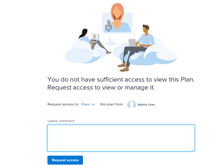
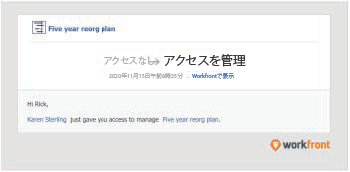

# 内のプランへのアクセスをリクエスト [!DNL Scenario Planner]

プランへのアクセスをリクエストするには、 [!DNL Adobe Workfront Scenario Planner] プランへのリンクが共有されたとき。

## アクセス要件

以下が必要です。

<table style="table-layout:auto"> 
 <col> 
 <col> 
 <tbody> 
  <tr> 
   <td> 
[!DNL Adobe Workfront]<b> 計画*</b> 
 </td> 
   <td>[!UICONTROL Business] 以降</td> 
  </tr> 
  <tr> 
   <td> 
[!DNL Adobe Workfront]<b> ライセンス*</b> 
 </td> 
   <td> 
[!UICONTROL レビュー ]、[!UICONTROL 作業 ]、または [!UICONTROL プラン ]
 </td> 
  </tr> 
  <tr> 
   <td><strong>製品*</strong> </td> 
   <td> 
の追加ライセンスを購入する必要があります。 [!DNL Adobe Workfront Scenario Planner] をクリックして、この記事で説明する機能にアクセスします。
 
詳しくは、 [!DNL Workfront Scenario Planner]を参照してください。 <a href="../scenario-planner/access-needed-to-use-sp.md" class="MCXref xref">[!UICONTROL シナリオプランナー ] を使用するために必要なアクセス</a>. 
 </td> 
  </tr> 
  <tr data-mc-conditions=""> 
   <td><strong>アクセスレベル設定*</strong> </td> 
   <td> 
に対するアクセス権以上の表示 [!DNL Scenario Planner]
 
注意：まだアクセス権がない場合は、 [!DNL Workfront] 管理者（アクセスレベルに追加の制限を設定している場合） を参照してください。 [!DNL Workfront] 管理者は、 <a href="../administration-and-setup/add-users/configure-and-grant-access/create-modify-access-levels.md" class="MCXref xref">カスタムアクセスレベルの作成または変更</a>.
 </td> 
  </tr> 
 </tbody> 
</table>

&#42;購入したプラン、ライセンスの種類、アクセス権を調べるには、 [!DNL Workfront Scenario Planner]、 [!DNL Workfront] 管理者。

## 前提条件

のプランへのアクセスをリクエストする前に [!DNL Scenario Planner]を使用するには、以下が必要です。

* プランへのリンク。

>[!NOTE]
>
>ユーザーが [!DNL Scenario Planner] リンクからプランにアクセスしようとした場合、プランへのアクセスをリクエストすることはできません。 代わりに、 [!DNL Workfront] 管理者。

## 内のプランへのアクセスをリクエスト [!DNL Workfront Scenario Planner]

プランに対する権限をまだ持っていない場合に、自分と共有しているリンクからプランに移動すると、プランを表示する権限がないことを示す画面が表示されます。 プラン作成者に権限を要求するよう求められます。

>[!TIP]
>
>プランの所有者または作成者に対してのみ、権限を要求できます。 プランへのアクセス権を持つ他のユーザーに対して権限をリクエストすることはできません。

権限をリクエストするには：

1. プランへのリンクをクリックします。

   

1. 内 **[!UICONTROL へのアクセスをリクエスト]** ドロップダウンメニューで、付与する権限のレベルを指定します。 次の中から選択します。

   * [!UICONTROL ビュー]
   * [!UICONTROL 管理]

   アクセスレベルより上の権限を [!DNL Scenario Planner]. 例えば、をリクエストすることはできません。 [!UICONTROL 管理] 権限 ( [!DNL Scenario Planner].

   様々なレベルの権限について詳しくは、 [プランを [!DNL Scenario Planner]](../scenario-planner/share-a-plan.md).

   Workfront管理者が [!DNL Scenario Planner]を参照してください。 [へのアクセス権の付与 [!DNL Scenario Planner]](../administration-and-setup/add-users/configure-and-grant-access/grant-access-sp.md).

1. （オプション）コメントまたはリクエストを **[!UICONTROL コメントボックスを残す]**&#x200B;を選択し、「 **[!UICONTROL アクセスのリクエスト]**.

   次の処理がおこなわれます。

   * [!DNL Workfront] はプラン所有者に電子メール通知を送信し、プラン所有者は要求された権限を付与できます。\
      

   * プラン所有者がリクエストされた権限を許可すると、権限が付与されたことを知らせる電子メールが届きます ( [!DNL Workfront] 管理者は、お使いのシステムで「オブジェクト共有からユーザーへの通知」を有効にし、 [!UICONTROL 誰かが私と物を共有してくれる] 電子メール通知を設定します。

      

   * また、 [!UICONTROL ホーム] 領域と [!DNL Workfront] モバイルアプリを使用します。
   システム通知の有効化については、 [システムの全員に対するイベント通知を設定する](../administration-and-setup/manage-workfront/emails/configure-event-notifications-for-everyone-in-the-system.md).

   プロファイルで通知を有効にする方法について詳しくは、 [通知：その他の情報](../workfront-basics/using-notifications/notifications-misc-information.md).
