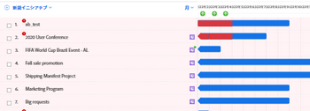
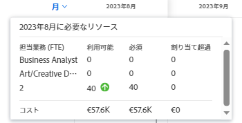
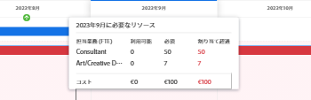
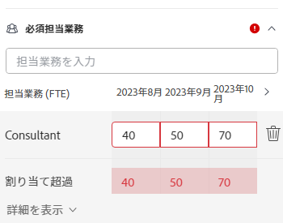
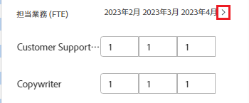
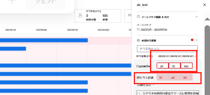
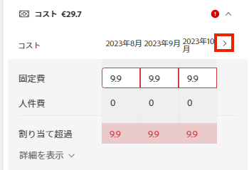
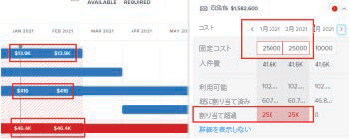

# 次の場所でのイニシアチブの競合を解決 [!DNL Scenario Planner]

イニシアチブが互いに競合する場合、同じリソースを求めて競い合っています。 シナリオに使用できるリソースは、シナリオのすべてのイニシアチブで必要とされるすべてのリソースをカバーするのに十分ではありません。

この問題は、次の場合に発生する可能性があります。

* イニシアチブに必要なジョブの役割の数が、計画に予算化された役割の数よりも多くなっています。
* イニシアチブのコストは、計画に使用できる予算金額よりも大きくなります。

## アクセス要件

以下が必要です。

<table style="table-layout:auto"> 
 <col> 
 <col> 
 <tbody> 
  <tr> 
   <td> 
[!DNL Adobe Workfront]<b> 計画*</b> 
 </td> 
   <td>[!UICONTROL Business] 以降</td> 
  </tr> 
  <tr> 
   <td> 
[!DNL Adobe Workfront]<b> ライセンス*</b> 
 </td> 
   <td> 
[!UICONTROL Review] 以降
 </td> 
  </tr> 
  <tr> 
   <td><b>製品</b> </td> 
   <td> 
の追加ライセンスを購入する必要があります。 [!DNL Adobe Workfront Scenario Planner] をクリックして、この記事で説明する機能にアクセスします。
 
詳しくは、 [!DNL Workfront Scenario Planner]を参照してください。 <a href="../scenario-planner/access-needed-to-use-sp.md" class="MCXref xref">を使用するために必要なアクセス [!DNL Scenario Planner]</a>. 
 </td> 
  </tr> 
  <tr data-mc-conditions=""> 
   <td><strong>アクセスレベル設定*</strong> </td> 
   <td> 
[!UICONTROL Edit] 以降の [!DNL Scenario Planner]
 
注意：まだアクセス権がない場合は、 [!DNL Workfront] 管理者（アクセスレベルに追加の制限を設定している場合） を参照してください。 [!DNL Workfront] 管理者は、 <a href="../administration-and-setup/add-users/configure-and-grant-access/create-modify-access-levels.md" class="MCXref xref">カスタムアクセスレベルの作成または変更</a>.
 </td> 
  </tr> 
  <tr data-mc-conditions=""> 
   <td> 
<strong>オブジェクト権限</strong> 
 </td> 
   <td> 
プランに対する [!UICONTROL 管理 ] 権限
 
プランへの追加アクセス権のリクエストについて詳しくは、 <a href="../scenario-planner/request-access-to-plan.md" class="MCXref xref">内のプランへのアクセスをリクエスト [!DNL Scenario Planner]</a>.
 </td> 
  </tr> 
 </tbody> 
</table>

&#42;保有しているプラン、ライセンスの種類、アクセス権を確認するには、Workfront管理者に問い合わせてください。

## 競合の解決の概要

* 競合は、ジョブの役割の割り当て超過やシナリオの予算とも考えられます。
* 条件 [!DNL Workfront] 競合を検出します。イニシアチブの期間中に競合する月に対応するバーが赤で表示されます。 この問題は、次の場合に発生する可能性があります。

   * イニシアチブに対して毎月必要なジョブの役割の数が、以前のすべてのイニシアチブでプランに予算化されたリソースを使用した後に、プランに予算化された役割の数よりも多くなります。
   * イニシアティブの月額コストは、以前のすべてのイニシアチブでプランの予算を使用してコストをカバーした後に、プランで使用可能な予算よりも大きくなります。

>[!TIP]
>
>デフォルトでは、 [!DNL Scenario Planner] は、別途指定しない限り、シナリオに対して 0 個の役割と$0 またはシステムの通貨で$0 に相当する予算があると仮定します。 役割の数は、役割に予算された FTE（フル・タイム・イクオリバント）の数または時間数を示します。
>
>シナリオ・プランナのすべての計算に対して、Workfrontは次の値を使用します。1 日= 8 時間
>
>プランと予算に使用可能なロールの更新について詳しくは、 [でプランを作成および編集 [!DNL Scenario Planner]](../scenario-planner/create-and-edit-plans.md).

* 次のいずれかの操作を行うことで、競合を解決できます。

   * 必要なリソースが不足している場合、シナリオのイニシアチブから自動的に追加されます。 この記事では、このオプションを使用して競合を解決する方法について説明します。
   * プランを編集して、シナリオのジョブの役割と予算のリソースを調整する。 詳しくは、 [でプランを作成および編集 [!DNL Scenario Planner]](../scenario-planner/create-and-edit-plans.md).

## イニシアチブ間の競合を解決

1. 競合を解決するプランに移動します。

   プランの作成について詳しくは、 [でプランを作成および編集 [!DNL Scenario Planner]](../scenario-planner/create-and-edit-plans.md).

   イニシアチブの作成については、 [のイニシアチブを作成および編集します [!DNL Scenario Planner]](../scenario-planner/create-and-edit-initiatives.md).

1. （オプション） **[!DNL Initial scenario]** ドロップダウンメニューから、確認するシナリオを選択します。

   >[!TIP]
   >
   >プランには、複数のシナリオが含まれる場合があります。 計画の矛盾を見る時 [!DNL Workfront] は、選択したシナリオで現在使用可能なリソースおよびそのシナリオのイニシアチブで必要なリソースを指します。 シナリオについて詳しくは、 [でのプランシナリオの作成と比較 [!DNL Scenario Planner]](../scenario-planner/create-and-compare-scenarios-for-a-plan.md).

1. 以下を確認します。 **[!UICONTROL 競合を表示]** が有効になっている。 これはデフォルトで有効になっています。

   

   最初に競合するイニシアチブでは、競合する月が赤で表示され、イニシアチブ名の横に警告アイコンが表示されます。

   最初に競合したイニシアチブから始まるすべてのイニシアチブの背景は、プランのグラフに赤で表示されます。

   イニシアチブが競合を表示する場合、少なくとも 1 つの特定の役割の役割の数、発生したコスト、またはその両方が、特定の月の計画に定義された役割の数または予算を超えていることを意味します。

   

1. 次のいずれかの操作を行って、存在する可能性のある競合についての詳細を把握します。

   * イニシアチブ名の横にある警告アイコンの上にマウスポインターを置くと、ジョブの役割と予算の競合のどちらがあるかがわかります。

      

      イニシアチブの役割を超過割り当てたか、コストを過大評価したかに応じて、警告アイコンの上にマウスポインターを置くと、次のオプションのいずれかが表示されます。

      * 矛盾がある担当業務の詳細を表示
      * 矛盾がある予算の詳細を表示
      * ジョブの役割と予算の詳細を表示
   * 月別にプランを表示する場合は、その月に必要なリソースと、その月の競合が人物かコスト関連かを表示するために、プランのタイムラインの 1 ヶ月の上にマウスポインターを置きます。

      

      次の月次情報を、計画レベルで確認します。

      * その月に計画されたすべてのイニシアチブに対する、その月の使用可能、必須および割り当て超過のジョブの役割数
      * その月に計画されたすべてのイニシアチブに対する、その月の使用可能なコスト、必須コスト、および割り当て超過コスト

         >[!TIP]
         >
         >この [!UICONTROL 利用可能] コストは、その月のシナリオの予算です。
   * イニシアチブの赤いバーの上にマウスポインターを置くと、その月に発生した競合に関する追加の情報ボックスが表示されます。

      

      イニシアチブのレベルで、「追加情報」ボックスの次のフィールドを確認します。

      <table style="table-layout:auto"> 
      <col> 
      <col> 
      <tbody> 
       <tr> 
        <td role="rowheader">競合が発生する月</td> 
        <td>追加情報ボックスのタイトルに表示されます。</td> 
       </tr> 
       <tr> 
        <td role="rowheader">イニシアチブ名</td> 
        <td>追加情報ボックスのタイトルに表示されます。</td> 
       </tr> 
       <tr> 
        <td role="rowheader">[!UICONTROL ジョブの役割 ]</td> 
        <td> 
選択した月に割り当て超過の、このイニシアチブに関連付けられているジョブの役割。 次の列には、選択した月に必要な各ジョブの役割に関する情報が表示され、その月に使用可能なジョブの役割の数と競合します。
 
         <ul> 
          <li> 
<strong>[!UICONTROL 利用可能 ]</strong>:選択した月のシナリオで使用可能な各ジョブの役割の数。
 </li> 
          <li> 
<strong>[!UICONTROL 必須 ]</strong>:選択した月のイニシアチブに必要な各ジョブの役割の数。
 </li> 
          <li> 
<strong>[!UICONTROL 割り当て超過 ]:</strong> イニシアチブで必要な数とシナリオから使用できる数との差。 
 </li> 
         </ul> 
ヒント：[!UICONTROL 使用可能な ] ロールの数が [!UICONTROL 必須 ] ロールの数と一致したり、それより大きい場合がありますが、 [!DNL Scenario Planner] 割り当て超過を表示します。 つまり、同じ月にプランで利用できる職務の役割を既に利用している上位の取り組みが存在するということです。 
 </td> 
       </tr> 
       <tr> 
        <td role="rowheader">コスト</td> 
        <td> 
選択した月のイニシアチブのコスト。 次の列には、選択した月の必要コストと使用可能な予算に関する情報が表示されます。
 
         <ul> 
          <li> 
<strong>[!UICONTROL 利用可能 ]</strong>:選択した月のプランで使用可能な予算です。
 </li> 
          <li> 
<strong>[!UICONTROL 必須 ]</strong>:選択した月のこのイニシアチブに関連付けられたコスト。
 </li> 
          <li> 
<strong>[!UICONTROL 割り当て超過 ]:</strong> イニシアチブのコストとプランから使用可能な予算の差。 
 </li> 
         </ul> 
ヒント：[!UICONTROL 利用可能 ] コストが、選択した月と [!DNL Scenario Planner] コストの割り当て超過が表示されます。 つまり、同じ月の計画に、既に予算を使用している上位のイニシアチブが存在するということです。 
 </td> 
       </tr> 
      </tbody> 
     </table>

1. イニシアチブの詳細パネルを開き、競合が発生した場所と解決方法に関する詳細情報を表示するには、次のいずれかの操作を実行します。

   * イニシアチブの名前の横にある警告アイコンをクリックします。
   * イニシアチブのバーをクリックします。
   * 次をクリック： **[!UICONTROL 詳細]** アイコン  イニシアチブの名前の右にある「 」をクリックし、 **[!UICONTROL 編集]**.

      イニシアチブの詳細パネルが右側に表示されます。

      イニシアチブに十分な人材や予算がない場合は、次のセクションの横に赤い警告アイコンが表示されます。

   * [!UICONTROL 必須担当業務]
   * [!UICONTROL コスト]

1. （条件付き）職務上の役割の競合があるイニシアチブの場合は、 **[!UICONTROL 必要なジョブの役割]** セクションを開いて、イニシアチブに必要なすべてのジョブの役割を表示します。 割り当て超過の可能性があるジョブの役割を特定します。 イニシアチブの各月の各ジョブロールに必要な工数または時間数を確認します。 割り当て超過の月の工数または時間数を示すボックスは、赤いアウトラインで表示されます。

   

1. （オプション）イニシアチブのタイムラインの月の横にある右向き矢印をクリックして、ジョブの役割の競合を表示する追加の月を表示します。

   

1. （オプション）「 **[!UICONTROL 詳細を表示]** 競合を表示するジョブの役割の下で、競合が発生した場所を確認し、プランのグラフ領域で競合する月をハイライト表示します。 各ジョブの役割に関する追加情報が表示されます。

   各ジョブロールに対して、次のフィールドが表示されます。

   <table style="table-layout:auto"> 
    <col> 
    <col> 
    <tbody> 
     <tr> 
      <td role="rowheader">[!UICONTROL 利用可能 ]</td> 
      <td> 
各月のプランで使用可能なジョブの役割の数。 
 </td> 
     </tr> 
     <tr> 
      <td role="rowheader">[!UICONTROL 以前に割り当てられた項目 ]</td> 
      <td>プランの予算から特定の月の上位イニシアティブに割り当て済みの役割の数。 </td> 
     </tr> 
     <tr> 
      <td role="rowheader">[!UICONTROL 割り当て超過 ]</td> 
      <td> 
イニシアチブで必要な職務の役割数と、上位のイニシアチブの後にプランで利用できる職務の役割数の違いも役割の一部を使用しました。 Workfrontは、次の式を使用して [!UICONTROL 割り当て超過 ] ジョブロールの数を計算します。
 
<code>Overallocated roles = (Roles Previously Allocated to higher initiatives + Required roles for current initiative) - Monthly available roles from the plan</code> 
 </td> 
     </tr> 
    </tbody> 
   </table>

   >[!TIP]
   >
   >プランのチャートで、ジョブの役割が割り当てられる月には、各イニシアチブに必要な役割の名前と数が表示されます。 次の項目を選択する必要があります。 [!UICONTROL 月] ジョブの役割の名前を表示します

   

1. ジョブの役割の競合を解決するには、次のいずれかの操作を行います。

   * イニシアチブの各月のジョブの役割数を手動で少ない数に調整します。
   * ジョブの役割の名前の上にマウスポインターを置いて、 **[!UICONTROL 削除] アイコン**  ：イニシアチブからジョブの役割を削除します。
   * 選択 **[!UICONTROL シナリオの使用可能なリソースにロールを追加]**&#x200B;を選択し、「 **[!UICONTROL 適用]**.

      これにより、見つからないジョブロールの FTE または時間数がシナリオの [!UICONTROL 利用可能] フィールドに入力します。

      >[!NOTE]
      >
      >競合を解決するために追加したロールによって、 [!UICONTROL 利用可能] 選択したシナリオの役割。プラン内のすべてのシナリオの役割ではありません。

      上向きの緑色の矢印  は、その月の月に、その月のプランに追加されたリソースを示すために、プランのタイムラインに表示されます。 次の項目を選択する必要があります。 [!UICONTROL 月] この指標を表示するには、を参照してください。

   * （条件付き）可能な場合は、詳細パネルを閉じて、最初に計画から予算リソースを受け取る優先順位を高めます。 イニシアチブの優先順位の更新について詳しくは、 [シナリオプランナーのイニシアチブ優先度を更新](../scenario-planner/prioritize-initiatives.md).

1. （オプション）「 **[!UICONTROL 詳細を非表示にする]** 追加の詳細ボックスを閉じるには、 **[!UICONTROL 適用]** ：ジョブの役割に対して行った変更を保存します。

1. （条件付き）コストの競合があるイニシアチブの場合は、 **[!UICONTROL コスト]** 「イニシアチブの詳細」パネルの「 」セクションを使用して、イニシアチブの期間中の毎月のコストを確認できます。 選択したイニシアチブのコストをカバーするのに十分な資金がプランの予算に含まれていない可能性のある月を特定します。 使用可能な予算が不十分なボックスが赤い輪郭で表示されます。
1. （オプション）イニシアチブのタイムラインの月の横にある右矢印をクリックして、コストをカバーするのに十分な予算がない追加の月を表示します。

   

1. （オプション）「 **[!UICONTROL 詳細を表示]** コスト情報の下で、競合が発生した場所を確認し、プランのグラフで競合する月を強調表示します。 各コストタイプに対して、次の追加のフィールドが表示されます。

   <table style="table-layout:auto"> 
    <col> 
    <col> 
    <tbody> 
     <tr> 
      <td role="rowheader">[!UICONTROL 利用可能 ]</td> 
      <td> 
各月のプランの予算から得られるコスト。 
 </td> 
     </tr> 
     <tr> 
      <td role="rowheader">[!UICONTROL 以前に割り当てられた項目 ]</td> 
      <td>プランの予算から上位のイニシアチブに割り当て済みのお金の額。 </td> 
     </tr> 
     <tr> 
      <td role="rowheader">[!UICONTROL 割り当て超過 ]</td> 
      <td> 
また、イニシアティブに必要なコストと、上位のイニシアティブの後に計画の予算から得られる資金の額との月別の差は、予算の一部を使用した。 [!DNL Workfront] 次の式を使用して、「割り当て超過原価」の数を計算します。
 
<code>Overallocated costs = (Costs Previously Allocated to higher initiatives + Required costs for the current initiative) - Monthly available budget from the plan</code> 
 
[!DNL Workfront] 次の式を使用して、各月の現行イニシアティブの必須原価を計算します。
 
<code>Required initiative costs = Initiative Fixed Costs + Initiative People Costs</code> 
 </td> 
     </tr> 
    </tbody> 
   </table>

   >[!TIP]
   >
   >プランのグラフに、コストが不十分な月には、イニシアチブに必要な名前とロール数が表示されます。 コスト金額を表示するには、月単位の表示を選択する必要があります。

   

   >[!NOTE]
   >
   >を無効にした場合、 [!UICONTROL 顧客コストを含める] 計画の設定 [!UICONTROL 予算] ボックスを使用してプランを作成した場合、 [!UICONTROL 顧客コスト] どのシナリオでも、イニシアチブの行は表示されません。 この場合、Workfrontでは、コストの競合を判断するために「人」のコストは計算に含まれません。 プランの作成について詳しくは、 [でプランを作成および編集 [!DNL Scenario Planner]](../scenario-planner/create-and-edit-plans.md).

1. コストの競合を解決するには、次のいずれかの操作を行います。

   * 手動で [!UICONTROL 固定コスト] イニシアチブの各月の数値を低くします。
   * 内 **[!UICONTROL 必要なジョブの役割]** 「 」セクションで、可能な場合は、「個人原価」予算を使用して、月の役割数を手動で調整します。 これにより、人物コストの数が削減されます。

      >[!TIP]
      >
      >担当者原価は手動で調整できません。

   * 選択 **[!UICONTROL シナリオの予算に金額を追加]**&#x200B;を選択し、「 **[!UICONTROL 適用]**.

      これにより、シナリオの予算に不十分な金額が追加され、シナリオの予算全体も更新されます。

      >[!NOTE]
      >
      >コストの競合を解決するために追加する金額は、プラン内のすべてのシナリオではなく、選択したシナリオの予算を変更します。

   * （条件付き）可能な場合は、詳細パネルを閉じて、最初に計画から予算リソースを受け取る優先順位を高めます。 イニシアチブの優先順位の更新について詳しくは、 [のイニシアチブ優先度を更新 [!DNL Scenario Planner]](../scenario-planner/prioritize-initiatives.md).

1. クリック **[!UICONTROL 適用]** コストセクションを変更する場合。
1. クリック **[!UICONTROL プランを保存]** 変更を保存します。

