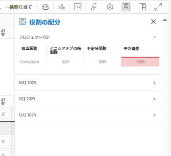
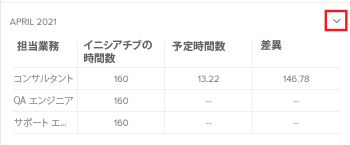

# [!UICONTROL ワークロードバランサー]のプロジェクトとイニシアチブの役割の割り当てを表示

>[!IMPORTANT]
>
>プロジェクトのイニシアチブ情報を表示するには、組織が [!DNL Adobe Workfront Scenario Planner] の追加ライセンスを購入する必要があります。[!DNL Workfront Scenario Planner] の取得に関して詳しくは、[ [!DNL Scenario Planner]](../scenario-planner/access-needed-to-use-sp.md) を使用するために必要なアクセスを参照してください。

プロジェクトとイニシアチブを結び付けた後、リソースの割り当てを横に並べ、それらが一致するよう管理できます。これにより、過剰な割り当てや割り当て不足を回避できます。

この記事では、プロジェクトの[!UICONTROL ワークロードバランサー]の[!UICONTROL 役割の割り当て]パネル内でリソースを調整する方法を説明します。

前提条件を含む、プロジェクトとイニシアチブ間でのリソースの調整に関する一般的な情報について詳しくは、[プロジェクトとイニシアチブ間でのリソース割り当て調整の概要](../scenario-planner/overview-reconcile-allocations-between-projects-initiatives.md)を参照してください。

## アクセス要件

次の操作が必要です。

<table style="table-layout:auto"> 
 <col> 
 <col> 
 <tbody> 
  <tr> 
   <td> 
[!DNL Adobe Workfront]<b> プラン*</b> 
 </td> 
   <td>[!UICONTROL Business] 以降</td> 
  </tr> 
  <tr> 
   <td> 
[!DNL Adobe Workfront]<b>ライセンス*</b> 
 </td> 
   <td> 
[!UICONTROL Review] 以降
 </td> 
  </tr> 
  <tr> 
   <td><b>製品</b> </td> 
   <td> 
この記事で説明する機能にアクセスするには、[!DNL Adobe Workfront Scenario Planner] 用の追加ライセンスを購入する必要があります。
 
[!DNL Workfront Scenario Planner] の取得について詳しくは、<a href="../scenario-planner/access-needed-to-use-sp.md">[!DNL Scenario Planner]</a> を使用する場合に必要なアクセス権を参照してください。 
 </td> 
  </tr> 
  <tr data-mc-conditions=""> 
   <td><strong>アクセスレベル設定*</strong> </td> 
   <td> 
プロジェクトに対する [!UICONTROL View] 以上のアクセス権 
 
メモ：まだアクセス権がない場合は、アクセスレベルに追加の制限が設定されていないか [!DNL Workfront] 管理者にお問い合わせください。[!DNL Workfront]管理者がアクセスレベルを変更する方法について詳しくは、<a href="../administration-and-setup/add-users/configure-and-grant-access/create-modify-access-levels.md" class="MCXref xref">カスタムアクセスレベルを作成または変更</a>を参照してください。
 </td> 
  </tr> 
  <tr data-mc-conditions=""> 
   <td> 
<strong>オブジェクト権限</strong> 
 </td> 
   <td> 
プロジェクトに対する [!UICONTROL View] 以上の権限
 
プランへの追加アクセス権のリクエストについて詳しくは、<a href="../scenario-planner/request-access-to-plan.md">[!DNL Workfront Scenario Planner]</a> でのプランへの [!UICONTROL Request] アクセス権を参照してください。
 
プロジェクトへの追加アクセス権のリクエストについて詳しくは、<a href="../workfront-basics/grant-and-request-access-to-objects/request-access.md" class="MCXref xref">オブジェクトへの利用申請</a>を参照してください。 
 </td> 
  </tr> 
 </tbody> 
</table>

&#42;ご利用のプラン、ライセンスタイプ、アクセス権を確認するには、[!DNL Workfront] 管理者にお問い合わせください。

## [!UICONTROL ワークロードバランサー]のプロジェクトとイニシアチブの役割の割り当てを表示

会社が [!DNL Workfront Scenario Planner] ライセンスを購入している場合、イニシアチブとそのイニシアチブにリンクされているプロジェクトとの間のリソース割り当てを、プロジェクトレベルの[!UICONTROL ワークロードバランサー]で調整できます。

1. （条件付き）以下の記事に記載されている方法のいずれかを使用して、プロジェクトをイニシアチブに接続します。

   * [ [!DNL Adobe Workfront Scenario Planner]](import-projects-to-plans.md) のプランにプロジェクトを読み込みます。
   * [ [!DNL Adobe Workfront Scenario Planner]](publish-scenarios-update-projects.md) でイニシアチブを公開することにより、プロジェクトを更新または作成します。

   >[!IMPORTANT]
   >
   >イニシアチブのリソースに変更を加える場合、イニシアチブの最新のリソース情報をプロジェクトで更新するには、イニシアチブが属するシナリオを再公開する必要があります。

1. プロジェクトおよび関連するイニシアチブの担当業務の割り当てを確認するプロジェクトに移動します。
1. 左側のパネルで[!UICONTROL ワークロードバランサー]をクリックします。

   **[!UICONTROL スケジュール]**、「**[!UICONTROL ワークロードバランサーに切り替え]**」の順でクリックが必要になることがあります。

1. 次のいずれかの操作を行います。

   * 「**[!UICONTROL 月]**」をクリックしてワークロードバランサーを月別表示にして、タイムライン  で月の横にあるドロップダウンメニュー、**[!UICONTROL 詳細]**&#x200B;の順にクリックします。
   * ツールバーの上右隅にある&#x200B;**[!UICONTROL 役割の割り当てを表示]**&#x200B;アイコン  をクリックします。

   [!UICONTROL 役割の割り当て]パネルが表示されます。

   

   >[!CAUTION]
   >
   >組織が [!DNL Workfront Scenario Planner] ライセンスを購入していない場合でも、[!UICONTROL 役割の割り当て]パネルを表示できますが、イニシアチブの担当業務に関する情報は表示できません。

   <!--
   
(NOTE: ensure this step stays 5 to match the mention of it in the section below)

   -->

1. 役割の割り当てパネルの&#x200B;**[!UICONTROL プロジェクト合計]**&#x200B;エリアにある以下の情報を確認します。

   <table style="table-layout:auto"> 
    <col> 
    <col> 
    <tbody> 
     <tr> 
      <td role="rowheader">[!UICONTROL Job Role]</td> 
      <td> 
次のいずれかに関連付けられた担当業務の名前。
 
       <ul> 
        <li> 
プロジェクトのタスク
 </li> 
        <li> 
プロジェクトのイシュー
 </li> 
        <li> 
プロジェクトにリンクされたイニシアチブ
 </li> 
       </ul> </td> 
     </tr> 
     <tr> 
      <td role="rowheader">[!UICONTROL Initiative Hours]</td> 
      <td>イニシアチブの全期間における、イニシアチブの各担当業務に関連付けられる必要な時間数。 </td> 
     </tr> 
     <tr> 
      <td role="rowheader">[!UICONTROL Planned Hours]</td> 
      <td>プロジェクトの全期間における、プロジェクトのタスクまたはイシューの各担当業務に関連付けられた予定時間数。 </td> 
     </tr> 
     <tr> 
      <td role="rowheader">[!UICONTROL Variance]</td> 
      <td> 
イニシアチブに必要な時間と、プロジェクトの作業に関連する予定時間数との差。[!DNL Workfront] は、以下の式を使用して [!UICONTROL Variance] を計算します。
 
<code>Role Allocation Variance = Initiative Hours - Planned Hours</code> 
 
イニシアチブで必要以上の時間リソースが予定されている場合、[!UICONTROL Variance] は負の値となり、赤で表示されます。つまり、リソースの割り当てが超過しています。 
 </td> 
     </tr> 
    </tbody> 
   </table>

   >[!TIP]
   >
   >プロジェクトからの予定時間数は、次のシナリオでは表示されません。
   >
   >   
   >   
   >   * タスクまたはイシューが担当業務に割り当てられていない場合、または担当業務が関連付けられているユーザーの場合。
   >   * タスクまたはイシューの[!UICONTROL 期間]がゼロの場合。
   >   
   >

1. （オプション）[!UICONTROL 平方偏差]列にリソースの割り当て超過が表示されている場合、以下のいずれかを調整します。

   * 割り当て超過を示す担当業務の予定時間数を減らすか、タスクにリソースを追加し、新しいリソースに対する予定時間数を増やします。割り当てを更新したり、タスクまたはイシューの編集時に予定時間数を更新したりできます。詳しくは、次の記事を参照してください。

      * [タスクを編集](../manage-work/tasks/manage-tasks/edit-tasks.md)
      * [イシューを編集](../manage-work/issues/manage-issues/edit-issues.md)

     >[!NOTE]
     >
     >タスクとイシューを編集するには、追加のアクセス権と権限が必要です。

   * イニシアチブの割り当て超過を示す役割に必要な時間数を増やします。詳しくは、[ [!DNL Adobe Workfront Scenario Planner]](create-and-edit-initiatives.md) のイニシアチブを作成と編集を参照してください。

     >[!NOTE]
     >
     >計画を編集するには、追加のアクセス権と権限が必要です。

1. （オプション）ドロップダウンアイコンをクリックして、[!UICONTROL 役割の割り当て]パネル、または[!UICONTROL ワークロードバランサー]のタイムラインのうちの月を展開します。

   

   [!UICONTROL プロジェクト合計]エリアに表示されるのと同じ種類の情報が、月ごとにも表示されます。

   >[!TIP]
   >
   >[!UICONTROL 役割の割り当て]パネルにリストされている月は、[!UICONTROL ワークロードバランサー]の画面に表示されるタイムラインの月です。タイムラインで前後にスクロールして、追加の月を表示します。

   <!--
   <li value="8" data-mc-conditions="QuicksilverOrClassic.Draft mode"> 
 
 </li>
   -->

