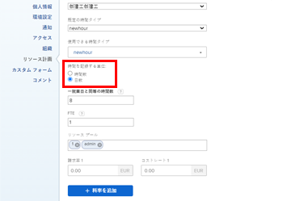

# 時間をログイン時間または日に設定

Planner ライセンスを持つユーザーは、Adobe Workfrontにログインする時間を時間単位で設定するか、日単位で設定できます。 システム管理者は、個々のユーザーまたは組織内の複数のユーザーに対して、この設定を構成できます。 デフォルトでは、ユーザーは時間単位でログに記録されます。 Workfrontでの時間のログイン方法について詳しくは、 [ログ時間](../../timesheets/create-and-manage-timesheets/log-time.md).

>[!NOTE]
>
>レポートの正確性を確保するため、組織全体で同じ方法で時間または日数を記録することをお勧めします。

## アクセス要件

この記事の手順を実行するには、次のアクセス権が必要です。

<table style="table-layout:auto"> 
 <col> 
 </col> 
 <col> 
 </col> 
 <tbody> 
  <tr> 
   <td role="rowheader">Adobe Workfront plan*</td> 
   <td> 
任意
 </td> 
  </tr> 
  <tr> 
   <td role="rowheader">Adobe Workfront license*</td> 
   <td> 
計画 
 </td> 
  </tr> 
  <tr data-mc-conditions=""> 
   <td role="rowheader">アクセスレベル設定*</td> 
   <td> 
プランナは、自分で時間を設定できます。 他のユーザーの時間を設定できるのは、Workfront管理者のみです。
 </td> 
  </tr> 
 </tbody> 
</table>

&#42;保有しているプラン、ライセンスの種類、アクセス権を確認するには、Workfront管理者に問い合わせてください。

1. 目的とシステムのアクセスレベルに応じて、次のいずれかの操作を行います。

   * **プランナー・ユーザーが自分用にタイム・ログを設定する：** 次をクリック： **メインメニュー** アイコン  Adobe Workfrontの右上隅で、プロフィール画像の横にあるユーザー名をクリックします。 次に、 **詳細** 名前の横にあるアイコンをクリックし、「 」を選択します。 **編集**.

   * **他のユーザーのタイムログを設定するシステム管理者：** 1 つ以上のユーザーアカウントの編集を開始します ( [ユーザーのプロファイルの編集](../../administration-and-setup/add-users/create-and-manage-users/edit-a-users-profile.md).

1. 表示されたダイアログボックスで、 **リソース計画** セクションで、 **ログイン時間** オプション。

   

1. （条件付き）複数のユーザーを同時に編集するシステム管理者の場合は、 **ログイン時間**.
1. ログ時間の次のオプションから選択します。

   | オプション | 説明 |
   |---|---|
   | **時間** | ユーザーは、Workfrontでログに記録する時間を指定します。 |
   | **日** | ユーザーは、Workfrontでログに記録する時間を指定します。 |

1. （条件付き）日単位のログを選択した場合、 **フルWorkdayの同等の時間** 「 」フィールドに、1 日を表す時間数を入力します。 ユーザーのタイムシートの 1 日は、ここに入力した時間数と同じです。

   この設定を構成する際は、次の点を考慮してください。

   * このオプションは、時間単位でログに記録するようにを設定する場合は使用できません。
   * このオプションは、ログ時間の目的でのみ使用されます。 このオプションは、 **スケジュール** オプションを使用できます。 この **スケジュール** オプションは、タイムラインの計算時やWorkfrontの他の領域で使用されます。 ( **スケジュール** オプション： [スケジュールの作成](../../administration-and-setup/set-up-workfront/configure-timesheets-schedules/create-schedules.md).) 

1. クリック **変更を保存**.
