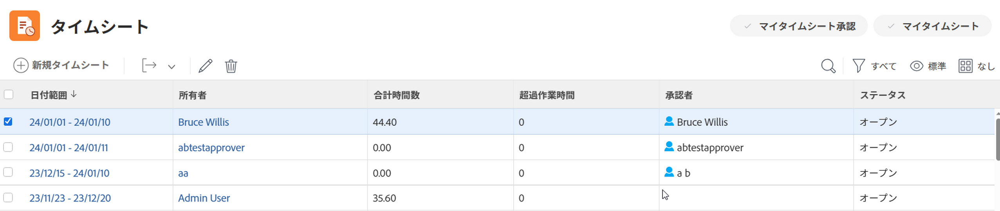
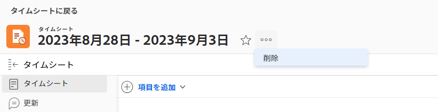

# Adobe Workfrontのタイムシートを削除

タイムシートプロファイルに対して行った変更は、現在の既存のタイムシートに対してすぐには有効になりません。詳しくは、 [タイムシートプロファイルの作成、編集、割り当て](../../timesheets/create-and-manage-timesheets/create-timesheet-profiles.md). 既存のタイムシートに変更を表示するには、生成済みのタイムシートを削除し、新しいタイムシートを生成する必要があります。 これは、タイムシートプロファイルをユーザーに関連付けて生成されたタイムシートにのみ適用されます。

>[!NOTE]
>
>手動で作成されたタイムシートは、タイムシートが手動で作成された後に、ユーザーがタイムシートプロファイルに関連付けられていない限り、タイムシートを再生成することで再作成できません。 手動で作成したタイムシートを削除すると、データが失われる可能性があります。 単一のタイムシートの作成については、 [単一使用のタイムシートを作成する](../../timesheets/create-and-manage-timesheets/create-tmshts.md).

Adobe Workfrontの管理者またはグループ管理者は、システム内の全員に対してタイムシートを生成できます。 タイムシートを手動で生成する方法の詳細は、次を参照してください。

* [タイムシートを手動で生成](../../timesheets/create-and-manage-timesheets/manually-generate-timesheets.md)
* [グループのタイムシートプロファイルを作成および管理する](../../administration-and-setup/manage-groups/work-with-group-objects/create-and-modify-a-groups-timesheet-profiles.md)

>[!IMPORTANT]
>
>* 削除したタイムシートは復元できません。
>* タイムシートプロファイルに基づいて自動的に生成されないので、過去のタイムシートは削除しないことをお勧めします。 タイムシートプロファイルに対する変更を新しいタイムシートに即座に表示する場合は、現在および将来のタイムシートを削除し、手動で生成できます。
>* タイムシートを削除しても、タスク、タスク、タスク、およびプロジェクトに対して記録された時間は削除されません。 タイムシートでは、[ 一般時間 ] のみが削除されます。 別のテキストエディタで、タイムシートに関連付けられている [ 一般時間 ] を書き留めます。 タイムシートを削除した後、新しいタイムシートに記録できます。
>

## アクセス要件

この記事の手順を実行するには、次の手順を実行する必要があります。

<table style="table-layout:auto"> 
 <col> 
 <col> 
 <tbody> 
  <tr> 
   <td role="rowheader">Adobe Workfrontプラン</td> 
   <td> 
任意
 </td> 
  </tr> 
  <tr> 
   <td role="rowheader">Adobe Workfrontライセンス</td> 
   <td> 
計画 
 </td> 
  </tr> 
  <tr> 
   <td role="rowheader">アクセスレベル設定*</td> 
   <td> 
タイムシートに対する管理者アクセス権が必要です。 
 
詳しくは、 <a href="../../administration-and-setup/add-users/configure-and-grant-access/grant-users-admin-access-certain-areas.md" class="MCXref xref">特定の領域に対する管理者アクセス権をユーザーに付与する</a>.
 
まだアクセス権がない場合は、Workfront管理者に、アクセスレベルに追加の制限を設定しているかどうかを問い合わせてください。 Workfront管理者がアクセスレベルを変更する方法について詳しくは、 <a href="../../administration-and-setup/add-users/configure-and-grant-access/create-modify-access-levels.md" class="MCXref xref">カスタムアクセスレベルの作成または変更</a>.
 </td> 
  </tr> 
 </tbody> 
</table>

*保有するプラン、ライセンスの種類、アクセス権を確認するには、Workfront管理者にお問い合わせください。

## リスト内のタイムシートを削除

1. 次をクリック： **メインメニュー** アイコン  Adobe Workfrontの右上隅にある

1. クリック **タイムシート**. この **すべて** フィルタは既定で選択され、表示するアクセス権のあるすべてのタイムシートが表示されます。

   

1. （オプション）次のいずれかの操作を行って、タイムシートの一覧のフィルタを更新します。

   * 選択 **自分のタイムシート承認** ページの右上隅に、承認したタイムシートのみを表示する

      または

      選択 **マイタイムシート** タイムシートのみを表示する場合。

      これにより、[ 自分のタイムシートの承認 ] または [ 自分のタイムシート ] フィルタが、タイムシートの一覧に適用されます。

      

   * フィルターアイコンをクリックします。  別のフィルターを適用するか、新しいフィルターを作成します。 フィルターの作成または更新について詳しくは、 [Adobe Workfrontでフィルターを作成または編集](../../reports-and-dashboards/reports/reporting-elements/create-filters.md).
   >[!NOTE]
   Workfront管理者またはグループ管理者が [ セットアップ ] 領域の [ リスト管理 ] または [ レイアウトテンプレート ] から [ 自分のタイムシート ] フィルタを削除した場合、[ 自分のタイムシート承認 ] および [ 自分のタイムシート ] オプションは、タイムシート一覧の先頭またはフィルタ一覧に表示されません。 詳しくは、次の記事を参照してください。
   * [レイアウトテンプレートを使用したフィルター、ビューおよびグループのカスタマイズ](../../administration-and-setup/customize-workfront/use-layout-templates/customize-fvg-list-controls-layout-template.md)

1. （オプション） **表示**  または **グループ化**  アイコンを使用して、別のビューやグループを適用するか、新しいビューやグループを作成します。

   フィルター、ビューまたはグループの作成について詳しくは、次の記事を参照してください。

   * [Adobe Workfrontでフィルターを作成または編集](../../reports-and-dashboards/reports/reporting-elements/create-filters.md)
   * [Adobe Workfrontでビューを作成または編集](../../reports-and-dashboards/reports/reporting-elements/create-edit-views.md)
   * [Adobe Workfrontでのグループ化の作成](../../reports-and-dashboards/reports/reporting-elements/create-groupings.md)

1. 削除する 1 つまたは複数のタイムシートを選択し、 **削除**   タイムシートの一覧の一番上にあるアイコン

1. クリック **削除**.

   選択したタイムシートは削除され、復元できません。

   新しいタイムシートを生成するには、ユーザーがタイムシートプロファイルに関連付けられていることを確認し、Workfront管理者またはグループ管理者に新しいタイムシートの生成を依頼します。

   詳しくは、次を参照してください。

   * [タイムシートプロファイルの作成、編集、割り当て](../../timesheets/create-and-manage-timesheets/create-timesheet-profiles.md)
   * [タイムシートを手動で生成](../../timesheets/create-and-manage-timesheets/manually-generate-timesheets.md)
   * [グループのタイムシートプロファイルを作成および管理する](../../administration-and-setup/manage-groups/work-with-group-objects/create-and-modify-a-groups-timesheet-profiles.md)

## タイムシートページからタイムシートを削除する

1. 次をクリック： [!UICONTROL **メインメニュー**] アイコン  Adobe Workfrontの右上隅にある
1. 削除するタイムシートをクリックして開きます。
1. 次をクリック： [!UICONTROL **詳細**] アイコン  タイムシート名の右に移動し、[ ] をクリックします。 **削除**.

   
1. クリック [!UICONTROL **削除**] をクリックして確定します。

   タイムシートは削除されたため、復元できません。
