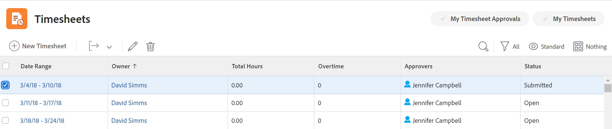
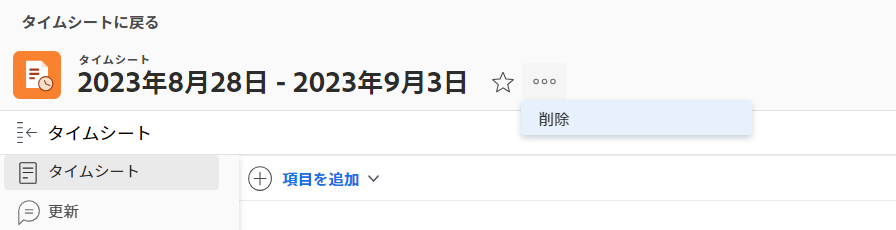

# Adobe Workfront でのタイムシートの削除

[タイムシートプロファイルの作成、編集、割り当て](../../timesheets/create-and-manage-timesheets/create-timesheet-profiles.md)で説明しているように、タイムシートプロファイルに対して行った変更は、現在のタイムシートにすぐには有効になりません。 既存のタイムシートで変更を表示するには、生成済みのタイムシートを削除し、新しいタイムシートを生成する必要があります。 これは、タイムシートプロファイルをユーザーに関連付けて生成されたタイムシートにのみ当てはまります。

>[!NOTE]
>
>手動で作成されたタイムシートは、それ以降、タイムシートプロファイルにユーザーが関連付けられていない限り、再生成によって再作成することはできません。 手動で作成されたタイムシートを削除すると、データが失われる可能性があります。 単一のタイムシートの作成については、[単一使用タイムシートの作成](../../timesheets/create-and-manage-timesheets/create-tmshts.md)を参照してください。

Adobe Workfront 管理者またはグループ管理者は、システム内の全員に対してタイムシートを生成できます。 タイムシートの手動生成について詳しくは、以下を参照してください。

* [タイムシートの手動生成](../../timesheets/create-and-manage-timesheets/manually-generate-timesheets.md)
* [グループのタイムシートプロファイルの作成と管理](../../administration-and-setup/manage-groups/work-with-group-objects/create-and-modify-a-groups-timesheet-profiles.md)

>[!IMPORTANT]
>
>* 削除したタイムシートは復元できません。
>* 過去のタイムシートは、タイムシートプロファイルに基づいて自動的に生成されないので、削除しないことをお勧めします。 現在および将来のタイムシートを削除し手動で生成すれば、タイムシートプロファイルに対する変更を新しいタイムシートに即座に表示することができます。
>* タイムシートを削除しても、タスク、イシューおよびプロジェクトに対して記録された時間数は削除されません。 一般的な時間数のみがタイムシートと共に削除されます。 別のテキストエディターで、タイムシートに関連付けられている一般的な時間数を書き留めておいてください。 タイムシートを削除した後、新しいタイムシートに記録できます。
>

## アクセス要件

+++ 展開すると、この記事の機能のアクセス要件が表示されます。

<table style="table-layout:auto">
 <col> 
 <col>
 <tbody> 
  <tr> 
   <td>Adobe Workfront パッケージ</td> 
   <td>
任意
</td> 
  </tr> 
  <tr> 
   <td>Adobe Workfront プラン</td> 
   <td>
   
標準

   
プラン
</td>
  </tr> 
  <tr> 
   <td>アクセスレベル設定</td> 
   <td>
タイムシートへの管理アクセス
 </td> 
  </tr> 
 </tbody> 
</table>

詳しくは、[Workfront ドキュメントのアクセス要件](/help/quicksilver/administration-and-setup/add-users/access-levels-and-object-permissions/access-level-requirements-in-documentation.md)を参照してください。

+++

## リスト内のタイムシートの削除

{{step1-to-timesheets}}

「**すべて**」フィルターがデフォルトで選択されており、表示アクセス権のあるすべてのタイムシートが表示されます。

1つのタイムシートが選択された

1. （オプション）次のいずれかの操作を行って、タイムシートリストのフィルターを更新します。

   * ページの右上隅にある「**マイタイムシート承認**」を選択して、承認するタイムシートのみを表示する

     または

     「**マイタイムシート**」を選択して、自分のタイムシートのみを表示する。

     これにより、「マイタイムシート承認」フィルターまたは「マイタイムシート」フィルターが、タイムシートリストに適用されます。

     

   * フィルターアイコン をクリックして、別のフィルターを適用するか、新しいフィルターを作成します。 フィルターの作成または更新について詳しくは、[Adobe Workfront でのフィルターの作成または編集](../../reports-and-dashboards/reports/reporting-elements/create-filters.md)を参照してください。

   >[!NOTE]
   >
   >Workfrontの管理者またはグループ管理者が設定エリアのリストコントロールまたはレイアウトテンプレートからこれらのフィルターを削除した場合、タイムシートリストの上部またはフィルターのリストに「マイタイムシートの承認」オプションと「マイタイムシート」オプションが表示されません。 詳しくは、[レイアウトテンプレートを使用したフィルター、ビューおよびグループ化のカスタマイズ](../../administration-and-setup/customize-workfront/use-layout-templates/customize-fvg-list-controls-layout-template.md)を参照してください。

1. （オプション）別のビューまたはグループ化を適用したり、新しいビューを作成したりするには、**ビュー** または&#x200B;**グループ化** をクリックします。

   フィルター、ビューまたはグループ化の作成については、次の記事を参照してください。

   * [Adobe Workfront でフィルターを作成または編集](../../reports-and-dashboards/reports/reporting-elements/create-filters.md)
   * [Adobe Workfront でビューを作成または編集](../../reports-and-dashboards/reports/reporting-elements/create-edit-views.md)
   * [Adobe Workfront でのグループ化の作成](../../reports-and-dashboards/reports/reporting-elements/create-groupings.md)

1. 削除する1つまたは複数のタイムシートを選択し、タイムシートのリストの上部にある&#x200B;**削除** アイコン をクリックします。

1. 「**削除**」をクリックします。

   選択したタイムシートは削除され、復元できません。

   新しいタイムシートを生成するには、ユーザーがタイムシートプロファイルに関連付けられていることを確認し、Workfront 管理者またはグループ管理者に、新しいタイムシートの生成を依頼します。

   詳しくは、以下を参照してください。

   * [タイムシートプロファイルの作成、編集、割り当て](../../timesheets/create-and-manage-timesheets/create-timesheet-profiles.md)
   * [タイムシートの手動生成](../../timesheets/create-and-manage-timesheets/manually-generate-timesheets.md)
   * [グループのタイムシートプロファイルの作成と管理](../../administration-and-setup/manage-groups/work-with-group-objects/create-and-modify-a-groups-timesheet-profiles.md)

## タイムシートページからのタイムシートの削除

{{step1-to-timesheets}}

1. 削除するタイムシートをクリックして開きます。
1. タイムシート名の右側にある&#x200B;[!UICONTROL **詳細**] アイコン をクリックし、**削除**&#x200B;をクリックします。

   
1. 「[!UICONTROL **削除**]」をクリックして確定します。

   タイムシートは削除され、復元できません。
