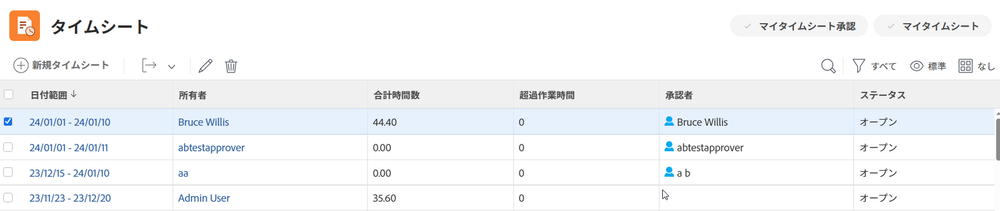

# タイムシートのリストを書き出し

管理職またはタイムシート承認者は、担当する従業員のタイムシートに関する情報をすばやく表示するために、タイムシートのリストをダウンロードする必要がある場合があります。これを行うには、タイムシートのリストを書き出します。

## アクセス要件

この記事の手順を実行するには、次のアクセス権が必要です。

<table style="table-layout:auto"> 
 <col> 
 <col> 
 <tbody> 
  <tr> 
   <td role="rowheader">Adobe Workfront プラン*</td> 
   <td> 
任意
 </td> 
  </tr> 
  <tr> 
   <td role="rowheader">Adobe Workfront ライセンス*</td> 
   <td> 
レビュー以上
 </td> 
  </tr> 
  <tr> 
   <td role="rowheader">アクセスレベル設定*</td> 
   <td> 
タスクとイシューへの閲覧またはそれ以上のアクセス権
 
まだアクセス権がない場合は、Workfront 管理者に問い合わせて、アクセスレベルに追加の制限が設定されているかどうかを確認してください。Workfront 管理者がアクセスレベルを変更する方法について詳しくは、<a href="../../administration-and-setup/add-users/configure-and-grant-access/create-modify-access-levels.md" class="MCXref xref">カスタムアクセスレベルの作成または変更</a>を参照してください。
 </td> 
  </tr> 
  <tr> 
   <td role="rowheader">オブジェクト権限</td> 
   <td> 
タイムシートに対する表示以上の権限
 
追加のアクセス権のリクエストについて詳しくは、<a href="../../workfront-basics/grant-and-request-access-to-objects/request-access.md" class="MCXref xref">オブジェクトへのアクセス権のリクエスト</a>を参照してください。
 </td> 
  </tr> 
 </tbody> 
</table>

*ご利用のプランやライセンスタイプは、Workfront 管理者にお問い合わせください。

## タイムシートのリストを書き出し

1. Adobe Workfront の右上隅にある&#x200B;**メインメニュー**&#x200B;アイコン  をクリックします。

1. 「**タイムシート**」をクリックします。デフォルトでは、**すべての**&#x200B;フィルターが選択されています。

   

1. （オプション）**検索**&#x200B;アイコン  をクリックし、キーワードを入力して、特定のタイムシートを検索します。例えば、タイムシートの時間枠または所有者名を検索できます。

1. （オプション）次のいずれかの操作を行って、タイムシートリストのフィルターを更新します。

   * ページの右上隅にある「**マイタイムシート承認**」を選択して、承認するタイムシートのみを表示する

     または

     「**マイタイムシート**」を選択して、自分のタイムシートのみを表示する。

     これにより、「マイタイムシート承認」フィルターまたは「マイタイムシート」フィルターが、タイムシートリストに適用されます。

     

   * フィルターアイコン  をクリックして別のフィルターを適用するか、新しいフィルターを作成します。フィルターの作成または更新については、[Adobe Workfront でフィルターを作成または編集](../../reports-and-dashboards/reports/reporting-elements/create-filters.md)を参照してください。

   >[!NOTE]
   >
   >Workfront 管理者またはグループ管理者が、設定領域の「リスト制御」またはレイアウトテンプレートから「マイタイムシート承認」フィルターと「マイタイムシート」フィルターを削除した場合、「マイタイムシート承認」オプションと「マイタイムシート」オプションは、タイムシートリストの上部またはフィルターリストには表示されません。詳しくは、次の記事を参照してください。
   >
   >   
   >   
   * [レイアウトテンプレートを使用したフィルター、ビューおよびグループ化のカスタマイズ](../../administration-and-setup/customize-workfront/use-layout-templates/customize-fvg-list-controls-layout-template.md)
   >   
   >

1. （オプション）**表示**&#x200B;アイコン  または&#x200B;**グループ化**&#x200B;アイコン  をクリックして、別のビューやグループ化を適用するか、新しいビューやグループ化を作成します。

   フィルター、ビューまたはグループ化の作成については、次の記事を参照してください。

   * [Adobe Workfront でフィルターを作成または編集](../../reports-and-dashboards/reports/reporting-elements/create-filters.md)
   * [Adobe Workfront でビューを作成または編集](../../reports-and-dashboards/reports/reporting-elements/create-edit-views.md)
   * [Adobe Workfront でのグループ化の作成](../../reports-and-dashboards/reports/reporting-elements/create-groupings.md)

1. 書き出すタイムシートを選択して、**書き出し**&#x200B;アイコン  をクリックします。

   

1. タイムシートの一覧を書き出すファイルの種類を次のオプションから選択します。

   * PDF 横
   * PDF 縦
   * PDF のその他のサイズ
   * Excel
   * Excel（xlsx）
   * タブ区切り

   タイムシートのリストは、選択した形式でコンピューターにダウンロードされ、次のタイムシート情報が含まれます。

   * 日付範囲
   * 所有者名
   * 合計時間数
   * 超過作業時間
   * 承認者名
   * ステータス
