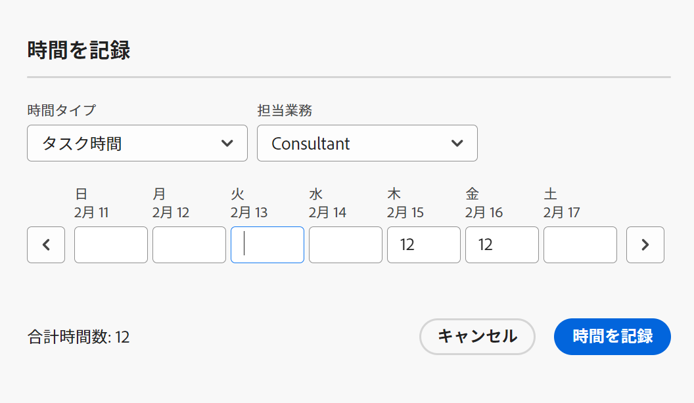
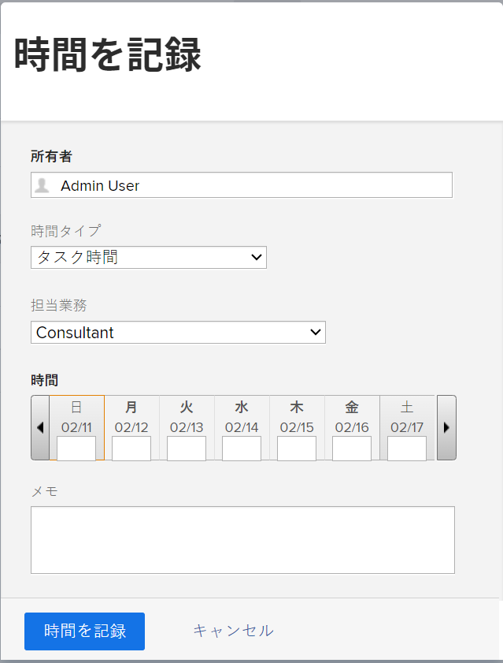

# 時間を記録

<!--Audited: 12/2023-->

<!--remove all preview and production references from this article with 23.3 release-->

<!--
The highlighted information on this page refers to functionality not yet generally available. It is available only in the Preview environment for all customers. After the monthly releases to Production, the same features are also available in the Production environment for customers who enabled fast releases.   
For information about fast releases, see [Enable or disable fast releases for your organization](../../administration-and-setup/set-up-workfront/configure-system-defaults/enable-fast-release-process.md). 

For information about the current release schedule, see [Fourth Quarter 2023 release overview](../../product-announcements/product-releases/23-q4-release-activity/23-q4-release-overview.md) 
-->

Adobe Workfront の作業アイテムに費やした時間を記録して、その作業アイテムに費やした時間を示すことができます。休暇、病気の時間、会議に費やした時間など、仕事に関係のない時間を記録することもできます。記録した時刻がタイムシートに表示されます。

Workfront にログインできる時間の種類について詳しくは、[時間タイプの管理](../../administration-and-setup/set-up-workfront/configure-timesheets-schedules/hour-types.md)を参照してください。

## アクセス要件

+++ 展開すると、この記事の機能のアクセス要件が表示されます。

この記事の手順を実行し、プロジェクト固有の時間を記録するには、次のアクセス権が必要です。

<table style="table-layout:auto"> 
 <col> 
 <col> 
 <tbody> 
  <tr> 
   <td role="rowheader">Adobe Workfront プラン</td> 
   <td> 
任意
 </td> 
  </tr> 
  <tr> 
   <td role="rowheader">Adobe Workfront プラン*</td> 
   <td> 
新規：プロジェクト、タスク、問題、またはタイムシートの一般時間を記録するには Light 以上

   
現在： 
   <ul><li>タイムシートの一般的な時間数を記録するには、確認またはそれ以上</li>
   <li>プロジェクト、タスク、またはイシューの時間を記録をするにはワーク以上</li></ul> </td> 
  </tr> 
  <tr> 
   <td role="rowheader">アクセスレベル設定</td> 
   <td> 
時間を記録する作業アイテムのタイプへのアクセスを編集 
 
例えば、イシューの発生時間を記録するには、イシューに対する編集アクセス権が必要です。
 </td> 
  </tr> 
  <tr> 
   <td role="rowheader">オブジェクト権限</td> 
   <td> 
時間を記録する作業アイテムにおける Contributer 以上の権限（時間を記録する権限を含む）。
 </td> 
  </tr> 
 </tbody> 
</table>

*詳しくは、[Workfront ドキュメントのアクセス要件](/help/quicksilver/administration-and-setup/add-users/access-levels-and-object-permissions/access-level-requirements-in-documentation.md)を参照してください。

+++

## Workfront で時間を記録する際の考慮事項

* プロジェクト、タスク、またはイシューに関する時間を記録したり、タイムシートに直接時間を記録したりできます。

  タイムシートの作成の詳細については、[単一使用のタイムシートを作成](../../timesheets/create-and-manage-timesheets/create-tmshts.md)を参照してください。

* タイムシート以外のツールによって記録されたすべての時間が、対応する期間のタイムシートに表示されます。
* 現在のプロジェクトではないタスクとイシューは、タイムシートに事前に入力されていません。
* タイムシートに記録された時間は、タスク、イシュー、またはプロジェクトに直ちに適用されます。
* タイムシートには、すべてのログに記録された日付の合計時間が含まれます。タイムラインの計算で除外するように設定されている場合でも、（[システム全体のプロジェクト環境設定の指定](../../administration-and-setup/set-up-workfront/configure-system-defaults/set-project-preferences.md)で説明されているように）週末を常に含みます。
* タイムシートに表示される項目の最大数は 45 です。タイムシートの時間枠に一致する日付を持つ 45 項目を超える場合は、最も新しく更新された項目のみが表示されます。
* 請求済み請求記録に含まれる時間エントリは灰色表示になり、タイムシートで編集できません。詳しくは、[請求記録の作成](../../manage-work/projects/project-finances/create-billing-records.md)を参照してください。
* デフォルトでは、個人タスクはタイムシートに表示されません。個人タスクは、タイムシートに時間が記録された場合にのみ表示されます。個人タスクの時間を記録した後、タスクをタイムシートに固定すると、そのタスクは固定されたままタイムシートに残ります。詳しくは、[ホームエリアからの作業アイテムの作成](../../workfront-basics/using-home/using-the-home-area/create-work-items-in-home.md)を参照してください。

## 時間を記録 {#log-time-section}

Workfront の次の領域で時間を記録できます。

* [タイムシート](#timesheet)
* [ホーム](#home)
* [プロジェクト、タスクまたはイシュー](#project-task-or-issue)
* [概要パネル](#summary-panel)
* [ボード](#boards)
* [モバイルアプリ](#mobile-app)

### タイムシート {#timesheet}

#### タイムシートへの時間の記録 {#log-time-on-a-timesheet}

タイムシートの次の項目に時間を記録できます。

* Workfront 管理者によるタイムシートの基本設定に基づいて、事前に入力されたタスク、イシューおよびプロジェクトが自動的に表示されます。タイムシートの事前入力方法について詳しくは、[タイムシートおよび時間の環境設定の指定](../../administration-and-setup/set-up-workfront/configure-timesheets-schedules/timesheet-and-hour-preferences.md)を参照してください。

  自分に割り当てられたタスクと問題のみがタイムシートに事前入力されます。チームまたは担当業務に割り当てられたタスクとイシューは、タイムシートに自動的に入力されません。

  チームに割り当てられた項目で「作業をする」クリックすると、項目が自分に割り当てられ、項目がタイムシートに表示されます。

* 手動で追加するタスク、イシュー、プロジェクト。
* Workfront のどこかで既に時間を記録しているタスク、イシュー、またはプロジェクト。
* 一般時間（休暇、トレーニング、オーバーヘッド時間）。

>[!NOTE]
>
>タイムシートプロファイルに割り当てられたレビューユーザーは、タイムシート領域を表示し、一般的な時間数を記録できます。ただし、タイムシートに表示され、割り当てられたタスクやイシューに関する時間は記録できません。

タイムシートに時間を記録するには：

{{step1-click-main-menu}}

1. 「[!UICONTROL **タイムシート**]」をクリックします。現在のタイムシートがデフォルトで表示されます。
   

1. （オプション）**全画面表示**&#x200B;アイコン  をクリックして、タイムシートを全画面モードで表示し、続いて **全画面を終了** アイコンをクリックしてタイムシートに戻ります。

   <!-- drafted for the resize columns in timesheet story: 1. (optional) Click on the separator lines between weeks or between the time frame area and the work item area to resize the columns of the timesheet.-->

1. （オプション）プロジェクト、タスク、またはタスクをタイムシートに追加するには、タイムシートの左上隅にある&#x200B;**項目を追加**&#x200B;ドロップダウンメニューをクリックし、続いて&#x200B;**プロジェクトを追加**、**タスクを追加**&#x200B;または&#x200B;**イシューを追加**&#x200B;をクリックします。

   プロジェクト、タスクまたはタスクのリストが表示されます。

   <!--drafted for full screen mode for add projects story - align it with the rest of the steps when you enable this:: 1. (Optional) Click the **full-screen** icon  to display the list of objects in full-screen mode.-->

1. （オプション）検索アイコン  をクリックして、キーワードを使用して特定のアイテムを検索し、タイムシートに追加します。

1. （オプション）フィルター、表示またはグループ化のドロップダウンメニューを展開して適用またはカスタマイズし、必要な項目情報を表示します。

1. リスト内の 1 つまたは複数の項目を選択し、「**追加**」をクリックします。

   一度に追加したアイテムが 50 個未満の場合、それらはタイムシートに追加されます。タスクとイシューは、プロジェクトの名前の下に表示されます。

   >[!NOTE]
   >
   >タイムシートにタスクまたはタスクを追加すると、プロジェクトも追加されます。

1. （条件付き）一度に 50 個以上の項目を追加すると、タイムシートに追加された項目の数を示す確認メッセージが表示されます。

   「**すべて追加**」をクリックして、すべての項目を追加
または
「**キャンセル**」をクリックして、選択した項目の追加を停止し、次に「**キャンセル**」をクリックして、項目のリストを閉じます。

   タスクとイシューは、プロジェクトの名前の下に表示されます。

   >[!NOTE]
   >
   >手動でタイムシートに追加した項目はピン留めされ、手動でピン留め解除して削除するまで、現在および将来のタイムシートに残ります。項目を固定解除してタイムシートから削除するには、手順 10 に進みます。

   <!--(ensure this stays accurate)-->

1. （オプション）プロジェクト名の横にある&#x200B;**折りたたむ**&#x200B;アイコン  または&#x200B;**展開**&#x200B;アイコン  をクリックして、プロジェクトのタスクとイシューのリストを表示または非表示にできます。

   >[!TIP]
   >
   >   標準の QWERTY キーボードを使用する場合、タイムシートでプロジェクトの名前をクリックしてから、以下のキーの組み合わせを押して、プロジェクトを折りたたんだり展開したりします。
   >   * プロジェクトを展開して作業アイテムを表示するには、以下のように行います。
   >     * Windows コンピューターの場合は、Shift + Alt + 上矢印
   >     * Mac コンピューターの場合は、Shift + Option +上矢印
   >   * プロジェクトを折りたたんで作業アイテムを非表示にするには、以下のように行います。
   >     * Windows コンピューターの場合は、Shift + Alt + 下矢印
   >     * Mac コンピューターの場合は、Shift + Option + 下矢印。

1. （オプション）タイムシートに自動的に表示される項目を手動でピン留めするには、項目の名前にポインタを合わせ、**ピン留め**&#x200B;アイコン  をクリックします。

   >[!TIP]
   >
   >   タイムシート内の項目をクリックした後で標準の QWERTY キーボードを使用する場合は、以下のキーの組み合わせを押して項目をピン留めします。
   >   * Windows コンピューターと Mac コンピューターの両方で Option + P キー。

1. （オプション）検索アイコン  をクリックして、キーワードを入力し、タイムシートのプロジェクト、タスク、やイシューを検索します。

1. （条件付き）Workfront 管理者またはグループ管理者が&#x200B;**担当業務を時間エントリに手動で割り当て**&#x200B;設定時に、ドロップダウンメニューから担当業務を選択します。作業アイテムに割り当てられたときに指定された役割がデフォルトで表示されます。オブジェクトに対する役割が割り当てられていない場合は、主要役割がデフォルトとして表示されます。この設定に関して詳しくは、[タイムシートと時間の環境設定を指定](../../administration-and-setup/set-up-workfront/configure-timesheets-schedules/timesheet-and-hour-preferences.md)を参照してください。

   

1. （オプション）**+**&#x200B;アイコンをクリックして別の行を追加し、[!UICONTROL 時間タイプ]列のドロップダウンメニューから新しい時間タイプを選択して、異なる時間タイプの時間を記録します。

   

   >[!TIP]
   >
   >   オペレーティングシステムやブラウザーに応じて、標準の QWERTY キーボードを使用する場合は、以下のキーのセットを押して別の行を追加します。
   >   * Windows コンピューターの場合は、Ctrl + Option + +
   >   * Mac コンピューターの場合は、Cmd + Option + +

   時間タイプは、システム、プロジェクト、ユーザーレベルで定義されている内容に応じて使用できます。詳しくは、[ 時間タイプと空き時間の定義 ](define-hour-types-and-availability.md) を参照してください。

   タイムシートを閉じた後は、時間タイプを変更できません。

   >[!TIP]
   >
   >以前にログに記録した時間で、選択した時間タイプが非アクティブ化された場合は、ログに記録された時間の行全体がグレー表示になります。別の時間タイプを選択してページを更新すると、非アクティブな「時間タイプ」オプションがドロップダウンリストから削除されるので、その時間タイプに時間数を追加できません。
   >
   >過去に記録された時間に関連付けられた非アクティブ化された時間タイプを保持したい場合は、追加時間を記録する作業アイテムの新しい行を追加し、新しい時間タイプを選択することを検討します。

1. 担当業務の横にある&#x200B;**削除**&#x200B;アイコン  をクリックして、削除します。役割に対してログに記録された時間も、常に削除されます。

   >[!TIP]
   >
   >   オペレーティングシステムやブラウザーに応じて、標準の QWERTY キーボードを使用する場合は、次のキーのセットを押して行を削除します。
   >   * Windows コンピューターの場合は Ctrl + Option + - 
   >   * Mac コンピューターの場合は Cmd + Option + -

1. タイムシートの「タイムライン」セクションで指定した日にログオンする時間を指定し、「時間」ボックスの外側をクリックして時間エントリを保存します。時間は自動的に保存されます。時間を記録する行が水色でハイライト表示され、時間入力ボックスは濃い青色でアウトライン表示されます。

   

   時間は、時間単位または日単位で記録します。この設定は、[時間を時間単位または日単位で記録するかを設定する](../../timesheets/config-timesheet-prefs/config-time-logged-hrs-days.md)で説明されるように、プランライセンスを持つユーザーまたはシステム管理者によって指定されます。

   >[!IMPORTANT]
   >
   >次のいずれかのシナリオが発生した場合は、タイムシートを手動で保存する必要があります。
   >
   >* 以前にログに記録した時間に関連付けられた担当業務が変更され、「**手動で担当業務を時間エントリに割り当てます**」の設定が無効になっています。新しい日付のログ時刻は、別の担当業務に関連付けられます。
   >   
   >   役割が変更され、「**手動で担当業務を時間エントリに割り当てます**」の設定を有効にすると、時間を記録したり、役割を更新したりでき、変更内容は自動的に保存されます。
   >
   >* タスクまたはイシューに割り当てられた担当業務は、タイムシート所有者が <!--or assigned to them_ this last  piece came from a Support note but but sure what role it's referring to. Leaving it out for now.--> で時間を記録する担当業務とは異なります。
   >
   >2 つの役割の間に競合するエントリがなくなった場合、タイムシートは自動的に時間を保存します。
   >

1. （オプション）タイムシートのヘッダーの「超過作業時間」フィールドに、超過作業時間数を指定します。

   >[!TIP]
   >
   >タイムシートの現在の合計時間数よりも長い時間の超過作業時間数を記録することはできません。例えば、これまでにタイムシートに 7 時間記録した場合、超過作業時間数を 8 時間の記録することはできません。

1. （オプション）「**コメント**」をクリックして、時間エントリにコメントを追加します。

   

   >[!TIP]
   >
   >   時間入力ボックスをクリックした後で標準の QWERTY キーボードを使用する場合は、次のキーのセットを押してコメントボックスを開きます。
   >   * Windows コンピューターおよび Mac コンピューターの両方で Shift + F2 を押します。

1. 「**完了**」をクリックしてコメントを保存します。

   >[!TIP]
   >
   >   標準の QWERTY キーボードを使用する場合は、コメントボックス内から次のキーを押してコメントを保存します。
   >   * Windows コンピューターの場合は、Ctrl + Enter キーを押します。
   >   * Mac コンピューターの場合は Cmd + Return キーを押します。

1. （オプション）ツールバーの「**コメントを表示**」をクリックして、作業アイテムの下に時間入力のコメントを表示します。

   

   >[!TIP]
   >
   >   タイムシートに加えた変更はすべて自動的に保存されます。

1. （オプション）タスクまたはイシューの行をクリックし、タイムシートの右上隅にある「**概要を開く**」をクリックして、更新を追加したり、タスクやイシューに関する情報を更新したりします。右側に概要パネルが開きます。

   

   更新内容は、ログに記録された時間に関連付けられた作業アイテムの更新エリアに表示されます。

   >[!TIP]
   >
   >プロジェクトまたは一般時間の時間エントリに対するコメントはできません。

1. 「[!UICONTROL **概要を閉じる**]」をクリックして概要パネルを閉じ、タイムシートに戻ります。

1. （オプション）左側のパネルで「[!UICONTROL **更新**]」をクリックして、タイムシートに更新を追加します。Workfront のアップデートについて詳しくは、[作業の更新](../../workfront-basics/updating-work-items-and-viewing-updates/update-work.md)を参照してください。

   

1. （オプション）**タイムシート**&#x200B;エリアに戻って、タイムシートを閉じるか送信します。

   * **閉じる**：タイムシートの更新が完了したら、タイムシートを閉じます。このオプションは、タイムシートが承認者に関連付けられていない場合にのみ使用できます。

   * **承認用に送信：**&#x200B;このオプションは、タイムシートに承認者が存在する場合にのみ使用できます。変更を保存し、承認用に送信します。タイムシートを閉じた後、「**リコール**」をクリックすると、承認されていない場合には開くことができます。詳しくは、[承認用のタイムシートを送信](../../timesheets/create-and-manage-timesheets/submit-timesheet-for-approval.md)を参照してください。

   * **拒否**：このオプションは、タイムシートの承認者に対して、タイムシートが承認用に送信された場合に表示されます。これをクリックすると、タイムシートの状態が拒否に変わり、タイムシートは開いたままになります。

   * **承認**：このオプションは、タイムシートの承認者に対して、タイムシートが承認用に送信された場合に表示されます。これをクリックすると、タイムシートの状態が承認済みに変わり、タイムシートが閉じられます。

   >[!TIP]
   >
   >タイムシートが承認者に関連付けられている場合は、システム管理者に対して「拒否」および「承認」オプションもタイムシートに表示されます。

1. （条件付き）タイムシートを閉じた場合または承認用にタイムシートを提出した場合、次のいずれかのオプションをクリックします。

   * **再開**：このオプションは、既に閉じた承認者を持たないタイムシートまたは既に承認済みのタイムシートに対して使用できます。タイムシートを再度開いて、時間エントリを変更します。
   * **取り消し**：このオプションは、承認用に送信されたが、まだ承認または却下されていないタイムシートに対して使用できます。「**取り消し**」をクリックして、タイムシートを再度開き、時間エントリを変更します。

#### タイムシートから項目を削除する

タイムシートから時間エントリまたは項目（プロジェクト、タスク、またはイシュー）を削除できます。

タイムシートから時間エントリを削除するには、次の手順に従います。

1. タイムシートに移動し、削除する時間エントリを見つけます。
1. 入力した時間を 0 に置き換えるか、
または
時間を削除して 0 に置き換え、Enter キーを押します。

   時間が削除され、タイムシートが自動的に保存されます。

項目（プロジェクト、タスク、またはイシュー）をタイムシートから削除するには、項目の固定を解除し、まだログに記録されていない場合は手動でアイテムを追加します（この記事の[タイムシートの時間を記録する](#log-time-on-a-timesheet)の節の手順 4 から 8 を参照）。<!--ensure this stays accurate-->

タイムシートに事前入力するように設定された Workfront システムまたはグループのタイムシート環境設定に従って、タイムシートに含まれる項目を自動的に削除することはできません（[タイムシートの設定と時間の環境設定](../../administration-and-setup/set-up-workfront/configure-timesheets-schedules/timesheet-and-hour-preferences.md)を参照）。項目の日付がタイムシートの期間外にある場合、項目はタイムシートの事前入力を停止します。

手動で追加したタイムシートから項目を削除するには、次の手順に従います。

1. 項目に対して時間が記録されていないことを確認します。
1. タイムシートから項目の固定を解除するには、項目の横にある&#x200B;**固定を解除**&#x200B;アイコン  をクリックします。

   >[!TIP]
   >
   >   タイムシート内の項目をクリックした後で標準の QWERTY キーボードを使用する場合は、次のキーを押して項目の固定を解除します。
   > * Windows コンピューターと Mac コンピューターの両方で Option + P キー。

   ページを更新すると、項目はタイムシートから削除されます。

### ホーム {#home}

ホームでは、プロジェクト固有の時間を記録できます。

ホームエリアの使用の概要については、[ホームエリアの使用](../../workfront-basics/using-home/using-the-home-area/use-the-home-area.md)を参照してください。

<!--#### Log time on a work item from the new Home area-->

ホーム領域の概要パネルを使用して、任意のウィジェットのタスクや問題に時間を記録できます。 詳しくは、この記事の[概要パネル](#summary-panel)の節を参照してください。

さらに、自分の作業ウィジェットでアイテムの時間を記録するには、次の手順に従います。

1. **ホーム** エリアに移動します。
1. **自分の作業**&#x200B;ウィジェットを自分のホームに追加します。
1. （オプション）リストでタスク、イシューまたはリクエストを選択し、「**作業**」をクリックします。
1. 時間を記録するタスクまたはイシューにポインタを合わせ、タスク情報の右にある&#x200B;**時間を記録**&#x200B;アイコン  をクリックします。

   

1. 「**時刻を記録**」をクリックします。

   ログ時間は、オブジェクトの「時間」セクションと、タイムシートに表示されます。

<!--#### Log time on a work item from the legacy Home area

1. In the **Work List** area, select the item where you want to log time.
1. In the right panel, click **Log Time**.  
  
     

1. In the **Enter Hours** drop-down menu, select the appropriate hour type.  
   Hour types are available depending on what has been defined at the system, project, and user levels, as described in [Define hour types and availability](../../timesheets/create-and-manage-timesheets/define-hour-types-and-availability.md).
1. (Conditional) If your Workfront or group administrator has enabled the **Assign job roles to hour entries manually** setting, select a job role from the drop-down menu. The role specified when you are assigned to the work item displays by default. If you are not assigned a role on the object, your Primary Role displays as the default. For more information on this setting, see the article [Configure timesheet and hour preferences](../../administration-and-setup/set-up-workfront/configure-timesheets-schedules/timesheet-and-hour-preferences.md).
1. Specify the time you want to log, then click **Log Time**.

   The logged time displays in the object's Hours section, nad in your timesheet. -->

### プロジェクト、タスクまたはイシュー {#project-task-or-issue}

次のセクションでは、プロジェクト、タスクまたはイシューに関するプロジェクト固有の時間を記録できます。

* [「更新」セクション](#updates-section)
* [「時間」セクション](#hours-section)

#### 「更新」セクション{#updates-section}

プロジェクト、タスク、またはイシューの「更新」セクションで時間を記録するには、以下が必要です。

* この記事の [ アクセス要件 ](#access-requirements) の節で説明しているように、正しいアクセスと権限です。

* プロジェクトに時間を直接記録するには、Workfront管理者がシステム領域の [!UICONTROL **タイムシートと時間**]>[!UICONTROL **環境設定**] の下にある「プロジェクトに直接時間を記録」設定を有効にする必要があります。

  時間数をユーザーが直接プロジェクトに記録できるようにする方法について詳しくは、[タイムシートと時間の環境設定の指定](../../administration-and-setup/set-up-workfront/configure-timesheets-schedules/timesheet-and-hour-preferences.md)を参照してください。

プロジェクト、タスクまたはイシューの「更新」セクションで時間を記録するには、次の手順に従います。

1. プロジェクト、タスクまたはイシューに移動します。
1. 左パネルで「**更新**」を選択します。
1. 「**時間を記録**」をクリックします。<!-- did Anna B change the casing for this button? If yes and if she changed it for the other areas, update screen shot too-->

   「時間を記録」ダイアログボックスが表示されます。

   >[!TIP]
   >
   >   時間を日単位で記録するようにプロファイルの環境設定が設定されている場合は、「日数の入力」ボックスが表示されます。
   >   
   >   1 日に含まれる時間数が「日数の入力」ボックスの右上隅に表示されます。

   

1. 次の情報を指定します。

   * **時間タイプ**：デフォルトで表示されるものと異なる場合は、ドロップダウンメニューから「時間タイプ」を選択します。

     システムで設定されている時間タイプによって、ここで提供されるオプションは異なる場合があります。時間タイプの設定について詳しくは、[ 時間タイプと空き時間の定義 ](../../timesheets/create-and-manage-timesheets/define-hour-types-and-availability.md) を参照してください。

   * **担当業務**：（条件付き）Workfront 管理者またはグループ管理者が「**手動で担当業務を時間エントリに割り当てます**」設定を有効にしている場合は、ドロップダウンメニューから「**担当業務**」を選択します。オブジェクトに割り当てられたときに指定された役割がデフォルトで表示されます。オブジェクトに対する役割が割り当てられていない場合は、主要役割がデフォルトとして表示されます。この設定について詳しくは、[タイムシートと時間の環境設定の指定](../../administration-and-setup/set-up-workfront/configure-timesheets-schedules/timesheet-and-hour-preferences.md)を参照してください。

   * **時間数**：プロジェクト、タスクまたはイシューの時間数を入力します。

1. 「**時刻を記録**」をクリックします。

   ログ時間は、オブジェクトの「時間」セクションと、タイムシートに表示されます。

#### 「時間」セクション{#hours-section}

「時間」セクションでプロジェクト、タスクおよびイシューの時間を記録するには、Workfront 管理者である必要があります。

または

以下がすべて必要です。

* 「タイムシートと時間」への管理アクセス権が付属しているプランライセンス。「タイムシートと時間」への管理アクセス権の付与について詳しくは、[ユーザーへの特定エリアに対する管理アクセス権の付与](../../administration-and-setup/add-users/configure-and-grant-access/grant-users-admin-access-certain-areas.md)を参照してください。
* プロジェクトへの「参加」またはそれ以上の権限と「時間の記録」へのアクセス権。プロジェクトに関する権限の付与について詳しくは、[Adobe Workfront でのプロジェクトの共有](../../workfront-basics/grant-and-request-access-to-objects/share-a-project.md)を参照してください。
* プロジェクトに時間を直接記録したい場合は、Workfront管理者が「設定」エリアの **タイムシートと時間/環境設定** セクションで「プロジェクトに直接時間を記録」設定を有効にする必要があります。 時間数をユーザーが直接プロジェクトに記録できるようにする方法について詳しくは、[タイムシートと時間の環境設定の指定](../../administration-and-setup/set-up-workfront/configure-timesheets-schedules/timesheet-and-hour-preferences.md)を参照してください。

プロジェクト、タスクまたはイシューの「時間」セクションで時間を記録するには、次の手順に従います。

1. プロジェクト、タスクまたはイシューに移動します。
1. 左パネルで「**時間**」をクリックします。
1. 「**時間を記録**」をクリックします。

   時間の記録ダイアログボックスが表示されます。

1. 次の情報を指定します。

   * **所有者**：デフォルトでは、自分の名前がこのフィールドに表示されます。\
     別のユーザーの時間を記録する場合は、そのユーザーの名前を指定します。

   * **時間タイプ**：デフォルトで表示されるものと異なる場合は、ドロップダウンメニューから「時間タイプ」を選択します。

     システムで設定されている時間タイプによって、ここで提供されるオプションは異なる場合があります。時間タイプの設定について詳しくは、[ 時間タイプと空き時間の定義 ](../../timesheets/create-and-manage-timesheets/define-hour-types-and-availability.md) を参照してください。

   * **担当業務**：（条件付き）Workfront 管理者またはグループ管理者が「**手動で担当業務を時間エントリに割り当てます**」設定を有効にしている場合は、ドロップダウンメニューから「**担当業務**」を選択します。オブジェクトに割り当てられたときに指定された役割がデフォルトで表示されます。オブジェクトに対する役割が割り当てられていない場合は、主要役割がデフォルトとして表示されます。この設定について詳しくは、[タイムシートと時間の環境設定の指定](../../administration-and-setup/set-up-workfront/configure-timesheets-schedules/timesheet-and-hour-preferences.md)を参照してください。

     
   * **時間数**：プロジェクト、タスクまたはイシューの時間数を入力します。

1. 「**時間を記録**」をクリックします。

### 概要パネル

概要パネルでは、タスクとイシューに関する時間を記録できます。
詳しくは、[概要について](../../workfront-basics/the-new-workfront-experience/summary-overview.md)を参照してください。

### ボード {#boards}

Workfront ボードの接続カードで時間を記録できます。これはタスクやイシューの時間を記録するのと同じプロセスであり、カードに記録された時間数は、接続されたタスクまたはイシューに保存されます。
詳しくは、[ボードでの接続カードの使用](/help/quicksilver/agile/get-started-with-boards/connected-cards.md)を参照してください。

### モバイルアプリ {#mobile-app}

Workfront モバイルアプリで時間を記録できます。
詳しくは、[Android 用 Adobe Workfront](/help/quicksilver/workfront-basics/mobile-apps/using-the-workfront-mobile-app/workfront-for-android.md) または [iOS 用 Adobe Workfront](/help/quicksilver/workfront-basics/mobile-apps/using-the-workfront-mobile-app/workfront-for-ios.md) を参照してください。

## リストおよびレポートのログ時間を編集する

>[!CAUTION]
>
>* クローズしたタイムシートに属する時間エントリは変更できません。 最初にタイムシートを再度開いてから、時間エントリ情報を変更する必要があります。
>* 時間タイプを収益としてカウントしないタイプから収益としてカウントする別のタイプに変更すると、プロジェクトの財務の変更も発生します。 時間タイプを収益としてカウントするタイプから収益としてカウントしないタイプに変更すると、プロジェクトの財務も更新されます。
>
>詳しくは、[ 時間タイプの管理 ](/help/quicksilver/administration-and-setup/set-up-workfront/configure-timesheets-schedules/hour-types.md) を参照してください。
>

次の領域でログ時間を編集できます。

* オープン タイムシートを含む、時間を追加したすべての領域
* 時間リストおよびレポート。

リストまたはレポートの時間エントリを編集する場合、次の時間項目の要素を編集できます。

* 時間数
* 時間タイプ
* 時間エントリに関連付けられた担当業務

編集する時間エントリのタイプに応じて、次のフィールドを編集できます。

* プロジェクト固有の時間を編集する場合：

   * 時間数を編集できます。
   * 時間タイプは、プロジェクト固有のタイプにのみ変更できます。
   * 時間の担当業務の割り当ては、設定で有効にした場合にのみ変更できます。 詳しくは、[ タイムシートおよび時間環境設定の設定 ](/help/quicksilver/administration-and-setup/set-up-workfront/configure-timesheets-schedules/timesheet-and-hour-preferences.md) を参照してください。

* 一般的な時間を編集する場合：

   * 時間数を編集できます。
   * 「時間タイプ」は、「一般」タイプにのみ変更できます。
   * 一般的な時間を役割に関連付けることはできないので、時間の担当業務の割り当てを変更することはできません。

* 一般時間とプロジェクト固有の時間を一括して編集する場合：

   * 時間数を編集できます。
   * 時間タイプは変更できません。これは、一般的な時間タイプをプロジェクト固有のタイプに変更したり、プロジェクト固有の時間タイプを一般的なタイプに変更したりできないためです。
   * 一般的な時間を役割に関連付けることはできないので、担当業務の割り当ては変更できません。
