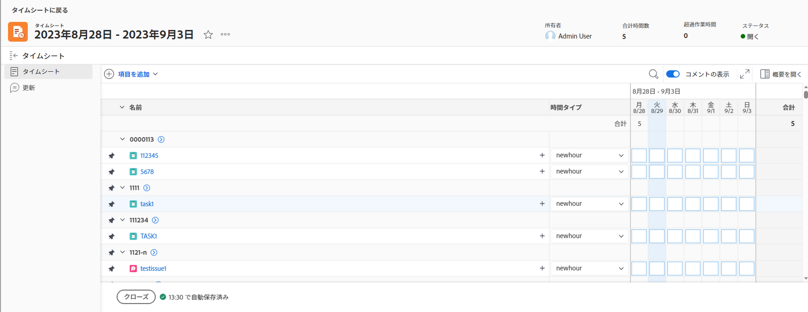
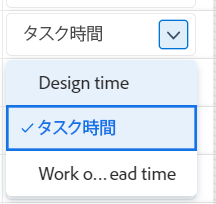
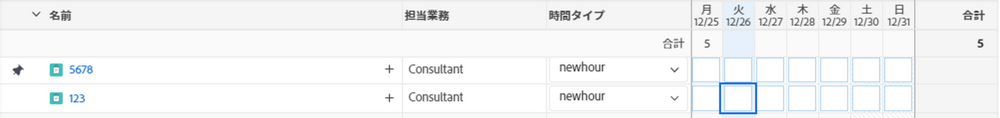
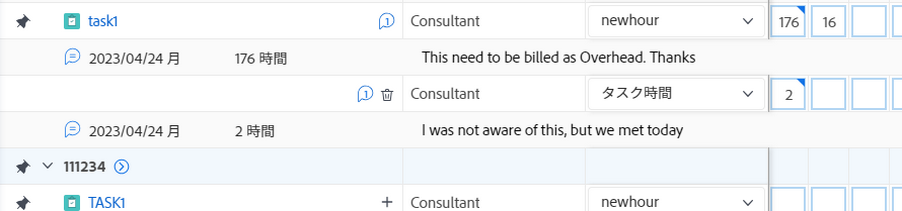
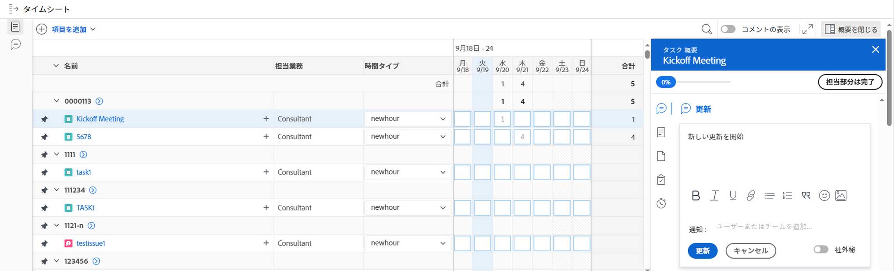
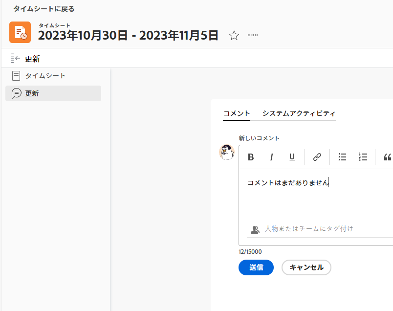
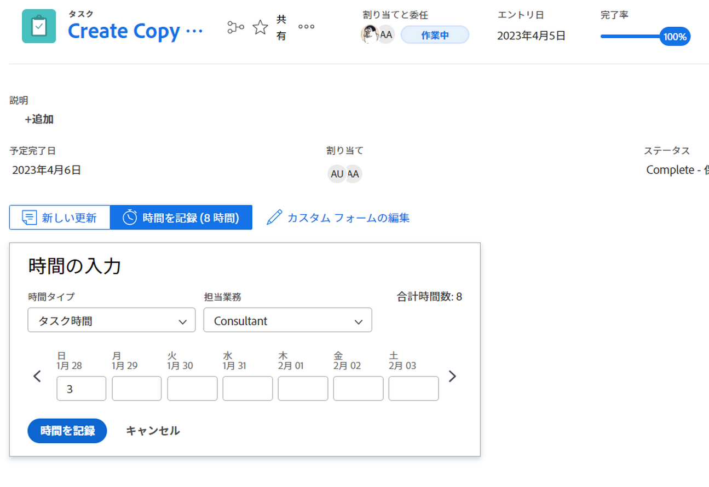
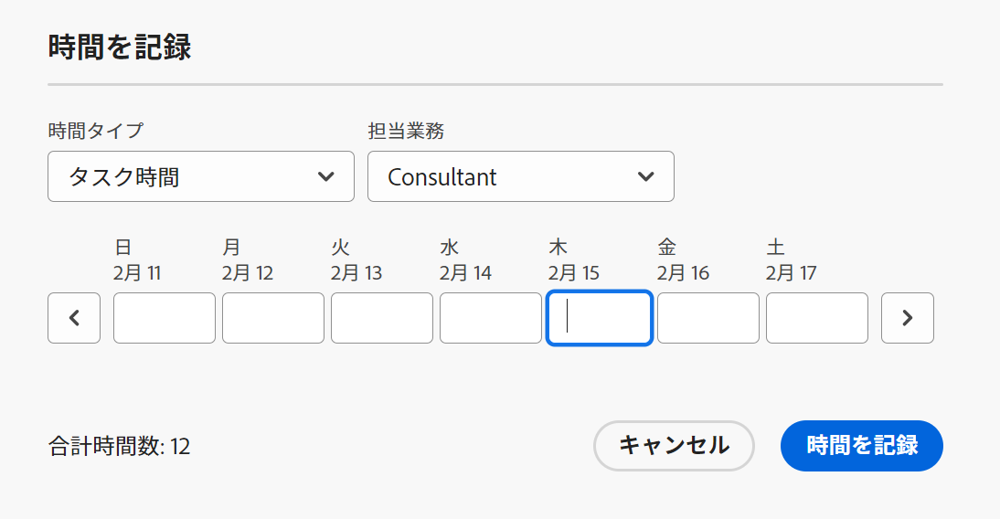
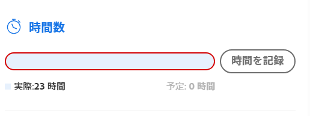

# 時間のログ記録

<!--remove all preview and production references from this article with 23.3 release-->

<!--
The highlighted information on this page refers to functionality not yet generally available. It is available only in the Preview environment for all customers. After the monthly releases to Production, the same features are also available in the Production environment for customers who enabled fast releases.   
For information about fast releases, see [Enable or disable fast releases for your organization](../../administration-and-setup/set-up-workfront/configure-system-defaults/enable-fast-release-process.md). 

For information about the current release schedule, see [Fourth Quarter 2023 release overview](../../product-announcements/product-releases/23-q4-release-activity/23-q4-release-overview.md) 
-->

Adobe Workfrontの作業項目に費やした時間を記録して、その作業項目に費やした時間を示すことができます。 休暇、病気の時間、会議に費やした時間など、仕事に関係のない時間を記録することもできます。 記録した時刻がタイムシートに表示されます。

Workfrontにログインできる時間の種類について詳しくは、 [時間タイプの管理](../../administration-and-setup/set-up-workfront/configure-timesheets-schedules/hour-types.md).

## アクセス要件

<!--drafted for P&P - replace the table:

<table style="table-layout:auto"> 
 <col> 
 <col> 
 <tbody> 
  <tr> 
   <td role="rowheader">Adobe Workfront plan*</td> 
   <td> 
Any
 </td> 
  </tr> 
  <tr> 
   <td role="rowheader">Adobe Workfront license*</td> 
   <td> 
Current license: Light or higher

   
Legacy license: 
   <ul><li>Review or higher to log General Hours in a timesheet</li>
   <li>Work or higher to log hours on a project, task, or issue</li></ul> </td> 
  </tr> 
  <tr> 
   <td role="rowheader">Access level configurations*</td> 
   <td> 
Edit access to the type of work item you log time for 
 
For example, you need Edit access to Issues, to log time for issues
 
If you still don't have access, ask your Workfront administrator if they set additional restrictions in your access level. For information on how a Workfront administrator can modify your access level, see <a href="../../administration-and-setup/add-users/configure-and-grant-access/create-modify-access-levels.md" class="MCXref xref">Create or modify custom access levels</a>.
 </td> 
  </tr> 
  <tr> 
   <td role="rowheader">Object permissions</td> 
   <td> 
Contribute or higher permissions on the work item you log time for that includes permissions to Log Hours
 
For information on requesting additional access, see <a href="../../workfront-basics/grant-and-request-access-to-objects/request-access.md" class="MCXref xref">Request access to objects </a>.
 </td> 
  </tr> 
 </tbody> 
</table>
-->

この記事の手順を実行し、プロジェクト固有の時間を記録するには、次のアクセス権が必要です。

<table style="table-layout:auto"> 
 <col> 
 <col> 
 <tbody> 
  <tr> 
   <td role="rowheader">Adobe Workfront plan*</td> 
   <td> 
任意
 </td> 
  </tr> 
  <tr> 
   <td role="rowheader">Adobe Workfront license*</td> 
   <td> <ul><li>タイムシートの一般時間を記録するには、確認するか、それ以上を指定します</li>
   <li> 作業時間以上：プロジェクト、タスク、またはタスクに時間を記録します。</li></ul>
   </td> 
  </tr> 
  <tr> 
   <td role="rowheader">アクセスレベル設定*</td> 
   <td> 
時間を記録する作業項目のタイプへのアクセスを編集します 
 
例えば、問題の発生時間を記録するには、問題に対する編集アクセス権が必要です
 
まだアクセス権がない場合は、Workfront管理者に、アクセスレベルに追加の制限を設定しているかどうかを問い合わせてください。 Workfront管理者がアクセスレベルを変更する方法について詳しくは、 <a href="../../administration-and-setup/add-users/configure-and-grant-access/create-modify-access-levels.md" class="MCXref xref">カスタムアクセスレベルの作成または変更</a>.
 </td> 
  </tr> 
  <tr> 
   <td role="rowheader">オブジェクトの権限</td> 
   <td> 
ログ時間に対する権限を含む、時刻を記録する作業項目に対する権限を付与するか、それ以上の権限を付与します。
 
追加のアクセス権のリクエストについて詳しくは、 <a href="../../workfront-basics/grant-and-request-access-to-objects/request-access.md" class="MCXref xref">オブジェクトへのアクセスのリクエスト </a>.
 </td> 
  </tr> 
 </tbody> 
</table>

*保有するプラン、ライセンスの種類、アクセス権を確認するには、Workfront管理者にお問い合わせください。

## Workfrontで時間を記録する際の考慮事項

* プロジェクト、タスク、または問題に関する時間を記録したり、タイムシートに直接時間を記録したりできます。

  タイムシートの作成の詳細については、 [単一使用のタイムシートを作成する](../../timesheets/create-and-manage-timesheets/create-tmshts.md).

* タイムシート以外のツールによって記録されたすべての時間が、対応する期間のタイムシートに表示されます。
* 現在のプロジェクトではないタスクとタスクは、タイムシートに事前に入力されていません。
* タイムシートに記録された時間は、タスク、タスク、タスク、またはプロジェクトに直ちに適用されます。
* タイムシートには、すべてのログに記録された日付の合計時間が含まれます。 週末は、タイムラインの計算で除外するように設定されている場合でも、常に含まれます ( [システム全体のプロジェクト環境設定の指定](../../administration-and-setup/set-up-workfront/configure-system-defaults/set-project-preferences.md)) をクリックします。
* タイムシートに表示される項目の最大数は 45 です。 タイムシートの期間に一致する日付を持つ 45 項目を超える場合は、最も新しく更新された項目のみが表示されます。
* 請求済み請求レコードに含まれる時間エントリは灰色表示になり、タイムシートで編集できません。 詳しくは、 [請求レコードの作成](../../manage-work/projects/project-finances/create-billing-records.md).
* 既定では、個人のタスクはタイムシートに表示されません。 個人のタスクは、タイムシートに時間が記録された場合にのみ表示されます。 個人のタスクの時間を記録した後、タスクをタイムシートに固定すると、そのタスクは固定されたままタイムシートに残ります。 詳しくは、 [ホーム領域から作業項目を作成する](../../workfront-basics/using-home/using-the-home-area/create-work-items-in-home.md).

## 時間のログ記録

Workfrontの次の領域で時間をログに記録できます。

* [タイムシート](#timesheet)
* [ホーム](#home)
* [プロジェクト、タスクまたはタスク](#project-task-or-issue)
* [概要パネル](#summary-panel)
* [ボード](#boards)
* [モバイルアプリ](#mobile-app)

### タイムシート {#timesheet}

#### タイムシートの時間を記録する {#log-time-on-a-timesheet}

タイムシートには、一般時間またはプロジェクト固有の時間を記録できます。

>[!NOTE]
>
>タイムシートプロファイルに割り当てられたレビューユーザーは、[ タイムシート ] 領域を表示し、一般時間を記録できます。 ただし、タイムシートに表示されるタスクやタスクに割り当てられた問題に関する時間は記録できません。

1. 次をクリック： [!UICONTROL **メインメニュー**] アイコン  Adobe Workfrontの右上隅にある

1. クリック [!UICONTROL **タイムシート**]. 現在のタイムシートは既定で表示されます。
   

   タイムシートには、タイムシートの期間に割り当てられた項目が事前に入力されます。 タイムシートの事前入力方法については、 [タイムシートと時間の基本設定を構成する](../../administration-and-setup/set-up-workfront/configure-timesheets-schedules/timesheet-and-hour-preferences.md). タイムシートに項目が表示されない場合は、項目を追加できます。

   >[!NOTE]
   >
   >タイムシートには、自分に割り当てられた項目のみが事前入力されます。 チームやジョブの役割に割り当てられた項目を事前に設定することはできません。
   >
   >チームに割り当てられた項目で [ 作業 ] をクリックすると、項目が割り当てられ、項目がタイムシートに表示されます。

1. （オプション） **フルスクリーン** アイコン  タイムシートをフルスクリーンモードで表示するには、 **exit-full-screen**  アイコンをクリックしてタイムシートに戻ります。

   <!-- drafted for the resize columns in timesheet story: 1. (optional) Click on the separator lines between weeks or between the time frame area and the work item area to resize the columns of the timesheet.-->

1. （オプション）プロジェクト、タスク、またはタスクをタイムシートに追加するには、[ **項目を追加** タイムシートの左上隅にあるドロップダウンメニューで、 **プロジェクトを追加**, **タスクを追加**&#x200B;または **問題の追加**.

   プロジェクト、タスクまたはタスクのリストが表示されます。

   <!--drafted for full screen mode for add projects story - align it with the rest of the steps when you enable this:: 1. (Optional) Click the **full-screen** icon  to display the list of objects in full-screen mode.-->

1. （オプション）検索アイコン  を使用して、タイムシートに追加するキーワードを使用して特定の項目を検索します。

1. （オプション）フィルター、表示またはグループ化のドロップダウンメニューを展開して、適用またはカスタマイズしたり、必要な項目情報を表示したりします。

1. リスト内の 1 つまたは複数の項目を選択し、「 **追加**.

   >[!NOTE]
   >
   >タイムシートにタスクまたはタスクを追加すると、プロジェクトも追加されます。

1. （条件付き）一度に 50 個以上の項目を追加すると、タイムシートに追加された項目の数を示す確認メッセージが表示されます。

   クリック **すべて追加** すべての項目を追加するには、以下をクリックします。 **キャンセル** 選択した項目の追加を停止するには、 **キャンセル** をクリックして、項目のリストを閉じます。

   タスクとタスクは、プロジェクトの名前の下に表示されます。

   >[!NOTE]
   >
   >手動でタイムシートに追加した項目は固定され、削除するために手動で固定解除するまで、現在および将来のタイムシートに残ります。 タイムシートから項目を削除するために項目の固定を解除する方法の詳細については、手順 10 に進んでください。

   <!--(ensure this stays accurate)-->

1. （オプション） **折りたたむ**  または **展開**  プロジェクト名の横にあるアイコンを使用して、プロジェクトのタスクとタスクの一覧を表示または非表示にできます。

   >[!TIP]
   >
   >   標準の QWERTY キーボードを使用する場合、タイムシートでプロジェクトの名前をクリックした後、次のキーを押して、プロジェクトを折りたたんだり展開したりします。
   >   * プロジェクトを展開して作業項目を表示するには、次の手順に従います。
   >     * Windows コンピューターの場合は、 Shift + Alt +上向き矢印
   >     * Macコンピューターの場合は、Shift + Option +上向き矢印
   >   * プロジェクトを折りたたんで作業項目を非表示にするには、次の手順に従います。
   >     * Windows コンピューターの場合は、 Shift + Alt +下向き矢印
   >     * Macコンピューターの場合は、Shift + Option +下向き矢印。

1. （オプション）タイムシートに自動的に表示される項目を手動で固定するには、項目の名前の上にマウスポインターを置き、 **ピン** アイコン .

   >[!TIP]
   >
   >   タイムシートで項目をクリックした後に標準の QWERTY キーボードを使用する場合は、次のキーを押して項目を固定します。
   >   * Windows コンピューターとMacコンピューターの両方で Option + P。

1. （オプション）検索アイコン  キーワードを入力して、タイムシートのプロジェクト、タスク、またはイシューを検索します。

1. （条件付き）Workfrontまたはグループ管理者が **ジョブの役割を時間エントリに手動で割り当てる** 設定時に、ドロップダウンメニューからジョブの役割を選択します。 作業項目に割り当てられたときに指定されたロールがデフォルトで表示されます。 オブジェクトにロールが割り当てられていない場合、プライマリロールがデフォルトとして表示されます。 この設定の詳細については、「 [タイムシートと時間の基本設定を構成する](../../administration-and-setup/set-up-workfront/configure-timesheets-schedules/timesheet-and-hour-preferences.md).

   

1. （オプション） **+** アイコンをクリックして別の行を追加し、 [!UICONTROL 時間タイプ] 列を使用して、別の時間タイプの時間を記録します。

   

   >[!TIP]
   >
   >   オペレーティングシステムやブラウザーに応じて、標準の QWERTY キーボードを使用する場合は、次のキーのセットを押して別の行を追加します。
   >   * Windows コンピューターの場合は、 Ctrl + Option + +
   >   * Macコンピューターの Cmd + Option + +

   時間タイプは、システム、プロジェクト、ユーザーレベルで定義された内容に応じて使用できます。詳しくは、 [タイムシートの時間の種類と可用性を定義する](define-hour-types-and-availability.md).

   タイムシートを閉じた後は、時間の種類を変更できません。

   >[!TIP]
   >
   >以前にログに記録した時間で、選択した時間タイプが非アクティブ化された場合は、ログに記録された時間の行全体が灰色表示になります。 別の時間タイプを選択してページを更新すると、非アクティブな時間タイプのオプションがドロップダウンリストから削除されるので、その時間タイプに時間を追加できません。
   >
   >過去のログに記録された時間に関連付けられた非アクティブな時間タイプを保持する場合は、追加の時間を記録する作業項目の新しい行を追加し、新しい時間タイプを選択することを検討します。

1. 次をクリック： **削除** アイコン   をクリックします。 ロールに対してログに記録された時間も常に削除されます。

   >[!TIP]
   >
   >   オペレーティングシステムやブラウザーに応じて、標準の QWERTY キーボードを使用する場合は、次のキーのセットを押して行を削除します。
   >   * Windows コンピューターの場合は Ctrl + Option + -
   >   * Macコンピューターの Cmd + Option + -

1. タイムシートの [ タイムライン ] セクションで指定した日にログオンする時間を指定し、[ 時間 ] ボックスの外側をクリックして時間エントリを保存します。 時間は自動的に保存されます。 時刻を記録する行が明るい青でハイライト表示され、時間入力ボックスは暗い青でアウトライン表示されます。

   

   時間は、時間または日単位で記録します。 この設定は、プランライセンスを持つユーザーまたはシステム管理者が構成します。詳しくは、 [時間をログイン時間または日に設定する](../../timesheets/config-timesheet-prefs/config-time-logged-hrs-days.md).

   >[!IMPORTANT]
   >
   >次のいずれかのシナリオが発生した場合は、タイムシートを手動で保存する必要があります。
   >
   >* 以前にログに記録した時間に関連付けられたジョブの役割が変更され、 **ジョブの役割を時間エントリに手動で割り当てる** の設定が無効になっています。 新しい日付のログ時刻は、別のジョブの役割に関連付けられます。
   >   
   >   役割が変更され、 **ジョブの役割を時間エントリに手動で割り当てる** を有効にすると、時刻を記録したり、役割を更新したりでき、変更内容は自動的に保存されます。
   >
   >* タスクまたは問題に割り当てられたジョブの役割は、タイムシート所有者が時刻を記録するジョブの役割とは異なります <!--or assigned to them_ this last  piece came from a Support note but but sure what role it's referring to. Leaving it out for now.-->.
   >
   >2 つの役割の間に競合するエントリがなくなった場合、タイムシートは自動的に時間を節約します。
   >

1. （オプション）タイムシートのヘッダーの [ 超過作業時間 ] フィールドに、超過作業時間を指定します。

   >[!TIP]
   >
   >タイムシートの現在の合計時間よりも長い時間の超過を記録することはできません。 たとえば、これまでにタイムシートに 7 時間記録した場合、8 時間の残業を記録することはできません。

1. （オプション）「 **コメント** をクリックして、1 時間のエントリにコメントを追加します。

   

   >[!TIP]
   >
   >   時間入力ボックスをクリックした後で標準の QWERTY キーボードを使用する場合は、次のキーのセットを押してコメントボックスを開きます。
   >   * Windows とMacの両方のコンピューターで Shift + F2 を押します。

1. クリック **完了** をクリックしてコメントを保存します。

   >[!TIP]
   >
   >   標準の QWERTY キーボードを使用する場合は、コメントボックス内から次のキーを押してコメントを保存します。
   >   * Windows コンピューターの場合は、Ctrl + Enter キーを押します。
   >   * Macコンピューターの Cmd + Return キー。

1. （オプション）「 **コメントを表示** をクリックし、作業項目の下に時間入力のコメントを表示します。

   

   >[!TIP]
   >
   >   タイムシートに加えた変更はすべて自動的に保存されます。

1. （オプション）タスクまたはイシューの行をクリックし、 **概要を開く** タイムシートの右上隅に、更新を追加したり、タスクや問題に関する情報を更新したりします。 右側に Summary パネルが開きます。

   

   更新は、ログに記録された時間に関連付けられた作業項目の「更新」領域に表示されます。

   >[!TIP]
   >
   >プロジェクトまたは [ 一般時間 ] 時間のエントリにコメントを付けることはできません。

1. クリック [!UICONTROL **概要を閉じる**] をクリックして [ サマリ ] パネルを閉じ、タイムシートに戻ります。

1. （オプション）「 [!UICONTROL **更新**] 左側のパネルで、タイムシートに更新を追加します。 Workfrontのアップデートについて詳しくは、 [作業を更新](../../workfront-basics/updating-work-items-and-viewing-updates/update-work.md).

   

   * **閉じる**：タイムシートの更新が完了したら、タイムシートを閉じます。 このオプションは、タイムシートが承認者に関連付けられていない場合にのみ使用できます。

   * **承認用に送信：** このオプションは、タイムシートに承認者がいる場合にのみ使用できます。 変更を保存し、承認用に送信します。 タイムシートを閉じた後に、次をクリックして開くことができます： **再現率**（まだ承認されていない場合） 詳しくは、 [承認用のタイムシートを送信](../../timesheets/create-and-manage-timesheets/submit-timesheet-for-approval.md).

   * **拒否**：このオプションは、タイムシートの承認者で、タイムシートが承認用に送信された場合に表示されます。 これをクリックすると、タイムシートの状態が [ 却下 ] に変わり、タイムシートは開いたままになります。

   * **承認**：このオプションは、タイムシートの承認者で、タイムシートが承認用に送信された場合に表示されます。 これをクリックすると、タイムシートの状態が [ 承認済み ] に変わり、タイムシートが閉じられます。

   >[!TIP]
   >
   >システム管理者で、タイムシートが承認者に関連付けられている場合は、[ 拒否 ] および [ 承認 ] オプションもタイムシートに表示されます。

1. （条件付き）タイムシートを閉じたか、承認用に提出した場合は、次のいずれかのオプションをクリックします。

   * **再度開く**：このオプションは、既に閉じていて、承認者を持たないタイムシート、または既に承認済みのタイムシートに対して使用できます。 タイムシートを再度開いて、時間エントリを変更します。
   * **再現率**：このオプションは、承認用に送信されたが、まだ承認または却下されていないタイムシートに対して使用できます。 クリック **再現率** タイムシートを再度開き、時間エントリを変更する。

#### タイムシートから項目を削除する

タイムシートから時間の入力項目または項目（プロジェクト、タスク、または問題）を削除できます。

タイムシートから時間の入力を削除するには、次の手順に従います。

1. タイムシートに移動し、削除する時間の入力を見つけます。
1. 入力した時間を 0 に置き換えるか、時間を削除して 0 に置き換え、Enter キーを押します。

   時間が削除され、タイムシートが自動的に保存されます。

アイテム（プロジェクト、タスク、またはイシュー）をタイムシートから削除するには、アイテムの固定を解除し、まだログに記録されていない場合は手動でアイテムを追加します ( [タイムシートの時間を記録する](#log-time-on-a-timesheet) （この記事の節を参照）。 <!--ensure this stays accurate-->

タイムシートに事前入力するように構成されたWorkfrontシステムまたはグループのタイムシート基本設定に従って、タイムシートに含まれる項目を自動的に削除することはできません ( [タイムシートと時間の基本設定を構成する](../../administration-and-setup/set-up-workfront/configure-timesheets-schedules/timesheet-and-hour-preferences.md)) をクリックします。 アイテムの日付がタイムシートの期間外にある場合、アイテムはタイムシートの事前入力を停止します。

手動で追加したタイムシートから項目を削除するには、次の手順に従います。

1. アイテムに対して時間が記録されていないことを確認します。
1. 次をクリック： **ピン留め** アイコン  項目の横に表示され、タイムシートから項目の固定を解除します。

   >[!TIP]
   >
   >   タイムシート内の項目をクリックした後で標準の QWERTY キーボードを使用する場合は、次のキーを押して項目の固定を解除します。
   > * Windows コンピューターとMacコンピューターの両方で Option + P。

   ページを更新すると、アイテムはタイムシートから削除されます。

### ホーム {#home}

プロジェクト固有の時間を Home でログに記録できます。

ホーム領域の使用に関する一般情報については、 [ホーム領域を使用する](../../workfront-basics/using-home/using-the-home-area/use-the-home-area.md).

[ ホーム ] 領域から作業項目の時間を記録するには、次の手順に従います。

1. Adobe Analytics の **作業用リスト** 「 」領域で、時間を記録する項目を選択します。
1. 右側のパネルで、 **ログ時間**.

   

1. Adobe Analytics の **時間を入力** ドロップダウンメニューから、適切な時間タイプを選択します。\
   時間タイプは、システム、プロジェクト、ユーザーレベルで定義された内容に応じて使用できます。詳しくは、 [タイムシートの時間の種類と可用性を定義する](../../timesheets/create-and-manage-timesheets/define-hour-types-and-availability.md).
1. （条件付き）Workfrontまたはグループ管理者が **ジョブの役割を時間エントリに手動で割り当てる** 設定時に、ドロップダウンメニューからジョブの役割を選択します。 作業項目に割り当てられたときに指定されたロールがデフォルトで表示されます。 オブジェクトにロールが割り当てられていない場合、プライマリロールがデフォルトとして表示されます。 この設定の詳細については、「 [タイムシートと時間の基本設定を構成する](../../administration-and-setup/set-up-workfront/configure-timesheets-schedules/timesheet-and-hour-preferences.md).
1. ログに記録する時刻を指定し、「 **ログ時間**.

### プロジェクト、タスクまたはタスク {#project-task-or-issue}

次のセクションで、プロジェクト、タスクまたはイシューに関するプロジェクト固有の時間を記録できます。

* [セクションを更新](#updates-section)
* [時間セクション](#hours-section)

#### セクションを更新{#updates-section}

プロジェクト、タスク、またはイシューの [ 更新 ] セクションに時間を記録するには、次の情報が必要です。

* 作業またはプランのライセンス
* ログ時間へのアクセス権を持つプロジェクト、タスク、または問題に対する権限を付与する。\
  プロジェクトに対する権限の付与の詳細については、「 [Adobe Workfrontでプロジェクトを共有する](../../workfront-basics/grant-and-request-access-to-objects/share-a-project.md).

* Workfront管理者が、次のプロジェクトで直接ログ時間設定を有効にする必要があります。 [!UICONTROL **タイムシートと時間**]> [!UICONTROL **環境設定**]&#x200B;を使用します。

  ユーザーが時間を直接プロジェクトに記録できるようにする方法について詳しくは、 [タイムシートと時間の基本設定を構成する](../../administration-and-setup/set-up-workfront/configure-timesheets-schedules/timesheet-and-hour-preferences.md).

プロジェクト、タスクまたはイシューの更新セクションに時間を記録するには、次の手順を実行します。

1. プロジェクト、タスク、またはイシューに移動します。
1. 左のパネルで、「 」を選択します。 **更新**.
1. クリック **ログ時間**. <!-- did Anna B change the casing for this button? If yes and if she changed it for the other areas, update screen shot too-->

   [ ログの時刻 ] ダイアログボックスが表示されます。

   >[!TIP]
   >
   >   プロファイルの環境設定が日単位の時間をログに記録するように設定されている場合は、「 Enter Days 」ボックスが表示されます。
   >   
   >   「 Enter Days 」ボックスの右上隅に、1 日に含まれる時間数が示されます。

   

1. 次の情報を指定します。

   * **時間タイプ**：デフォルトで表示されるものと異なる場合は、ドロップダウンメニューから「時間タイプ」を選択します。

     お使いのシステムで設定されている時間の種類に応じて、ここで選択できるオプションは異なる場合があります。 時間タイプの設定について詳しくは、 [タイムシートの時間の種類と可用性を定義する](../../timesheets/create-and-manage-timesheets/define-hour-types-and-availability.md).

   * **ジョブの役割**: （条件付き）Workfrontまたはグループ管理者が **ジョブの役割を時間エントリに手動で割り当てる** 設定、 **ジョブの役割** を選択します。 オブジェクトに割り当てられたときに指定したロールがデフォルトで表示されます。 オブジェクトにロールが割り当てられていない場合、プライマリロールがデフォルトとして表示されます。 この設定の詳細については、「 [タイムシートと時間の基本設定を構成する](../../administration-and-setup/set-up-workfront/configure-timesheets-schedules/timesheet-and-hour-preferences.md).

   * **時間**：プロジェクト、タスクまたはタスクの時間数を入力します。

1. クリック **ログ時間**.

#### 時間セクション{#hours-section}

プロジェクト、タスクおよび問題の時間を「Hours」セクションに記録するには、Workfront管理者である必要があります。

または

次のすべてが必要です。

* タイムシート&amp;時間への管理アクセス権を持つプランライセンス。 タイムシートおよび時間への管理アクセス権の付与の詳細については、「 [特定の領域に対する管理者アクセス権をユーザーに付与する](../../administration-and-setup/add-users/configure-and-grant-access/grant-users-admin-access-certain-areas.md).
* ログ時間へのアクセス権を持つプロジェクトに、権限を付与するか、それ以上の権限を付与します。 プロジェクトに対する権限の付与の詳細については、「 [Adobe Workfrontでプロジェクトを共有する](../../workfront-basics/grant-and-request-access-to-objects/share-a-project.md).
* 時間を直接プロジェクトに記録する場合は、Workfrontの管理者が [ タイムシートと時間 ] > [ プリファレンス ] の [ プロジェクトでの時間の直接記録 ] 設定を有効にする必要があります。 ユーザーが時間を直接プロジェクトに記録できるようにする方法について詳しくは、 [タイムシートと時間の基本設定を構成する](../../administration-and-setup/set-up-workfront/configure-timesheets-schedules/timesheet-and-hour-preferences.md).

プロジェクト、タスクまたはイシューの「時間」セクションに時間を記録するには、次の手順に従います。

1. プロジェクト、タスク、またはイシューに移動します。
1. 左側のパネルで、 **時間**.
1. クリック **ログ時間**.

   [Log Hours] ダイアログ・ボックスが表示されます。

1. 次の情報を指定します。

   * **所有者：** お客様の名前は、デフォルトで、このフィールドに表示されます。\
     別のユーザーの時間をログに記録する場合は、そのユーザーの名前を指定します。

   * **時間**：プロジェクト、タスクまたはタスクの時間数を入力します。
   * **時間タイプ**：デフォルトで表示されるものと異なる場合は、ドロップダウンメニューから「時間タイプ」を選択します。

     お使いのシステムで設定されている時間の種類に応じて、ここで選択できるオプションは異なる場合があります。 時間タイプの設定について詳しくは、 [タイムシートの時間の種類と可用性を定義する](../../timesheets/create-and-manage-timesheets/define-hour-types-and-availability.md).

   * **ジョブの役割**: （条件付き）Workfrontまたはグループ管理者が **ジョブの役割を時間エントリに手動で割り当てる** 設定、 **ジョブの役割** を選択します。 オブジェクトに割り当てられたときに指定したロールがデフォルトで表示されます。 オブジェクトにロールが割り当てられていない場合、プライマリロールがデフォルトとして表示されます。 この設定の詳細については、「 [タイムシートと時間の基本設定を構成する](../../administration-and-setup/set-up-workfront/configure-timesheets-schedules/timesheet-and-hour-preferences.md).

     

1. クリック **ログ時間**.

### 概要パネル

Summary パネルで、タスクと問題に関する時間を記録できます。
詳しくは、 [概要の概要](../../workfront-basics/the-new-workfront-experience/summary-overview.md).

### ボード {#boards}

Workfrontボードの接続済みカードで時間を記録できます。 これは、タスクまたはイシューの時間を記録するのと同じプロセスで、カードに記録された時間は、接続されたタスクまたはイシューに保存されます。
詳しくは、 [ボードでの接続済みカードの使用](/help/quicksilver/agile/get-started-with-boards/connected-cards.md).

### モバイルアプリ {#mobile-app}

Workfrontモバイルアプリから時間をログに記録できます。
詳しくは、 [Adobe Workfront for Android](/help/quicksilver/workfront-basics/mobile-apps/using-the-workfront-mobile-app/workfront-for-android.md) または [Adobe Workfront for iOS](/help/quicksilver/workfront-basics/mobile-apps/using-the-workfront-mobile-app/workfront-for-ios.md).
