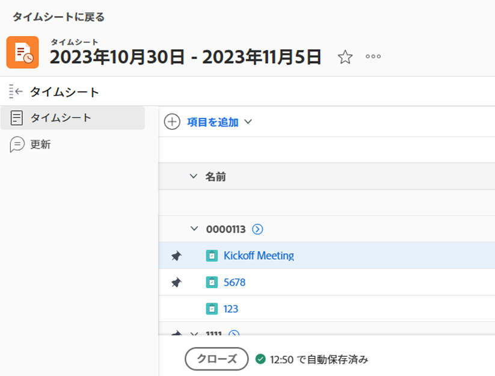

# 承認用のタイムシートを送信

承認のためタイムシートを提出すると、マネージャーはあなたの労働時間を把握できるようになります。承認者は、記録されたすべての時間が正しい領域に割り当てられていること、およびその期間に十分な時間が記録されていることを確認できます。

## アクセス要件

この記事の手順を実行するには、次のアクセス権が必要です。

<table style="table-layout:auto"> 
 <col> 
 <col> 
 <tbody> 
  <tr> 
   <td role="rowheader">Adobe Workfront プラン*</td> 
   <td> 
任意
 </td> 
  </tr> 
  <tr> 
   <td role="rowheader">Adobe Workfront ライセンス*</td> 
   <td> 
レビュー以上
 </td> 
  </tr> 
  <tr> 
   <td role="rowheader">アクセスレベル設定*</td> 
   <td> 
タスクとイシューへの閲覧またはそれ以上のアクセス権
 
まだアクセス権がない場合は、Workfront 管理者に問い合わせて、アクセスレベルに追加の制限が設定されているかどうかを確認してください。Workfront 管理者がアクセスレベルを変更する方法について詳しくは、<a href="../../administration-and-setup/add-users/configure-and-grant-access/create-modify-access-levels.md" class="MCXref xref">カスタムアクセスレベルの作成または変更</a>を参照してください。
 </td> 
  </tr> 
  <tr> 
   <td role="rowheader">オブジェクト権限</td> 
   <td> 
タスクとイシューに対する表示またはそれ以上の権限
 
追加のアクセス権のリクエストについて詳しくは、<a href="../../workfront-basics/grant-and-request-access-to-objects/request-access.md" class="MCXref xref">オブジェクトへのアクセス権のリクエスト</a>を参照してください。
 </td> 
  </tr> 
 </tbody> 
</table>

*保有するプラン、ライセンスタイプまたはアクセス権を確認するには、Workfront 管理者にお問い合わせください。

## 承認用のタイムシートを送信

* [承認用のタイムシートを送信](#submit-a-timesheet-for-approval)
* [提出されたタイムシートのステータスを表示](#view-the-status-of-a-submitted-timesheet)

### 承認用のタイムシートを送信

タイムシート承認者を設定した後（[タイムシートを承認](../../timesheets/create-and-manage-timesheets/timesheet-approvals.md)の記事の[タイムシート承認者を指定](../../timesheets/create-and-manage-timesheets/timesheet-approvals.md#designating-a-timesheet-approver)の節で説明されているように）、タイムシートの下部にある「**閉じる**」ボタンが「**承認用に送信**」ボタンに変わります。

承認用のタイムシートを送信するには、次の手順に従います。

1. 承認者が設定されているタイムシートに移動します。
1. [時間を記録](../../timesheets/create-and-manage-timesheets/log-time.md)で説明されている時間を記録します。
1. 「**承認用に送信**」をクリックして、タイムシートの承認プロセスを開始します。

   

   「**承認用に送信**」ボタンは、「**承認**」、「**拒否**」、「**リコール**」ボタンに置き換えられます。タイムシートのステータスが&#x200B;**送信済み**&#x200B;に変わります。

   タイムシートが承認用に送信されると、承認者の&#x200B;**ホーム**&#x200B;ページの&#x200B;**承認**&#x200B;エリアにリストされたタイムシートが表示されます。次のようなことが起こる可能性があります。

   * 承認された場合、「**リコール**」ボタンが「**再度開く**」に変わり、タイムシートのステータスが&#x200B;**開く**&#x200B;に更新されます。
   * 拒否された場合、「**承認用に送信**」ボタンが「**リコール**」ボタンに代わり、タイムシートのステータスが&#x200B;**拒否**&#x200B;に更新されます。

1. （オプション）タイムシートを再度開いて時間を更新する必要がある場合は、「**リコール**」をクリックします。詳しくは、この記事の[タイムシートをリコール](#recall-a-timesheet)の節を参照してください。

### 提出されたタイムシートのステータスを表示 {#view-the-status-of-a-submitted-timesheet}

タイムシートを送信した後、タイムシートのステータスを表示できます。

Workfront 管理者がユーザーへのタイムシート承認イベントハンドラーとユーザーへのタイムシート拒否イベントハンドラーを有効にしている場合、タイムシートが承認または拒否された後に通知が届きます。イベント通知を有効にする方法について詳しくは、[Adobe Workfront で利用可能なイベント通知](../../administration-and-setup/manage-workfront/emails/event-notifications-available-in-wf.md)を参照してください。

これらの通知がない場合、Workfront のタイムシートエリアで、送信したタイムシートのステータスを確認できます。

タイムシートのステータスを表示するには、次の手順に従います。

1. Adobe Workfront の右上隅にある&#x200B;**メインメニュー**&#x200B;アイコン  をクリックします。
1. **タイムシート**&#x200B;をクリックします。デフォルトでは、**すべて**&#x200B;のフィルターが選択されています。

   

1. （オプション）次のいずれかの操作を行って、タイムシートリストのフィルターを更新します。

   * ページの右上隅にある「**マイタイムシート承認**」を選択して、自分が承認するタイムシートのみを表示します。

     または

     「**マイタイムシート**」を選択して、自分のタイムシートのみを表示します。

     これにより、「マイタイムシート承認」フィルターまたは「マイタイムシート」フィルターが、タイムシートリストに適用されます。

     

   * フィルターアイコン  をクリックして別のフィルターを適用するか、新しいフィルターを作成します。フィルターの作成または更新について詳しくは、[Adobe Workfront でのフィルターの作成または編集](../../reports-and-dashboards/reports/reporting-elements/create-filters.md)を参照してください。

   >[!NOTE]
   >
   >Workfront 管理者またはグループ管理者が、設定エリアのリスト制御またはレイアウトテンプレートから、「マイタイムシート承認」と「マイタイムシート」のフィルターを削除した場合、「マイタイムシート承認」と「マイタイムシート」のオプションは、タイムシート一覧の先頭にもフィルター一覧にも表示されません。詳しくは、次の記事を参照してください。
   >
   >   
   >   
   >   * [レイアウトテンプレートを使用したフィルター、ビューおよびグループ化のカスタマイズ](../../administration-and-setup/customize-workfront/use-layout-templates/customize-fvg-list-controls-layout-template.md)
   >   
   >

1. （条件付き）**マイタイムシート**&#x200B;を選択した場合は、**標準**&#x200B;ビューが適用されていることを確認し、**ステータス**&#x200B;列に注目してください。

   タイムシートには次のようなステータスがあります。

   <table style="table-layout:auto"> 
    <col> 
    <col> 
    <tbody> 
     <tr> 
      <td role="rowheader">開く</td> 
      <td> 
タイムシートは現在開いているので、時刻を記録できます。 
 
リコールされたタイムシートは、オープンステータスで表示されます。詳しくは、この記事の<a href="#recall-a-timesheet" class="MCXref xref">タイムシートのリコール</a>の節を参照してください。 
 </td> 
     </tr> 
     <tr> 
      <td role="rowheader">送信済み</td> 
      <td>タイムシートを承認用に送信しましたが、まだ承認されていません。送信されたタイムシートをリコールして、編集を続けることができます。詳しくは、この記事の<a href="#recall-a-timesheet" class="MCXref xref">タイムシートのリコール</a>の節を参照してください。 </td> 
     </tr> 
     <tr> 
      <td role="rowheader">クローズ</td> 
      <td> 
次のシナリオが存在します。
 
       <ul> 
        <li> 
タイムシートに承認者がいない場合は、時間を記録してタイムシートをクローズしたことになります。
 </li> 
        <li> 
タイムシートに承認者がいる場合は、タイムシートを承認用に送信し、承認されたことになります。
 </li> 
       </ul> </td> 
     </tr> 
     <tr> 
      <td role="rowheader">却下</td> 
      <td>承認のためにタイムシートを送信しましたが、承認者によって却下されました。</td> 
     </tr> 
    </tbody> 
   </table>

## タイムシートのリコール {#recall-a-timesheet}

承認用に既に送信されたタイムシートをリコールできます。未承認のタイムシートのみリコールできます。

タイムシートをリコールするには、以下のように行います。

1. Adobe Workfront の右上隅にある&#x200B;**メインメニュー**&#x200B;アイコン  をクリックします。

1. **タイムシート**&#x200B;をクリックします。
1. 画面の右上隅にある「**マイタイムシート**」をクリックするか、または&#x200B;**フィルター**ドロップダウンメニューから「**マイタイムシート**」を選択します。
1. ステータスが&#x200B;**送信済み**&#x200B;のタイムシートの時間枠をクリックします。
1. 「**リコール**」をクリックします。

   タイムシートが再び編集可能になり、ステータスが&#x200B;**オープン**&#x200B;に変わります。
