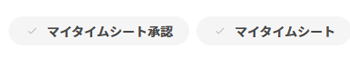

# タイムシートの承認

<!--Audited: 8/2024-->

管理者はタイムシートの承認プロセスで、直属の部下の作業時間を表示できます。 承認者は、記録されたすべての時間が正しいエリアに割り当てられ、その期間に対して十分な時間数が記録されていることを確認できます。

これに対応できるよう、Adobe Workfront ではタイムシートの承認を設定する機能が提供されています。

タイムシートの送信について詳しくは、[承認用のタイムシートの送信](../../timesheets/create-and-manage-timesheets/submit-timesheet-for-approval.md)を参照してください。

## アクセス要件

+++ 展開すると、この記事の機能のアクセス要件が表示されます。

<table style="table-layout:auto">
 <col> 
 <col>
 <tbody> 
  <tr> 
   <td>Adobe Workfront パッケージ</td> 
   <td>
任意
</td> 
  </tr> 
  <tr> 
   <td>Adobe Workfront プラン</td> 
   <td>
   
標準

   
プラン
</td>
  </tr> 
  <tr> 
   <td>アクセスレベル設定</td> 
   <td>
タイムシートと時間への管理アクセス
 </td> 
  </tr> 
 </tbody> 
</table>

詳しくは、[Workfront ドキュメントのアクセス要件](/help/quicksilver/administration-and-setup/add-users/access-levels-and-object-permissions/access-level-requirements-in-documentation.md)を参照してください。

+++

## タイムシートの承認者の指定

通常、タイムシートは、部門マネージャーまたは人事担当者によって承認されます タイムシートは通常、プロジェクトマネージャーによって承認されるわけではありません。 プロジェクトマネージャーは、プロジェクトに記録された時間を承認することができます。一方、チームマネージャーや人事部長は、タイムシートを承認する必要があります。

タイムシート プロファイルを作成する際に、タイムシート承認者が定義されます。 承認者として指定するには、標準ライセンスまたはプラン ライセンスが必要です。

タイムシートの承認者の指定について詳しくは、[タイムシートプロファイルの作成、編集、割り当て](../../timesheets/create-and-manage-timesheets/create-timesheet-profiles.md)の[タイムシートプロファイルの作成または編集](../../timesheets/create-and-manage-timesheets/create-timesheet-profiles.md#create)を参照してください。

## タイムシートの承認

承認者は、自分を承認者として指定して提出されたタイムシートを承認できます。 タイムシートが承認用に送信されると、タイムシートは&#x200B;**ホーム** エリアの&#x200B;**マイ承認** ウィジェットに一覧表示されます。 詳しくは、[作業の承認](../../review-and-approve-work/manage-approvals/approving-work.md)を参照してください。

次の通知設定が有効な場合、タイムシートを承認用に送信したユーザーは、タイムシートが承認された後にメールを受信します。

* Workfront管理者は、ユーザーに対するタイムシートの承認と、ユーザーイベントハンドラーに対するタイムシートの拒否を有効にしました。 イベント通知の有効化について詳しくは、[&#x200B; イベント通知タイプ &#x200B;](../../administration-and-setup/manage-workfront/emails/event-notifications-available-in-wf.md)を参照してください。
* 「自分のタイムシートが承認済み」の個人通知は、ユーザーのプロファイルページで有効になっています。 詳しくは、[自身のメール通知の変更](/help/quicksilver/workfront-basics/using-notifications/activate-or-deactivate-your-own-event-notifications.md)を参照してください。

### タイムシート領域からタイムシートを承認する

{{step1-to-timesheets}}

**タイムシート**&#x200B;領域が開きます。

1. （条件付き）最後にアクセスした時間が開いた場合は、画面の左上隅にある「**タイムシートに戻る**」をクリックします。

1. ページの右上にある「**マイタイムシート承認**」を選択し、承認するタイムシートを表示します。

   または

   タイムシートのリストの一番上で「**マイタイムシート承認**」フィルターを選択します。

   

   >[!NOTE]
   >
   >Workfrontの管理者またはグループ管理者が設定エリアのリストコントロールまたはレイアウトテンプレートからマイタイムシートの承認フィルターを削除した場合、「マイタイムシートの承認」オプションは、タイムシートリストの上部またはフィルターのリストに表示されません。
   >
   >詳しくは、[&#x200B; レイアウトテンプレートを使用したフィルター、ビュー、グループ化のカスタマイズ &#x200B;](../../administration-and-setup/customize-workfront/use-layout-templates/customize-fvg-list-controls-layout-template.md)を参照してください。
   >   
   >

1. （オプション）タイムシートのリストの上部で&#x200B;**検索**&#x200B;アイコン  をクリックし、キーワードを入力して特定のタイムシートを検索します。 時間枠のほか、所有者や承認者の名前を検索できます。
1. 承認するタイムシートの時間枠をクリックします。 タイムシートが開きます。

   >[!TIP]
   >
   >承認待ちタイムシートのステータスは「[!UICONTROL 提出済み]」です。

1. 「**承認**」をクリックします。

   または

   タイムシートを却下する場合は、タイムシートの左下にある「**拒否**」をクリックします。

   タイムシートが承認されると、タイムシートのステータスが「**クローズ**」に変わります。

   却下された場合は、ステータスが「**拒否**」に変わります。

### ホーム エリアからタイムシートを承認する

{{step1-to-home}}

ホーム領域が開きます。

1. **マイ承認** ウィジェットがホームエリアに追加されていることを確認します。 詳しくは、[新しいホームでウィジェットを追加、編集、または削除](/help/quicksilver/workfront-basics/using-home/using-the-home-area/add-edit-remove-widgets-in-new-home.md)を参照してください。
1. 自分の承認ウィジェットでタイムシートの承認を検索します。
1. （オプション）承認ボタンまたは拒否ボタンの右側にあるドロップダウンメニューを展開して、決定に関するコメントを追加し、**追加**&#x200B;をクリックします。
1. 次のいずれかのボタンをクリックして、承認を決定します。

   * 承認
   * Reject

   承認は&#x200B;**マイ承認** ウィジェットから削除されます。

