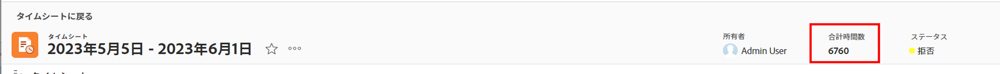
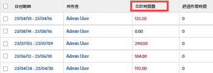

# タイムシートの合計時間の表示

タイムシートの合計時間数を表示できます。この時間数には、プロジェクト、タスク、イシューに関して記録された時間とすべての一般的な時間が含まれます。

合計時間数には、タイムシート、「更新」エリア、またはプロジェクト、タスク、イシューの「時間」エリアで提出された時間が反映されます。

## アクセス要件

この記事の手順を実行するには、次のアクセス権が必要です。

<table style="table-layout:auto"> 
 <col> 
 <col> 
 <tbody> 
  <tr> 
   <td role="rowheader">Adobe Workfront プラン*</td> 
   <td> 
任意
 </td> 
  </tr> 
  <tr> 
   <td role="rowheader">Adobe Workfront ライセンス*</td> 
   <td> 
レビュー 
 </td> 
  </tr> 
  <tr> 
   <td role="rowheader">アクセスレベル設定*</td> 
   <td> 
タスクとイシューへの閲覧またはそれ以上のアクセス権
 
まだアクセス権がない場合は、Workfront 管理者に問い合わせて、アクセスレベルに追加の制限が設定されているかどうかを確認してください。Workfront 管理者がアクセスレベルを変更する方法について詳しくは、<a href="../../administration-and-setup/add-users/configure-and-grant-access/create-modify-access-levels.md" class="MCXref xref">カスタムアクセスレベルの作成または変更</a>を参照してください。
 </td> 
  </tr> 
  <tr> 
   <td role="rowheader">オブジェクト権限</td> 
   <td> 
タスクとイシューに対する表示またはそれ以上の権限
 
追加のアクセス権のリクエストについて詳しくは、<a href="../../workfront-basics/grant-and-request-access-to-objects/request-access.md" class="MCXref xref">オブジェクトへのアクセス権のリクエスト</a>を参照してください。
 </td> 
  </tr> 
 </tbody> 
</table>

*ご利用のプランやライセンスタイプは、Workfront 管理者にお問い合わせください。

## タイムシートヘッダーのタイムシートの合計時間数の表示

タイムシートの合計時間数は、タイムシートのヘッダーに表示できます。

## タイムシートリストでのタイムシート合計時間数の表示

1. Adobe Workfront の右上で&#x200B;**メインメニュー**&#x200B;アイコン（）をクリックし、「**タイムシート**」をクリックします。「**すべて**」フィルターがデフォルトで選択されており、表示アクセス権のあるすべてのタイムシートが表示されます。

   

1. （オプション）次のいずれかの操作を行って、タイムシートリストのフィルターを更新します。

   * ページの右上にある「**マイタイムシート承認**」を選択して、承認するタイムシートのみを表示します。

     または

     「**マイタイムシート**」を選択して、自分のタイムシートのみを表示します。

     これにより、「マイタイムシート承認」フィルターまたは「マイタイムシート」フィルターが、タイムシートリストに適用されます。

     

   * フィルターアイコン（）をクリックして別のフィルターを適用するか、新しいフィルターを作成します。フィルターの作成または更新については、[Adobe Workfront でのフィルターの作成または編集](../../reports-and-dashboards/reports/reporting-elements/create-filters.md)を参照してください。

   >[!NOTE]
   >
   >Workfront 管理者またはグループ管理者が、設定領域の「リスト制御」またはレイアウトテンプレートから「マイタイムシート承認」フィルターと「マイタイムシート」フィルターを削除した場合、「マイタイムシート承認」オプションと「マイタイムシート」オプションは、タイムシートリストの上部またはフィルターリストには表示されません。詳しくは、次の記事を参照してください。
   >
   >   
   >   
   * [レイアウトテンプレートを使用したフィルター、ビューおよびグループ化のカスタマイズ](../../administration-and-setup/customize-workfront/use-layout-templates/customize-fvg-list-controls-layout-template.md)
   >   
   >

1. （オプション）**ビュー**&#x200B;アイコン（）または&#x200B;**グループ化**&#x200B;アイコン（）をクリックして、別のビューやグループ化を適用するか、新しいビューやグループ化を作成します。

   フィルター、ビューまたはグループ化の作成については、次の記事を参照してください。

   * [Adobe Workfront でのフィルターの作成または編集](../../reports-and-dashboards/reports/reporting-elements/create-filters.md)
   * [Adobe Workfront でのビューの作成または編集](../../reports-and-dashboards/reports/reporting-elements/create-edit-views.md)
   * [Adobe Workfront でのグループ化の作成](../../reports-and-dashboards/reports/reporting-elements/create-groupings.md)

1. 各タイムシートの合計時間数は **合計時間数**&#x200B;列に表示されます。

   

   >[!TIP]
   >
   タイムシートリストの標準ビューでは、タイムシートの項目に対して記録された時間がタイムシートの時間枠の時間数を超えると、合計時間数が赤で表示されます。詳しくは、[Adobe Workfront の用語集](../../workfront-basics/navigate-workfront/workfront-navigation/workfront-terminology-glossary.md)で「合計時間数」の項目を参照してください。
