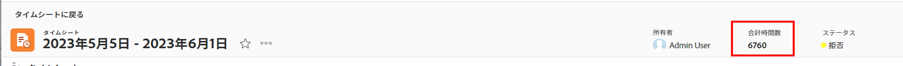

# タイムシートの合計時間の表示

<!--Audited: 8/2024-->

タイムシートの合計時間数を表示できます。 この時間数には、プロジェクト、タスク、イシューに関して記録された時間とすべての一般的な時間が含まれます。

合計時間数には、タイムシート、「更新」エリア、またはプロジェクト、タスク、イシューの「時間」エリアで提出された時間が反映されます。

## アクセス要件

+++ 展開すると、この記事の機能のアクセス要件が表示されます。 

<table style="table-layout:auto"> 
 <col> 
 <col> 
 <tbody> 
  <tr> 
   <td>Adobe Workfront パッケージ</td> 
   <td> 
任意
 </td> 
  </tr> 
  <tr> 
   <td>Adobe Workfront プラン</td> 
   <td> 
明るいまたはそれ以上 

   
レビュー以上
 </td> 
  </tr> 
  <tr> 
   <td>アクセスレベル設定</td> 
   <td> 
タスクとイシューへのアクセス権を表示または高くする
 </td> 
  </tr> 
  <tr> 
   <td>オブジェクト権限</td> 
   <td> 
タスクとイシューに対する表示またはそれ以上の権限
 </td> 
  </tr> 
 </tbody> 
</table>

詳しくは、[Workfront ドキュメントのアクセス要件](/help/quicksilver/administration-and-setup/add-users/access-levels-and-object-permissions/access-level-requirements-in-documentation.md)を参照してください。

+++

## タイムシートヘッダーのタイムシートの合計時間数の表示

タイムシートの合計時間数は、タイムシートのヘッダーに表示できます。

## タイムシートリストでのタイムシート合計時間数の表示

{{step1-to-timesheets}}

**タイムシート**&#x200B;領域が開きます。

1. （オプション）次のいずれかの操作を行って、タイムシートリストのフィルターを更新します。

   * ページの右上隅にある「**マイタイムシート承認**」を選択して、承認するタイムシートのみを表示する

     または

     「**マイタイムシート**」を選択して、自分のタイムシートのみを表示する。

     これにより、「マイタイムシート承認」フィルターまたは「マイタイムシート」フィルターが、タイムシートのリストに適用されます。

     

   * フィルターアイコン  をクリックして別のフィルターを適用するか、新しいフィルターを作成します。 フィルターの作成または更新について詳しくは、[Adobe Workfront でのフィルターの作成または編集](../../reports-and-dashboards/reports/reporting-elements/create-filters.md)を参照してください。

   >[!NOTE]
   >
   >Workfront 管理者またはグループ管理者が、設定エリアのリスト制御またはレイアウトテンプレートから、「マイタイムシート承認」と「マイタイムシート」のフィルターを削除した場合、「マイタイムシート承認」と「マイタイムシート」のオプションは、タイムシート一覧の先頭にもフィルター一覧にも表示されません。 詳しくは、次の記事を参照してください。
   >
   >   
   >   
   >   * [レイアウトテンプレートを使用したフィルター、ビューおよびグループ化のカスタマイズ](../../administration-and-setup/customize-workfront/use-layout-templates/customize-fvg-list-controls-layout-template.md)
   >   
   >

1. （オプション）**表示**&#x200B;アイコン  または&#x200B;**グループ化**&#x200B;アイコン  をクリックして、別のビューやグループ化を適用するか、新しいビューやグループ化を作成します。

   フィルター、ビューまたはグループ化の作成については、次の記事を参照してください。

   * [Adobe Workfront でフィルターを作成または編集](../../reports-and-dashboards/reports/reporting-elements/create-filters.md)
   * [Adobe Workfront でビューを作成または編集](../../reports-and-dashboards/reports/reporting-elements/create-edit-views.md)
   * [Adobe Workfront でのグループ化の作成](../../reports-and-dashboards/reports/reporting-elements/create-groupings.md)

1. 各タイムシートの合計時間数は **合計時間数**&#x200B;列に表示されます。

   

   >[!TIP]
   >
   >タイムシートのリストに標準ビューを使用する場合、タイムシート上のアイテムのログ時間がタイムシートの時間枠の時間数を超えると、「合計時間」列が赤で表示されます。 詳しくは、[Adobe Workfront用語の用語集](../../workfront-basics/navigate-workfront/workfront-navigation/workfront-terminology-glossary.md)の「合計時間数」フィールドを参照してください。
