# タイムシートレイアウトを理解する

この記事では、Adobe Workfrontのタイムシートのレイアウトについて説明し、タイムシートをカスタマイズして時間を記録する方法をより深く理解できます。

タイムシートと時間の基本設定は、タイムシートに表示する内容を制御します。 この記事では、利用可能なすべてのオプションの概要を説明します。 詳しくは、 [タイムシートと時間の基本設定を構成する](../../administration-and-setup/set-up-workfront/configure-timesheets-schedules/timesheet-and-hour-preferences.md).

タイムシートの時刻を記録する方法については、 [ログ時間](../../timesheets/create-and-manage-timesheets/log-time.md).

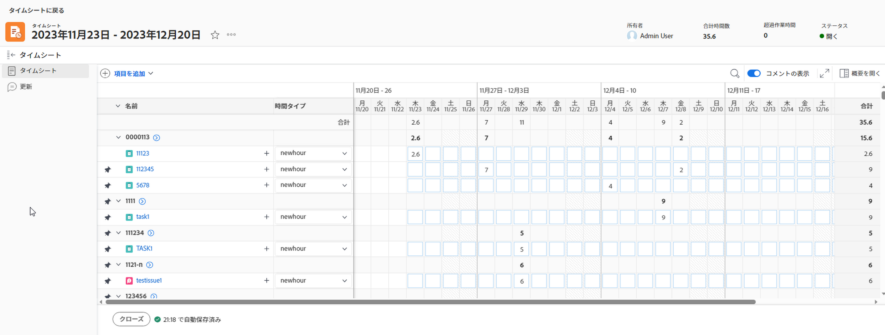

タイムシートの領域は次のとおりです。

* [タイムシートヘッダー](#timesheet-header)
* [左側のパネル](#the-left-panel)
* [作業項目](#work-items)
* [ツール バー](#toolbar)
* [タイムシートのフッター](#timesheet-footer)
* [ジョブの役割](#job-role)
* [時間タイプ](#hour-type)
* [左パネルの更新領域](#updates-area-in-the-left-panel)
* [概要パネル](#summary-panel)
* [時間枠と時間入口領域](#time-frame-and-hour-entry-area)
* [時間入力コメント](#hour-entry-comments)
* [時間](#hours)
* [合計](#totals)

## タイムシートヘッダー

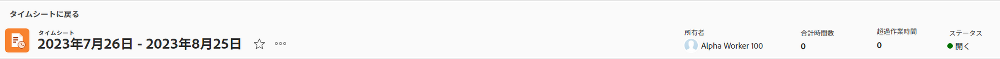

タイムシートヘッダーには、次の情報が含まれます。

* タイムシートの期間。
* 「アクション」領域には、次のものが含まれます。
   * [ お気に入り ] の一覧にタイムシートを追加する星形のアイコン。
   * タイムシートを削除できる [ 削除 ] オプションを含む [ その他 ] アイコン。
* タイムシートの所有者の名前。
* タイムシートに表示される項目に関して記録された時間の合計時間数。
* 残業時間数。 これは手動のエントリで、 **残業** の設定は、タイムシートで有効になっています。 詳しくは、 [タイムシート情報の編集](../create-and-manage-timesheets/edit-timesheets.md).

>[!TIP]
>
>タイムシートの現在の合計時間よりも長い時間の超過を記録することはできません。 たとえば、これまでにタイムシートに 7 時間記録した場合、8 時間の残業を記録することはできません。

* タイムシートの状態。

## 左側のパネル

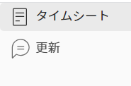

次のセクションには、左側のパネルでアクセスできます。

* **タイムシート**:実際のタイムシートを表示します。
* **更新**:タイムシートのコメントとシステム更新を表示します。 詳しくは、 [左パネルの更新領域](#updates-area-in-the-left-panel) 」の節を参照してください。

## 作業項目

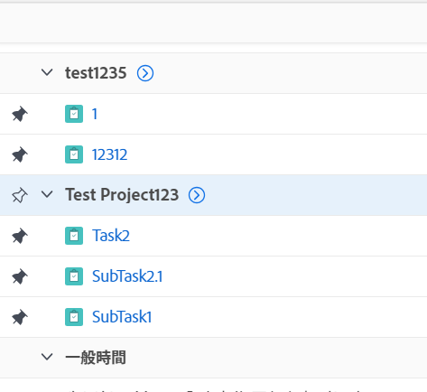

作業項目は、時間を記録するプロジェクト、タスクおよび問題です。 ヘッダー行の下向き矢印をクリックすると、プロジェクトと、その下に表示されるタスクと問題が折りたたまれます。 プロジェクト名の横にある下向き矢印をクリックすると、そのプロジェクトの作業項目が折りたたまれます。

タイムシート外で時間が記録されるタスク、タスク、タスク、およびプロジェクト、またはタイムシートの期間中に計画された項目は、ここに自動的に表示されます。

## ツール バー

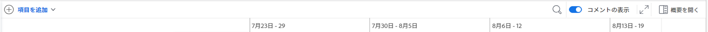

ツールバーには次のオプションが含まれます。

* プロジェクト、タスクまたはイシューを追加できる「項目を追加」ボタン。
* タイムシートのタスクまたは問題を検索するクイックフィルタアイコン。
* この **コメントを表示** プロジェクト、タスク、または発行時間のエントリで記録された時間コメントの表示/非表示を切り替える設定です。
* タイムシートをフルスクリーンモードで表示できる全画面表示アイコン。
* **概要を開く** ( または **概要を閉じる**) ボタンを使用して、 Summary パネルを開くか閉じて、タスクや問題の追加情報を表示できます。 これは、プロジェクトでは使用できません。

詳しくは、 [ログ時間](../create-and-manage-timesheets/log-time.md).

## タイムシートのフッター

この領域の [ 承認用に送信 ]、[ 閉じる ]、[ 承認 ]、および [ 却下 ] ボタンをクリックすると、タイムシートの承認を閉じるか、却下することができます。

この領域には、タイムシートが最後に保存された日時に関する情報も含まれます。 タイムシートの情報に対して行った変更はすべて自動的に保存されます。

## 担当業務

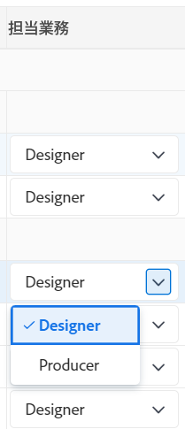

時間エントリに関連付ける別の役割を選択できます。 Workfront管理者が、手動で「 Assign job roles to hour entries 」設定を有効にする必要があります。 タスクに割り当てられたとき、またはタスクに問題が発生したときに指定されたジョブの役割がデフォルトで表示されます。 タスクまたは問題に対してプライマリの役割が割り当てられていない場合は、「ジョブの役割」がデフォルトとして表示されます。 詳しくは、 [タイムシートと時間の基本設定を構成する](../../administration-and-setup/set-up-workfront/configure-timesheets-schedules/timesheet-and-hour-preferences.md).

異なるロールの同じ作業項目に対して、複数の時間エントリを記録できます。 詳しくは、 [ログ時間](../create-and-manage-timesheets/log-time.md).

## 時間タイプ

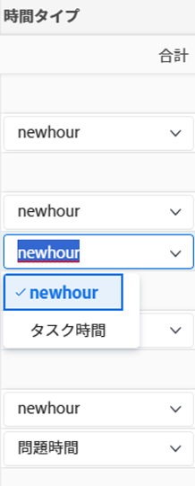

各項目の時間エントリに関連付ける時間タイプを選択できます。 このフィールドは、Workfront管理者がお使いの環境で有効にした場合にのみ表示されます。 詳しくは、 [タイムシートと時間の基本設定を構成する](../../administration-and-setup/set-up-workfront/configure-timesheets-schedules/timesheet-and-hour-preferences.md).

異なる時間タイプの同じ作業項目に対して、複数の時間エントリを記録できます。 詳しくは、 [ログ時間](../create-and-manage-timesheets/log-time.md).

## 左パネルの更新領域

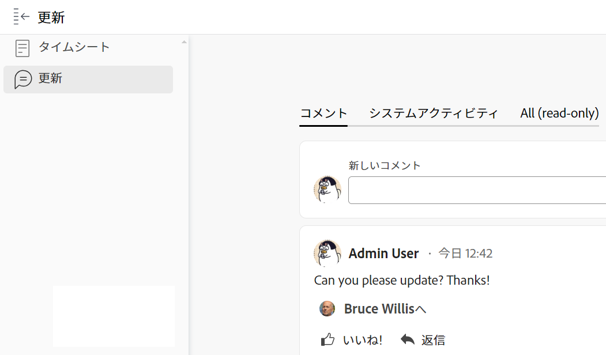

タイムシートにコメントを付けて、タイムシートの承認者や他のユーザーとコミュニケーションを取ることができます。その場合は、左パネルの [ 更新 ] セクションを使用します。

タイムシートに対して行われたコメントは、この領域のタイムシートの下部に表示されます。 この領域は、タイムシートの下とタイムシートのフッターの上に表示されます。 詳しくは、 [タイムシートのコメントの表示と管理](../create-and-manage-timesheets/view-and-manage-comments-timesheets.md).

## 概要パネル

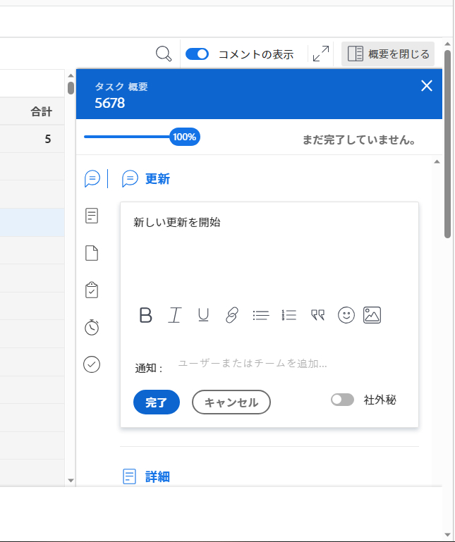

タイムシートに表示されたタスクや問題に関する [ 概要 ] パネルにコメントを付けることができます。 ここから、タスクや問題に対するコメントを作成したり、その情報を更新したりできます。 詳しくは、 [概要の概要](../../workfront-basics/the-new-workfront-experience/summary-overview.md).

タイムシートの [ 概要 ] パネルに入力した作業項目に対するコメントは、タスクまたは懸案事項の [ 更新 ] 領域に表示されます。 Summary パネルは、プロジェクトでは使用できません。

## 時間枠と時間入口領域

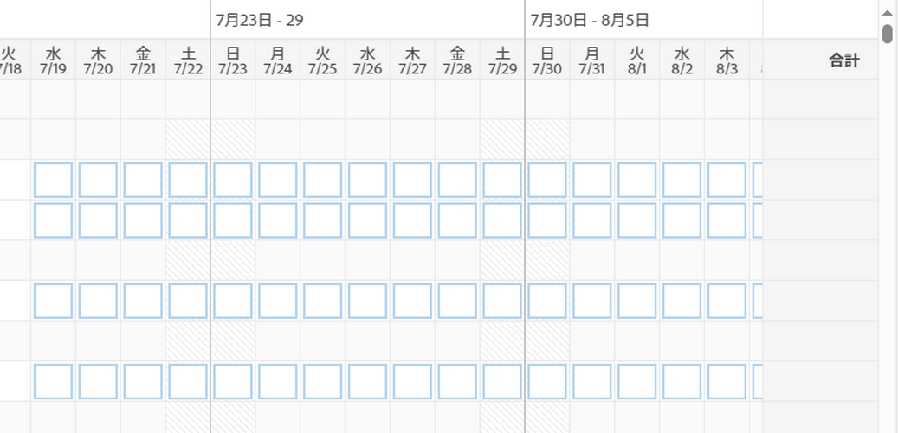

タイムシートの期間は、作業項目の右側に表示されます。

1 週間、2 週間、4 週間のタイムシートを作成できます。

期間は 1 週間単位で表示されます。 指定したタイムシート期間外の日数は淡色表示になります。 タイムシートの期間外の日の時間は記録できません。

詳しくは、 [単一使用タイムシートの作成](../create-and-manage-timesheets/create-tmshts.md) または [タイムシートプロファイルの作成、編集、割り当て](../create-and-manage-timesheets/create-timesheet-profiles.md).

<!--drafted for the resize columns in timesheets story - make this blurb a TIP when the story is released: 
You can resize the columns that display different weeks, the time frame, or the work item areas by dragging and dropping the vertical lines that separate them.-->

## 時間入力コメント

タイムシートに追加する 1 時間ごとのエントリにコメントを追加できます。

時間入力のコメントボックスに入力したコメントは、タイムシートの各作業項目の下に表示され、タイムシートで、 **コメントを表示** 設定が有効になっている場合、ツールバーで有効になります。

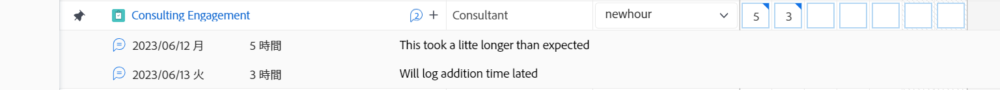

## 時間

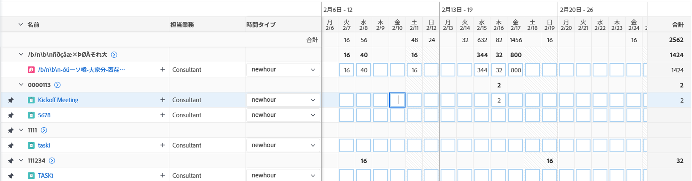

タイムシートは、各作業項目とタイムシート範囲の日付に対する入力フィールドを提供し、項目の作業に費やした時間を記録します。 時刻を記録する際、時刻を記録する項目は、明るい青でハイライト表示され、時間ボックスは暗い青でアウトライン表示されます。

## 合計

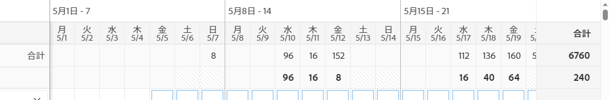

タイムシートに入力された全時間の合計を、日別（タイムシートのヘッダー）およびオブジェクト別（最後の列）にまとめて確認します。
