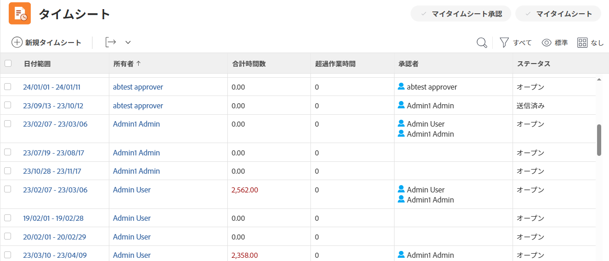
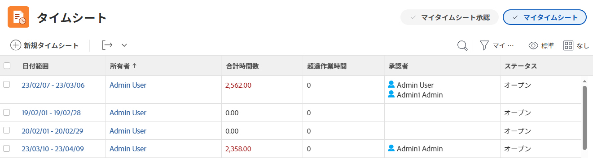
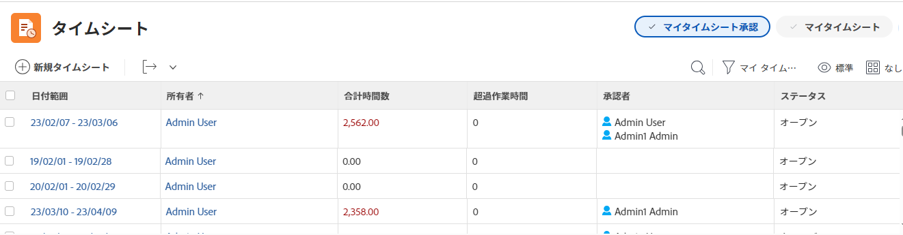

# タイムシートの概要

タイムシートを使用して、Adobe Workfrontの内外の仕事に費やした時間を追跡できます。

プロジェクト、タスク、問題などの作業項目に関するプロジェクトの時間を記録できます。 タスク、タスク、およびプロジェクトに記録された時間が、タイムシートに自動的に表示されます。

また、会議、トレーニング、またはオフィスからの離れた時間など、非作業関連アイテムの非プロジェクト時間を [ 一般時間 ] のタイムシートに直接記録することもできます。

Workfrontでの時間のログ記録方法について詳しくは、 [ログ時間](../../timesheets/create-and-manage-timesheets/log-time.md).

>[!TIP]
>
>Workfrontまたはグループ管理者は、タイムシートを作成してユーザーに関連付けることができます。 タイムシートの作成の詳細については、 [タイムシートの作成と管理](../create-and-manage-timesheets/create-and-manage-timesheets.md).

## プロジェクト時間と非プロジェクト時間を把握する

タイムシートを使用すると、ユーザーは、プロジェクト作業と非プロジェクト作業の両方について、簡単に時間を追跡できます。

* **プロジェクト時間：** 時刻を追跡するタスクまたはプロジェクトから直接移動します。

  タイムシートを通じてタスク、問題、およびプロジェクトに対して記録された時間は、各作業項目に関連付けられ、プロジェクトやタスクに費やされた作業の正確な表現が提供されます。 正確な時間入力がないと、請求目的の場合はデータが正確でない可能性があります。

  また、リソースがタスクに直接時間を記録すると、ユーザーがタイムシートにアクセスすると、タスクとプロジェクトが自動的に表示されます。 タイムシートの日付範囲が、時間が記録された日付に及ぶと仮定します。

* **非プロジェクト時間：** ユーザーのタイムシートに直接移動します。 Workfrontで時間を追跡する方法について詳しくは、   [ログ時間](../../timesheets/create-and-manage-timesheets/log-time.md).

  タイムシートでは、休暇時間、病欠時間、通過時間、修理時間、保守時間など、必要な一般的な間接費時間タイプを記録できます。

## [ タイムシート ] 領域のタイムシートにアクセスする

タイムシート領域は、既定ではすべてのユーザーが使用できます。 Workfrontの管理者は、必要に応じてレイアウトテンプレートでこれを変更できます。 詳しくは、 [レイアウトテンプレートを使用したメインメニューのカスタマイズ](/help/quicksilver/administration-and-setup/customize-workfront/use-layout-templates/customize-main-menu.md).

タイムシートにアクセスするには：

{{step1-to-timesheets}}

既定で表示できるすべてのタイムシートとタイムシート。 Adobe Workfrontのタイムシートレイアウトの詳細については、「 [タイムシートのレイアウトを理解する](../../timesheets/timesheets/timesheet-layout.md).

1. 右上隅の次のオプションのいずれかをクリックして、タイムシートを表示します。

   * **マイタイムシート** をクリックして、タイムシートのみを表示します。

   

   * **自分のタイムシート承認** 承認したタイムシートのみを表示する場合。

     

1. （オプション）タイムシートの一覧の先頭のビュー、フィルタ、およびグループを更新します。 詳しくは、 [レポート要素：フィルター、ビューおよびグループ化](../../reports-and-dashboards/reports/reporting-elements/reporting-elements-overview.md).

1. 次をクリック： **日付範囲** タイムシートを開くことができます。

   各タイムシートには、時間を記録したすべてのタスク、タスク、およびプロジェクトが表示されます。 タイムシートには、タイムシートの期間内の日付で割り当てられているが、まだログに記録されていない可能性のあるタスク、タスク、またはプロジェクトも最大 45 個表示されます。

   詳しくは、 [タイムシートと時間の基本設定を構成する](../../administration-and-setup/set-up-workfront/configure-timesheets-schedules/timesheet-and-hour-preferences.md).
