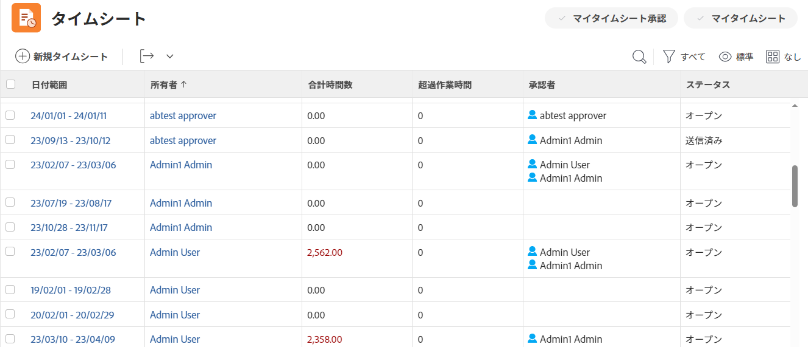
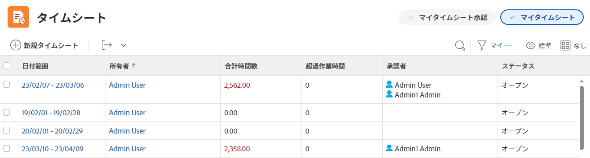
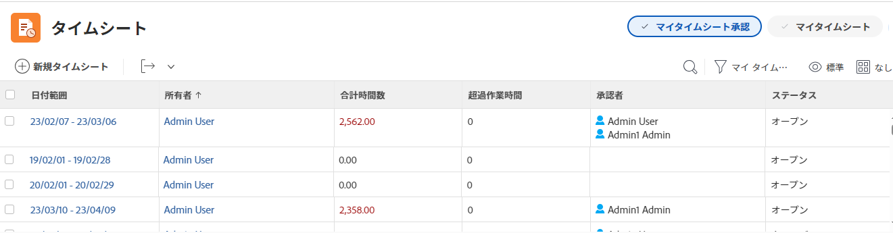

# タイムシートの概要

<!-- Audited: 12/2023 -->

タイムシートを使用すると、Adobe Workfront の内外で作業に費やした時間を追跡できます。

プロジェクト、タスク、イシューなどの作業アイテムに関するプロジェクトの時間を記録できます。 タスク、イシューおよびプロジェクトに対して記録された時間は、タイムシートに表示されます。

また、会議、トレーニングまたはオフィスからの離席時間など、非作業関連アイテムのプロジェクト時間以外を「一般時間」のタイムシートに直接記録できます。

Workfront で時間を記録する方法について詳しくは、[時間を記録](../../timesheets/create-and-manage-timesheets/log-time.md)を参照してください。

>[!TIP]
>
>Workfront 管理者またはグループ管理者は、タイムシートを作成してユーザーに関連付けることができます。 タイムシートの作成について詳しくは、[タイムシートの作成と管理：記事インデックス](../create-and-manage-timesheets/create-and-manage-timesheets.md)を参照してください。

## プロジェクト時間と非プロジェクト時間を理解する

タイムシートを使用すると、ユーザーは、プロジェクト作業と非プロジェクト作業の両方について、容易に時間を追跡できます。

* **プロジェクト時間：**&#x200B;時刻を追跡するタスクまたはプロジェクトから直接移動します。

  タイムシートを通じてタスク、イシューおよびプロジェクトに対して記録された時間は、各作業アイテムに関連付けられ、プロジェクトやタスクに費やされた作業量を正確に表すことができます。 正確な時間が入力されないと、請求目的の場合はデータが正確でなくなる可能性があります。

  また、リソースが直接タスクに時間を記録した場合、ユーザーがタイムシートにアクセスすると、イシューやプロジェクトが自動的に表示されます。 タイムシートの日付範囲が、時間を記録した日付にまたがっていると仮定します。

* **非プロジェクト時間：**&#x200B;ユーザーのタイムシートに直接移動します。 Workfront で時間を追跡する方法について詳しくは、[時間の記録](../../timesheets/create-and-manage-timesheets/log-time.md)を参照してください。

  タイムシートでは、休暇時間、病欠時間、移動時間、修理時間、保守時間、または作成する一般的な間接費時間タイプを記録できます。

## タイムシートエリアでのタイムシートへのアクセス

タイムシートエリアは、デフォルトではすべてのユーザーが使用できます。 Workfront 管理者は、必要に応じてレイアウトテンプレートでこれを変更できます。 詳細情報については、[レイアウトテンプレートを使用したメインメニューのカスタマイズ](/help/quicksilver/administration-and-setup/customize-workfront/use-layout-templates/customize-main-menu.md)を参照してください。

タイムシートにアクセスするには、次の手順に従います。

{{step1-to-timesheets}}

自分のすべてのタイムシートと、デフォルトで表示する権限のあるタイムシート。 Adobe Workfront のタイムシートレイアウトについて詳しくは、[タイムシートレイアウトの概要](../../timesheets/timesheets/timesheet-layout.md)を参照してください。

1. 右上隅の次のオプションのいずれかをクリックして、タイムシートを表示します。

   * 「**マイタイムシート**」をクリックして、自分のタイムシートのみを表示します。

   

   * 「**マイタイムシート承認**」をクリックして、自分が承認するタイムシートのみを表示します。

     

1. （オプション）タイムシートのリストの上部にあるビュー、フィルターおよびグループを更新します。 詳しくは、[レポート要素：フィルター、ビュー、グループ化](../../reports-and-dashboards/reports/reporting-elements/reporting-elements-overview.md)を参照してください。

1. タイムシートの&#x200B;**日付範囲**&#x200B;をクリックして開きます。

   各タイムシートには自分が時間を記録したすべてのタスク、イシューおよびプロジェクトが表示されます。 また、タイムシートには、タイムシートの時間枠内の日付で割り当てられた最大45個のタスクとイシューが表示されますが、まだ時間が記録されていない可能性があります。 タイムシートに表示する45の最近更新された項目が選択されます。

   詳しくは、[タイムシートと時間の環境設定を指定](../../administration-and-setup/set-up-workfront/configure-timesheets-schedules/timesheet-and-hour-preferences.md)を参照してください。
