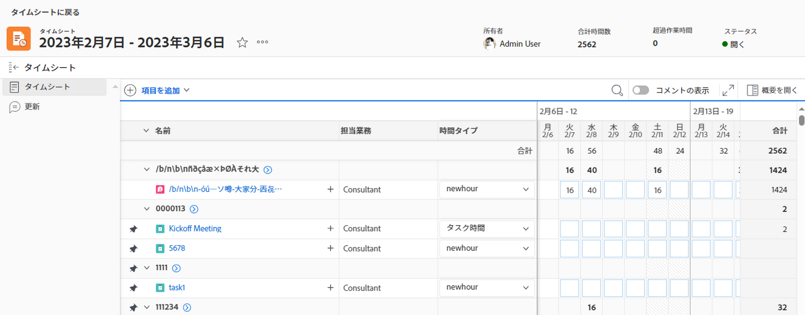

# タイムシートの概要

タイムシートを使用して、Adobe Workfrontでの作業に費やした時間を追跡できます。

Workfrontまたはグループ管理者は、タイムシートを作成し、ユーザーに関連付けることができます。 タイムシートの作成の詳細については、 [タイムシートの作成と管理](../create-and-manage-timesheets/create-and-manage-timesheets.md).

タイムシートは、作業項目とカレンダー領域を表示するグリッド状のテーブルです。 項目の時間をログに記録し、その項目を作業が実行された日に関連付けることができます。 これは、Workfrontでの実際の作業時間を追跡します。 また、タイムシートには、会議、トレーニング、オフィスから離れた時間など、作業に関連しない項目の時間を記録できる領域もあります。

Adobe Workfrontのタイムシートレイアウトの詳細については、「 [タイムシートのレイアウトを理解する](../../timesheets/timesheets/timesheet-layout.md).

Workfrontには、通常、作業が実行されるプロジェクト、タスクまたは問題のレベルで、様々な方法で時間を記録できます。 タスク、タスク、タスク、およびプロジェクトに対して記録された時間も、タイムシートに表示されます。

また、[ 一般時間 ] で、プロジェクト以外の作業の時間を記録することもできます。 タイムシートには、通常の時間のみを記録できます。

Workfrontで時刻を記録できる場所について詳しくは、 [ログ時間](../../timesheets/create-and-manage-timesheets/log-time.md).

>[!TIP]
>
>また、Workfrontモバイルアプリでは、更新を投稿したり、ログに記録された時間を変更したり、コメントを入力したり、タイムシートを閉じたりすることもできます。

## アクセス要件

この記事の手順を実行するには、次の手順を実行する必要があります。

<table style="table-layout:auto"> 
 <col> 
 <col> 
 <tbody> 
  <tr> 
   <td role="rowheader">Adobe Workfrontプラン</td> 
   <td> 
任意
 </td> 
  </tr> 
  <tr> 
   <td role="rowheader">Adobe Workfrontライセンス</td> 
   <td> 
計画 
 </td> 
  </tr> 
  <tr> 
   <td role="rowheader">アクセスレベル設定*</td> 
   <td> 
タイムシートに対する管理者アクセス権が必要です。 
 
詳しくは、 <a href="../../administration-and-setup/add-users/configure-and-grant-access/grant-users-admin-access-certain-areas.md" class="MCXref xref">特定の領域に対する管理者アクセス権をユーザーに付与する</a>.
 
<b>メモ</b>

まだアクセス権がない場合は、Workfront管理者に、アクセスレベルに追加の制限を設定しているかどうかを問い合わせてください。 Workfront管理者がアクセスレベルを変更する方法について詳しくは、 <a href="../../administration-and-setup/add-users/configure-and-grant-access/create-modify-access-levels.md" class="MCXref xref">カスタムアクセスレベルの作成または変更</a>.
 </td>
</tr> 
 </tbody> 
</table>

&#42;保有するプラン、ライセンスの種類、アクセス権を確認するには、Workfront管理者に問い合わせてください。

## プロジェクト時間と非プロジェクト時間を把握する

タイムシートを使用すると、ユーザーは、プロジェクト作業と非プロジェクト作業の両方について、簡単に時間を追跡できます。

* **プロジェクト時間：** 時刻を追跡するタスクまたはプロジェクトから直接移動します。

  タイムシートを通じてタスク、問題、およびプロジェクトに対して記録された時間は、各作業項目に関連付けられ、プロジェクトやタスクに費やされた作業の正確な表現が提供されます。 正確な時間入力がないと、請求目的の場合はデータが正確でない可能性があります。

  また、リソースがタスクに直接時間を記録すると、ユーザーがタイムシートにアクセスすると、タスクとプロジェクトが自動的に表示されます。 タイムシートの日付範囲が、時間が記録された日付に及ぶと仮定します。

* **非プロジェクト時間：** ユーザーのタイムシートに直接移動します。 Workfrontで時間を追跡する方法について詳しくは、   [ログ時間](../../timesheets/create-and-manage-timesheets/log-time.md).

  タイムシートでは、リソースは休暇時間、病欠時間、通過時間、修理時間、保守時間、または作成する一般的な間接費時間タイプを記録できます。

## [ タイムシート ] 領域のタイムシートにアクセスする

Workfrontのすべての領域で時刻を記録する方法について詳しくは、 [ログ時間](../../timesheets/create-and-manage-timesheets/log-time.md).

タイムシートにアクセスするには：

1. 次をクリック： **メインメニュー** アイコン  を右上に配置するか、 **メインメニュー** アイコン  Workfrontの左上隅にある場合は、[ タイムシート ] をクリックします。

   [ タイムシート ] 領域が表示され、既定では、自分が属する、または表示するアクセス権を持つすべてのタイムシートが表示されます。

   

1. 右上隅の次のオプションのいずれかをクリックすると、タイムシートの数が制限されます。

   * **マイタイムシート** をクリックして、タイムシートのみを表示します。

   

   * **自分のタイムシート承認** 承認したタイムシートのみを表示する場合。

     

   フィルタされたタイムシートのリストが表示されます。

1. （オプション）タイムシートの一覧の先頭のビュー、フィルタ、およびグループを更新します。 詳しくは、 [レポート要素：フィルター、ビューおよびグループ化](../../reports-and-dashboards/reports/reporting-elements/reporting-elements-overview.md).

1. 次をクリック： **日付範囲** タイムシートを開くことができます。

   各タイムシートには、時間を記録したすべてのタスク、タスク、およびプロジェクトが表示されます。 タイムシートには、タイムシートの期間内の日付で割り当てられているが、まだログに記録されていない可能性のあるタスク、タスク、またはプロジェクトも最大 45 個表示されます。

   詳しくは、 [タイムシートと時間の基本設定を構成する](../../administration-and-setup/set-up-workfront/configure-timesheets-schedules/timesheet-and-hour-preferences.md).

