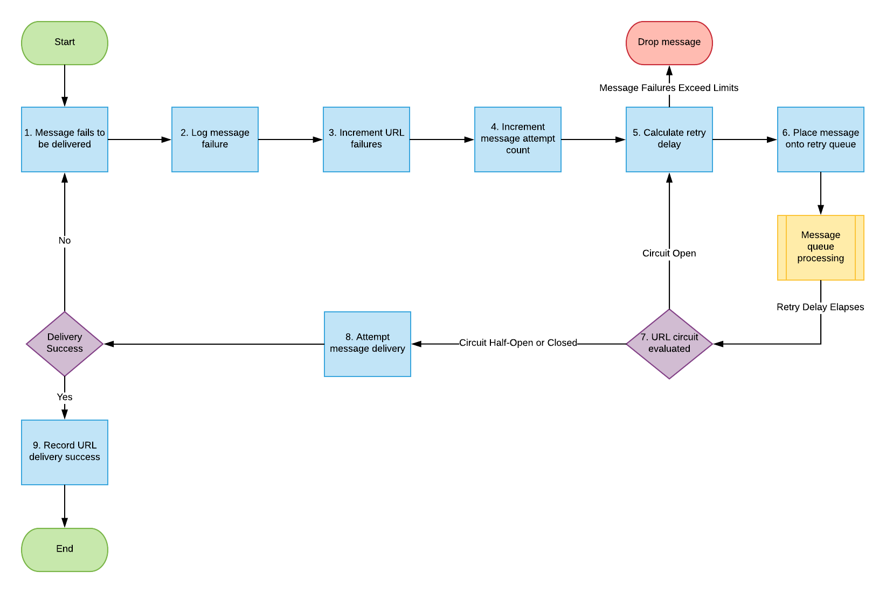

# イベント登録の再試行

メッセージ配信システムを実装する場合、安定性、一貫性、優れたユーザーエクスペリエンスを確保するために、いくつかの注意事項があります。 メッセージ配信システムの問題点の 1 つとして、メッセージを宛先に正常に到達させること、およびメッセージが届かなかった場合にどのように対処するかを確認することがあります。

一部の統合では、配信の失敗を受け入れてから、メッセージをドロップして次のメッセージに移動する場合があります。  その他の統合では、メッセージの配信に失敗したことを無視することはできません。 例えば、財務統合はメッセージの配信を試みる場合がありますが、代わりに HTTP ステータスコード 404 を受信します。これは、サーバーがメッセージの配信先のエンドポイントを見つけられなかったことを示します。 このような場合、メッセージが欠落しているということは、誰かが時間に対して賃金を支払っていないこと、または組織が契約リソースの予算を超過していることを意味する可能性があります。

## イベントサブスクリプションの再試行のための Adobe Workfront 戦略

顧客は Workfront プラットフォームを日々の知識作業の中核として活用するので、Workfront イベントサブスクリプションフレームワークは、各メッセージの配信を可能な限り確実に試行するメカニズムを提供します。

顧客のエンドポイントへの配信に失敗したイベントトリガーの送信メッセージは、最大 48 時間配信が成功するまで再送信されます。 この間、配信が成功するまで、または11回の試行が行われるまで、再試行は段階的に増加する頻度で行われます。

これらの再試行の数式は次のとおりです。

`((2^attempt) - 1) * 84800ms`

最初の再試行は1.5分後に行われ、約5分後に2回目、11回目は約48時間後に行われます。

顧客は、Workfront イベントサブスクリプションからの送信メッセージを消費するエンドポイントが、配信が成功したときに 200 レベルの応答メッセージを Workfront に返すように設定されていることを確認する必要があります。

## 無効なサブスクリプションルールと凍結されたサブスクリプションルール

* サブスクリプション URLは、100回以上の試行で70%を超える失敗率がある場合、または2,000回連続の失敗がある場合は&#x200B;**無効**&#x200B;になります
* サブスクリプション URLは、連続したエラーが2,000を超え、最後の成功が72時間以上前の場合、または任意の期間で連続したエラーが50,000件の場合、**固定**&#x200B;になります。
* **無効**&#x200B;のサブスクリプション URLは、10分ごとに引き続き配信を試み、正常に配信されると再度有効になります。
* **凍結** サブスクリプション URLは、API リクエストを行って手動で有効にしない限り、配信を試みません。

<!--

## Handling Failed Event-Triggered Outbound Messages

The following flowchart shows the strategy for reattempting message deliveries with Workfront Event Subscriptions:

The following explanations correspond with the steps depicted in the flowchart:

1. Message fails to be delivered. 
1. Message delivery failure information is logged.

   All failed attempts to deliver a message are logged so that debugging may be performed to determine the root cause of a given failure or series of failures. 

1. URL failures incremented. 
1. Message attempt count is incremented. 
1. Calculate the delay until this message's delivery will be attempted again. 
1. Message is placed onto the message retry queue.

   As shown in the preceding flowchart, the message queue used for processing message delivery retries is a separate queue from the one that processes the initial delivery attempt for each message. This allows the near real-time flow of messages to continue unimpeded by the failure of any subset of messages. 

1. URL circuit status is evaluated. One of the following occurs:

   * If the circuit is open and not allowing deliveries at this time, restart the process at step 5.
   * If the circuit is half-open, this implies that our circuit is currently open, but enough time has passed to allow testing of the URL to see if the problem with delivering to it has been resolved.
   * If the message delivery attempt limits have been reached (48 hours of retrying) then the message is dropped

1. If the URL circuit is closed and allowing deliveries, attempt to deliver the message. If this delivery fails, the message will restart at step 1 

1. If the URL circuit is closed and allowing deliveries, attempt to deliver the message. If this delivery fails, the message will restart at step 1.
   -->
