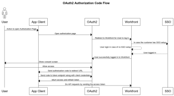

# 認証コードフローを使用した組織のカスタム OAuth 2 アプリケーションの設定および使用

Workfront と統合し、クライアントアプリがユーザーの代わりに Workfront と通信できるようにするには、次の操作が必要です。

* OAuth2 アプリケーションを作成
* サードパーティアプリケーションの設定
* ユーザーの認証ページへのリンク
* 認証コードフローの設定：ユーザーは Workfront インスタンスにログインし、クライアントアプリケーションが代わりに Workfront に接続できるようにする同意をします。その結果、アクセストークンと更新トークンと交換する認証コードを取得します。
* 更新トークンフローの設定：このフローでは、更新トークンを使用して、古いアクセストークンが期限切れになった際に新しいアクセストークンを取得します。

## OAuth2 アプリケーションを作成

OAuth2 アプリケーションの作成手順について詳しくは、[Workfront 統合用の OAuth2 アプリケーションの作成](../../administration-and-setup/configure-integrations/create-oauth-application.md)で[ユーザー資格情報を使用した OAuth2 アプリケーションの作成（認証コードフロー）](../../administration-and-setup/configure-integrations/create-oauth-application.md#create3)を参照してください。

## ユーザーの認証ページへのリンク

ユーザーは自分のアカウントでこの統合を認証するには、ログインする必要があります。ユーザーが承認するページには、ここで説明する特定の形式があります。この情報を使用して、アプリの認証ページのアドレスを特定し、このアドレスまたはリンクをユーザーに提供します。

* 組織のドメインの完全な URL。例：

  ```
  https://myorganization.my.workfront.com
  ```


* `client_id`：これは、Workfront で OAuth2 アプリの作成時に生成されるクライアント ID です。

* `redirect_uri`：アプリの作成時に入力したリダイレクト URL です。ユーザーは、アカウントでアプリを認証した後、このページに誘導されます。

* `response_type`：`code` の値を持つ必要があります。

認証ページの URL は次のようになります。

```
https://<URL of your organization's domain>/integrations/oauth2/authorize?client_id=<Your ClientID>&redirect_uri=<Your redirect URL>&response_type=code
```

>[!NOTE]
>
>ユーザーがクリックしてこのページに移動するためのボタンまたはその他のリンクを作成することをお勧めします。

## サードパーティアプリケーションの設定

サードパーティアプリケーションでは、設定が必要な場合があります。次の表に、サードパーティアプリケーションを設定する際に必要となる可能性のあるフィールドに関する情報を示します。

<table style="table-layout:auto"> 
 <col> 
 <col> 
 <tbody> 
  <tr> 
   <td role="rowheader">認証 URI</td> 
   <td> <p><code>https://&lt;the full URL of your organization's domain&gt;/integrations/oauth2/authorize</code> </p> <p class="example" data-mc-autonum="<b>Example: </b>"><span class="autonumber"><span><b>例：</b></span></span><code> https://myorganization.my.workfront.com/integrations/oauth2/authorize</code> </p> </td> 
  </tr> 
  <tr> 
   <td role="rowheader">トークン URL</td> 
   <td> <p><code>https://&lt;the full URL of your organization's domain&gt;/integrations/oauth2/api/v1/token</code> </p> <p class="example" data-mc-autonum="<b>Example: </b>"><span class="autonumber"><span><b>例：</b></span></span><code>https://myorganization.my.workfront.com/integrations/oauth2/api/v1/token</code> </p> </td> 
  </tr> 
  <tr> 
   <td role="rowheader">スコープ</td> 
   <td>スコープを指定する必要はありません。 </td> 
  </tr> 
 </tbody> 
</table>

## 認証コードフローのセットアップ



OAuth2 を使用してユーザーをログインするには、次の手順に従います。

1. ユーザーが認証ページを開くと、Workfront のログインページにリダイレクトされるので、ユーザーは Workfront にログインできます。ユーザーに SSO 設定がある場合は、ID プロバイダーのログインページが開きます。

   ユーザーが同じブラウザーで既に Workfront にログインしている場合またはユーザーが Workfront に正常にログインした場合、ユーザーは同意画面にリダイレクトされます。

   

1. ユーザーがアクセスを許可した場合、ページは `redirect_url` にリダイレクトされます。リダイレクトには、次のクエリパラメーターを含める必要があります。

* `code`：アクセス／更新トークンの取得に必要な認証コード。
* `domain`：組織のドメイン。例：`myorganization.my.workfront.com` の場合、ドメインは `myorganization` です。
* `lane`：リクエストのレーン。例：`myorganization.preview.workfront.com` の場合、レーンは `preview` です。

  >[!IMPORTANT]
  >
  >`code` は 2 分間のみ有効です。そのため、その時間内に更新トークンとアクセストークンを取得する必要があります。

1. コードを入手したら、更新とアクセストークンを要求できます。そのためには、コードとクライアントアプリの資格情報を `/integrations/oauth2/api/v1/token` エンドポイントに送信します。

   フルトークンリクエスト URL は次のとおりです。

   ```
   https://<URL of your organization's domain></span>/integrations/oauth2/api/v1/token
   ```

   **例：**&#x200B;トークンエンドポイントへの CURL 呼び出しの例。

   例 1

   ```
      curl --location --request POST '**<workfront host>**/integrations/oauth2/api/v1/token' \
      --header 'Authorization: Basic **<base64(client_id:client_secret)>**' \
      --header 'Content-Type: application/json' \
      --data-raw '{
      "code": "**<code>**",
      "grant_type": "**authorization_code**",
      "redirect_uri": "**<redirect_url>**"
      }'
   ```

   例 2

   ```
      curl --location --request POST '**<workfront host>**/integrations/oauth2/api/v1/token' \
      --header 'Content-Type: application/x-www-form-urlencoded' \
      --data-urlencode 'grant_type=**authorization_code**' \
      --data-urlencode 'redirect_uri=**<redirect_url>**' \
      --data-urlencode 'code=**<code>**' \
      --data-urlencode 'client_id=**<client_id>**' \
      --data-urlencode 'client_secret=**<client_secret>**'  
   ```


   >[!IMPORTANT]
   >
   > クライアントシークレットは、Workfront でのアプリの登録時に生成されました。保存場所は安全な場所に保存する必要があります。紛失した場合は復元できません。

   渡されたすべてのパラメーターが正しい場合、トークンエンドポイントは次のペイロードを返します。

   ```
   {
      "token_type": "sessionID",
      "access_token": "string", // the value of sessionID
      "refresh_token": "string",
      "expires_in": 0,
      "wid": "string"
   }
   ```

   アクセストークンは ```sessionID``` と同じで、標準の ```sessionID``` と同じ方法で有効期限が切れます。

   >[!IMPORTANT]
   >
   > 更新トークンを安全な場所に保存します。古い更新トークンの有効期限が切れたら、新しい更新トークンを取得する必要があります。Workfront は更新トークンを保存しません。

1. アクセストークンがある場合、Workfront に対して API 呼び出しを実行できるようになりました

   ```
   curl --request GET 'https://<workfront host>/attask/api/v14.0/proj/search \
   --header 'sessionID: <access_token>'
   ```

## 更新アクセストークンの設定


access_token を更新するには、トークンエンドポイントに対して「POST」呼び出しを行う必要があります。今回は、次のように別のフォームデータを送信します。

```
curl --location --request POST '<workfront host>/integrations/oauth2/api/v1/token' \
--header 'Authorization: Basic <base64(client_id:client_secret)>' \
--header 'Content-Type: application/json' \
--data-raw '{
   "grant_type": "refresh_token",
   "refresh_token": "<refresh_token>"
}'

###### OR

curl --location --request POST '<workfront host>/integrations/oauth2/api/v1/token' \
--header 'Content-Type: application/x-www-form-urlencoded' \
--data-urlencode 'grant_type=refresh_token' \
--data-urlencode 'redirect_uri=<redirect_url>' \
--data-urlencode 'refresh_token=<refresh_token>' \
--data-urlencode 'client_id=<client_id>' \
--data-urlencode 'client_secret=<client_secret>'
```

次の結果が返されます。

```
{
  "token_type": "sessionID",
  "access_token": "string", // the value of sessionID
  "refresh_token": "string",
  "expires_in": 0,
  "wid": "string"
}
```

また、アクセストークンは `sessionID` で、Workfront に API リクエストを送信する際に使用できます。
