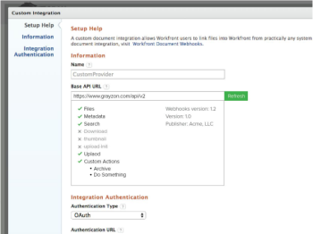

# Web フックの概要

Adobe Workfront のドキュメント Web フックは、Workfront が外部ドキュメントプロバイダーに対して認可された API 呼び出しを行う API エンドポイントのセットを定義します。 これにより、誰でも任意のドキュメントストレージプロバイダー用のミドルウェアプラグインを作成できます。

Web フックベースの統合のユーザーエクスペリエンスは、Google Drive、Box、Dropboxなどの既存のドキュメント統合のユーザーエクスペリエンスに似ています。 例えば、Workfront ユーザーは以下のアクションを実行できます。

* 外部ドキュメントプロバイダーのフォルダー構造をナビゲート
* ファイルを検索
* ファイルを Workfront にリンク
* 外部ドキュメントプロバイダーにファイルをアップロード
* ドキュメントのサムネールを表示

**参照実装**

新しい web フック実装の開発をすぐに開始できるように、Workfront では参照実装の例を提供しています。 これらの例は、[https://github.com/Workfront/webhooks-app](https://github.com/Workfront/webhooks-app) にあります。 これらは Java ベースの例で、Workfront からネットワークファイルシステム上のドキュメントに接続できるようにするものです。 

>[!NOTE]
>
>GitHub で公開しているリソースは例に過ぎず、実装を実行することはできません。

## バージョン

* バージョン 1.0（リリース日 - 2015年5月）：初期仕様

* バージョン 1.1（リリース日 - 2015年6月）。 /uploadInit の更新 - documentId と documentVersionId の追加

* バージョン 1.2（リリース日 - 2015年10月）：/createFolder を追加

* 今後のバージョン（リリース日 - 未定）:

  * /delete を追加
  * /rename を追加
  * /serviceInfo を追加
  * /customAction を追加
  * /search にページネーションと parentId を追加
