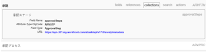

# API エクスプローラーの使用

Adobe Workfront コア API を使用する場合、API エクスプローラーは従来の参照ツールで、サポートされているリソース、パラメーターおよび変数の間の関係をカタログ化するものです。

## API エクスプローラーにアクセス

1. Web ブラウザーを使用して、[API エクスプローラ](https://developer.adobe.com/workfront/api-explorer/)に移動します。\
   

1. API エクスプローラーの右上で、目的の Workfront **API バージョン**&#x200B;を選択します。デフォルトでは、最新バージョンが自動的に選択されています。
1. 「**フィルター**」フィールドでは、名前別にリストされたオブジェクトを以下のようにフィルタリングでき、それに応じて表示されるオブジェクトのリストが短くなります。

   

   * **フィールド**：指定したオブジェクト内の使用可能なフィールド。
   * **参照**：指定したオブジェクトに使用できる参照変数。参照は変数のエイリアスです。初期化後、参照は変数名と同じ意味で使用できます。参照では、初期化されたメモリを使用します。
   * **コレクション**：オブジェクトに使用できるコレクション。コレクションは、オブジェクトとリソースの間の 1 対多の関係を表す変数です。
   * **検索**：オブジェクトに使用可能な検索リソース。検索の結果は、API リクエストの検索リソースで指定されたクエリパラメーターに基づきます。
   * **アクション**：オブジェクトでサポートされているアクション。アクションは、リソースまたはリソースのセットに対して実行される単純なプロシージャまたは複雑なプロシージャです。特定のアクションは、関連リソースにも影響を与える場合があります。

1. タブを開き、「オブジェクト ID」をクリックすると、該当する変数を表示できます。\
   \
   選択したオブジェクトに応じて、次の変数が適用されます。

   | 変数 | 定義 |
   |---|---|
   | フィールド名 | Workfront API 内の操作で使用されるフィールドの名前。 |
   | フィールドタイプ | データテーブルの特定のフィールドに入力できる値の種類。使用可能なフィールドタイプの値は、string、double、int、dateTime です。 |
   | 列挙型 | データタイプの識別に使用できる値の種類。 |
   | 可能な値 | オブジェクトに指定できる値。 |
   | 属性タイプ ObjCode | オブジェクトクラスの変更に使用できる属性。 |
   | URL | アプリと Workfront API との通信を可能にするエントリパス。 |
   | 引数 | アプリケーションと Workfront の間で受け渡すことができる、オブジェクトの変数。 |
   | 結果タイプ | メソッドから返すことができる使用可能なデータタイプ。 |
