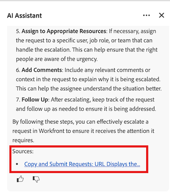

# AI アシスタントのプロンプトとベストプラクティス

WorkfrontのAI アシスタントは、アカウントデータや特定のオブジェクトタイプに関する有益な情報を提供することで、より効果的に業務を遂行するのに役立つ強力なツールです。

この記事では、明確なプロンプトの作成方法、情報を求められるオブジェクトタイプ、必要に応じて情報を検証するための追加リソースへのアクセス方法など、AI アシスタントの現在のベストプラクティスについて解説します。

AI アシスタントについて詳しくは、[AI アシスタントの概要](/help/quicksilver/workfront-basics/ai-assistant/ai-assistant-overview.md)を参照してください。

>[!NOTE]
>
>AI アシスタントの機能が進化するにつれ、依頼できるリクエストや質問の種類は拡大していきます。 使用できる使用可能なプロンプトについて詳しくは、新しいAI アシスタント機能がリリースされたので、この記事を再検討することをお勧めします。

## AI アシスタントで利用可能なオブジェクトタイプ

AI アシスタントは、次のオブジェクトタイプのデータを提供できます。

* ポートフォリオ
* プログラム
* プロジェクト
* タスク
* イシュー
* カスタムフォーム
* ユーザー
* Adobe Workfront Planning のレコード

>[!NOTE]
>
>AI アシスタントにデータをリクエストする前に、オブジェクトのアクセスレベルで必要な権限を持っている必要があります。

## ベストプラクティス

### 明確なプロンプトを入力

AI アシスタントから最も有用な情報にアクセスするには、探している応答を提供するプロンプトを作成することが重要です。 次のリストには、適切なプロンプトを作成するのに役立つ原則が含まれています。

* **明確で具体的な言語を使用する**：あいまいな一般的なプロンプトを避けることで、AI アシスタントが受信しようとしているデータを誘導できるようになります。
* **時間枠を含める**: AI アシスタントにオブジェクトの特定の時間枠を指定すると、処理する必要があるデータを絞り込むのに役立ち、応答でよりターゲットを絞り込んだ情報が得られます。
* **一度に1つのことだけを要求します**:1つのプロンプトに複数の無関係な要求が含まれている場合、AI アシスタントは適切な情報を提供できません。

推奨プロンプトについて詳しくは、この記事の次の節を参照してください。[ プロンプトの例](#prompt-examples)。

### AI アシスタントの回答を検証

AI アシスタントの開発のこの段階では、Workfrontのプロセスに関する情報を求める際に、提供される情報を検証することをお勧めします。 これは、プロンプト応答の「ソース」セクションで提供されている記事リンクをクリックすることで可能です。

Workfront プロセスのプロンプトについて詳しくは、この記事の「[Workfrontのアクションに関するプロンプト ](#prompts-to-learn-about-workfront-actions)」を参照してください。

## プロンプトの例

次の表には、作業情報を生成するために使用できるプロンプトの例と、Workfrontの特定のプロセスや操作について詳しく説明しています。

### 作業に関する情報を検索するプロンプト

<table>
    <tr>
        <td><b>オブジェクトタイプ</b></td>
        <td><b>プロンプト</b></td>
    </tr>
        <tr>
        <td>プロジェクト</td>
        <td><em>[ プロジェクト名]の期日を教えてください。</em>
        </td>
    </tr>
    <tr>
        <td>プロジェクト</td>
        <td><em>[ プロジェクト名]のステータスを教えてください。</em>
        </td>
    </tr>
    <tr>
        <td>プロジェクト </td>
        <td><em>[ プロジェクト名]のプロジェクトオーナーは誰ですか？</em></td>
    </tr>
    <tr>
        <td>タスク</td>
        <td><em>今週割り当てられたタスクは何か？</em></td>
    </tr>
       <tr>
        <td>イシュー </td>
        <td><em>チームに割り当てられている未解決のイシューはどれですか？</em></td>
           <tr>
        <td>ユーザー</td>
        <td><em>[ プロジェクト名]のクリエイティブチームのメンバーは誰ですか？</em></td>
    </tr>
           <tr>
        <td>ユーザー </td>
        <td><em>[USER]に割り当てられているタスクの数</em></td>
    </tr>
   </table>

### Workfrontのアクションについて学習するプロンプト

<table>
    <tr>
        <td><b>オブジェクトタイプ</b></td>
        <td><b>プロンプト</b></td>
    </tr>
    <tr>
        <td>プロジェクト</td>
        <td><em> テンプレートから新しいプロジェクトを作成するにはどうすればよいですか？</em>
        </td>
    </tr>
    <tr>
        <td>プロジェクト </td>
        <td><em>プロジェクトとプログラムの違い？</em></td>
    </tr>
    <tr>
        <td>タスク</td>
        <td><em>タスクを複数のユーザーに割り当てるにはどうすればよいですか？</em></td>
    </tr>
       <tr>
        <td>タスク</td>
        <td><em>「開始準備完了」ステータスとは何を意味しますか？</em></td>
    </tr>
       <tr>
        <td>イシュー </td>
        <td><em>リクエストをタスクに変換するにはどうすればよいですか？</em></td>
    </tr>
           <tr>
        <td>イシュー </td>
        <td><em>Workfrontでの問題のライフサイクルは何ですか？</em></td>
    </tr>
        </tr>
           <tr>
        <td>イシュー </td>
        <td><em>リクエストをエスカレーションするにはどうすればよいですか？</em></td>
    </tr>
           <tr>
        <td>ドキュメント</td>
        <td><em>ドキュメントの新しいバージョンをアップロードするにはどうすればよいですか？</em></td>
    </tr>
           <tr>
        <td>ドキュメント </td>
        <td><em>ドキュメント承認ワークフローを設定できますか？</em></td>
    </tr>
   </table>

## 現在のAI アシスタントの制限事項

AI アシスタントは強力なツールですが、現在の開発段階では、データを提供できない特定の種類の質問やリクエストがあります。 次の表は、AI アシスタントがデータを表示できないプロンプトの例です。

<table>
    <tr>
        <td><b>プロンプトタイプ</b></td>
        <td><b>例</b></td>
    </tr>
    <tr>
        <td>カスタマイズされた設定に関する質問</td>
        <td><em>Workfront インスタンスで実行されているカスタム統合ロジックは何ですか？</em>
        </td>
    </tr>
    <tr>
        <td>Workfront以外のデータに関する疑問 </td>
        <td><em>今日のOutlookのカレンダーを見せてもらえますか？</em></td>
    </tr>
             <tr>
        <td>Adobeの非統合型製品に関する質問 </td>
        <td><em>ここからAcrobatでPDFを編集するにはどうすればよいですか？</em></td>
         <tr>
        <td>人間の判断が必要な質問</td>
        <td><em>このプロジェクトは保留にすべきですか？</em></td>
    </tr>
    </tr>
       <tr>
        <td>一括更新のリクエスト</td>
        <td><em>[USER]のすべての期限切れタスクを再割り当てします。</em></td>
    </tr>
       <tr>
        <td>予測分析の依頼</td>
        <td><em>過去データをもとに、新しいプロジェクト計画を提案。</em></td>
    </tr>
           <tr>
        <td>アクセスレベルを超える情報のリクエスト</td>
        <td><em>アカウント内のすべての請求レートを一覧表示します。</em></td>
    </tr>
           <tr>
        <td>曖昧な情報を含むリクエスト </td>
        <td><em>プロジェクトの修正：</em></td>
    </tr>
   </table>
