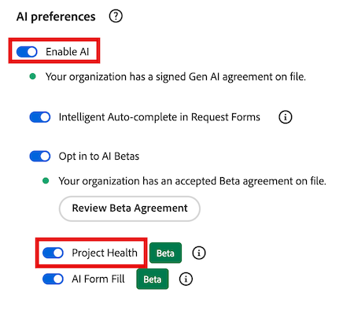
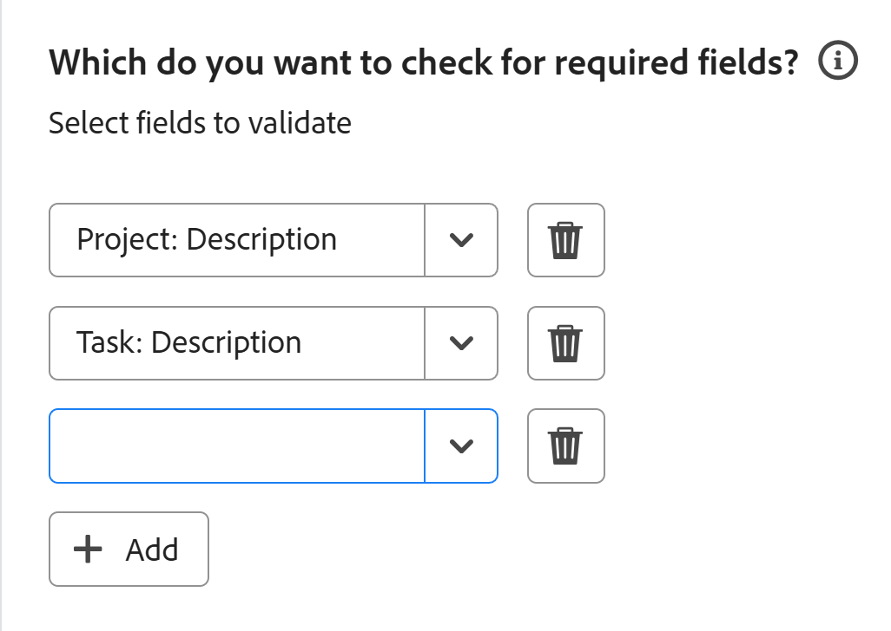
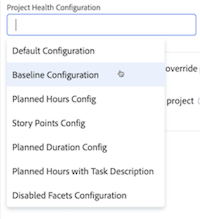
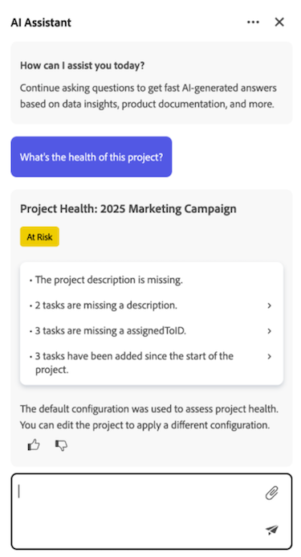
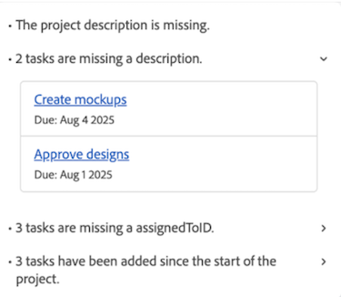
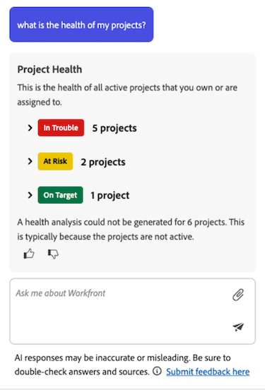

# プロジェクトのヘルスの概要

>[!IMPORTANT]
>
>プロジェクトの正常性機能は現在、ベータ版ステージに参加しているユーザーのみが利用できます。

Adobe Workfrontのプロジェクトヘルス機能は、AI アシスタントの機能を活用して、プロジェクトのパフォーマンス、注意が必要な分野、時間と費用がかかる可能性のある問題を回避する方法などを即座に評価します。

AI アシスタントは、次のオブジェクトに対してプロジェクト正常性評価を生成できます。

* 単一のプロジェクト
* 単一のプログラム
* 複数のプロジェクト

AI アシスタントについて詳しくは、[AI アシスタントの概要](/help/quicksilver/workfront-basics/ai-assistant/ai-assistant-overview.md)を参照してください。

+++ 展開すると、この記事の機能のアクセス要件が表示されます。

<table style="table-layout:auto"> 
<col> 
</col> 
<col> 
</col> 
<tbody> 
<tr> 
   <td role="rowheader">
Adobe Workfront パッケージ
</td> 
   <td> 

Select以上 
 

ワークフロー選択以上

   </td> 
<tr> 
 <tr> 
   <td role="rowheader">
Adobe Workfront プラン
</td> 
   <td> 

標準
 
   </td> 
   </tr> 
  </tr> 
  <tr> 
   <td role="rowheader">
アクセスレベル設定
</td> 
   <td>
プロジェクト正常性設定を管理するには、システム管理者である必要があります 

   
プロジェクトへのアクセス権を編集して、プロジェクトの正常性設定を適用する 

     
プロジェクトへのアクセスを表示して、プロジェクトの正常性設定を表示します 

     
プログラムへのアクセスを表示して、プログラム内のすべてのプロジェクトのプロジェクトの正常性を表示する

  </td> 
  <tr> 
   <td role="rowheader">
オブジェクト権限
</td> 
   <td>
プロジェクトのヘルス設定を適用するためのプロジェクトへの権限の管理 

     
プロジェクトのヘルス設定を表示するためのプロジェクトの権限の表示 

  </td> 
  </tr> 
  </tr>  
    </tr>  
</tbody> 
</table>

この表の情報について詳しくは、[Workfront ドキュメントのアクセス要件](/help/quicksilver/administration-and-setup/add-users/access-levels-and-object-permissions/access-level-requirements-in-documentation.md)を参照してください。
+++

## Project Health ベータ版に登録する

プロジェクトの正常性を使用するには、組織でAI アシスタントを有効にする必要があります。

組織でAI アシスタントとプロジェクトの正常性を有効にするには、次のすべてを適用する必要があります。

<!--Remove me October 2026-->

* お客様の組織は、Adobe Identity Management システム（IMS）に移行している必要があります。
* 組織には、WorkfrontまたはWorkflow Select、Prime、またはUltimate パッケージが必要です。
* Adobe Unified Experienceを有効にする必要があります。
* Adobeには、署名済みのAdobe Gen AI契約書がファイルに登録されている必要があります。
* Workfront管理者は、組織内のユーザーに対してAI アシスタントを有効にする必要があります。 AI アシスタントはアクセスレベルで有効になります。
* 「AIを有効にする」オプションと「プロジェクトの健全性」オプションの両方を、「設定」の「システム環境設定」セクションの「AI環境設定」セクションで選択する必要があります。

  

詳しくは、[AI アシスタントの概要](/help/quicksilver/workfront-basics/ai-assistant/ai-assistant-overview.md)および[ システム環境設定](/help/quicksilver/administration-and-setup/manage-workfront/security/configure-security-preferences.md)を参照してください。

## プロジェクトの健全性の計算方法

AI アシスタントは、利用可能なプロジェクトの健全性ステータスのひとつを割り当てることで、プロジェクトの全体的な状況を迅速に評価します。

* 目標どおり
* リスクあり
* トラブル発生中

この状態は、プロジェクトの進捗状況、過小評価された作業など、プロジェクトコンポーネントを使用して計算されます。 プロジェクトの正常性を測定するために使用されるコンポーネントの完全なリストについては、「[ プロジェクトとプログラムの状態リスト ](#project-and-program-states-list)」を参照してください。

各プロジェクトコンポーネントに割り当てられたリスクスコアは（0～100）です。このスコアを平均することで、プロジェクト全体の健全性を把握できます。

* 目標（75以上）: プロジェクトのパフォーマンスが期待しきい値内である。
* リスク（50～74）: プロジェクトのパフォーマンスに影響を与える可能性のある新たな問題が検出されます。
* 問題が発生した場合（49点以下）: プロジェクトのパフォーマンスが許容値のしきい値を下回っているため、直ちに対処する必要があります。

>[!NOTE]
>
>* AI アシスタントは現在、選択したプロジェクトのデータのみを評価します。
>* プロジェクト間または過去の分析は、プロジェクトの正常性の計算にまだ含まれていません。

### プロジェクトのプロジェクト正常性の計算の例

最初の例では、4つのプロジェクトコンポーネントが評価され、それぞれのリスクスコアが次のように計算されます。

* 2 On Target （90 リスクスコア）
* 1 At Risk （45 risk score）
* 1 In Trouble （20 リスクスコア）

これらのスコアを平均すると、結果は61になります。 上記のプロジェクトヘルス基準を使用すると、このプロジェクトはリスク状態になります。

次の例では、プロジェクトのタイムラインの早い段階で1日のスケジュール変更が発生しました。 このシナリオでは、AI アシスタントは、プロジェクトの全体的な期間に対して、変更のタイミングと影響の両方を評価します。

* プロジェクトの60日間のタイムラインの初期段階における1日間のスケジュールシフトは軽微であり、通常は「On Target」としてスコアリングされます。
* プロジェクトの完了日付近での1日間のスケジュールシフトは、より破壊的であり、「リスク」または「トラブル」と評価される可能性があります。

変更は軽微であり、プロジェクトのタイムラインの初期段階で発生したため、プロジェクトは「ターゲット時」状態になります。

プロジェクトのタイムライン内で複数のスケジュール変更が発生した場合、それらの変更をスコアリングし、平均化してから、プロジェクトの健全性の計算に適用します。

## プロジェクトの条件とプロジェクトの正常性の違いを理解する

プロジェクトの条件とプロジェクトの健全性はWorkfrontでも同様の概念であり、プロジェクトの条件または状態（目標時、リスク時、問題発生時）を表すデフォルト名は同じですが、目的が異なります。

プロジェクト条件は、計画、予測、推定の日付のみに基づいて、プロジェクトの現在のパフォーマンスに関する基本的なスナップショットを示します。 プロジェクトオーナーは手動で設定することも、プロジェクトのタスクに基づいてWorkfrontで自動的に設定することもできます。 あるいは、Project Healthでは、より包括的にプロジェクトを管理し、その他の要因を評価することで、プロジェクトのパフォーマンスをより詳細に把握できます。

プロジェクトの条件について詳しくは、次の記事を参照してください。

* [プロジェクトの状況の更新](/help/quicksilver/manage-work/projects/updating-work-in-a-project/update-condition-on-project.md)
* [ カスタム条件](/help/quicksilver/administration-and-setup/customize-workfront/create-manage-custom-conditions/custom-conditions.md)。

## プロジェクトとプログラム プロジェクトの正常性の状態リスト

次の表に、プロジェクトの健全性評価を生成する際にAI アシスタントがプロジェクトまたはプログラムに割り当てる使用可能な状態の内訳を示します。

<table>
    <tr>
        <td><b>プロジェクトの状態</b></td>
        <td><b>定義</b></td>
        <td><b>要因</b></td>
    </tr>
    <tr>
        <td>目標どおり</td>
        <td>これは、以下の要因の平均リスクレベルが健全な閾値の範囲内にある場合に割り当てられます。
        </td>
        <td> 
        <ul><li>スコープクリープ</li>
        <li>環境にないフィールド</li>
        <li>スケジュールの変更</li>
        <li>過小評価された作業</li>
        <li>プロジェクト進捗</li>
        <li>期限切れタスク</li>
        <li>予算</li>
        </ul></td>
    </tr>
    <tr>
        <td>リスクあり</td>
        <td>これは、以下の要因の平均リスクレベルが健全な閾値をわずかに下回った場合に割り当てられます。</td>
        <td>
        <ul><li>スコープクリープ</li>
        <li>環境にないフィールド</li>
        <li>スケジュールの変更</li>
        <li>過小評価された作業</li>
        <li>プロジェクト進捗</li>
        <li>期限切れタスク</li>
        <li>予算</li>
        </ul></td>
    </tr>
    <tr>
        <td>トラブル発生中</td>
        <td>これは、以下の要因の平均リスクレベルが健全な閾値を下回った場合に割り当てられます。</td>
        <td>
        <ul><li>スコープクリープ</li>
        <li>環境にないフィールド</li>
        <li>スケジュールの変更</li>
        <li>過小評価された作業</li>
        <li>プロジェクト進捗</li>
        <li>期限切れタスク</li>
        <li>予算</li>
        </ul></td>
    </tr>
    </tr>
   </table>

## AI アシスタントのプロンプトリスト

以下は、AI アシスタントに対して、プロジェクト、プログラム、または表示できるすべてのプロジェクトのプロジェクトのプロジェクト正常性評価を生成するように依頼するために使用できるプロンプトのリストです。

<table>
    <tr>
        <td><b>Location</b></td>
        <td><b>プロンプト</b></td>
    </tr>
    <tr>
        <td>特定のプロジェクト詳細ページ</td>
        <td><em>このプロジェクトの健全性はどうなっていますか？</em></td>
    </tr>
    <tr>
        <td>Workfrontのすべてのページ </td>
        <td><em>プロジェクト [ プロジェクト名]のヘルスとは何ですか？</em></td>
    </tr>
    <tr>
        <td>Workfrontのすべてのページ </td>
        <td><em>プロジェクトの健全性を把握します？</em></td>
    </tr>
       <tr>
        <td>特定のプログラムの詳細ページ</td>
        <td><em>このプログラムの健全性は何か？</em></td>
    </tr>
       <tr>
        <td>Workfrontのすべてのページ </td>
        <td><em>プログラム [ プログラム名]のヘルスは何ですか？</em></td>
    </tr>
   </table>

## プロジェクト正常性設定の管理

プロジェクトの正常性設定を管理するには、システム管理者である必要があります。

プロジェクト正常性設定には、プロジェクトの正常性の計算方法を決定する特定の基準が含まれています。 Workfront管理者が設定を作成したら、それをプロジェクトに適用できます。

システムには、複数のプロジェクト正常性設定を設定できます。

{{step-1-to-setup}}

1. 左側のパネルで「**プロジェクト環境設定**」をクリックし、**プロジェクトの正常性**」を選択します。

1. ページの右上隅にある「**新規設定**」をクリックします。

   **AI設定** ページが開きます。

1. （オプション）「**名称未設定**」タイトル内をクリックして、設定の名前を変更します。

1. 「**プロジェクトの健全性**」セクションに含める要素を選択し、プロジェクトの健全性の基準を決定する際に含めない要素を選択解除します。
   * **スコープクリープ**: プロジェクトスコープが開始されてから拡張された量。

   * **必須フィールド**：必須フィールドがない場合（プロジェクトの説明など）。 これらの必須フィールドは、プロジェクトの完全性を決定し、**どのフィールドで完全性を確認しますか？以下の**&#x200B;設定セクション。

   * **スケジュールの変更**: プロジェクトの開始後に発生したスケジュールの変更の数。

   * **タスクの見積もり**: タスクの作業がどれだけ正確に見積もられたか（例：現在プロジェクトに期限切れのタスクがない）。

   * **タスクのバーンダウン**: プロジェクトの作業がプロジェクトのタイムラインと比較してどのように進行しているか。

   * **期限切れのタスク**：現在の期限切れのタスクの数。

   * **コスト**：現在プロジェクトが予算超過の場合。

1. **では、プロジェクトの正式な開始日はいつですか？** セクションで、ドロップダウンからプロジェクトの開始を示すイベントを選択します。

1. **で、プロジェクトの作業範囲を見積もる方法を教えてください。** セクションで、プロジェクトスコープの増加に伴い増加するプロジェクト要因を選択します。

1. **で、必須フィールドを確認しますか？** セクションで、プロジェクトの値を含める必要がある1つ以上のフィールドを選択します。

   

1. 「**追加**」をクリックして、より多くのネイティブまたはカスタムプロジェクトまたはタスクフィールドに追加します。

1. 右上隅の「**保存**」をクリックします。

## プロジェクト正常性設定の適用

Workfront管理者がプロジェクトのヘルス設定を作成したら、プロジェクトに対する管理権限がある場合は、その設定をプロジェクトに適用できます。

{{step1-to-projects}}

1. **プロジェクト** ページで、プロジェクトを選択します。

1. プロジェクト名の右側にある&#x200B;**詳細** アイコン をクリックし、**編集**&#x200B;を選択します。 「**プロジェクトを編集**」ボックスが開きます。

1. 左側のパネルで、**プロジェクト設定**&#x200B;をクリックします。

1. 「**プロジェクト正常性設定**」フィールドで、このプロジェクトに適用する設定を選択します。

   

1. ページの左下隅にある「**保存**」をクリックします。

## プロジェクトまたはプログラムのプロジェクト正常性評価の生成

次の領域では、AI アシスタントからプロジェクトの健全性評価を生成できます。

* プロジェクトの場合、評価は、プロジェクトページから生成するか、アシスタントに特定のプロジェクトのパフォーマンスを尋ねたときにプロジェクト名を参照して生成できます。

* プログラムの場合は、プログラムの詳細ページの評価を生成できます。

>[!NOTE]
>
>* 評価を生成するには、プロジェクトまたはプログラムの表示権限が必要です。
>* プロジェクトが開始されるまで、プロジェクトの健全性評価を生成することはできません。 プロジェクトの環境設定で開始するイベントトリガーを設定できます

詳しくは、この記事の「[ プロジェクト正常性設定の管理](#manage-project-health-configurations)」の節を参照してください。

プロジェクトまたはプログラムのプロジェクト正常性評価を生成するには：

1. プロジェクトの健全性評価を生成するプロジェクトまたはプログラムに移動します。

1. プロジェクト/プログラムの詳細ページで、画面の右上隅にある&#x200B;**AI アシスタント** アイコン をクリックします。 AI アシスタントが開きます。

1. 「**Workfrontについて質問**」フィールドに次の項目を入力します。*このプロジェクトの正常性は何ですか？*

   または

   「**Workfrontについて質問**」フィールドに次の項目を入力します。*このプログラムの正常性は何ですか？*

   >[!NOTE]
   >
   >Workfrontの別のページからAI アシスタントにアクセスする場合は、*プロジェクトの健全性[ プロジェクト名]を入力できます。*&#x200B;または&#x200B;*プログラム [ プログラム名]の正常性は何ですか？*  
   >入力できる現在のプロンプトの完全なリストについては、この記事の「[AI アシスタント プロンプト リスト ](#ai-assistant-prompts-list)」の節を参照してください。

1. **送信** アイコン をクリックします。 プロジェクトの正常性評価が生成され、パネルに表示されます。 各プロジェクトヘルス評価の上部にバッジが表示され、プロジェクトの現在の状況が反映されます。

   

   プログラムの評価を生成する場合は、プログラム内の各プロジェクトの状態を示す複数のバッジが表示されます。 バッジラベルについて詳しくは、この記事の「[ プロジェクトとプログラムの状態リスト ](#project-and-program-states-list)」の節を参照してください。

1. （オプション）評価ポイントのいずれかをクリックして、その詳細を展開します。

1. （オプション）拡張された詳細モードで、プロジェクト リンクをクリックしてプロジェクトの詳細を開きます。

   

1. プロジェクトの正常性の詳細を確認したら、AI アシスタントの右上隅にある&#x200B;**閉じる** アイコン をクリックします。

## 複数のプロジェクトに対してプロジェクトの正常性評価を生成する

現在の表示権限を持つプロジェクトすべてに対して、プロジェクトの健全性評価を組み合わせて生成できます。

プロジェクトが開始された場合にのみ、プロジェクトは組み合わされたプロジェクト正常性評価に含まれます。 プロジェクトトリガーで開始するイベント設定を設定できます。 詳しくは、この記事の「[ プロジェクト正常性設定の管理](#manage-project-health-configurations)」の節を参照してください。

1. 画面の右上隅にある&#x200B;**AI アシスタント** アイコン をクリックします。 AI アシスタントが開きます。

1. 「**Workfrontについて質問する」フィールドに次のように入力します**: *自分のプロジェクトの健全性は何ですか？*

   入力できる現在のプロンプトの完全なリストについては、この記事の次の節を参照してください。[AI アシスタント プロンプト リスト ](#ai-assistant-prompts-list)。

1. **送信** アイコン をクリックします。 プロジェクトヘルスアセスメントが生成され、パネルに表示されます。

   

   複数のプロジェクトの評価を生成する場合、AI アシスタントは、プロジェクトの現在のパフォーマンスに基づいて結果をグループ化します。

1. （オプション）プロジェクトの健全性バッジのいずれかをクリックしてプロジェクトリストを展開し、特定のプロジェクトのリンクを選択して、そのプロジェクトの詳細ページに移動します。

1. プロジェクトの正常性の詳細を確認したら、AI アシスタントの右上隅にある&#x200B;**閉じる** アイコン をクリックして閉じます。

<!--

## Build a Project Health table report in a Canvas Dashboard

>[!IMPORTANT]
>
>The Canvas Dashboards feature is currently only available for users participating in the beta stage. For more information, see [Canvas Dashboards beta information](/help/quicksilver/product-announcements/betas/canvas-dashboards-beta/canvas-dashboards-beta-information.md). 

You can add a table report to a Canvas Dashboard in order to easily visualize your Project Health data in a table format.  

### Prerequisites 

You must create a dashboard before you can build a table report. 

For more, see [Create a Canvas Dashboard](/help/quicksilver/reports-and-dashboards/canvas-dashboards/create-dashboards/create-dashboards.md).

### Build a Project Health table report 

There are many configuration options available for building a Project Health table report. In this section, we'll walk you through the process of creating one that displays the following columns: 

* **Name**: Contains the project name. 
* **Project Health Analysis**: Contains a summary of the Project Health assessment. 
* **Project Health Created At**: Contains the date/time when the Project Health assessment was last generated. 
* **Project Health Label**: Contains the project's label (e.g. On Target, At Risk, or In Trouble).

{{step1-to-dashboards}}

1. In the left panel, click **Canvas Dashboards**. 
1. In the upper-right corner, click **New Dashboard**. 
1. In the **Create dashboard** box, enter the dashboard's **Name** and **Description**. 
1. Click **Create**. 
1. In the **Add report** box, select **Create report**. 
1. On the left side, select **Table**. 
1. In the upper-right corner, click **Create report**. 
1. (Optional) Follow the steps below to configure the **Details**  section: 
    1. Enter a report **Name**. 
    1. Enter a report **Description**. 
1. Follow the steps below to configure the **Build table**  section: 
    1. In the left panel, click the **Table columns** icon. 
    1. Click **Add column**, then select **Project** > **Name**. 
    1. Click **Add column**, then select **Project** > **Project Health** > **Health Analysis**. 
    1. Click **Add column**, then select **Project** > **Project Health** > **Created At**. 
    1. Click **Add column**, then select **Project** > **Project Health** > **Health Label**. 

1. Follow the steps below to configure the **Filter**  section: 
    1. In the left panel, click the **Filter** icon. 
    1. Select **Edit filter**. 
    1. Click **Add condition** and then specify the field you want to filter by and the modifier that defines what kind of condition the field must meet. The column appears in the preview section on the right.
    1. (Optional) Click **Add filter group** to add another set of filtering criteria. The default operator between the sets is AND. Click the operator to change it to OR. 

1. Follow the steps below to configure the **Drilldown Group Settings**  section: 
    1. In the left panel, click the **Group Settings** icon. 
    1. Click the **Add grouping** button and then select the field you want to create as a grouping. The grouping column appears in the preview section on the right. 

1. Click **Save** to create the report.

-->
