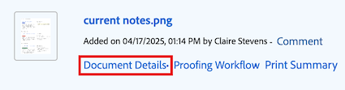
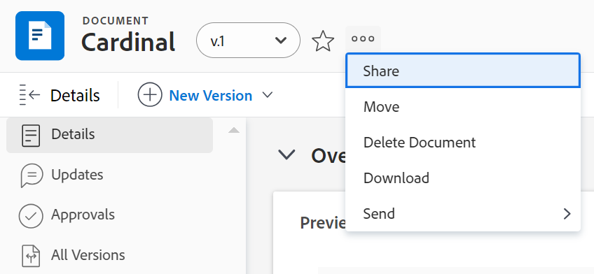
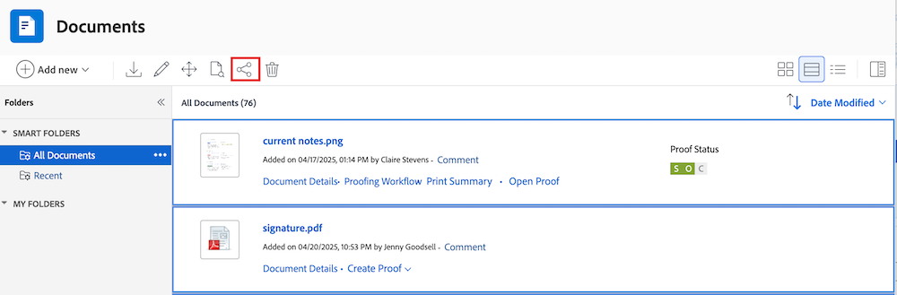

# 従来のWorkfront ストレージ上のドキュメントの共有

このページでハイライト表示されている情報は、まだ一般に利用できない機能を示します。プレビューサンドボックス環境でのみ使用できます。

Workfront管理者は、設定のアクセスレベル領域でドキュメントを表示または編集できるユーザーを制御します。 詳しくは、[ドキュメントへのアクセス権を付与](../../administration-and-setup/add-users/configure-and-grant-access/grant-access-documents.md)を参照してください。

ユーザーは、アップロードしたドキュメントやアクセス権のあるドキュメントを共有し、他のユーザーにそのドキュメントを表示または管理する権限を与えることもできます。

* 権限は個々のアイテムに適用され、そのアイテムに対して実行できるアクションを定義します。
* ドキュメントをアップロードするユーザーは、自動的にフルコントロール（権限の管理）を取得します。
* フォルダー全体を共有するには、[ ドキュメントフォルダーの共有](../../workfront-basics/grant-and-request-access-to-objects/share-a-document-folder.md)を参照してください。

## アクセス要件

+++ 展開すると、この記事の機能のアクセス要件が表示されます。 

<table style="table-layout:auto"> 
 <col> 
 <col> 
 <tbody> 
  <tr> 
   <td role="rowheader">Adobe Workfront パッケージ</td> 
   <td> 
任意 
 </td> 
  </tr> 
  <tr> 
   <td role="rowheader">Adobe Workfront プラン</td> 
   <td> 
標準
 
   
Work またはそれ以上

   </td> 
  </tr> 
  <tr> 
   <td role="rowheader">アクセスレベル設定</td> 
   <td> 
共有するオブジェクトに対する表示以上の権限
 </td> 
  </tr> 
  <tr> 
   <td role="rowheader">オブジェクト権限</td> 
   <td> 
共有するオブジェクトに対する表示またはそれ以上の権限
</td> 
  </tr> 
 </tbody> 
</table>

この表の情報について詳しくは、[Workfront ドキュメントのアクセス要件](/help/quicksilver/administration-and-setup/add-users/access-levels-and-object-permissions/access-level-requirements-in-documentation.md)を参照してください。

+++

## 従来のドキュメント領域でのドキュメントの共有

組織が従来のWorkfront ストレージを使用している場合、Workfrontでドキュメントにアクセスすると、従来のドキュメント領域が表示されます。 従来のWorkfront ストレージについて詳しくは、[従来のWorkfront ストレージとAdobe エンタープライズ ストレージの違い](/help/quicksilver/review-and-approve-work/esm-overview.md)を参照してください。

### レガシードキュメント領域で個々のドキュメントを共有する

Workfront にドキュメントをアップロードするユーザーには、デフォルトで、そのドキュメントに対する管理権限が付与されています。

{{step1-to-documents}}

1. **ドキュメント** ページで、共有するドキュメントにカーソルを合わせ、表示される&#x200B;**ドキュメントの詳細** リンクをクリックします。 **ドキュメントの詳細** ページが開きます。

   

1. ドキュメント名の右側にある&#x200B;**詳細** アイコン をクリックし、**共有**&#x200B;をクリックします。 **共有[文書名]** ダイアログボックスが開きます。

   

1. 「**ドキュメントに**&#x200B;へのアクセス権を付与」フィールドで、ドキュメントを共有するユーザー、チーム、役割、グループ、会社、またはビジネスプロファイル の名前を入力し始め、ドロップダウンリストに表示されたら、名前をクリックします。

   >[!TIP]
   >
   >ドキュメントを共有できるのは、アクティブなユーザー、チーム、役割、または会社のみです。

1. （オプション）「**アクセス可能なユーザー**」ドロップダウンを選択し、ドキュメントのアクセスレベルを選択します。

   * **招待されたユーザーのみがアクセスできます：** ドキュメントに招待されたユーザーのみがアクセスできます（デフォルト）。
   * **システム内のすべてのユーザーが表示できます**: システム内のすべてのユーザーは、招待なしでドキュメントを表示できます。

1. （オプション）ドキュメントを公開するには、歯車アイコン をクリックし、**のボックスをインラインでクリックして、このドキュメントを外部ユーザーに公開します**。 ダイアログボックスの下部に「**公開リンクをコピー**」ボタンが表示されます。

1. ユーザー名の右側にあるドロップダウンをクリックし、このドキュメントの権限レベルを選択します。

   * **表示**: ユーザーはドキュメントをレビューして共有できます。
   * **管理**: ユーザーは管理者権限を持たずにドキュメントに完全にアクセスできます。管理者権限はアクセス レベルで付与されます（すべての表示権限も含まれます）。

1. （オプション）付与した権限レベルの横にある「詳細オプション」アイコンをクリックして、ドキュメントに対する特定の権限を設定します。

   

1. （オプション）ドキュメントの子オブジェクトに対する継承された権限をオフにするには、**継承された権限**&#x200B;で&#x200B;**をインラインでオフにします。**

1. （条件付き）ドキュメントを外部ユーザーと共有できる公開リンクをコピーするには、「**公開リンクをコピー**」をクリックします。

   >[!CAUTION]
   >
   >機密情報を含む文書を外部ユーザーと共有する場合は、慎重に行うことをお勧めします。 Workfront のユーザーや組織の一員でなくても、情報を表示できるようになるからです。

1. 「**保存**」をクリックします。

### 従来のドキュメント領域でのドキュメントの一括共有

{{step1-to-documents}}

1. **ドキュメント** ページの「**すべてのドキュメント**」タブで、キーボードの&#x200B;**Command** （Mac）または&#x200B;**Ctrl** （Windows）を押しながら、共有する各ドキュメントをクリックします。

1. ページの上部で、**共有** アイコン をクリックします。 共有モーダルが開きます。

   

1. 「**ドキュメントに**&#x200B;へのアクセス権を付与」フィールドで、ドキュメントを共有するユーザー、チーム、役割、グループ、会社、またはビジネスプロファイル の名前を入力し始め、ドロップダウンリストに表示されたら、名前をクリックします。

   >[!TIP]
   >
   >ドキュメントを共有できるのは、アクティブなユーザー、チーム、役割、または会社のみです。

1. （オプション）「**アクセス可能なユーザー**」ドロップダウンを選択し、ドキュメントのアクセスレベルを選択します。

   * **招待されたユーザーのみがアクセスできます：** ドキュメントに招待されたユーザーのみがアクセスできます（デフォルト）。
   * **システム内のすべてのユーザーが表示できます**: システム内のすべてのユーザーは、招待なしでドキュメントを表示できます。

1. ユーザー名の右側にあるドロップダウンをクリックし、ドキュメントの権限レベルを選択します。

   * **表示**: ユーザーはドキュメントをレビューして共有できます。
   * **管理**: ユーザーは、管理者権限を持たずにドキュメントに完全にアクセスできます。管理者権限は、アクセスレベルで付与されます（すべての表示権限も含まれます）。

1. （オプション）付与した権限レベルの横にある「詳細オプション」アイコンをクリックして、ドキュメントに対する特定の権限を設定します。

   

1. 「**保存**」をクリックします。

### 従来のドキュメントの権限

権限は、Workfrontの 1 つの項目に固有で、その項目に対して実行できるアクションを定義します。オブジェクトの権限について詳しくは、[オブジェクトに対する共有権限の概要](../../workfront-basics/grant-and-request-access-to-objects/sharing-permissions-on-objects-overview.md)を参照してください。

+++ ドキュメント権限の詳細なリストを表示するには展開します

次の表に、ユーザーにドキュメントの表示または管理を許可する際に付与できる権限を示します。

<table border="2" cellspacing="15" cellpadding="1"> 
 <col> 
 <col> 
 <col> 
 <thead> 
  <tr> 
   <th> 
<strong>アクション</strong> 
 </th> 
   <th> 
<strong>管理</strong> 
 </th> 
   <th> 
<strong>表示</strong> 
 </th> 
  </tr> 
 </thead> 
 <tbody> 
  <tr> 
   <td scope="row">作成</td> 
   <td>✓</td> 
   <td> </td> 
  </tr> 
  <tr> 
   <td scope="row">ドキュメントの詳細を編集</td> 
   <td>✓</td> 
   <td> </td> 
  </tr> 
  <tr> 
   <td scope="row">削除*</td> 
   <td>✓</td> 
   <td> </td> 
  </tr> 
  <tr> 
   <td scope="row">ダウンロード</td> 
   <td>✓</td> 
   <td>✓</td> 
  </tr> 
  <tr> 
   <td scope="row">チェックアウト</td> 
   <td>✓</td> 
   <td> </td> 
  </tr> 
  <tr> 
   <td scope="row">承認者を追加</td> 
   <td>✓</td> 
   <td> </td> 
  </tr> 
  <tr> 
   <td scope="row">ドキュメントを承認</td> 
   <td>✓</td> 
   <td>✓</td> 
  </tr> 
  <tr> 
   <td scope="row">カスタムフォームを添付</td> 
   <td>✓</td> 
   <td> </td> 
  </tr> 
  <tr> 
   <td scope="row">カスタムフィールドを編集</td> 
   <td>✓</td> 
   <td> </td> 
  </tr> 
  <tr> 
   <td scope="row">移動（オブジェクト）</td> 
   <td>✓</td> 
   <td> </td> 
  </tr> 
  <tr> 
   <td scope="row">送信先（統合）</td> 
   <td>✓</td> 
   <td> </td> 
  </tr> 
  <tr> 
   <td scope="row">アップデート／コメント</td> 
   <td>✓</td> 
   <td>✓</td> 
  </tr> 
  <tr> 
   <td scope="row">新しいバージョンのアップロード</td> 
   <td>✓</td> 
   <td> </td> 
  </tr> 
  <tr> 
   <td scope="row">バージョンを削除</td> 
   <td>✓</td> 
   <td> </td> 
  </tr> 
  <tr> 
   <td scope="row">ドキュメントを表示</td> 
   <td>✓</td> 
   <td>✓</td> 
  </tr> 
  <tr> 
   <td scope="row">プレビュー</td> 
   <td>✓</td> 
   <td>✓</td> 
  </tr> 
  <tr> 
   <td scope="row">Proof**</td> 
   <td>✓</td> 
   <td>✓</td> 
  </tr> 
  <tr> 
   <td scope="row">プルーフの作成**</td> 
   <td>✓</td> 
   <td> </td> 
  </tr> 
  <tr> 
   <td scope="row">プルーフを削除**</td> 
   <td>✓</td> 
   <td> </td> 
  </tr> 
  <tr> 
   <td scope="row">共有*</td> 
   <td>✓</td> 
   <td>✓</td> 
  </tr> 
  <tr> 
   <td scope="row">システム全体で共有*</td> 
   <td>✓</td> 
   <td> </td> 
  </tr> 
  <tr> 
   <td scope="row">ドキュメントをパブリックにして共有*</td> 
   <td>✓</td> 
   <td> </td> 
  </tr> 
  <tr> 
   <td scope="row">外部のメールアドレスと共有</td> 
   <td> </td> 
   <td>✓</td> 
  </tr> 
  <tr> 
   <td scope="row">追加／削除</td> 
   <td>✓</td> 
   <td>✓</td> 
  </tr> 
  <tr> 
   <td scope="row">名前を変更</td> 
   <td>✓</td> 
   <td> </td> 
  </tr> 
  <tr> 
   <td scope="row">リンク（統合を使用）</td> 
   <td>✓</td> 
   <td>✓</td> 
  </tr> 
  <tr> 
   <td scope="row">リンク解除（統合を使用）</td> 
   <td>✓</td> 
   <td> </td> 
  </tr> 
 </tbody> 
</table>

&#42; アクションは、ドキュメントとドキュメントフォルダーの両方で共有されます。

&#42;&#42; ドキュメントのプルーフを行えるようにするには、Workfront アカウントに対応する個別のプルーフライセンスが必要です。プルーフライセンスの取得については、アカウントマネージャーにお問い合わせください。Workfront でのプルーフについて詳しくは、[プルーフ](../../review-and-approve-work/proofing/proofing.md)を参照してください。

+++

## 新規ドキュメント領域でのドキュメントの共有

Workfrontは、Adobe Creative Cloud製品との接続性を向上させるために、Adobe エンタープライズストレージソリューションに移行中です。 組織でエンタープライズストレージを使用している場合、Workfrontでドキュメントにアクセスすると、新しいドキュメント領域が表示されます。 エンタープライズストレージについて詳しくは、[Adobe エンタープライズストレージの概要](/help/quicksilver/review-and-approve-work/esm-overview.md)を参照してください。

Workfront インスタンスでAdobe エンタープライズストレージを使用している場合、個々のドキュメントを直接共有することはできません。 プロジェクト、タスク、イシューに対するアクセス権を管理します。 詳しくは、[ ドキュメント権限の仕組み](/help/quicksilver/review-and-approve-work/esm-access-permissions.md#how-document-permissions-work)を参照してください。

>[!IMPORTANT]
>
>また、プロジェクトを共有することで、選択した権限レベルに応じて、財務などの機密性の高いプロジェクト情報にアクセスできる場合があります。
>
>共有する前に、必ず権限の設定を慎重に確認してください。

## 従来のWorkfront ストレージでのドキュメントの共有に関する考慮事項

以下の考慮事項に加えて、[オブジェクトの共有権限の概要](../../workfront-basics/grant-and-request-access-to-objects/sharing-permissions-on-objects-overview.md)も参照してください。

>[!NOTE]
>
>Workfront 管理者は、システム内のすべてのユーザーに対して、システム内のアイテムに対する権限の追加や削除を、それらのアイテムの所有者にならなくても行うことができます。

* ドキュメントの共有は、Workfront で他のオブジェクトを共有する方法と同様です。Workfront でドキュメントを共有する方法について詳しくは、[オブジェクトの共有](../../workfront-basics/grant-and-request-access-to-objects/share-an-object.md)を参照してください。
* ドキュメントには、次の権限を付与できます。

   * 表示
   * 管理

* ドキュメントを公開またはシステム全体で共有することもできます。

  >[!CAUTION]
  >
  >機密情報を含んだオブジェクトを外部ユーザーと共有する場合は、注意することをお勧めします。Workfront のユーザーや組織の一員でなくても、情報を表示できるようになるからです。

* 「ドキュメントへのアクセス権の付与先」フィールドにメールアドレスを追加することで、Workfront アカウントを持たないユーザーとドキュメントを共有できます。
* ドキュメントを共有すると、ユーザーはすべてのドキュメントバージョンとすべてのドキュメントプルーフに同じアクセス権を持ちます。\
  Workfront でのプルーフについて詳しくは、[プルーフ](../../review-and-approve-work/proofing/proofing.md)の節を参照してください。

* ドキュメントに対する権限は、ドキュメントに関連付けられているオブジェクトから継承できます。Workfront 管理者は、アクセスレベルでドキュメントの権限の継承を制限できます。

  ドキュメントに対する継承された権限の制限について詳しくは、[カスタムアクセスレベルの作成または変更](../../administration-and-setup/add-users/configure-and-grant-access/create-modify-access-levels.md)を参照してください。

  ドキュメントの継承された権限は手動で削除できます。詳しくは、[オブジェクトからの権限の削除](../../workfront-basics/grant-and-request-access-to-objects/remove-permissions-from-objects.md)を参照してください

* 添付されたドキュメントは、添付されたオブジェクトからのみ権限を継承します。オブジェクト上にフォルダーを作成し、ドキュメントをフォルダーに移動すると、そのフォルダーの権限が継承されます。ただし、親オブジェクトまたは祖父母オブジェクト上にフォルダーを作成し、ドキュメントをそのフォルダーに移動した場合、そのフォルダーの権限は継承されません。