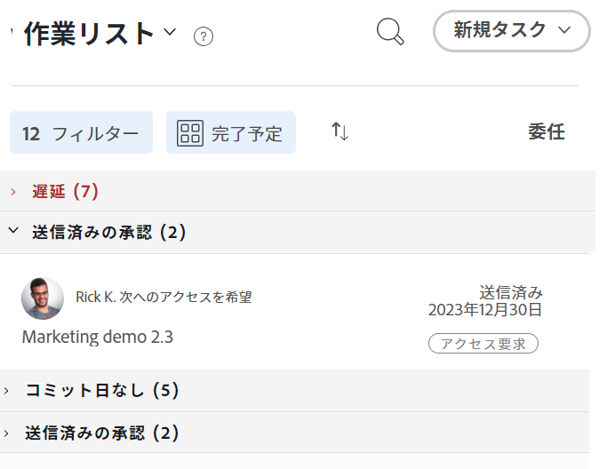
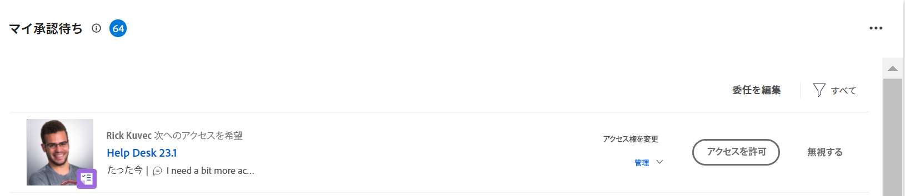

# ホームエリアのオブジェクトに対するアクセスの許可

ユーザーは、Adobe Workfront 内のオブジェクトへのアクセス権をリクエストできます。アクセス権のリクエストについて詳しくは、[オブジェクトへのアクセス権のリクエスト](../../workfront-basics/grant-and-request-access-to-objects/request-access.md)を参照してください。

オブジェクトの所有者は、ホームエリアからアイテムへのアクセス権を付与または拒否できます。

## アクセス要件

<!--drafted for P&P:

<table style="table-layout:auto"> 
 <col> 
 <col> 
 <tbody> 
  <tr> 
   <td role="rowheader">Adobe Workfront plan*</td> 
   <td> 
Any
 </td> 
  </tr> 
  <tr> 
   <td role="rowheader">Adobe Workfront license*</td> 
   <td> 
Current license: Standard
 
   Or
   
Legacy license: Work or higher

   </td> 
  </tr> 
  <tr> 
   <td role="rowheader">Access level configurations*</td> 
   <td> 
View access or higher to projects, tasks, issues, or documents
 
<b>NOTE</b>
   
   If you still don't have access, ask your Workfront administrator if they set additional restrictions in your access level. For information on how a Workfront administrator can modify your access level, see <a href="../../administration-and-setup/add-users/configure-and-grant-access/create-modify-access-levels.md" class="MCXref xref">Create or modify custom access levels</a>.
 </td> 
  </tr> 
  <tr> 
   <td role="rowheader">Object permissions</td> 
   <td> 
View permissions or higher to projects, tasks, issues, or documents
 
For information on requesting additional access, see <a href="../../workfront-basics/grant-and-request-access-to-objects/request-access.md" class="MCXref xref">Request access to objects </a>.
 </td> 
  </tr> 
 </tbody> 
</table>

-->

この記事の手順を実行するには、次のアクセス権が必要です。

<table style="table-layout:auto"> 
 <col> 
 <col> 
 <tbody> 
  <tr> 
   <td role="rowheader">Adobe Workfront プラン*</td> 
   <td> 
任意
 </td> 
  </tr> 
  <tr> 
   <td role="rowheader">Adobe Workfront ライセンス*</td> 
   <td> 
ワークまたはそれ以上
 </td> 
  </tr> 
  <tr> 
   <td role="rowheader">アクセスレベル設定*</td> 
   <td> 
プロジェクト、タスク、イシュー、ドキュメントに対する表示以上のアクセス権
 
<b>メモ</b>

まだアクセス権がない場合は、Workfront 管理者に問い合わせて、アクセスレベルに追加の制限が設定されているかどうかを確認してください。Workfront 管理者がアクセスレベルを変更する方法について詳しくは、<a href="../../administration-and-setup/add-users/configure-and-grant-access/create-modify-access-levels.md" class="MCXref xref">カスタムアクセスレベルの作成または変更</a>を参照してください。
 </td>
</tr> 
  <tr> 
   <td role="rowheader">オブジェクト権限</td> 
   <td> 
プロジェクト、タスク、イシュー、またはドキュメントに対する表示以上の権限
 
追加のアクセス権のリクエストについて詳しくは、<a href="../../workfront-basics/grant-and-request-access-to-objects/request-access.md" class="MCXref xref">オブジェクトへのアクセス権のリクエスト</a>を参照してください。
 </td> 
  </tr> 
 </tbody> 
</table>

&#42;保有するプラン、ライセンスタイプ、アクセス権を確認するには、Workfront 管理者に問い合わせてください。

## ホームエリアのオブジェクトに対するアクセスの許可

1. Adobe Workfront の左上隅にある&#x200B;**ホーム**&#x200B;アイコン  をクリックします。

   >[!NOTE]
   >
   >Workfront 管理者が、環境内のホームアイコンに次の変更を加える場合があります。
   >
   >* 組織を説明するようにカスタマイズされた画像に置き換える。この場合、アイコンはこの記事に示すものとは異なる外観になります。
   >* リンクされたページを別のページに置き換える。この場合、ページの右上隅にある&#x200B;**メインメニュー**&#x200B;アイコン  をクリックしたあと、「**ホーム**」をクリックします。

1. （条件付き）従来のホーム領域で、以下の操作を実行します。

   1. Adobe Analytics の **作業用リスト**」で、管理するアクセス要求を **承認** 」セクションに入力します。

   

   リクエストは「作業用リスト」の右側に表示されます。

   1. 右上隅の「アクセス権を付与」のボタンをクリックします。\
      リクエストされたアクセスのタイプに応じて、ボタン名が変わります。 たとえば、要求者がビューアクセスを要求した場合、ボタンは次のようになります。 **ビューアクセスの許可**.\
      

   1. （オプション）要求されたアクセスレベルとは異なるアクセスレベルを付与するには、「アクセスを許可」ボタンの横の矢印をクリックし、新しいアクセスを選択して、「 **&lt; 権限レベル > アクセスを許可する >**.\
      アクセス権が付与されたことを確認するメッセージが表示されます。

   1. （オプション）「 **無視** をクリックして、アクセスを拒否します。\
      アクセス権が拒否されたことを確認するメッセージが表示されます。

1. （条件付き）新しい「ホーム」領域で、以下の操作を実行します。

   1. 次に移動： **承認待ち** ウィジェットを開き、アクセス権の追加リクエストを探して、 **アクセスの許可**.

      

   1. （オプション）要求されたアクセスレベルとは異なるレベルのアクセスを許可するには、「アクセスを許可」ボタンの左側にあるドロップダウンメニューをクリックし、新しいアクセスを選択して、 **アクセスの許可**.

      アクセスリクエストが許可され、承認リクエストのリストに表示されなくなります。

   1. （オプション）「 **無視** をクリックして、アクセスを拒否します。 アクセスリクエストが許可されず、リクエストが承認リクエストのリストに表示されなくなります。

## リクエストに対するメール通知の設定

アクセス権のリクエストに対して、メール通知を受信するかどうかを設定できます。Workfront 管理者はこの機能を無効にできます。詳しくは、[システムの全員に対するイベント通知の設定](../../administration-and-setup/manage-workfront/emails/configure-event-notifications-for-everyone-in-the-system.md)を参照してください。

1. Adobe Workfront の右上隅にある&#x200B;**メインメニュー**&#x200B;アイコン  をクリックし、**設定**  をクリックします。

1. 「**環境設定**」をクリックするか、「環境設定」セクションまでスクロールします。
1. 「**次の場合にメールで通知**」ドロップダウンリストで、別のユーザーからアクセス権を要求されたときにメール通知を送るか送らないかに応じて、「**誰かが自分にアクセスを要求**」を選択または選択解除します。

1. 「**変更を保存**」をクリックします。
