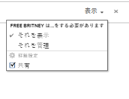
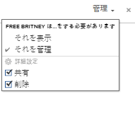

# レポート、ダッシュボードおよびカレンダーの共有

アクセスレベルを割り当てる際に、Adobe Workfront 管理者は、レポート、ダッシュボードおよびカレンダーを表示または編集するためのアクセス権をユーザーに付与します。レポート、ダッシュボードおよびカレンダーへのアクセス権の付与に関して詳しくは、[レポート、ダッシュボードおよびカレンダーへのアクセス権の付与](../../administration-and-setup/add-users/configure-and-grant-access/grant-access-reports-dashboards-calendars.md)を参照してください。

ユーザーに付与されるアクセスレベルに加えて、共有するためのアクセス権を自分が持っている特定のレポート、ダッシュボードまたはカレンダーを表示または管理する権限をユーザーに付与することもできます。オブジェクトの共有権限をユーザーに付与する方法については、[オブジェクトの共有権限の概要](../../workfront-basics/grant-and-request-access-to-objects/sharing-permissions-on-objects-overview.md)を参照してください。

権限は、Workfrontの 1 つの項目に固有で、その項目に対して実行できるアクションを定義します。

各アクセスレベルのユーザーがイシューに対して実行できる操作については、[各オブジェクトタイプで使用できる機能](../../administration-and-setup/add-users/access-levels-and-object-permissions/functionality-available-for-each-object-type.md)の記事で[レポート](../../administration-and-setup/add-users/access-levels-and-object-permissions/functionality-available-for-each-object-type.md#reports)の節を参照してください。

## レポート、ダッシュボードおよびカレンダーの共有に関する考慮事項

以下の考慮事項に加えて、[オブジェクトの共有権限の概要](../../workfront-basics/grant-and-request-access-to-objects/sharing-permissions-on-objects-overview.md)も参照してください。

>[!NOTE]
>
>Workfront 管理者は、システム内のすべてのユーザーに対して、システム内のアイテムに対する権限の追加や削除を、それらのアイテムの所有者にならなくても行うことができます。

* レポート、ダッシュボードまたはカレンダーの作成者には、デフォルトで、それらのアイテムの管理権限が付与されています。
* レポート、ダッシュボードおよびカレンダーの共有は、Workfront における他のあらゆるオブジェクトの共有と同様です。

  Workfront でオブジェクトを共有する方法に関して詳しくは、[オブジェクトの共有](../../workfront-basics/grant-and-request-access-to-objects/share-an-object.md)を参照してください。

  レポート、ダッシュボードおよびカレンダーの共有方法については、以下の記事も参照してください。

   * [Adobe Workfront でのレポートの共有](../../reports-and-dashboards/reports/creating-and-managing-reports/share-report.md)
   * [ダッシュボードの共有](../../reports-and-dashboards/dashboards/creating-and-managing-dashboards/share-dashboard.md)
   * [カレンダーレポートの共有](../../reports-and-dashboards/reports/calendars/share-a-calendar-report.md)

* レポートやダッシュボードは個別に共有することも、一括で共有することもできます。

  カレンダーは個別にのみ共有できます。一括で共有することはできません。

* 組み込みのシステムレポートを共有することはできません。共有できるのは、カスタムレポートのみです。

  システムレポートを新しいカスタムレポートとして保存する方法について詳しくは、[レポートのコピーの作成](../../reports-and-dashboards/reports/creating-and-managing-reports/create-copy-report.md)を参照してください。

* レポート、ダッシュボードおよびカレンダーに対する以下の権限を付与できます。

   * 表示

     

   * 管理

     

* ダッシュボードを共有すると、ユーザーにはデフォルトで、ダッシュボード上のすべてのレポート、カレンダーおよび外部ページに対する表示権限があります。
* リクエストライセンスを持つユーザーは、システム全体のレポートを表示できません。依頼者がレポートを表示する必要がある場合は、そのレポートを依頼者と個別に共有する必要があります。
* レポートにプロンプトがあり、それを公に共有する場合、レポートにアクセスするユーザーがプロンプトを使用してレポートを実行するには、ユーザーが Workfront にログインする必要があります。Workfront にログインできない場合は、プロンプトが適用されないレポートが表示されます。\
  プロンプトを使用したレポートの共有の制限事項について詳しくは、[レポートへのプロンプトの追加](../../reports-and-dashboards/reports/creating-and-managing-reports/add-prompt-report.md)の記事で[プロンプト付きレポートの共有の制限事項](../../reports-and-dashboards/reports/creating-and-managing-reports/add-prompt-report.md#limitations-of-running-public-prompted-reports)の節を参照してください。

* レポートまたはカレンダーから継承された権限は削除できます。

  継承された権限をオブジェクトから削除する方法について詳しくは、[オブジェクトからの権限の削除](../../workfront-basics/grant-and-request-access-to-objects/remove-permissions-from-objects.md)を参照してください。

* また、レポートやカレンダーを公にまたはシステム全体で共有することもできます。

  ダッシュボードを公に共有することはできませんが、システム全体で共有することはできます。

  >[!CAUTION]
  >
  >機密情報を含んだオブジェクトを外部ユーザーと共有する場合は、注意することをお勧めします。Workfront のユーザーや組織の一員でなくても、情報を表示できるようになるからです。
