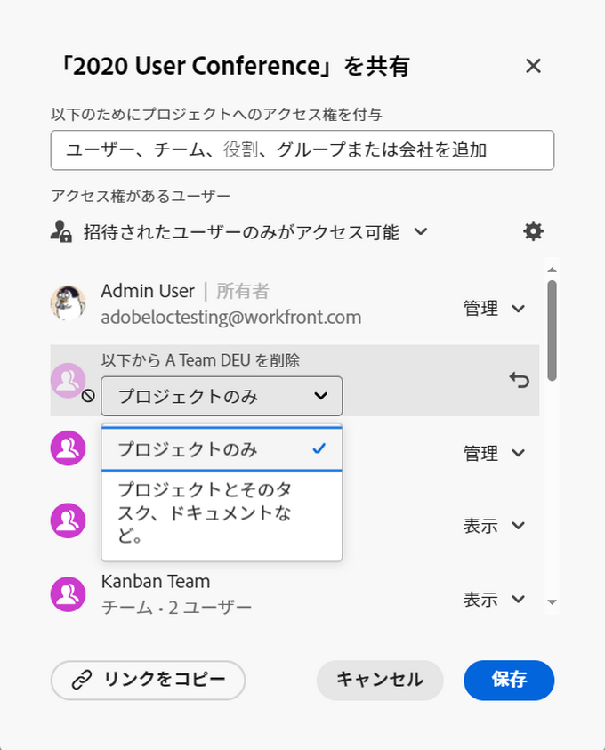
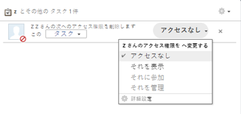
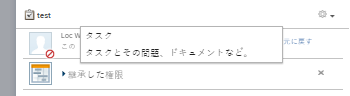
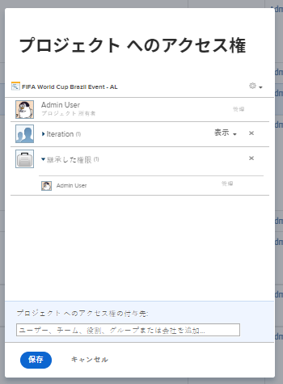
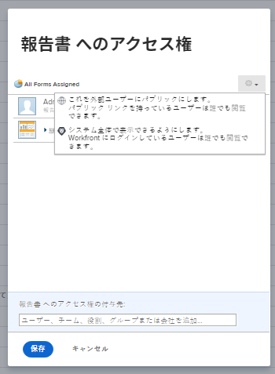

# オブジェクトから権限を削除

共有にアクセスできるオブジェクトに対する他のユーザーの権限を削除できます。 オブジェクトからの権限の削除は、共有可能なすべてのオブジェクトで同じです。 

オブジェクトを共有する場合と同様の考慮事項は、オブジェクトから権限を削除する場合に適用されます。 詳しくは、 [オブジェクトの共有に関する考慮事項](../../workfront-basics/grant-and-request-access-to-objects/sharing-permissions-on-objects-overview.md#consider) 記事内 [オブジェクトに対する共有権限の概要](../../workfront-basics/grant-and-request-access-to-objects/sharing-permissions-on-objects-overview.md)

## アクセス要件

<!--drafted for P&P:

<table style="table-layout:auto"> 
 <col> 
 <col> 
 <tbody> 
  <tr> 
   <td role="rowheader">Adobe Workfront plan*</td> 
   <td> 
Any 
 </td> 
  </tr> 
  <tr> 
   <td role="rowheader">Workfront license*</td> 
   <td> 
Current license: Contributor or higher

   Or  
   
Legacy license: Request or higher

   
<b>NOTE</b>

   
Some objects require a higher access than Request. 

   
   
For example, for the current license, a Contributor can share issues, but only Standard-license users can share a project.

   
   
For the legacy license, a Requestor can share issues, but only Workers or Planners can share a project.
 
   </td> 
  </tr> 
  <tr> 
   <td role="rowheader">Access level configurations*</td> 
   <td> 
View access or higher to the objects you want to share
 
<b>NOTE</b>
   
   If you still don't have access, ask your Workfront administrator if they set additional restrictions in your access level. For information on how a Workfront administrator can modify your access level, see <a href="../../administration-and-setup/add-users/configure-and-grant-access/create-modify-access-levels.md" class="MCXref xref">Create or modify custom access levels</a>.
 </td> 
  </tr> 
  <tr> 
   <td role="rowheader">Object permissions</td> 
   <td> 
View permissions or higher to the objects you want to share
 
Manage permissions to remove inherited permissions on objects
 
For information on requesting additional access, see <a href="../../workfront-basics/grant-and-request-access-to-objects/request-access.md" class="MCXref xref">Request access to objects </a>.
 </td> 
  </tr> 
 </tbody> 
</table>
-->

オブジェクトを共有するには、次の条件を満たす必要があります。

<table style="table-layout:auto"> 
 <col> 
 <col> 
 <tbody> 
  <tr> 
   <td role="rowheader">Adobe Workfront plan*</td> 
   <td> 
任意 
 </td> 
  </tr> 
  <tr> 
   <td role="rowheader">Workfront license*</td> 
   <td> 
リクエスト以上

   
<b>メモ</b>

一部のオブジェクトは、Request よりも高いアクセス権が必要です。 たとえば、要求者は問題を共有できますが、プロジェクトを共有できるのは、作業者またはプランナのみです。

</td> 
  </tr> 
  <tr> 
   <td role="rowheader">アクセスレベル設定*</td> 
   <td> 
共有するオブジェクトへのアクセス権以上の表示
 
<b>メモ</b>

まだアクセス権がない場合は、Workfront管理者に、アクセスレベルに追加の制限を設定しているかどうかを問い合わせてください。 Workfront管理者がアクセスレベルを変更する方法について詳しくは、 <a href="../../administration-and-setup/add-users/configure-and-grant-access/create-modify-access-levels.md" class="MCXref xref">カスタムアクセスレベルの作成または変更</a>.
 </td>
</tr> 
  <tr> 
   <td role="rowheader">オブジェクト権限</td> 
   <td> 
共有するオブジェクトに対する権限以上の表示
 
オブジェクトの継承された権限を削除する権限を管理します
 
追加のアクセス権のリクエストについて詳しくは、 <a href="../../workfront-basics/grant-and-request-access-to-objects/request-access.md" class="MCXref xref">オブジェクトへのアクセスのリクエスト </a>.
 </td> 
  </tr> 
 </tbody> 
</table>

&#42;保有しているプラン、ライセンスの種類、アクセス権を確認するには、Workfront管理者に問い合わせてください。

## オブジェクトの共有リストからエンティティを削除します {#remove-entities-from-the-sharing-list-of-an-object}

オブジェクトの共有リストからエンティティ（ユーザー、ジョブの役割、チーム、グループ、会社）を削除できます。 これにより、オブジェクトに対する権限が削除されます。

1. 共有するオブジェクトに移動します。

   共有可能なオブジェクトについては、 [オブジェクトに対する共有権限の概要](../../workfront-basics/grant-and-request-access-to-objects/sharing-permissions-on-objects-overview.md).

1. 次をクリック： **詳細** アイコン オブジェクト名の横にあるをクリックし、 **共有** または&#x200B;**共有。**

   

1. 次をクリック： **x** ユーザー、チーム、グループ、会社、ジョブの役割の横にある [ オブジェクトアクセス ] ボックスで、削除します。

   

1. 内 `<User Name>`のWorkfrontアクセスがこのドロップダウンメニューから削除され、選択したオブジェクトからのみアクセスを削除するか、それに関連付けられているすべての子オブジェクトからアクセスを削除するかを選択します。\
   次のシナリオが存在します。

   * オブジェクトからのみエンティティを削除する場合、そのエンティティはオブジェクトに対する権限を失い、子オブジェクトに対する継承された権限を失います。 以前に子項目に対して個別に権限を付与されていた場合、このオプションを選択すると、関連付けられているすべての子オブジェクトに対して同じ権限が保持されます。 
   * オブジェクトとすべての子オブジェクトからエンティティを削除すると、各子オブジェクトに対して個別の権限が与えられていた場合でも、そのエンティティはオブジェクトおよびすべての子オブジェクトに対する権限を失います。 

1. 「**保存**」をクリックします。

## 複数のオブジェクトから権限を一括で削除します。

リストでエンティティ（ユーザー、ジョブロール、チーム、グループ、会社）を一度に複数のオブジェクトから削除できます。 

>[!NOTE]
>
>一括選択したすべてのオブジェクトに対して、どのアクセスエンティティが持つかを表示することはできません。 権限を削除する前に、選択したオブジェクトの共有から削除するエンティティを把握しておく必要があります。

1. 共有するオブジェクトのリストに移動します。

   共有可能なオブジェクトについては、 [オブジェクトに対する共有権限の概要](../../workfront-basics/grant-and-request-access-to-objects/sharing-permissions-on-objects-overview.md).

1. リスト内の複数のオブジェクトを選択し、 **共有** アイコン をクリックします。
1. アクセスを削除するユーザー、役割、チーム、グループまたは会社の名前を **編集 `<Object Name>` ～へのアクセス** フィールドに入力します。
1. アクセスドロップダウンメニューから、 **アクセスなし**.

   

1. 内 `<User Name>`のWorkfrontアクセスがこのドロップダウンメニューから削除され、選択したオブジェクトからのみアクセスを削除するか、そのオブジェクトに関連付けられている他のすべての子オブジェクトかを選択します。\
   次のシナリオが存在します。

   * オブジェクトからのみエンティティを削除する場合、そのエンティティはオブジェクトに対する権限を失い、子オブジェクトに対する継承された権限を失います。 以前に子項目に対して個別に権限を付与されていた場合、このオプションを選択すると、関連付けられているすべての子オブジェクトに対して同じ権限が保持されます。 
   * オブジェクトとすべての子オブジェクトからエンティティを削除すると、各子オブジェクトに対して個別の権限が与えられていた場合でも、そのエンティティはオブジェクトおよびすべての子オブジェクトに対する権限を失います。

   **例：** リストで選択したタスクに対する権限を削除するか、タスクに添付された問題とドキュメントに対する権限を削除するかを選択します。

   

1. （オプション）複数のオブジェクトに対する権限を一括で変更するには、選択したエンティティに対して別のレベルの共有を選択します。

   例えば、管理権限を持っている場合は、代わりに「貢献」または「表示」を選択します。

1. 「**保存**」をクリックします。

## 継承された権限の削除

継承された権限は、オブジェクトから削除できます。これにより、親オブジェクトへのユーザーのアクセスに関係なく、所有者は子オブジェクトへのアクセス権を取得するユーザーを特定できます。

>[!IMPORTANT]
>
>継承された権限を削除できるのは、管理権限を持つユーザーのみです。

継承された権限を削除するには：

1. 管理権限を持つオブジェクトに移動します。 例えば、タスクに移動します。
1. 「 [オブジェクトの共有リストからエンティティを削除します](#remove-entities-from-the-sharing-list-of-an-object) 」の節を参照してください。
1. を選択します。 **x** 次の **継承された権限** 共有ボックスに表示されているすべてのユーザーを削除します。

   

   これにより、親オブジェクト（プロジェクトなど）に対する権限を付与されたユーザーが、デフォルトでこのタスクに対する権限を持つことを防ぐことができます。 タスクに対する権限を付与するには、タスクの共有リストに個々のエンティティをリストする必要があります。

   >[!TIP]
   >
   >「継承された権限」リストから個々のエンティティを削除することはできません。 リストされているすべてのエンティティに対して、継承された権限のみ無効にできます。

1. クリック **保存**. 

## オブジェクトを非公開にする

システム全体でオブジェクトを共有している場合や、オブジェクトを公開して外部のユーザーと共有している場合は、システム全体または公開の権限を削除して、再び非公開にすることができます。 

オブジェクトをシステム全体または公開で使用できるようにする方法については、 [オブジェクトの共有](../../workfront-basics/grant-and-request-access-to-objects/share-an-object.md).

オブジェクトを非公開にするには：

1. 非公開にするオブジェクトに移動します。\
   例えば、レポートに移動します。
1. クリック **レポートのアクション**&#x200B;を、 **共有**.

   

1. クリック **公開アクセスを削除** 」をクリックすると、レポートを表示する外部ユーザーのアクセス権が削除されます。
1. クリック **システム全体のアクセスを削除** をクリックして、すべてのWorkfrontユーザーとの共有を停止します。 
1. 「**保存**」をクリックします。
