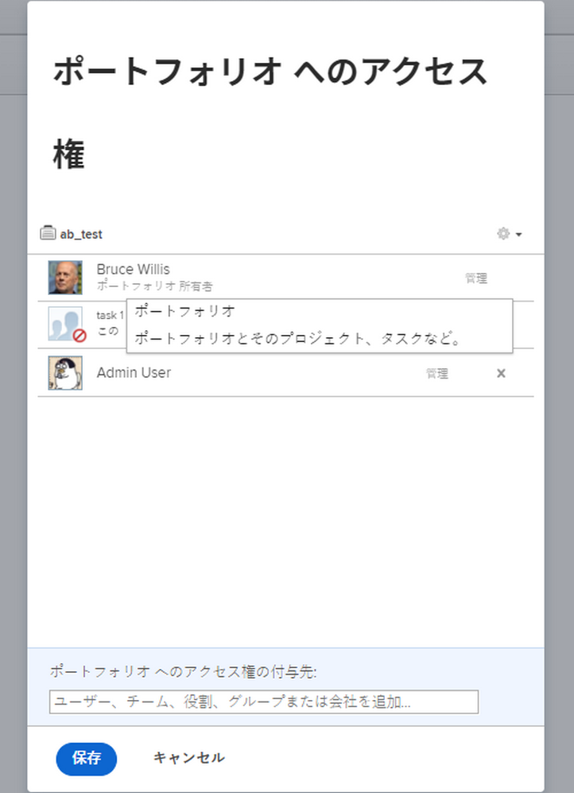
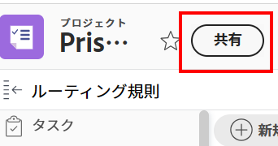

# オブジェクトから権限を削除

<!--Audited: 01/2024-->

共有にアクセスできるオブジェクトに対する他のユーザーの権限を削除できます。オブジェクトからの権限の削除は、共有可能なすべてのオブジェクトで同一です。

オブジェクトを共有する場合と同様の考慮事項は、オブジェクトから権限を削除する場合に適用されます。 詳しくは、 [オブジェクトの共有に関する考慮事項](../../workfront-basics/grant-and-request-access-to-objects/sharing-permissions-on-objects-overview.md#consider) 記事内 [オブジェクトに対する共有権限の概要](../../workfront-basics/grant-and-request-access-to-objects/sharing-permissions-on-objects-overview.md)

## アクセス要件

オブジェクトを共有するには、次の条件を満たしている必要があります。

<table style="table-layout:auto"> 
 <col> 
 <col> 
 <tbody> 
  <tr> 
   <td role="rowheader">Adobe Workfront プラン</td> 
   <td> 
任意 
 </td> 
  </tr> 
  <tr> 
   <td role="rowheader">Workfront ライセンス*</td> 
   <td> 
新しいライセンス：寄稿者以上

   または  
   
現在のライセンス：リクエスト以上

   
<b>メモ</b>

一部のオブジェクトは、Request よりも高いアクセス権が必要です。 

例えば、新しいライセンスの場合、コントリビューターは問題を共有できますが、プロジェクトを共有できるのは標準ライセンスユーザーのみです。

現在のライセンスでは、要求者が問題を共有できますが、プロジェクトを共有できるのは、ワーカーまたはプランナーのみです。
 
   </td> 
  </tr> 
  <tr> 
   <td role="rowheader">アクセスレベル設定</td> 
   <td> 
共有するオブジェクトに対する表示以上の権限
 </td> 
  </tr> 
  <tr> 
   <td role="rowheader">オブジェクト権限</td> 
   <td> 
共有するオブジェクトに対する表示またはそれ以上の権限
 
オブジェクトの継承された権限を削除する権限を管理
  </td> 
  </tr> 
 </tbody> 
</table>

*保有するプラン、ライセンスの種類、アクセス権を確認するには、Workfront管理者にお問い合わせください。 詳しくは、 [Workfrontドキュメントのアクセス要件](/help/quicksilver/administration-and-setup/add-users/access-levels-and-object-permissions/access-level-requirements-in-documentation.md).

## オブジェクトの共有リストからエンティティを削除 {#remove-entities-from-the-sharing-list-of-an-object}

オブジェクトの共有リストからエンティティ（ユーザー、ジョブの役割、チーム、グループ、会社）を削除できます。 これにより、オブジェクトに対する権限が削除されます。

1. 権限を削除するオブジェクトに移動します。

   共有可能なオブジェクトについて詳しくは、[オブジェクトに対する共有権限の概要](../../workfront-basics/grant-and-request-access-to-objects/sharing-permissions-on-objects-overview.md)を参照してください。

1. （条件付き）プログラム、ポートフォリオ、ドキュメントの場合は、次の操作を行います。

   1. 次をクリック： **その他** アイコン オブジェクト名の横にあるをクリックし、 **共有** または **共有。**

      

   1. ユーザー、チーム、グループ、会社、担当業務の横にある **x** をクリックし「オブジェクトアクセス」ボックスから削除します。

      

   1. Adobe Analytics の **&lt; ユーザー名 > 様のWorkfrontへのアクセスは、このページから削除されます** ドロップダウンメニューから、選択したオブジェクトからのみアクセスを削除するか、それに関連するすべての子オブジェクトからアクセスを削除するかを選択します。

1. （条件付き）プロジェクト、タスクおよびタスクの場合は、次の手順を実行します。

   1. クリック **共有** オブジェクト名の右側に配置します。

      
   1. オブジェクトから削除するユーザー、役割、チーム、グループ、または会社を検索します。
   1. クリック **削除**.
Adobe Analytics の **次の場所から &lt; ユーザ名 > を削除：** ドロップダウンメニューから、選択したオブジェクトからのみアクセスを削除するか、それに関連するすべての子オブジェクトからアクセスを削除するかを選択します。

      

   次のシナリオが存在します。

   * オブジェクトからのみエンティティを削除する場合、そのエンティティはオブジェクトに対する権限を失い、子オブジェクトに継承された権限を失います。以前に子項目に対して個別に権限を付与されていた場合、このオプションを選択すると、関連付けられているすべての子オブジェクトに対して同じ権限が保持されます。
   * オブジェクトとすべての子オブジェクトからエンティティを削除すると、各子オブジェクトに対して個別の権限が与えられていた場合でも、そのエンティティはオブジェクトおよびすべての子オブジェクトに対する権限を失います。

1. 「**保存**」をクリックします。

## 複数のオブジェクトから権限を一括で削除

リストでエンティティ（ユーザー、担当業務、チーム、グループ、会社）を一度に複数のオブジェクトから削除できます。

>[!NOTE]
>
>一括選択すると、選択したすべてのオブジェクトに対して、どのアクセスエンティティがあるかを表示することはできません。権限を削除する前に、選択したオブジェクトの共有から削除するエンティティを把握しておく必要があります。

1. 共有するオブジェクトのリストに移動します。

   共有可能なオブジェクトについて詳しくは、[オブジェクトに対する共有権限の概要](../../workfront-basics/grant-and-request-access-to-objects/sharing-permissions-on-objects-overview.md)を参照してください。

1. リスト内の複数のオブジェクトを選択し、リストの一番上にある&#x200B;**共有**&#x200B;アイコン  をクリックします。
1. アクセスを削除するユーザー、役割、チーム、グループ、または会社の名前を「**`<Object Name>` アクセス権を編集**」フィールドに入力します。
1. アクセスドロップダウンメニューから、「**アクセスなし**」を選択します。

   

1. `<User Name>` の Workfront アクセスがこのドロップダウンメニューから削除され、選択したオブジェクトからのみアクセスを削除するか、それに関連付けられているすべての子オブジェクトからアクセスを削除するかを選択します。\
   次のシナリオが存在します。

   * オブジェクトからのみエンティティを削除する場合、そのエンティティはオブジェクトに対する権限を失い、子オブジェクトに継承された権限を失います。以前に子項目に対して個別に権限を付与されていた場合、このオプションを選択すると、関連付けられているすべての子オブジェクトに対して同じ権限が保持されます。 
   * オブジェクトとすべての子オブジェクトからエンティティを削除すると、各子オブジェクトに対して個別の権限が与えられていた場合でも、そのエンティティはオブジェクトおよびすべての子オブジェクトに対する権限を失います。

   **例：**&#x200B;リストで選択したタスクに対する権限だけを削除するか、タスクに添付されたイシューとドキュメントに対する権限も削除するかを選択します。

   

1. （オプション）複数のオブジェクトに対する権限を一括で変更するには、選択したエンティティに対して別のレベルの共有を選択します。

   例えば、管理権限を持っている場合は、代わりに「貢献」または「表示」を選択します。

1. 「**保存**」をクリックします。

## 継承した権限を削除

継承された権限はオブジェクトから削除できます。これにより、親オブジェクトへのユーザーのアクセスに関係なく、所有者は子オブジェクトへのアクセス権を取得するユーザーを特定できます。

>[!IMPORTANT]
>
>継承された権限を削除できるのは、管理権限を持つユーザーのみです。

継承した権限を削除するには：

1. 管理権限を持つオブジェクトに移動します。例えば、タスクに移動します。
1. この記事の「[オブジェクトの共有リストからエンティティを削除する](#remove-entities-from-the-sharing-list-of-an-object)」で説明されているように、オブジェクトアクセスボックスに移動します。
1. 共有ボックスの&#x200B;**継承された権限**&#x200B;の隣にある **x** を選択し、共有ボックスに表示されているすべてのユーザーを削除します。

   

   これにより、親オブジェクト（プロジェクトなど）に対する権限を付与されたユーザーが、デフォルトでこのタスクに対する権限を持つことを防ぐことができます。タスクに対する権限を付与するには、タスクの共有リストで個々のエンティティをリストする必要があります。

   >[!TIP]
   >
   >継承された権限リストから個々のエンティティを削除することはできません。リストされているすべてのエンティティに対して、継承された権限のみ無効にできます。

1. 「**保存**」をクリックします。

## オブジェクトを非公開にする

システム全体でオブジェクトを共有している場合や、オブジェクトを公開して外部のユーザーと共有している場合は、システム全体または公開の権限を削除して、再び非公開にすることができます。 

オブジェクトをシステム全体または公開で使用できるようにする方法について詳しくは、[オブジェクトを共有](../../workfront-basics/grant-and-request-access-to-objects/share-an-object.md)を参照してください。

オブジェクトを非公開にするには、次の手順を実行します。

1. 非公開にするオブジェクトに移動します。\
   例えば、レポートに移動します。
1. 「**レポートのアクション**」、「**共有**」の順にクリックします。

   

1. 「**公開アクセスを削除**」をクリックして、レポートを表示する外部ユーザーのアクセス権を削除します。
1. 「**システム全体のアクセスを削除**」をクリックして、すべての Workfront ユーザーとの共有を停止します。
1. 「**保存**」をクリックします。
