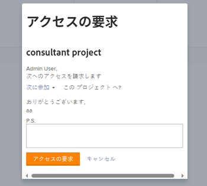
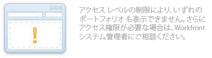
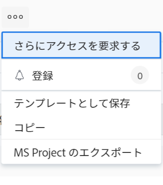

# オブジェクトへのアクセスのリクエスト

Adobe Workfrontでのオブジェクトの表示は、そのタイプのオブジェクトに対するアクセス権と、個々のオブジェクトに対する権限によって異なります。

>[!NOTE]
>
>この記事では、Adobe Workfront Scenario Planner のプランを除くすべてのオブジェクトに対して、権限を要求する方法について説明します。 プランへのアクセス要求の詳細は、 [シナリオ・プランナのプランへのアクセスを要求](../../scenario-planner/request-access-to-plan.md). 追加のライセンスが必要です。

Workfront管理者が、アクセスレベルの特定の種類のオブジェクトに対するアクセスを設定します。 詳しくは、 [アクセスレベルと権限の連携](../../administration-and-setup/add-users/access-levels-and-object-permissions/how-access-levels-permissions-work-together.md).

Workfront内の特定のオブジェクトに対する権限が必要な場合は、そのオブジェクトへのアクセス権をリクエストできます。 必要に応じて、Workfront管理者やオブジェクト所有者に電子メールを送信してニーズを説明する代わりに、Workfront内で追加のアクセス（または権限）をリクエストできます。

他のユーザーがオブジェクトへのリンクを共有している場合は、オブジェクトへの初期アクセスを要求できます。また、少なくとも表示する他のオブジェクトへのアクセスを要求することもできます。

例えば、プロジェクトに対する表示権限を持っているが、そのプロジェクトにタスクを追加する必要がある場合があります。 この場合、プロジェクトに Contribute 権限をリクエストできます。

## アクセス要件

<!--drafted for P&P:

<table style="table-layout:auto"> 
 <col> 
 <col> 
 <tbody> 
  <tr> 
   <td role="rowheader">Adobe Workfront plan*</td> 
   <td> 
Any 
 </td> 
  </tr> 
  <tr> 
   <td role="rowheader">Adobe Workfront license*</td> 
   <td> 
Current license: Standard
 
   Or
   
Legacy license: Work or higher
 
   </td> 
  </tr> 
  <tr> 
   <td role="rowheader">Access level configurations*</td> 
   <td> 
View access or higher to the objects you request permissions to
 
<b>NOTE</b> 
   
   If you still don't have access, ask your Workfront administrator if they set additional restrictions in your access level. For information on how a Workfront administrator can modify your access level, see <a href="../../administration-and-setup/add-users/configure-and-grant-access/create-modify-access-levels.md" class="MCXref xref">Create or modify custom access levels</a>.
 </td> 
  </tr> 
 </tbody> 
</table>

-->

オブジェクトを共有するには、次の条件を満たす必要があります。

<table style="table-layout:auto"> 
 <col> 
 <col> 
 <tbody> 
  <tr> 
   <td role="rowheader">Adobe Workfront plan*</td> 
   <td> 
任意 
 </td> 
  </tr> 
  <tr> 
   <td role="rowheader">Adobe Workfront license*</td> 
   <td> 
仕事以上
 </td> 
  </tr> 
  <tr> 
   <td role="rowheader">アクセスレベル設定*</td> 
   <td> 
権限をリクエストするオブジェクトへのアクセス権以上の表示
 
<b>メモ</b>

まだアクセス権がない場合は、Workfront管理者に、アクセスレベルに追加の制限を設定しているかどうかを問い合わせてください。 Workfront管理者がアクセスレベルを変更する方法について詳しくは、 <a href="../../administration-and-setup/add-users/configure-and-grant-access/create-modify-access-levels.md" class="MCXref xref">カスタムアクセスレベルの作成または変更</a>.
 </td>
</tr> 
 </tbody> 
</table>

&#42;保有するプラン、ライセンスの種類、アクセス権を確認するには、Workfront管理者に問い合わせてください。

## 標準の共有ルールを理解する

次の標準共有ルールは、Workfrontシステムでデフォルトオプションとして設定されているので、自動的に有効になります。

* タスクまたはイシューに割り当てられたユーザーは、Contribute にアクセスできます。
* プロジェクト、Portfolio、およびプログラムマネージャは、自分が所有するオブジェクトに対する管理アクセス権を持っています。
* 会話に含まれるユーザーは、会話が発生するオブジェクトに対してビューアクセス権を持ちます。
* 承認者として割り当てられたユーザーは、承認を待機しているオブジェクトに対して「表示」アクセス権を持ちます。
* ダッシュボードを共有すると、ダッシュボード上のすべてのレポートも同じユーザーに対する同じアクセス権で共有されます。
* オブジェクトの所有者は、管理者が定義したオブジェクトへのアクセス権を超えて、そのオブジェクトへのアクセス権を拡張することはできません。

## アクセスを要求

現在アクセスできないオブジェクトに対する初期アクセスを要求したり、アクセスが制限されたオブジェクトに対する追加アクセスを要求したりできます。

* [初期アクセスのリクエスト](#request-initial-access)
* [追加アクセスのリクエスト](#request-additional-access)

### 初期アクセスのリクエスト  {#request-initial-access}

オブジェクトにまだアクセスできず、リンクからそのオブジェクトに移動した場合は、情報を表示するアクセス権がないことを示す画面が表示されます。

オブジェクトへの最初のアクセスをリクエストするには：

1. クリック **アクセスを申請**.\
   The **アクセスを申請** ダイアログボックスが表示されます。

1. （条件付き）複数のユーザーが追加のアクセス権を付与するための適切なアクセス権を持っている場合、ユーザー名の横にドロップダウン矢印が表示されます。
1. ドロップダウンリストから、アクセス要求を受け取るユーザーを選択します。\
   ドロップダウンリストには 10 人のユーザーのみが表示されます。 リストはアルファベット順に並べ替えられます。\
   このドロップダウンメニューに表示されるユーザーの順序について詳しくは、  [「アクセスをリクエスト」および「アクセスをさらにリクエスト」ドロップダウンメニューの階層](#hierarchy-of-the-request-access-and-request-more-access-drop-down-menus).

1. ドロップダウンリストから、要求するアクセスのタイプを選択します。
1. （オプション） **PS.** フィールドに、追加のアクセスが必要な理由に関するメモをユーザーに指定します。

   

オブジェクトに対するアクセスレベル権限を持っていない状態で、リンクからそのオブジェクトにアクセスしようとすると、Workfrontの管理者に問い合わせるよう通知する画面が表示されます。

例えば、ポートフォリオにアクセスできないが、ポートフォリオへのリンクが与えられた場合、次のメッセージが表示されます。\

### 追加アクセスのリクエスト {#request-additional-access}

既にアクセスが制限されているオブジェクトへの追加アクセスをリクエストするには、次の手順に従います。

1. 追加のアクセスをリクエストするオブジェクトに移動します。

1. 次をクリック： **その他** プロジェクト名の右にあるメニューから、 **さらにアクセスをリクエスト**.

   

1. （条件付き）複数のユーザーが追加のアクセス権を付与するための適切なアクセス権を持っている場合、ユーザー名の横にドロップダウン矢印が表示されます。
1. ドロップダウンリストから、アクセス要求を受け取るユーザーを選択します。\
   ドロップダウンリストには 10 人のユーザーのみが表示されます。 リストはアルファベット順に並べ替えられます。\
   このドロップダウンメニューに表示されるユーザーの順序について詳しくは、  [「アクセスをリクエスト」および「アクセスをさらにリクエスト」ドロップダウンメニューの階層](#hierarchy-of-the-request-access-and-request-more-access-drop-down-menus).

1. ドロップダウンリストから、要求するアクセスレベルを選択します。
1. （オプション） **PS.** フィールドに、追加のアクセスが必要な理由に関するメモを指定します。
1. クリック **アクセスを申請**.\
   

## 「アクセスをリクエスト」および「アクセスをさらにリクエスト」ドロップダウンメニューの階層 {#hierarchy-of-the-request-access-and-request-more-access-drop-down-menus}

* [アクセスを申請ドロップダウンメニューおよびアクセスをさらに申請ドロップダウンメニューに表示されるユーザーの階層を理解します](#understand-the-hierarchy-of-users-listed-in-the-request-access-and-request-more-access-drop-down-menus)
* [オブジェクトの所有者の理解](#understand-the-owner-of-an-object)

### アクセスを申請ドロップダウンメニューおよびアクセスをさらに申請ドロップダウンメニューに表示されるユーザーの階層を理解します {#understand-the-hierarchy-of-users-listed-in-the-request-access-and-request-more-access-drop-down-menus}

オブジェクトに対して「Request Access」または「Request More Access」リストを設定する場合、Workfrontは、以下に説明するように、オブジェクトの共有で様々な役割を果たす最大 10 人のユーザーのリストを選択します。 これらのユーザーは、オブジェクトをリクエストするユーザーに、オブジェクトへのアクセス権を付与できます。\
その後、結果のリストは、名前で昇順に並べ替えられます。\
Workfrontの「Request Access」および「Request More Access」リストには、最大 10 人のユーザーが表示されます。

「アクセスをリクエスト」または「さらにアクセスをリクエスト」ドロップダウンメニュー内のユーザーの順序は、次のルールによって決まります。

* リストの最初のユーザーは、「所有者」オブジェクトです。詳しくは、 [オブジェクトの所有者の理解](#understand-the-owner-of-an-object).
* 次に、オブジェクトを個別に共有するユーザーがリストに表示されます。 これらはアルファベット順に表示されます。
* その後、必要なアクセス権を取得したユーザーが、チーム、グループまたは会社と共有してリストに表示されます。 これらはアルファベット順に表示されます。
* このリストが空の場合、Workfront管理者が追加され、常に誰かがアクセスを要求できるようになります。 これらはアルファベット順に表示されます。
* リスト内の各ユーザーは、オブジェクトへのリクエストされたアクセス権と、オブジェクトを共有するためのアクセス権を持っている必要があります。

### オブジェクトの所有者の理解 {#understand-the-owner-of-an-object}

オブジェクトの所有者は、次のように定義されます。

<table style="table-layout:auto"> 
 <col> 
 <col> 
 <thead> 
  <tr> 
   <th><strong>オブジェクト</strong> </th> 
   <th><strong>オブジェクトの所有者の定義</strong> </th> 
  </tr> 
 </thead> 
 <tbody> 
  <tr> 
   <td>プロジェクト</td> 
   <td>所有者は、プロジェクト所有者です。所有者が見つからない場合や、必要なアクセス権がない場合は、親ポートフォリオの所有者です。 
プロジェクトの作成者とは異なる人物である可能性があります。 
</td> 
  </tr> 
  <tr> 
   <td>タスク</td> 
   <td>所有者は、プライマリの担当者です。所有者が見つからない場合や、必要なアクセス権がない場合は、上で定義したように、タスクが存在するプロジェクトの所有者です。 
タスクの作成者とは異なる人物である可能性があります。 
</td> 
  </tr> 
  <tr> 
   <td>イシュー</td> 
   <td> 
所有者は、問題のプライマリ連絡先、または問題が見つからない場合や必要なアクセス権がない場合は、上述のように、問題が存在するプロジェクトの所有者です。 
 
問題の作成者とは異なる人物である可能性があります。 
 </td> 
  </tr> 
  <tr> 
   <td>ポートフォリオ</td> 
   <td>所有者はPortfolio所有者。 
彼らはポートフォリオの作成者と同じ人物ではないかもしれません。 
</td> 
  </tr> 
  <tr> 
   <td>ドキュメント</td> 
   <td>所有者は、ドキュメントの所有者（ドキュメントをアップロードしたユーザー）、またはドキュメントが見つからない場合や必要なアクセス権がない場合は、ドキュメントが存在するオブジェクトの所有者です。</td> 
  </tr> 
  <tr> 
   <td>レポートとダッシュボード</td> 
   <td>所有者は、作成者、レポートまたはダッシュボードです。 </td> 
  </tr> 
  <tr> 
   <td>カレンダー</td> 
   <td>所有者はカレンダーの作成者です。 すべてのユーザーには、デフォルトでカレンダーが割り当てられています。 彼らはそのカレンダーの所有者と見なされます。 </td> 
  </tr> 
  <tr> 
   <td>フィルター、ビュー、グループ化</td> 
   <td>フィルター、ビューまたはグループの所有者が作成者です。 </td> 
  </tr> 
  <tr data-mc-conditions="QuicksilverOrClassic.Quicksilver"> 
   <td>プラン </td> 
   <td> 
所有者は、計画の作成者です。 
 
追加のライセンスが必要です。 
 
Workfront Scenario Planner の詳細は、 <a href="../../scenario-planner/scenario-planner-overview.md" class="MCXref xref">シナリオプランナーの概要</a>.
 </td> 
  </tr> 
  <tr data-mc-conditions="QuicksilverOrClassic.Quicksilver"> 
   <td>目標</td> 
   <td> 
所有者は、所有者に指定されたユーザーです。 彼らは目標の創造者と同じ人物ではないかもしれません。 
 
追加のライセンスが必要です。 
 
Workfront目標について詳しくは、 <a href="../../workfront-goals/goal-management/wf-goals-overview.md" class="MCXref xref">Adobe Workfront目標の概要</a>. 
 </td> 
  </tr> 
 </tbody> 
</table>

