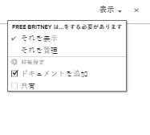
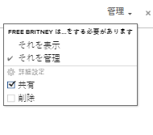

# ポートフォリオの共有

Adobe Workfront管理者は、アクセスレベルを割り当てる際に、ポートフォリオの表示や編集のアクセス権を付与できます。 ポートフォリオを編集するには、プランライセンスが必要です。 詳しくは、 [ポートフォリオへのアクセス権の付与](../../administration-and-setup/add-users/configure-and-grant-access/grant-access-portfolios.md).

また、付与されたアクセスレベルに加えて、特定のポートフォリオを共有できるユーザーから、特定のポートフォリオを表示または管理する権限を受け取ることもできます。 アクセスレベルと権限の詳細については、 [アクセスレベルと権限の連携](../../administration-and-setup/add-users/access-levels-and-object-permissions/how-access-levels-permissions-work-together.md).

権限は、Workfrontの 1 つの項目に固有で、その項目に対してユーザーが実行できるアクションを定義します。

## ポートフォリオの共有に関する考慮事項

以下の考慮事項に加えて、 [オブジェクトに対する共有権限の概要](../../workfront-basics/grant-and-request-access-to-objects/sharing-permissions-on-objects-overview.md).

>[!NOTE]
>
>Workfront管理者は、システム内のすべてのユーザーに対して、それらの項目の所有者にならずに、システム内の項目に対する権限を追加または削除できます。

* ポートフォリオの作成者には、デフォルトで、ポートフォリオに対する管理権限があります。
* ポートフォリオは、個別に共有することも、同時に複数のポートフォリオを共有することもできます。 ポートフォリオの共有は、Workfrontの他のオブジェクトの共有と同じです。 詳しくは、 [オブジェクトの共有](../../workfront-basics/grant-and-request-access-to-objects/share-an-object.md).

* ビューまたは管理権限の付与は、Portfolioに対してのみ可能です。

       

* ポートフォリオを共有する場合、デフォルトでは、ポートフォリオに関連付けられているすべての子オブジェクトに同じ権限が継承されます。

   Workfrontのオブジェクトの階層について詳しくは、 [Adobe Workfrontのオブジェクトについて](../../workfront-basics/navigate-workfront/workfront-navigation/understand-objects.md).

* 継承された権限は、Portfolioから削除できます。 オブジェクトから権限を削除する方法について詳しくは、 [オブジェクトから権限を削除](../../workfront-basics/grant-and-request-access-to-objects/remove-permissions-from-objects.md).

## Portfolio権限

次の表に、ユーザーに対し、ユーザーの表示または管理を許可する際に付与できるPortfolioを示します。

| **アクション** | **管理** | **ビュー** |
|---|---|---|
| Portfolioの詳細を編集 | ✓ |   |
| Portfolio | ✓ | ✓ |
| Portfolioの削除 | ✓ |   |
| カスタムフォームの添付 | ✓ |   |
| カスタムフィールドの編集 | ✓ |   |
| プログラムの追加または削除&#42; | ✓ |   |
| プロジェクトを追加または削除する&#42; | ✓ |   |
| プロジェクトを承認 | ✓ |   |
| Portfolio最適化&#42; | ✓ |   |
| ドキュメントフォルダーを追加&#42; | ✓ | ✓ |
| ドキュメントを追加 | ✓ | ✓ |
| 更新/コメント | ✓ | ✓ |
| 共有 | ✓ | ✓ |
| システム全体で共有 |   | ✓ |

*これらの権限は、プロジェクト、プログラム、ドキュメントなど、他のオブジェクトに対するアクセスレベルと権限によって制御されます。
