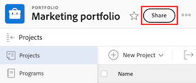
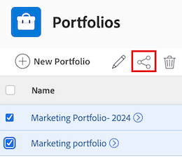

# ポートフォリオの共有

Adobe Workfront 管理者は、アクセスレベルを割り当てる際に、ユーザーにポートフォリオの表示または編集のアクセス権を付与できます。ポートフォリオの編集に対するアクセス権には、プランライセンスが必要です。詳しくは、[ポートフォリオへのアクセス権の付与](../../administration-and-setup/add-users/configure-and-grant-access/grant-access-portfolios.md)を参照してください。

付与されたアクセスレベルに加えて、ユーザーに特定のポートフォリオを共有できる別のユーザーから、そのポートフォリオを表示または管理する権限を受け取ることもできます。アクセスレベルと権限について詳しくは、[アクセスレベルと権限の連携方法](../../administration-and-setup/add-users/access-levels-and-object-permissions/how-access-levels-permissions-work-together.md)を参照してください。

権限は Workfront の 1 つの項目に固有で、その項目に対してユーザーが実行できるアクションが定義されます。

## アクセス要件

+++ 展開すると、この記事の機能のアクセス要件が表示されます。 

<table style="table-layout:auto"> 
 <col> 
 <col> 
 <tbody> 
  <tr> 
   <td role="rowheader">Adobe Workfront パッケージ</td> 
   <td> 
任意
 </td> 
  </tr> 
  <tr> 
   <td role="rowheader">Adobe Workfront プラン</td> 
   <td> 
標準
 
   
Work またはそれ以上
 
   </td> 
  </tr> 
  <tr> 
   <td role="rowheader">アクセスレベル設定</td> 
   <td> 
共有するオブジェクトに対する表示以上の権限
 </td> 
  </tr> 
  <tr> 
   <td role="rowheader">オブジェクト権限</td> 
   <td> 
共有するオブジェクトに対する表示またはそれ以上の権限
</td> 
  </tr> 
 </tbody> 
</table>

この表の情報について詳しくは、[Workfront ドキュメントのアクセス要件](/help/quicksilver/administration-and-setup/add-users/access-levels-and-object-permissions/access-level-requirements-in-documentation.md)を参照してください。

+++

## ポートフォリオの共有に関する考慮事項

以下の考慮事項に加えて、[オブジェクトの共有権限の概要](../../workfront-basics/grant-and-request-access-to-objects/sharing-permissions-on-objects-overview.md)も参照してください。

>[!NOTE]
>
>Workfront 管理者は、システム内のすべてのユーザーに対して、システム内のアイテムに対する権限の追加や削除を、それらのアイテムの所有者にならなくても行うことができます。

* ポートフォリオの作成者には、デフォルトで管理権限があります。
* ポートフォリオは個別に共有することも、複数のポートフォリオを同時に共有することもできます。ポートフォリオの共有は、Workfront で他のオブジェクトを共有することと同じです。詳しくは、[オブジェクトの共有](../../workfront-basics/grant-and-request-access-to-objects/share-an-object.md)を参照してください。

* 表示権限や管理権限の付与は、ポートフォリオに対してのみ可能です。

* ポートフォリオを共有する場合、デフォルトでは、ポートフォリオに関連付けられているすべての子オブジェクトに同じ権限が継承されます。

Workfront のオブジェクトの階層について詳しくは、[Adobe Workfront のオブジェクトについて](../../workfront-basics/navigate-workfront/workfront-navigation/understand-objects.md)を参照してください。

* ポートフォリオから継承された権限は削除できます。オブジェクトから権限を削除する方法について詳しくは、[オブジェクトからの権限の削除](../../workfront-basics/grant-and-request-access-to-objects/remove-permissions-from-objects.md)を参照してください。

## ポートフォリオの共有

{{step1-to-portfolios}}

1. **ポートフォリオ** ページで、共有するポートフォリオを選択します。 ポートフォリオページが開きます。

1. ポートフォリオ名の右側にある「**共有**」をクリックします。 **共有[Portfolio名]** ダイアログボックスが開きます。

   

1. 「**ポートフォリオに**&#x200B;へのアクセス権を付与」フィールドで、ポートフォリオを共有するユーザー、チーム、役割、グループ、会社、またはビジネスプロファイルの名前の入力を開始し、ドロップダウンリストに表示される名前をクリックします。

   >[!TIP]
   >
   >ポートフォリオを共有できるのは、アクティブなユーザー、チーム、役割、または会社のみです。

1. （オプション）「**アクセス可能なユーザー**」ドロップダウンを選択し、ポートフォリオのアクセスレベルを選択します。

   * **招待されたユーザーのみがアクセスできます：** ポートフォリオに招待されたユーザーのみがアクセスできます（デフォルト）。
   * **システム内のすべてのユーザーが表示できます**: システム内のすべてのユーザーは、招待なしでポートフォリオを表示できます。

1. ユーザー名の右側にあるドロップダウンをクリックし、このポートフォリオの権限レベルを選択します。

   * **表示**: ユーザーはポートフォリオをレビューして共有できます。
   * **管理**: ユーザーは、管理者権限を持たずにポートフォリオに完全にアクセスできます。管理者権限は、アクセスレベルで付与されます（すべての表示権限も含まれます）。

1. （オプション）付与した権限レベルの横にある「詳細オプション」アイコンをクリックして、ポートフォリオに対する特定の権限を設定します。

   

1. （オプション）リンクを使用してポートフォリオをすばやく共有するには、**リンクをコピー**&#x200B;をクリックし、受信者に転送します。

1. 「**保存**」をクリックします。

## ポートフォリオを一括共有

{{step1-to-portfolios}}

1. **ポートフォリオ** ページで、共有する各ポートフォリオの左側にあるボックスを選択し、ページの上部にある&#x200B;**共有** アイコン をクリックします。 共有モーダルが開きます。

   

1. 「**ポートフォリオに**&#x200B;へのアクセス権を付与」フィールドで、ポートフォリオを共有するユーザー、チーム、役割、グループ、会社、またはビジネスプロファイルの名前の入力を開始し、ドロップダウンリストに表示される名前をクリックします。

   >[!TIP]
   >
   >ポートフォリオを共有できるのは、アクティブなユーザー、チーム、役割、または会社のみです。

1. （オプション）「**アクセス可能なユーザー**」ドロップダウンを選択し、ポートフォリオのアクセスレベルを選択します。

   * **招待されたユーザーのみがアクセスできます：** ポートフォリオに招待されたユーザーのみがアクセスできます（デフォルト）。
   * **システム内のすべてのユーザーが表示できます**: システム内のすべてのユーザーは、招待なしでポートフォリオを表示できます。

1. ユーザー名の右側にあるドロップダウンをクリックし、ポートフォリオの権限レベルを選択します。

   * **表示**: ユーザーはポートフォリオをレビューして共有できます。
   * **管理**: ユーザーは、管理者権限を持たずにポートフォリオに完全にアクセスできます。管理者権限は、アクセスレベルで付与されます（すべての表示権限も含まれます）。

1. （オプション）付与した権限レベルの横にある「詳細オプション」アイコンをクリックして、ポートフォリオに対する特定の権限を設定します。

   

1. 「**保存**」をクリックします。

## ポートフォリオの権限

次の表には、ユーザーにポートフォリオの表示または管理を許可する際に付与できる権限が示されています。

| **アクション** | **管理** | **表示** |
| --- | --- | --- |
| ポートフォリオの詳細の編集 | ✓ | |
| ポートフォリオの表示 | ✓ | ✓ |
| ポートフォリオの削除 | ✓ | |
| カスタムフォームの添付 | ✓ | |
| カスタムフィールドの編集 | ✓ | |
| プログラムの追加または削除&#42; | ✓ | |
| プロジェクトの追加または削除&#42; | ✓ | |
| プロジェクトを承認 | ✓ | |
| ポートフォリオ最適化&#42; | ✓ | |
| ドキュメントフォルダーを追加&#42; | ✓ | ✓ |
| ドキュメントを追加 | ✓ | ✓ |
| アップデート／コメント | ✓ | ✓ |
| 共有 | ✓ | ✓ |
| システム全体で共有 | | ✓ |
| 請求率を編集&#42; | ✓ | |
| コスト率を編集&#42; | ✓ | |
| 一般財務を編集&#42; | ✓ | |
| 請求率の表示&#42; | ✓ | ✓ |
| コスト率の表示&#42; | ✓ | ✓ |
| 一般財務を表示&#42; | ✓ | ✓ |

*これらの権限は、プロジェクト、プログラム、ドキュメントなどの、他のオブジェクトに対するアクセスレベルと権限によって制御されます。
