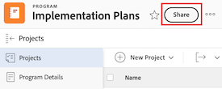

# プログラムの共有

Adobe Workfront 管理者は、アクセスレベルを割り当てる際に、プログラムの表示や編集のアクセス権を付与できます。プログラムの編集にアクセスするには、プランライセンスが必要です。詳しくは、[プログラムへのアクセス権の付与](../../administration-and-setup/add-users/configure-and-grant-access/grant-access-programs.md)を参照してください。

自分が付与されているアクセスレベルに加えて、自分と共有できるユーザーから特定のプログラムを表示または管理する権限を受け取ることもできます。アクセスレベルと権限について詳しくは、[アクセスレベルと権限の連携方法](../../administration-and-setup/add-users/access-levels-and-object-permissions/how-access-levels-permissions-work-together.md)を参照してください。

権限は、Workfront の各項目に固有で、ユーザーがその項目に対して実行できるアクションを定義します。

## アクセス要件

+++ 展開すると、この記事の機能のアクセス要件が表示されます。 

<table style="table-layout:auto"> 
 <col> 
 <col> 
 <tbody> 
  <tr> 
   <td role="rowheader">Adobe Workfront パッケージ</td> 
   <td> 
任意
 </td> 
  </tr> 
  <tr> 
   <td role="rowheader">Adobe Workfront プラン</td> 
   <td> 
標準
 
   
ワークまたはそれ以上
 
   </td> 
  </tr> 
  <tr> 
   <td role="rowheader">アクセスレベル設定</td> 
   <td> 
共有するオブジェクトに対する表示以上の権限
 </td> 
  </tr> 
  <tr> 
   <td role="rowheader">オブジェクト権限</td> 
   <td> 
共有するオブジェクトに対する表示またはそれ以上の権限
</td> 
  </tr> 
 </tbody> 
</table>

この表の情報について詳しくは、[Workfront ドキュメントのアクセス要件](/help/quicksilver/administration-and-setup/add-users/access-levels-and-object-permissions/access-level-requirements-in-documentation.md)を参照してください。

+++

## プログラムの共有に関する考慮事項

以下の考慮事項に加えて、[オブジェクトの共有権限の概要](../../workfront-basics/grant-and-request-access-to-objects/sharing-permissions-on-objects-overview.md)も参照してください。

>[!NOTE]
>
>Workfront 管理者は、システム内のすべてのユーザーに対して、システム内のアイテムに対する権限の追加や削除を、それらのアイテムの所有者にならなくても行うことができます。

* プログラムの作成者には、デフォルトで、プログラムに対する管理権限が付与されています。

* プログラムは個別に共有することも、一度に複数共有することもできます。

  Workfront でのアイテムの共有について詳しくは、[オブジェクトの共有](../../workfront-basics/grant-and-request-access-to-objects/share-an-object.md)を参照してください。

* プログラムに対する表示権限または管理権限のみを付与できます。

* プログラムを共有する場合、ユーザーは、デフォルトでは、プログラムに関連付けられているすべての子オブジェクトに同じ権限を継承します。

  Workfront のオブジェクトの階層について詳しくは、[Adobe Workfront のオブジェクトについて](../../workfront-basics/navigate-workfront/workfront-navigation/understand-objects.md)を参照してください。

* 継承された権限をプログラムから削除できます。オブジェクトから権限を削除する方法について詳しくは、[オブジェクトから権限を削除](../../workfront-basics/grant-and-request-access-to-objects/remove-permissions-from-objects.md)を参照してください。

## プログラムの共有

{{step1-to-programs}}

1. **プログラム** ページで、共有するプログラムを選択します。 プログラムページが開きます。

1. プログラム名の右側にある「**共有**」をクリックします。 **共有 [ プログラム名]** ダイアログボックスが開きます。

   

1. **プログラムへのアクセスの許可** フィールドに、プログラムを共有するユーザー、チーム、役割、グループ、または会社の名前の入力を開始し、ドロップダウンリストに表示される名前をクリックします。

   >[!TIP]
   >
   >プログラムを共有できるのは、アクティブユーザー、チーム、役割または会社のみです。

1. （オプション） **アクセスできるユーザー** ドロップダウンを選択し、プログラムのアクセスレベルを選択します。

   * **招待されたユーザーのみがアクセスできます：** プログラムに招待されたユーザーのみがプログラムにアクセスできます（デフォルト）。
   * **システム内のすべてのユーザーが表示可能**：システム内のすべてのユーザーは、招待なしにプログラムを表示できます。

1. ユーザー名の右側にあるドロップダウンをクリックし、このプログラムに対する権限レベルを選択します。

   * **表示**：ユーザーは、プログラムをレビューおよび共有できます。
   * **管理**：ユーザーは、管理者権限を持たずにプログラムへのフルアクセス権を持ちます。これは、アクセスレベルで付与されます（すべての表示権限も含まれます）。

1. （オプション）付与した権限レベルの横にある「詳細オプション」アイコンをクリックして、プログラムに特定の権限を設定します。

   

1. （省略可能） プログラムの子オブジェクトに対して継承されたアクセス許可を無効にするには、**継承されたアクセス許可** を使用してインラインで **無効** をクリックします。

1. （オプション）リンクを使用してプログラムをすばやく共有するには、[**リンクのコピー**] をクリックして受信者に転送します。

1. 「**保存**」をクリックします。

## プログラムを一括で共有

{{step1-to-programs}}

1. **プログラム** ページで、共有する各プログラムの左側にあるボックスを選択し、ページ上部にある **共有** アイコン  をクリックします。 共有モーダルが開きます。

   

1. **プログラムへのアクセスの許可** フィールドに、プログラムを共有するユーザー、チーム、役割、グループ、または会社の名前の入力を開始し、ドロップダウンリストに表示されたら名前をクリックします。

   >[!TIP]
   >
   >プログラムを共有できるのは、アクティブなユーザー、チーム、役割または会社のみです。

1. （オプション） **アクセスできるユーザー** ドロップダウンを選択し、プログラムのアクセスレベルを選択します。

   * **招待されたユーザーのみがアクセスできます：** プログラムに招待されたユーザーのみがプログラムにアクセスできます（デフォルト）。
   * **システム内のすべてのユーザーが表示可能**：システム内のすべてのユーザーは、招待なしにプログラムを表示できます。

1. ユーザー名の右側にあるドロップダウンをクリックし、プログラムのアクセス許可レベルを選択します。

   * **表示**：ユーザーは、プログラムを確認および共有できます。
   * **管理**：ユーザーは、管理者権限を持たないプログラムに対してフルアクセス権を持ちます。この権限はアクセスレベルで付与されます（すべての表示権限も含まれます）。

1. （オプション）付与した権限レベルの横にある「詳細オプション」アイコンをクリックして、プログラムに対する特定の権限を設定します。

   

1. 「**保存**」をクリックします。

## プログラム権限

次の表に、ユーザーがプログラムの表示や管理を許可する際に付与できる権限を示します。

| **アクション** | **管理** | **ビュー** |
|---|---|---|
| プログラムの詳細の編集 | ✓ |   |
| プログラムの表示 | ✓ | ✓ |
| プログラムの削除 | ✓ |   |
| カスタムフォームの添付 | ✓ |   |
| カスタムフィールドの編集 | ✓ |   |
| プロジェクトの追加または削除&#42; | ✓ |   |
| プロジェクトを承認 | ✓ |   |
| ドキュメントフォルダーを追加&#42; | ✓ | ✓ |
| ドキュメントを追加 | ✓ | ✓ |
| 更新／コメントの追加 | ✓ | ✓ |
| 共有 | ✓ | ✓ |
| システム全体で共有 |   | ✓ |

*これらの権限は、プロジェクトなどの他のオブジェクトに対するアクセスレベルおよび権限によって制御されます。

