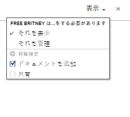

# プログラムの共有

Adobe Workfront 管理者は、アクセスレベルを割り当てる際に、プログラムの表示や編集のアクセス権を付与できます。プログラムの編集にアクセスするには、プランライセンスが必要です。詳しくは、[プログラムへのアクセス権の付与](../../administration-and-setup/add-users/configure-and-grant-access/grant-access-programs.md)を参照してください。

自分が付与されているアクセスレベルに加えて、自分と共有できるユーザーから特定のプログラムを表示または管理する権限を受け取ることもできます。アクセスレベルと権限について詳しくは、[アクセスレベルと権限の連携方法](../../administration-and-setup/add-users/access-levels-and-object-permissions/how-access-levels-permissions-work-together.md)を参照してください。

権限は、Workfront の各項目に固有で、ユーザーがその項目に対して実行できるアクションを定義します。

## プログラムの共有に関する考慮事項

以下の考慮事項に加えて、[オブジェクトの共有権限の概要](../../workfront-basics/grant-and-request-access-to-objects/sharing-permissions-on-objects-overview.md)も参照してください。

>[!NOTE]
>
>Workfront 管理者は、システム内のすべてのユーザーに対して、システム内のアイテムに対する権限の追加や削除を、それらのアイテムの所有者にならなくても行うことができます。

* プログラムの作成者には、デフォルトで、プログラムに対する管理権限が付与されています。

* プログラムは個別に共有することも、一度に複数共有することもできます。

  Workfront でのアイテムの共有について詳しくは、[オブジェクトの共有](../../workfront-basics/grant-and-request-access-to-objects/share-an-object.md)を参照してください。

* プログラムに対する表示または管理の権限のみ付与できます。

      

* プログラムを共有する場合、ユーザーは、デフォルトでは、プログラムに関連付けられているすべての子オブジェクトに同じ権限を継承します。

  Workfront のオブジェクトの階層について詳しくは、[Adobe Workfront のオブジェクトについて](../../workfront-basics/navigate-workfront/workfront-navigation/understand-objects.md)を参照してください。

* 継承された権限をプログラムから削除できます。オブジェクトから権限を削除する方法について詳しくは、[オブジェクトから権限を削除](../../workfront-basics/grant-and-request-access-to-objects/remove-permissions-from-objects.md)を参照してください。

## プログラム権限

次の表に、ユーザーがプログラムの表示や管理を許可する際に付与できる権限を示します。

| **アクション** | **管理** | **ビュー** |
|---|---|---|
| プログラムの詳細の編集 | ✓ |   |
| プログラムの表示 | ✓ | ✓ |
| プログラムの削除 | ✓ |   |
| カスタムフォームの添付 | ✓ |   |
| カスタムフィールドの編集 | ✓ |   |
| プロジェクトの追加または削除&#42; | ✓ |   |
| プロジェクトを承認 | ✓ |   |
| ドキュメントフォルダーの追加&#42; | ✓ | ✓ |
| ドキュメントを追加 | ✓ | ✓ |
| 更新／コメントの追加 | ✓ | ✓ |
| 共有 | ✓ | ✓ |
| システム全体で共有 |   | ✓ |

*これらの権限は、プロジェクトなどの他のオブジェクトに対するアクセスレベルおよび権限によって制御されます。 
