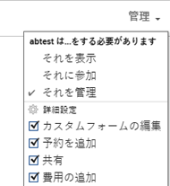
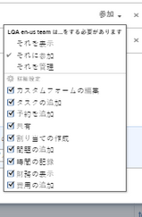
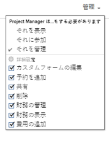
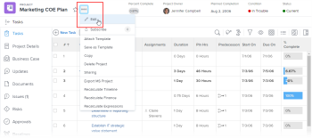

# Adobe Workfrontでプロジェクトを共有する

<!-- Audited: 1/2024 -->

Adobe Workfront管理者は、アクセスレベルを割り当てる際に、プロジェクトの表示や編集のアクセス権を付与できます。 詳しくは、 [プロジェクトへのアクセス権の付与](../../administration-and-setup/add-users/configure-and-grant-access/grant-access-projects.md).

ユーザーに付与されるアクセスレベルに加えて、共有する特定のプロジェクトを表示、投稿、管理する権限をユーザーに付与することもできます。

権限は、Workfrontの 1 つの項目に固有で、その項目に対して実行できるアクションを定義します。

## プロジェクトの共有に関する考慮事項

以下の考慮事項に加えて、 [オブジェクトに対する共有権限の概要](../../workfront-basics/grant-and-request-access-to-objects/sharing-permissions-on-objects-overview.md).

* デフォルトでは、プロジェクトの作成者にはプロジェクトを管理する権限があり、プロジェクト所有者としても指定されます。 プロジェクトが別の所有者に割り当てられている場合、そのユーザーはプロジェクトを管理する権限も持ちます。 プロジェクト作成者（または所有者）がプロジェクトを他のユーザーと共有する場合、ユーザーに対して、プロジェクトでの作業中に実行できる操作を制御するための特定の権限を付与します。

  ただし、プロジェクト所有者が Planner ライセンスを持っていない場合、プロジェクトを管理するためのフルアクセス権は持ちません。 プロジェクトを管理する権限を持つのは、プランライセンスを持つユーザーのみです。 詳しくは、 [アクセスレベルと権限の連携](../../administration-and-setup/add-users/access-levels-and-object-permissions/how-access-levels-permissions-work-together.md).

* プロジェクトは個別に共有することも、一度に複数共有することもできます。 プロジェクトの共有は、他のオブジェクトの共有と同じです。 Workfrontでの項目の共有について詳しくは、 [オブジェクトの共有](../../workfront-basics/grant-and-request-access-to-objects/share-an-object.md).
* プロジェクトに次の権限を付与できます。

   * 表示
   * 管理
   * 貢献

       

* プロジェクトを共有する場合、特に指定のない限り、すべてのタスク、問題およびドキュメントは同じ権限を継承します。

  プロジェクトに対するユーザーの権限に基づく、プロジェクトでのタスクへのアクセスおよび問題の管理について詳しくは、  記事のセクション [プロジェクトを編集](../../manage-work/projects/manage-projects/edit-projects.md).

  Workfrontの管理者は、ドキュメントがユーザーのアクセスレベルの上位のオブジェクトから権限を継承するかどうかを指定できます。 ドキュメントに対する継承された権限の制限について詳しくは、 [カスタムアクセスレベルの作成または変更](../../administration-and-setup/add-users/configure-and-grant-access/create-modify-access-levels.md).

* 子オブジェクトが継承しないように、継承された権限をプロジェクトから削除できます。 継承された権限をオブジェクトから削除する方法について詳しくは、 [オブジェクトから権限を削除](../../workfront-basics/grant-and-request-access-to-objects/remove-permissions-from-objects.md).

## プロジェクトを共有する方法 {#ways-to-share-a-project}

プロジェクトは次の方法で共有できます。

* 次のいずれかの操作を行って、手動で操作します。

   * プロジェクトチームにユーザーを追加する。 プロジェクトチームにユーザーを追加すると、プロジェクトに対する表示権限が自動的に取得されます。\
     プロジェクトチームにユーザーを追加する方法の詳細については、 [プロジェクトチームの概要](../../manage-work/projects/planning-a-project/project-team-overview.md).
   * を使用する場合は、プロジェクトを個別に、または一括で共有する。 **共有** オプション。

     プロジェクトの共有は、Adobe Workfrontで他のすべてのオブジェクトを共有する場合と似ています。

     Workfrontでのオブジェクトの共有について詳しくは、 [オブジェクトの共有](../../workfront-basics/grant-and-request-access-to-objects/share-an-object.md).

* 次のいずれかの操作を行うと、自動的に次の操作が行われます。

   * プロジェクトをに配置する **Portfolio** または **プログラム** それは既に他の人と共有されています。 ユーザーは、ポートフォリオやプログラムに対して持っているのと同じ権限をプロジェクトに対して取得します。\
     プロジェクトを **Portfolio**&#x200B;を参照してください。 [ポートフォリオへのプロジェクトの追加](../../manage-work/portfolios/create-and-manage-portfolios/add-projects-to-portfolios.md).\
     プロジェクトを **プログラム**&#x200B;を参照してください。 [プログラムにプロジェクトを追加する](../../manage-work/portfolios/create-and-manage-programs/add-project-to-program.md).

     オブジェクトに対する継承された権限の表示について詳しくは、 [オブジェクトの継承された権限の表示](../../workfront-basics/grant-and-request-access-to-objects/view-inherited-permissions-on-objects.md).

   * プロジェクトの作成に使用するテンプレートで、エンティティをプロジェクト共有に追加します。 テンプレートからプロジェクトを共有する方法については、 [テンプレートの共有](../../workfront-basics/grant-and-request-access-to-objects/share-a-template.md).
   * プロジェクトアクセステンプレートを定義します。

     プロジェクトアクセステンプレートを定義するには、 [オブジェクトの共有](../../workfront-basics/grant-and-request-access-to-objects/share-an-object.md).

     >[!TIP]
     >
     >テンプレートを添付または保存する際に、テンプレートプロジェクト共有ルールをクリアできます。

   * プロジェクトの編集と定義 **誰かがこのプロジェクトへのアクセス権を与えられたとき** 設定。 詳しくは、 [プロジェクトを編集](../../manage-work/projects/manage-projects/edit-projects.md).

<!--

(NOTE: drafted because I created new article and linked it above) 

To view what users have inherited the access on the project from a portfolio or a program, do the following:

<ol style="list-style-type: lower-alpha;">
<li value="1">Go to a project whose sharing permissions you want to view. </li>
<li value="2"> Click the <strong>More</strong> menu , then click <strong>Sharing</strong>. </li>
<li value="3"> 
Expand the <strong>Inherited Permissions</strong> list. 
 
This list displays the names of users that have access to either the portfolio or the program that the project belongs to and also have permissions to the project. 
 
  
 </li>
</ol>

-->

<!--
<ol data-mc-conditions="QuicksilverOrClassic.Draft mode">
<li value="1">Go to a project whose sharing permissions you want for all projects you create from scratch. (NOTE: drafted because linked above)&nbsp;</li>
<li value="2"> Click the More menu, then click <strong>Sharing</strong>. </li>
<li value="3"> 
In the Project Access box that displays, near the upper-right corner, click the gear icon , then click <strong>Set as my project access template</strong>.
 
The entities that are granted permissions on the selected project have the same permissions for all the projects you create from scratch in the future.
 
 The project access template overrides the sharing defaults granted to you by the Workfront administrator in your Access Level. For more information about specifying sharing defaults for projects in the Access Level, see <a href="../../administration-and-setup/add-users/configure-and-grant-access/grant-access-projects.md" class="MCXref xref">Grant access to projects</a>.
 </li>
<li value="4">Click <strong>Save</strong>.</li>
</ol>
-->

## 異なるライセンスタイプの制限

* Worker ライセンスを持つユーザーには、プロジェクトを管理する権限がありません。 ワーカーの場合、最も高い共有権限は Contribute です。
* リクエストライセンスを持つユーザーは、プロジェクト情報を表示できますが、プロジェクトへのアクセスは制限されています。
* プロジェクトのステータス変更の例外は、表示または投稿の権限を持つユーザーが承認プロセスに含まれている場合に発生します。 プロジェクトを承認し、プロジェクトのステータスを変更できますが、ステータスは、承認または却下の事前定義済みのステータスです。
* プロジェクトをコピーするには、ユーザーがアクセスレベルでプロジェクトを作成するアクセス権も持っている必要があります。

<!--

<h2>Configure default permissions for a project</h2>

(NOTE: drafted because I added one more way to automatically share the project above in the bullet list and linked it to Edit Projects) 

As a project owner, you can configure the default permissions for View, Manage, and Contribute access that are used when sharing&nbsp;the project with others. When users share a project, the default permissions are used. Users can then adjust the default permissions when sharing the project, as described in <a title="Project Permissions" href="#ways-to-share-a-project" class="MCXref xref">Ways to share a project</a>. 

To configure the default permissions that are included with each access level:

<ol>
<li value="1">Go to the project where you want to set the default permissions.</li>
<li value="2"> 
Click the More menu , then click <strong>Edit</strong>. 
 
  
 </li>
<li value="3">Click <strong>Access</strong> in the list on the left.</li>
<li value="4"> 
In the <strong>When someone is given access to this PROJECT</strong> section, select permissions that you want to be available when users are given access to the project via sharing.
 
Ensure that any permissions that you want to include in the selected access level are selected and deselect any permissions that you do not want to include in the selected permissions level.
 
To view which permissions are available for each level, see&nbsp;<a title="Project Permissions" href="#Understanding_Project_Permissions" class="MCXref xref">Share a project in Adobe Workfront</a>.
 <note type="note">
The
<strong>Delete</strong> access in the
<strong>Manage</strong> permission level determines whether users can&nbsp;delete the project itself. Users with
<strong>Manage</strong> access to the project can delete tasks and issues within the project regardless of whether this option is selected, if they have
<strong>Manage</strong> permissions to the tasks and issues.&nbsp;
</note> </li>
<li value="5">Click <strong>Save Changes</strong>.</li>
</ol>

-->

## プロジェクト権限オプション

次の表に、ユーザーがプロジェクトを共有する際に付与できる権限を示します。 ユーザーがライセンスに基づいて取得するアクセスについて詳しくは、 [プロジェクトへのアクセス権の付与](../../administration-and-setup/add-users/configure-and-grant-access/grant-access-projects.md).

<table border="1" cellspacing="15" cellpadding="1"> 
 <col> 
 <col> 
 <col> 
 <col> 
 <thead> 
  <tr> 
   <th> 
<strong>アクション</strong> 
 </th> 
   <th> 
<strong>管理</strong> 
 </th> 
   <th> 
<strong>Contribute</strong> 
 </th> 
   <th> 
<strong>ビュー</strong> 
 </th> 
  </tr> 
 </thead> 
 <tbody> 
  <tr> 
   <td> 
カスタムフォームを追加
 </td> 
   <td> 
✓
 </td> 
   <td> 
 
 </td> 
   <td> 
 
 </td> 
  </tr> 
  <tr> 
   <td> 
カスタムフィールドの更新
 </td> 
   <td> 
✓
 </td> 
   <td> 
✓
 </td> 
   <td> 
 
 </td> 
  </tr> 
  <tr> 
   <td> 
承認プロセスの追加
 </td> 
   <td> 
✓
 </td> 
   <td> 
 
 </td> 
   <td> 
 
 </td> 
  </tr> 
  <tr> 
   <td> 
プロジェクトを承認
 </td> 
   <td> 
✓
 </td> 
   <td> 
✓
 </td> 
   <td> 
✓
 </td> 
  </tr> 
  <tr> 
   <td> 
承認時間
 </td> 
   <td> 
✓
 </td> 
   <td> 
✓ 
 </td> 
   <td> 
 
 </td> 
  </tr> 
  <tr> 
   <td> 
プロジェクトを作成
 </td> 
   <td> 
✓
 </td> 
   <td> 
 
 </td> 
   <td> 
 
 </td> 
  </tr> 
  <tr> 
   <td> 
ドキュメントを追加
 </td> 
   <td> 
✓
 </td> 
   <td> 
✓
 </td> 
   <td> 
✓
 </td> 
  </tr> 
  <tr> 
   <td> 
問題を追加
 </td> 
   <td> 
✓
 </td> 
   <td> 
✓
 </td> 
   <td> 
✓
 </td> 
  </tr> 
  <tr> 
   <td> 
タスクを追加
 </td> 
   <td> 
✓
 </td> 
   <td> 
✓
 </td> 
   <td> 
 
 </td> 
  </tr> 
  <tr> 
   <td> 
プロジェクトのコピー
 </td> 
   <td> 
 
 </td> 
   <td> 
✓
 </td> 
   <td> 
 
 </td> 
  </tr> 
  <tr> 
   <td> 
プロジェクトの削除
 </td> 
   <td> 
✓
 </td> 
   <td> 
 
 </td> 
   <td> 
 
 </td> 
  </tr> 
  <tr> 
   <td> 
計画日の変更
 </td> 
   <td> 
✓
 </td> 
   <td> 
 
 </td> 
   <td> 
 
 </td> 
  </tr> 
  <tr> 
   <td> 
プロジェクトを共有
 </td> 
   <td> 
✓
 </td> 
   <td> 
✓
 </td> 
   <td> 
✓
 </td> 
  </tr> 
  <tr> 
   <td> 
システム全体で共有
 </td> 
   <td> 
 
 </td> 
   <td> 
 
 </td> 
   <td> 
✓
 </td> 
  </tr> 
  <tr> 
   <td> 
プロジェクトの表示
 </td> 
   <td> 
✓
 </td> 
   <td> 
✓
 </td> 
   <td> 
✓
 </td> 
  </tr> 
  <tr> 
   <td> 
更新/コメント
 </td> 
   <td> 
✓
 </td> 
   <td> 
✓
 </td> 
   <td> 
✓
 </td> 
  </tr> 
  <tr> 
   <td> 
状態変更
 </td> 
   <td> 
✓
 </td> 
   <td> 
 
 </td> 
   <td> 
 
 </td> 
  </tr> 
  <tr> 
   <td> 
時間の記録
 </td> 
   <td> 
✓
 </td> 
   <td> 
✓
 </td> 
   <td> 
 
 </td> 
  </tr> 
  <tr> 
   <td> 
割り当てを編集
 </td> 
   <td> 
✓
 </td> 
   <td> 
✓
 </td> 
   <td> 
 
 </td> 
  </tr> 
  <tr> 
   <td> 
ベースラインを管理
 </td> 
   <td> 
✓
 </td> 
   <td> 
 
 </td> 
   <td> 
 
 </td> 
  </tr> 
  <tr> 
   <td> 
リスク管理*
 </td> 
   <td> 
✓
 </td> 
   <td> 
 
 </td> 
   <td> 
 
 </td> 
  </tr> 
  <tr> 
   <td> 
金融の管理*
 </td> 
   <td> 
✓
 </td> 
   <td> 
 
 </td> 
   <td> 
 
 </td> 
  </tr> 
  <tr> 
   <td> 
費用の追加/編集*
 </td> 
   <td> 
✓
 </td> 
   <td> 
✓
 </td> 
   <td> 
 
 </td> 
  </tr> 
  <tr> 
   <td> 
金融を表示*
 </td> 
   <td> 
✓
 </td> 
   <td> 
✓
 </td> 
   <td> 
✓
 </td> 
  </tr> 
  <tr> 
   <td> 
テンプレートの添付
 </td> 
   <td> 
✓
 </td> 
   <td> 
 
 </td> 
   <td> 
 
 </td> 
  </tr> 
  <tr> 
   <td> 
テンプレートとして保存
 </td> 
   <td> 
✓
 </td> 
   <td> 
✓
 </td> 
   <td> 
✓
 </td> 
  </tr> 
  <tr> 
   <td> 
ビジネスケースの追加/編集
 </td> 
   <td> 
✓
 </td> 
   <td> 
 
 </td> 
   <td> 
 
 </td> 
  </tr> 
  <tr> 
   <td> 
プロジェクトの詳細を編集
 </td> 
   <td> 
✓
 </td> 
   <td> 
 
 </td> 
   <td> 
 
 </td> 
  </tr> 
  <tr> 
   <td> 
スタッフの編集
 </td> 
   <td> 
✓
 </td> 
   <td> 
 
 </td> 
   <td> 
 
 </td> 
  </tr> 
  <tr> 
   <td> 
MS Project にエクスポートする
 </td> 
   <td> 
✓
 </td> 
   <td> 
✓
 </td> 
   <td> 
✓
 </td> 
  </tr> 
  <tr> 
   <td> 
財務/タイムラインを再計算*
 </td> 
   <td> 
✓
 </td> 
   <td> 
 
 </td> 
   <td> 
 
 </td> 
  </tr> 
  <tr> 
   <td> 
キューのプロパティを設定
 </td> 
   <td> 
✓
 </td> 
   <td> 
 
 </td> 
   <td> 
  
 </td> 
  </tr> 
  <tr> 
   <td> 
リストでプロジェクトを一括編集
 </td> 
   <td> 
✓
 </td> 
   <td> </td> 
   <td> </td> 
  </tr> 
 </tbody> 
</table>

&#42;財務データにアクセスできないユーザーは、プロジェクトに対する編集アクセス権を持っていても、プロジェクトのリスクや財政を管理できません。 財務データへのアクセスについて詳しくは、 [財務データへのアクセス権の付与](../../administration-and-setup/add-users/configure-and-grant-access/grant-access-financial.md).
