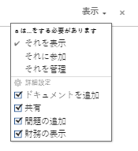
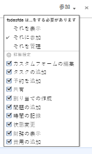
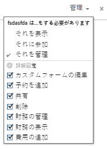

# タスクの共有

Adobe Workfront 管理者は、アクセスレベルを割り当てる際に、タスクの表示や編集のアクセス権を付与できます。タスクへのアクセス権の付与について詳しくは、[タスクへのアクセス権の付与](../../administration-and-setup/add-users/configure-and-grant-access/grant-access-tasks.md)を参照してください。

ユーザーに付与されるアクセスレベルに加えて、共有するアクセス権を持つ特定のタスクを表示、参加または管理する権限をユーザーに付与することもできます。

権限は、Workfrontの 1 つの項目に固有で、その項目に対して実行できるアクションを定義します。

## タスクを共有する際の考慮事項

以下の考慮事項に加えて、[オブジェクトに対する権限の共有の概要](../../workfront-basics/grant-and-request-access-to-objects/sharing-permissions-on-objects-overview.md)を参照してください。

* タスクの作成者には、デフォルトでタスクの管理権限が付与されています。
* タスクは個別に共有することも、一度に複数のタスクを一括して共有することもできます。\
  タスクの共有は、他のオブジェクトの共有と同じです。Workfront での項目の共有について詳しくは、[オブジェクトの共有](../../workfront-basics/grant-and-request-access-to-objects/share-an-object.md)を参照してください。

* タスクに次の権限を付与できます。

   * 表示
   * 管理
   * 参加\
       

* タスクを共有する場合、デフォルトでは、ユーザーはタスクに関連付けられたすべての子オブジェクトに対して同じ権限を継承します。例えば、タスクに添付された子タスク、イシューおよびドキュメントに対して同じ権限を継承します。\
  Workfront のオブジェクトの階層について詳しくは、[Adobe Workfront のオブジェクトについて](../../workfront-basics/navigate-workfront/workfront-navigation/understand-objects.md)を参照してください。

  Workfront 管理者は、ドキュメントがユーザーのアクセスレベルの上位のオブジェクトから権限を継承するかどうかを指定できます。ドキュメントに対する継承された権限の制限について詳しくは、[カスタムアクセスレベルの作成または変更](../../administration-and-setup/add-users/configure-and-grant-access/create-modify-access-levels.md)を参照してください。

* タスクから継承された権限を削除できます。\
  継承された権限をオブジェクトから削除する方法について詳しくは、[オブジェクトから権限の削除](../../workfront-basics/grant-and-request-access-to-objects/remove-permissions-from-objects.md)を参照してください。

## タスクの共有方法

タスクは次の方法で共有できます。

* 手動、個別または一括。タスクを手動で共有することは、Workfront で他のオブジェクトを共有する場合と似ています。

  Workfront でのオブジェクトの共有について詳しくは、[オブジェクトの共有](../../workfront-basics/grant-and-request-access-to-objects/share-an-object.md)を参照してください。

* 次の操作を実行すると、自動的に次の操作が行われます。

   * プロジェクト、プログラムまたはポートフォリオなど、タスクの任意の親オブジェクトに対する権限を指定します。タスクは、親オブジェクトから権限を継承します。オブジェクトに対する継承された権限の表示について詳しくは、[オブジェクトの継承された権限の表示](../../workfront-basics/grant-and-request-access-to-objects/view-inherited-permissions-on-objects.md)を参照してください。
   * タスクが存在するプロジェクトの作成に使用するテンプレートで、プロジェクト共有にエンティティを追加します。テンプレートからのプロジェクトの共有について詳しくは、[テンプレートの共有](../../workfront-basics/grant-and-request-access-to-objects/share-a-template.md)を参照してください。

   * プロジェクトの編集時に、プロジェクト内のすべてのタスクに対する権限を指定します。プロジェクトに対するユーザーの権限に基づいて、プロジェクト上のタスクへのアクセスを管理する方法について詳しくは、[プロジェクトの編集](../../manage-work/projects/manage-projects/edit-projects.md)の記事の  の節を参照してください。

  >[!TIP]
  >
  >ユーザーがプロジェクト上のタスクに割り当てられる際に、どのタスク権限を持たせるかを指定しない場合、ユーザーはデフォルトで、プロジェクトと同じ権限が付与されます。

## タスク権限

次の表に、ユーザーにタスクの表示、参加または管理を許可する際にユーザーに付与できる権限を示します。

<table border="2" cellspacing="15" cellpadding="1"> 
 <col> 
 <col> 
 <col> 
 <col> 
 <thead> 
  <tr> 
   <th><strong>アクション</strong> </th> 
   <th><strong>管理</strong> </th> 
   <th><strong>参加</strong> </th> 
   <th><strong>表示</strong> </th> 
  </tr> 
 </thead> 
 <tbody> 
  <tr> 
   <td scope="row">タスクを追加</td> 
   <td>✓</td> 
   <td>✓</td> 
   <td> </td> 
  </tr> 
  <tr> 
   <td scope="row">先行タスクの追加</td> 
   <td>✓</td> 
   <td> </td> 
   <td> </td> 
  </tr> 
  <tr> 
   <td scope="row">イシューを追加</td> 
   <td>✓</td> 
   <td>✓</td> 
   <td>✓</td> 
  </tr> 
  <tr> 
   <td scope="row">タスクを削除</td> 
   <td>✓</td> 
   <td> </td> 
   <td> </td> 
  </tr> 
  <tr> 
   <td scope="row"> 
一般タスクの編集 
 </td> 
   <td>✓</td> 
   <td>✓</td> 
   <td> </td> 
  </tr> 
  <tr> 
   <td scope="row">タスクステータスの変更</td> 
   <td>✓</td> 
   <td>✓</td> 
   <td> </td> 
  </tr> 
  <tr> 
   <td scope="row">タスク制約の編集</td> 
   <td>✓</td> 
   <td> </td> 
   <td> </td> 
  </tr> 
  <tr> 
   <td scope="row">タスクの表示</td> 
   <td>✓</td> 
   <td>✓</td> 
   <td>✓</td> 
  </tr> 
  <tr> 
   <td scope="row">ドキュメントを追加</td> 
   <td>✓</td> 
   <td>✓</td> 
   <td>✓</td> 
  </tr> 
  <tr> 
   <td scope="row">タスクのコピー*</td> 
   <td>✓</td> 
   <td>✓</td> 
   <td>✓</td> 
  </tr> 
  <tr> 
   <td scope="row">タスクの移動*</td> 
   <td>✓</td> 
   <td> </td> 
   <td> </td> 
  </tr> 
  <tr> 
   <td scope="row">時間の記録</td> 
   <td>✓</td> 
   <td>✓</td> 
   <td> </td> 
  </tr> 
  <tr> 
   <td scope="row">予定日の変更</td> 
   <td>✓</td> 
   <td> </td> 
   <td> </td> 
  </tr> 
  <tr> 
   <td scope="row">割り当ての受け入れ</td> 
   <td>✓</td> 
   <td>✓</td> 
   <td> </td> 
  </tr> 
  <tr> 
   <td scope="row">割り当て</td> 
   <td>✓</td> 
   <td>✓</td> 
   <td> </td> 
  </tr> 
  <tr> 
   <td scope="row">カスタムフォームを添付</td> 
   <td>✓</td> 
   <td> </td> 
   <td> </td> 
  </tr> 
  <tr> 
   <td scope="row">カスタムフィールドを編集</td> 
   <td>✓</td> 
   <td>✓</td> 
   <td> </td> 
  </tr> 
  <tr> 
   <td scope="row">承認プロセスを作成</td> 
   <td>✓</td> 
   <td> </td> 
   <td> </td> 
  </tr> 
  <tr> 
   <td scope="row">タスクを承認</td> 
   <td>✓</td> 
   <td>✓</td> 
   <td>✓</td> 
  </tr> 
  <tr> 
   <td scope="row">財務情報を編集*</td> 
   <td>✓</td> 
   <td> </td> 
   <td> </td> 
  </tr> 
  <tr> 
   <td scope="row">費用を追加／編集</td> 
   <td>✓</td> 
   <td>✓</td> 
   <td> </td> 
  </tr> 
  <tr> 
   <td scope="row">財務情報を表示</td> 
   <td>✓</td> 
   <td>✓</td> 
   <td>✓</td> 
  </tr> 
  <tr> 
   <td scope="row">アップデート／コメント</td> 
   <td>✓</td> 
   <td>✓</td> 
   <td>✓</td> 
  </tr> 
  <tr> 
   <td scope="row">共有</td> 
   <td>✓</td> 
   <td>✓</td> 
   <td>✓</td> 
  </tr> 
  <tr> 
   <td scope="row">システム全体で共有</td> 
   <td> </td> 
   <td> </td> 
   <td>✓</td> 
  </tr> 
 </tbody> 
</table>

&#42;プロジェクトのアクセスレベルと権限で制御されます。
