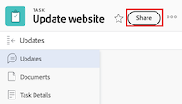
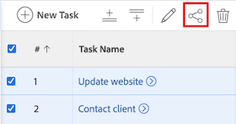

# タスクの共有

このページでハイライト表示されている情報は、まだ一般に利用できない機能を示します。プレビューサンドボックス環境でのみ使用できます。

Adobe Workfront 管理者は、アクセスレベルを割り当てる際に、タスクの表示や編集のアクセス権を付与できます。タスクへのアクセス権の付与について詳しくは、[タスクへのアクセス権の付与](../../administration-and-setup/add-users/configure-and-grant-access/grant-access-tasks.md)を参照してください。

ユーザーに付与されるアクセスレベルに加えて、共有するアクセス権を持つ特定のタスクを表示、参加または管理する権限をユーザーに付与することもできます。

権限は、Workfrontの 1 つの項目に固有で、その項目に対して実行できるアクションを定義します。

## アクセス要件

+++ 展開すると、この記事の機能のアクセス要件が表示されます。 

<table style="table-layout:auto"> 
 <col> 
 <col> 
 <tbody> 
  <tr> 
   <td role="rowheader">Adobe Workfront パッケージ</td> 
   <td> 
任意
 </td> 
  </tr> 
  <tr> 
   <td role="rowheader">Adobe Workfront プラン</td> 
   <td> 
標準
 
   
Work またはそれ以上
 
   </td> 
  </tr> 
  <tr> 
   <td role="rowheader">アクセスレベル設定</td> 
   <td> 
共有するオブジェクトに対する表示以上の権限
 </td> 
  </tr> 
  <tr> 
   <td role="rowheader">オブジェクト権限</td> 
   <td> 
共有するオブジェクトに対する表示またはそれ以上の権限
</td> 
  </tr> 
 </tbody> 
</table>

この表の情報について詳しくは、[Workfront ドキュメントのアクセス要件](/help/quicksilver/administration-and-setup/add-users/access-levels-and-object-permissions/access-level-requirements-in-documentation.md)を参照してください。

+++

## タスクを共有する際の考慮事項

以下の考慮事項に加えて、[オブジェクトに対する権限の共有の概要](../../workfront-basics/grant-and-request-access-to-objects/sharing-permissions-on-objects-overview.md)を参照してください。

* タスクの作成者には、デフォルトでタスクの管理権限があります。
* タスクは個別に共有することも、一度に複数のタスクを一括して共有することもできます。\
  タスクの共有は、他のオブジェクトの共有と同じです。Workfront での項目の共有について詳しくは、[オブジェクトの共有](../../workfront-basics/grant-and-request-access-to-objects/share-an-object.md)を参照してください。

* タスクに次の権限を付与できます。

   * 表示
   * 管理
   * 参加
* タスクを共有すると、デフォルトでは、タスクに関連付けられているすべての子オブジェクトに対して同じ権限がユーザーに継承されます。 例えば、タスクに添付された子タスク、イシューおよびドキュメントに対して同じ権限を継承します。\
  Workfrontでのオブジェクトの階層について詳しくは、「   [Adobe Workfrontのオブジェクトについて](../../workfront-basics/navigate-workfront/workfront-navigation/understand-objects.md)説明します。

  Workfront 管理者は、ドキュメントがユーザーのアクセスレベルの上位のオブジェクトから権限を継承するかどうかを指定できます。ドキュメントに対する継承された権限の制限について詳しくは、[カスタムアクセスレベルの作成または変更](../../administration-and-setup/add-users/configure-and-grant-access/create-modify-access-levels.md)を参照してください。

* タスクから継承された権限を削除できます。\
  オブジェクトから継承された権限を削除する方法の詳細については、を参照してください   [ オブジェクトから権限を削除](../../workfront-basics/grant-and-request-access-to-objects/remove-permissions-from-objects.md)。

## タスクの共有方法

タスクは次の方法で共有できます。

* 手動または一括で行うことができます。

* 次の操作を実行すると、自動的に次の操作が行われます。

   * プロジェクト、プログラムまたはポートフォリオなど、タスクの任意の親オブジェクトに対する権限を指定します。タスクは、親オブジェクトから権限を継承します。オブジェクトに対する継承された権限の表示について詳しくは、[オブジェクトの継承された権限の表示](../../workfront-basics/grant-and-request-access-to-objects/view-inherited-permissions-on-objects.md)を参照してください。
   * タスクが存在するプロジェクトの作成に使用するテンプレートで、プロジェクト共有にエンティティを追加します。テンプレートからのプロジェクトの共有について詳しくは、[テンプレートの共有](../../workfront-basics/grant-and-request-access-to-objects/share-a-template.md)を参照してください。

   * プロジェクトの編集時に、プロジェクト内のすべてのタスクに対する権限を指定します。  プロジェクトに対するユーザーの権限に基づいて、プロジェクト上のタスクへのアクセスを管理する方法について詳しくは、記事 プロジェクトの編集[の](../../manage-work/projects/manage-projects/edit-projects.md) セクションを参照してください。

  >[!TIP]
  >
  >ユーザーがプロジェクトのタスクに割り当てられたときに持つタスク権限を指定しない場合、ユーザーはデフォルトでプロジェクトと同じ権限を受け取ります。

## タスクの共有

1. 共有するタスクに移動します。

1. タスク名の右側にある「**共有**」をクリックします。 **共有[ タスク名]** ダイアログボックスが開きます。

   

1. 「**タスクに**&#x200B;へのアクセス権を付与」フィールドで、タスクを共有するユーザー、チーム、役割、グループ、会社、またはビジネスプロファイル の名前の入力を開始し、ドロップダウンリストに表示されたら、名前をクリックします。

   >[!TIP]
   >
   >タスクを共有できるのは、アクティブなユーザー、チーム、役割、または会社のみです。

1. （オプション）「**アクセス可能なユーザー**」ドロップダウンを選択し、タスクのアクセスレベルを選択します。

   * **招待されたユーザーのみがアクセスできます：** タスクに招待されたユーザーのみがアクセスできます（デフォルト）。
   * **システム内のすべてのユーザーが表示できます**: システム内のすべてのユーザーは、招待なしでタスクを表示できます。

1. ユーザー名の右側にあるドロップダウンをクリックし、このタスクの権限レベルを選択します。

   * **表示**: ユーザーはタスクをレビューして共有できます。
   * **Contribute**: ユーザーは、更新、情報の記録、マイナーな編集、タスクの共有を行うことができます（すべての表示権限も含まれます）。
   * **管理**: ユーザーは、管理者権限を持たずにタスクに完全にアクセスできます。管理者権限は、アクセスレベルで付与されます（すべてのビュー権限と貢献権限も含まれます）。

1. （オプション）付与した権限レベルの横にある「詳細オプション」アイコンをクリックして、タスクに対する特定の権限を設定します。

   

1. （オプション）タスクの子オブジェクトに対する継承された権限をオフにするには、**継承された権限**&#x200B;で&#x200B;**をインラインでオフにします。**

1. （オプション）リンクを使用してタスクをすばやく共有するには、**リンクをコピー**&#x200B;をクリックし、受信者に転送します。

1. 「**保存**」をクリックします。

## タスクを一括共有

1. 共有するタスクを含むプロジェクトに移動します。

1. プロジェクトページの「**タスク**」タブで、共有する各タスクの左側にあるボックスを選択し、ページの上部にある「**共有**」アイコン「」をクリックします。 共有モーダルが開きます。

   

1. 「**タスクに**&#x200B;へのアクセス権を付与」フィールドで、タスクを共有するユーザー、チーム、役割、グループ、会社、またはビジネスプロファイル の名前の入力を開始し、ドロップダウンリストに表示されたら、名前をクリックします。

   >[!TIP]
   >
   >タスクを共有できるのは、アクティブなユーザー、チーム、役割、会社のみです。

1. （オプション）「**アクセス可能なユーザー**」ドロップダウンを選択し、タスクのアクセスレベルを選択します。

   * **招待されたユーザーのみがアクセスできます：** タスクに招待されたユーザーのみがアクセスできます（デフォルト）。
   * **システム内のすべてのユーザーが表示できます**: システム内のすべてのユーザーは、招待なしでタスクを表示できます。

1. ユーザー名の右側にあるドロップダウンをクリックし、タスクの権限レベルを選択します。

   * **表示**: ユーザーはタスクをレビューして共有できます。
   * **Contribute**: ユーザーは、更新、情報の記録、マイナーな編集、タスクの共有を行うことができます（すべての表示権限も含まれます）。
   * **管理**: ユーザーは、管理者権限を持たずにタスクに完全にアクセスできます。管理者権限は、アクセスレベルで付与されます（すべてのビュー権限と貢献権限も含まれます）。

1. （オプション）付与した権限レベルの横にある「詳細オプション」アイコンをクリックして、タスクに対する特定の権限を設定します。

   

1. 「**保存**」をクリックします。

## タスク権限

次の表に、ユーザーにタスクの表示、参加または管理を許可する際にユーザーに付与できる権限を示します。

<table border="2" cellspacing="15" cellpadding="1"> 
 <col> 
 <col> 
 <col> 
 <col> 
 <thead> 
  <tr> 
   <th><strong>アクション</strong> </th> 
   <th><strong>管理</strong> </th> 
   <th><strong>参加</strong> </th> 
   <th><strong>表示</strong> </th> 
  </tr> 
 </thead> 
 <tbody> 
  <tr> 
   <td scope="row">タスクを追加</td> 
   <td>✓</td> 
   <td>✓</td> 
   <td>  </td> 
  </tr> 
  <tr> 
   <td scope="row">先行タスクの追加</td> 
   <td>✓</td> 
   <td>  </td> 
   <td>  </td> 
  </tr> 
  <tr> 
   <td scope="row">イシューを追加</td> 
   <td>✓</td> 
   <td>✓</td> 
   <td>✓</td> 
  </tr> 
  <tr> 
   <td scope="row">タスクを削除</td> 
   <td>✓</td> 
   <td>  </td> 
   <td>  </td> 
  </tr> 
  <tr> 
   <td scope="row"> 
一般タスクの編集 
 </td> 
   <td>✓</td> 
   <td>✓</td> 
   <td>  </td> 
  </tr> 
  <tr> 
   <td scope="row">タスクステータスの変更</td> 
   <td>✓</td> 
   <td>✓</td> 
   <td>  </td> 
  </tr> 
  <tr> 
   <td scope="row">タスク制約の編集</td> 
   <td>✓</td> 
   <td>  </td> 
   <td>  </td> 
  </tr> 
  <tr> 
   <td scope="row">タスクの表示</td> 
   <td>✓</td> 
   <td>✓</td> 
   <td>✓</td> 
  </tr> 
  <tr> 
   <td scope="row">ドキュメントを追加</td> 
   <td>✓</td> 
   <td>✓</td> 
   <td>✓</td> 
  </tr> 
  <tr> 
   <td scope="row">タスクのコピー*</td> 
   <td>✓</td> 
   <td>✓</td> 
   <td>✓</td> 
  </tr> 
  <tr> 
   <td scope="row">タスクの移動*</td> 
   <td>✓</td> 
   <td>  </td> 
   <td>  </td> 
  </tr> 
  <tr> 
   <td scope="row">時間の記録</td> 
   <td>✓</td> 
   <td>✓</td> 
   <td>  </td> 
  </tr> 
  <tr> 
   <td scope="row">予定日の変更</td> 
   <td>✓</td> 
   <td>  </td> 
   <td>  </td> 
  </tr> 
  <tr> 
   <td scope="row">割り当ての受け入れ</td> 
   <td>✓</td> 
   <td>✓</td> 
   <td>  </td> 
  </tr> 
  <tr> 
   <td scope="row">割り当て</td> 
   <td>✓</td> 
   <td>✓</td> 
   <td>  </td> 
  </tr> 
  <tr> 
   <td scope="row">カスタムフォームを添付</td> 
   <td>✓</td> 
   <td>  </td> 
   <td>  </td> 
  </tr> 
  <tr> 
   <td scope="row">カスタムフィールドを編集</td> 
   <td>✓</td> 
   <td>✓</td> 
   <td>  </td> 
  </tr> 
  <tr> 
   <td scope="row">承認プロセスを作成</td> 
   <td>✓</td> 
   <td>  </td> 
   <td>  </td> 
  </tr> 
  <tr> 
   <td scope="row">タスクを承認</td> 
   <td>✓</td> 
   <td>✓</td> 
   <td>✓</td> 
  </tr> 
  <tr> 
   <td> 
請求率の編集*
 </td> 
   <td> 
✓
 </td> 
   <td> 
  
 </td> 
   <td> 
  
 </td> 
  </tr> 
  <tr> 
   <td> 
コスト率を編集*
 </td> 
   <td> 
✓
 </td> 
   <td> 
  
 </td> 
   <td> 
  
 </td> 
  </tr>
  <tr> 
   <td> 
一般財務の編集*
 </td> 
   <td> 
✓
 </td> 
   <td> 
  
 </td> 
   <td> 
  
 </td> 
  </tr>
  <tr> 
   <td scope="row">費用を追加／編集</td> 
   <td>✓</td> 
   <td>✓</td> 
   <td>  </td> 
  </tr> 
  <tr> 
   <td> 
請求率の表示*
 </td> 
   <td> 
✓
 </td> 
   <td> 
✓
 </td> 
   <td> 
✓
 </td> 
  </tr>
  <tr> 
   <td> 
コスト率の表示*
 </td> 
   <td> 
✓
 </td> 
   <td> 
✓
 </td> 
   <td> 
✓
 </td> 
  </tr>
  <tr> 
   <td> 
一般的な財務の表示*
 </td> 
   <td> 
✓
 </td> 
   <td> 
✓
 </td> 
   <td> 
✓
 </td> 
  </tr> 
  <tr> 
   <td scope="row">アップデート／コメント</td> 
   <td>✓</td> 
   <td>✓</td> 
   <td>✓</td> 
  </tr> 
  <tr> 
   <td scope="row">共有</td> 
   <td>✓</td> 
   <td>✓</td> 
   <td>✓</td> 
  </tr> 
  <tr> 
   <td scope="row">システム全体で共有</td> 
   <td>  </td> 
   <td>  </td> 
   <td>✓</td> 
  </tr> 
 </tbody> 
</table>

&#42;プロジェクトのアクセスレベルと権限で制御されます。
