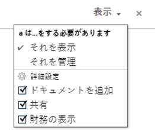
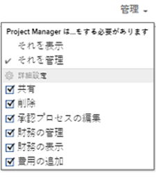
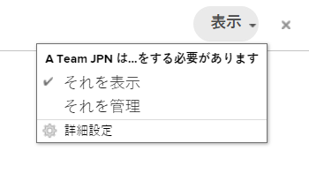
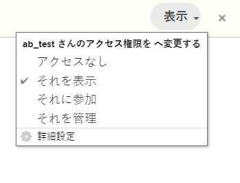

# テンプレートの共有

Adobe Workfront 管理者は、ユーザーのアクセスレベルを割り当てる際に、テンプレートを表示または編集するためのアクセス権をユーザーに付与できます。テンプレートを編集するには、Plan ライセンスが必要です。

テンプレートへのアクセス権の付与について詳しくは、[テンプレートへのアクセス権の付与](../../administration-and-setup/add-users/configure-and-grant-access/grant-access-templates.md)を参照してください。

付与されるアクセスレベルに加えて、ユーザーは、特定のテンプレートを共有する他のユーザーから、それらのテンプレートを表示または管理する権限を受け取ることもできます。

>[!NOTE]
>
>権限レベルは、アクセスレベルの範囲内で機能します。例えば、アクセスレベルでテンプレートの表示のみが許可されている場合、そのユーザーはテンプレートを管理する権限を得ることはできません。

権限は、Workfrontの 1 つの項目に固有で、その項目に対して実行できるアクションを定義します。

## テンプレートを共有する際の考慮事項

* 以下の考慮事項に加えて、[オブジェクトに対する権限の共有の概要](../../workfront-basics/grant-and-request-access-to-objects/sharing-permissions-on-objects-overview.md)を参照してください。
* テンプレートの作成者およびテンプレート所有者には、デフォルトで、テンプレートに対する管理権限があります。ユーザーをテンプレート所有者に指定する方法については、[プロジェクトテンプレートの編集](../../manage-work/projects/create-and-manage-templates/edit-templates.md)を参照してください。
* テンプレートを共有すると、以下のものを共有できます。

   * テンプレート

     テンプレートの共有方法について詳しくは、[プロジェクトテンプレートの共有](../../manage-work/projects/create-and-manage-templates/share-project-template.md)を参照してください。

     テンプレートに対する次の権限を付与できます。

      * 表示

        

      * 管理

        

   * このテンプレートを使用して今後作成されるプロジェクト。個々のプロジェクトに付与するのと同じレベルの権限を、テンプレートから作成されたプロジェクトに付与できます。 

     テンプレートから作成されたプロジェクトをテンプレートレベルで共有する方法については、[プロジェクトテンプレートの共有](../../manage-work/projects/create-and-manage-templates/share-project-template.md)を参照してください。

* テンプレートまたはテンプレートから作成されたプロジェクトを共有する場合、ユーザーは、テンプレートまたはプロジェクトに関連付けられているすべての子オブジェクトに対して同じ権限をデフォルトで継承します。

  Workfront のオブジェクトの階層について詳しくは、[Adobe Workfront のオブジェクトについて](../../workfront-basics/navigate-workfront/workfront-navigation/understand-objects.md)を参照してください。

* テンプレートを共有する場合、特に指定のない限り、すべてのテンプレートタスクおよびドキュメントと、そのテンプレートから今後作成されるプロジェクトに関するイシューは、同じ権限を継承します。

  プロジェクトに対するユーザーの権限に基づいてテンプレートタスクとプロジェクトのイシューへのアクセスを管理する方法については、[プロジェクトテンプレートの編集](../../manage-work/projects/create-and-manage-templates/edit-templates.md)の記事の[アクセス](../../manage-work/projects/create-and-manage-templates/edit-templates.md#access)の節を参照してください。

* Workfront 管理者は、ドキュメントがユーザーのアクセスレベルの上位のオブジェクトから権限を継承するかどうかを指定できます。ドキュメントに対する継承された権限の制限について詳しくは、[カスタムアクセスレベルの作成または変更](../../administration-and-setup/add-users/configure-and-grant-access/create-modify-access-levels.md)を参照してください。

<!--

<h2>Share a template</h2>

(NOTE: drafted because this is also linked above: Share project templates >> which is an article in the Manage Work section>> Templates)&nbsp;

<ol>
<li value="1"> 
Go to the template you want to share with other entities, click <strong>Template Actions</strong>, then <strong>Template Sharing</strong>. Or
 
Navigate to a list of templates, and select multiple templates from the list, then click <strong>Share Template</strong>.
 <note type="note">
If you select multiple templates, you cannot view who already has permissions to the individual templates.
</note> </li>
<li value="2"> 
Start typing the name of a user, group, team, job role, or company that you want to share the template with in the <strong>Give template access to</strong> or <strong>Edit template access for</strong> fields.
 
Select them when they appear in the list.
 <note type="tip">
You can share an object only with active users, teams,
roles, or companies.
</note> </li>
<li value="3">From the drop-down menu, select which level of permissions you want to grant: 
<ul>
<li>
<strong>View it</strong>: Users with these permissions are able to view the template and create a project using it, or attach it to an existing project.

</li>
<li><strong>Manage it</strong>: Users with these permissions are able to edit or delete the template.</li>
</ul></li>
<li value="4">(Optional) Click <strong>Advanced Settings</strong> to fine-tune your settings for each level of permissions.</li>
<li value="5">Click <strong>Save</strong>.</li>
</ol>
<h2>Share a project at the template level</h2>

You can share the future projects that are created using a template with users at the template level.

<ol>
<li value="1"> 
Go to the template whose future projects you want to share with other entities, click <strong>Template Actions</strong>, then <strong>Project Sharing</strong>.
 
Or
 
Navigate to a list of templates, and select multiple templates from the list, then click <strong>Share Project</strong>.
 <note type="note">
If you select multiple templates, you cannot view who already has project permissions to the individual templates.
</note> </li>
<li value="2"> 
Start typing and then select the name of a user, group, team, job role, or company with whom you want to share future projects created from the template in the <strong>Give project access to</strong> or <strong>Edit template access for</strong> fields.
 <note type="tip">
You can share an object only with active users, teams,
roles, or companies.
</note> </li>
<li value="3">From the drop-down menu, select which level of permissions you want to grant. Select from the following: 
<ul>
<li><strong>No access</strong>: You can specify which users will not have any access to the template. This option is available only when bulk sharing projects from templates.&nbsp;</li>
<li><strong>View</strong>: Users with these permissions can view projects created from the template.</li>
<li><strong>Contribute</strong>: Users with these permissions can contribute to projects created from the template&nbsp;</li>
<li><strong>Manage</strong>: Users with these permissions can manage or delete projects created from this template. </li>
</ul></li>
<li value="4">(Optional) Click <strong>Advanced Settings</strong> to fine-tune your settings for each level of permissions. </li>
<li value="5">Click <strong>Save</strong>.</li>
</ol>

-->

## テンプレート共有の詳細設定

ユーザーにテンプレートの表示または管理を許可する際に付与できる権限を次の表に示します。テンプレートを共有する手順については、[プロジェクトテンプレートの共有](../../manage-work/projects/create-and-manage-templates/share-project-template.md)の記事の[テンプレートの共有](../../manage-work/projects/create-and-manage-templates/share-project-template.md#share)の節を参照してください。

<table style="table-layout:auto"> 
 <col> 
 <col> 
 <col> 
 <thead> 
  <tr> 
   <th>アクション</th> 
   <th>管理</th> 
   <th>表示</th> 
  </tr> 
 </thead> 
 <tbody> 
  <tr> 
   <td>コピー</td> 
   <td>✓</td> 
   <td> </td> 
  </tr> 
  <tr> 
   <td>削除</td> 
   <td>✓</td> 
   <td> </td> 
  </tr> 
  <tr> 
   <td>テンプレートの詳細を編集</td> 
   <td>✓</td> 
   <td> </td> 
  </tr> 
  <tr> 
   <td>テンプレートの表示</td> 
   <td>✓</td> 
   <td>✓</td> 
  </tr> 
  <tr> 
   <td>共有</td> 
   <td>✓</td> 
   <td>✓</td> 
  </tr> 
  <tr> 
   <td>システム全体で共有</td> 
   <td> </td> 
   <td>✓</td> 
  </tr> 
  <tr data-mc-conditions=""> 
   <td> 
ドキュメントを追加
 
ヒント：時には、プロジェクトにドキュメントを追加しているつもりで、プロジェクトテンプレートにドキュメントを追加してしまうユーザーがいます。この設定を無効にすることで、受信者のこのような行動を防ぐことができます。
 </td> 
   <td> </td> 
   <td>✓</td> 
  </tr> 
 </tbody> 
</table>

テンプレートから作成されたプロジェクトに対する、ユーザーに付与する権限については、[Adobe Workfront でのプロジェクトの共有](../../workfront-basics/grant-and-request-access-to-objects/share-a-project.md)を参照してください。
