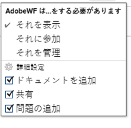
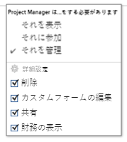
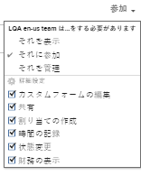

# イシューの共有

Adobe Workfront管理者は、アクセスレベルを割り当てる際に、ユーザーに問題の表示や編集のアクセス権を付与します。 問題へのアクセス権の付与について詳しくは、 [問題へのアクセス権の付与](../../administration-and-setup/add-users/configure-and-grant-access/grant-access-issues.md).

ユーザーに付与されるアクセスレベルに加えて、共有する特定の問題を表示、投稿、管理する権限をユーザーに付与することもできます。 アクセスレベルと権限の詳細については、 [アクセスレベルと権限の連携](../../administration-and-setup/add-users/access-levels-and-object-permissions/how-access-levels-permissions-work-together.md).

権限は、Workfrontの 1 つの項目に固有で、その項目に対して実行できるアクションを定義します。

## 共有の問題に関する考慮事項

以下の考慮事項に加えて、 [オブジェクトに対する共有権限の概要](../../workfront-basics/grant-and-request-access-to-objects/sharing-permissions-on-objects-overview.md).

>[!NOTE]
>
>Workfront管理者は、システム内のすべてのユーザーに対して、それらの項目の所有者にならずに、システム内の項目に対する権限を追加または削除できます。

* イシューの作成者には、デフォルトで、イシューの管理権限が付与されています。
* イシューは個別に共有することも、一度に複数共有することもできます。 共有の問題は、Workfrontの他の項目を共有する場合と同じです。 Workfrontでの項目の共有について詳しくは、 [オブジェクトの共有](../../workfront-basics/grant-and-request-access-to-objects/share-an-object.md).
* 問題に対しては、次の権限を付与できます。 

   * ビュー

      

   * 管理

      

   * 参加\
      

* イシューを共有すると、イシューに添付されたすべてのドキュメントに同じ権限が継承されます。

   Workfrontの管理者は、ドキュメントがユーザーのアクセスレベルの上位のオブジェクトから権限を継承するかどうかを指定できます。 ドキュメントに対する継承された権限の制限について詳しくは、 [カスタムアクセスレベルの作成または変更](../../administration-and-setup/add-users/configure-and-grant-access/create-modify-access-levels.md).

* イシューから継承された権限を削除できます。 詳しくは、 [オブジェクトから権限を削除](../../workfront-basics/grant-and-request-access-to-objects/remove-permissions-from-objects.md).

## イシューを共有する方法

* 手動 (Workfrontでの他のオブジェクトの共有と似ています ) Workfrontでオブジェクトを共有する方法について詳しくは、 [オブジェクトの共有](../../workfront-basics/grant-and-request-access-to-objects/share-an-object.md).
* 次のいずれかの操作を行うと、自動的に実行されます。

   * 問題の親オブジェクトの権限を指定します。プロジェクト、プログラム、またはポートフォリオ。 問題は親オブジェクトから権限を継承します。 オブジェクトに対する継承された権限の表示については、 [オブジェクトの継承された権限の表示](../../workfront-basics/grant-and-request-access-to-objects/view-inherited-permissions-on-objects.md).
   * イシューの作成に使用するテンプレートで、プロジェクト共有にエンティティを追加します。 テンプレートからプロジェクトを共有する方法については、 [テンプレートの共有](../../workfront-basics/grant-and-request-access-to-objects/share-a-template.md).

   * プロジェクトの編集時に、プロジェクト内のすべての問題に対する権限を指定します。 プロジェクトに対するユーザーの権限に基づく、プロジェクトのイシューやリクエストへのアクセスの管理について詳しくは、  記事のセクション [プロジェクトを編集](../../manage-work/projects/manage-projects/edit-projects.md).

      >[!TIP]
      >
      >プロジェクト上のイシューに割り当てられる際に、ユーザーにどのイシュー権限を持たせるかを指定しない場合、ユーザーはデフォルトでプロジェクト上の同じ権限を受け取ります。

   * リクエストキューの作成時にリクエストキューで送信される問題に対してユーザーが受け取る権限を指定します。 詳しくは、 [リクエストキューの作成](../../manage-work/requests/create-and-manage-request-queues/create-request-queue.md).

      >[!IMPORTANT]
      >
      >プロジェクトがリクエストキューとして公開されているかどうかに応じて、次の権限が異なります。
      >
      >   
      >   
      >   * プライマリがリクエストキューとして公開されたプロジェクトにリクエストを送信すると、ユーザーの「連絡先」と「入力者」に指定された権限が付与されます。
      >   * プライマリが要求キューとして公開されていないプロジェクトに要求を送信すると、ユーザー連絡先（入力者ユーザーと異なる場合）に指定された権限が付与され、入力者ユーザーには問題に対する管理権限が付与されます。

<!--

<h2>Automatically share an issue at the project level</h2>

(NOTE: this info duplicates in Edit projects - linked there instead (above).)&nbsp;

As the Project Owner, you can grant permissions automatically to users as the issues are added to a project.

<ol>
<li value="1">Go to the project whose issues you want to share automatically.</li>
<li value="2"> Click the More menu , then click <strong>Edit</strong>. </li>
<li value="3">In the <strong>Edit Project</strong> box that displays, click <strong>Access</strong>.</li>
<li value="4">In the <strong>When someone is assigned to an ISSUE</strong> field, select from the following permissions levels:
<ul>
<li><strong>View</strong></li>
<li><strong>Contribute</strong></li>
<li><strong>Manage</strong> Now, when someone is assigned to an issue on the selected project, they are granted the specified permissions to the issue.&nbsp;</li>
</ul></li>
<li value="5">(Optional) Select the <strong>Also grant ... access to the project</strong> field to also grant View, Contribute, or Manage permissions to the projects to the user assigned to the issue</li>
<li value="6">In the <strong>When someone submits a REQUEST ...</strong> field, select from the following permissions levels:
<ul>
<li><strong>View</strong></li>
<li><strong>Contribute</strong></li>
<li>
<strong>Manage</strong>
<note type="important">

Permissions are granted differently depending on whether or not the project is published as a request queue:

<ul>
<li>When a user submits a request to a project published as a request queue, the Primary Contact and Entered By users are granted the permission specified.</li>
<li>When a user submits a request to a project not published as a request queue, the Primary Contact (if different from Entered By user) is granted the permission specified, and the Entered By user is granted Manage permissions to the issue.</li>
</ul>
</note></li>
</ul></li>
<li value="7"> 
(Optional) Select the <strong>People from the same company will inherit the same permissions for all requests</strong> field.
 
People from the same company as the user submitting the request are granted the same permissions on the requests as the user.&nbsp;
 </li>
<li value="8">Click <strong>Save Changes</strong>.</li>
</ol>

-->

<!--

<h2>Automatically share an issue in request queues</h2>

(NOTE: drafted because it's duplicated from Create a Request Queue which is linked above)&nbsp;

As the Project Owner, you can grant permissions automatically to users as the issues are submitted to a request queue.

<ol>
<li value="1">Go to the project whose issues you want to share automatically.</li>
<li value="2">Click <strong>Edit Project</strong>.</li>
<li value="3">Click <strong>More</strong> then click <strong>Queue Setup</strong>. </li>
<li value="4"> 
On the <strong>Queue Details</strong> sub-tab, in the drop-down menu under <strong>When someone makes a request, automatically grant</strong>, select from the following permissions levels:

<ul>
<li><strong>View Access</strong> </li>
<li><strong>Contribute Access</strong> </li>
<li> 
<strong>Manage Access</strong> 
 </li>
</ul> 
Now, when someone submits a request to the selected project, they are granted the specified permissions to the request.
 </li>
<li value="5"> 
(Optional) Select the <strong>People from the same company will inherit the same permissions for all requests</strong>.
 
People from the same company as the user submitting the request are granted the same permissions on the requests as the user.&nbsp;
 </li>
<li value="6">Click <strong>Save</strong>.</li>
</ol>

-->

## 権限の発行

次の表に、ユーザーに対して、問題の表示、投稿、管理を許可する際に付与できる権限を示します。

<table style="table-layout:auto"> 
 <col> 
 <col> 
 <col> 
 <col> 
 <tbody> 
  <tr> 
   <td><strong>アクション</strong> </td> 
   <td><strong>管理</strong> </td> 
   <td><strong>参加</strong> </td> 
   <td><strong>ビュー</strong> </td> 
  </tr> 
  <tr> 
   <td> 
 件の問題を追加
 </td> 
   <td>✓</td> 
   <td> </td> 
   <td> </td> 
  </tr> 
  <tr> 
   <td>削除 </td> 
   <td>✓</td> 
   <td> </td> 
   <td> </td> 
  </tr> 
  <tr> 
   <td>カスタムフォームを添付</td> 
   <td>✓</td> 
   <td> </td> 
   <td> </td> 
  </tr> 
  <tr> 
   <td>カスタムフィールドの編集</td> 
   <td>✓</td> 
   <td>✓</td> 
   <td> </td> 
  </tr> 
  <tr> 
   <td>問題の承認</td> 
   <td>✓</td> 
   <td>✓</td> 
   <td>✓</td> 
  </tr> 
  <tr> 
   <td>承認プロセスの追加</td> 
   <td>✓</td> 
   <td> </td> 
   <td> </td> 
  </tr> 
  <tr> 
   <td>ドキュメントを追加</td> 
   <td>✓</td> 
   <td>✓</td> 
   <td>✓</td> 
  </tr> 
  <tr> 
   <td>問題のコピー*</td> 
   <td>✓</td> 
   <td>✓</td> 
   <td>✓</td> 
  </tr> 
  <tr> 
   <td>問題の移動</td> 
   <td>✓</td> 
   <td> </td> 
   <td> </td> 
  </tr> 
  <tr> 
   <td>時間の記録</td> 
   <td>✓</td> 
   <td>✓</td> 
   <td> </td> 
  </tr> 
  <tr> 
   <td>プロジェクトに変換*</td> 
   <td>✓</td> 
   <td> </td> 
   <td> </td> 
  </tr> 
  <tr> 
   <td>割り当てを承認</td> 
   <td>✓</td> 
   <td>✓</td> 
   <td> </td> 
  </tr> 
  <tr> 
   <td>更新/コメント</td> 
   <td>✓</td> 
   <td>✓</td> 
   <td>✓</td> 
  </tr> 
  <tr> 
   <td>計画日の変更</td> 
   <td>✓</td> 
   <td> </td> 
   <td> </td> 
  </tr> 
  <tr> 
   <td>割り当ての作成</td> 
   <td>✓</td> 
   <td>✓</td> 
   <td> </td> 
  </tr> 
  <tr> 
   <td>共有</td> 
   <td>✓</td> 
   <td>✓</td> 
   <td>✓</td> 
  </tr> 
  <tr> 
   <td>システム全体で共有</td> 
   <td> </td> 
   <td> </td> 
   <td>✓</td> 
  </tr> 
 </tbody> 
</table>

&#42;プロジェクトのアクセスレベルと権限で制御します。
