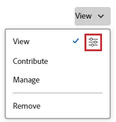

# イシューの共有

Adobe Workfront 管理者は、ユーザーにアクセスレベルを割り当てる際に、イシューの表示や編集を行えるアクセス権を付与します。イシューへのアクセスを許可について詳しくは、[イシューへのアクセスの許可](../../administration-and-setup/add-users/configure-and-grant-access/grant-access-issues.md)を参照してください。

ユーザーに付与するアクセスレベルに加えて、自分が共有を行うアクセス権を持っている特定のイシューを、表示、投稿、管理する権限をユーザーに付与することもできます。アクセスレベルと権限について詳しくは、[アクセスレベルと権限の連携方法](../../administration-and-setup/add-users/access-levels-and-object-permissions/how-access-levels-permissions-work-together.md)を参照してください。

権限は、Workfrontの 1 つの項目に固有で、その項目に対して実行できるアクションを定義します。

## アクセス要件

+++ 展開すると、この記事の機能のアクセス要件が表示されます。

オブジェクトを共有するには、次の条件を満たしている必要があります。

<table style="table-layout:auto"> 
 <col> 
 <col> 
 <tbody> 
  <tr> 
   <td role="rowheader">Adobe Workfront プラン</td> 
   <td> 
任意 
 </td> 
  </tr> 
  <tr> 
   <td role="rowheader">Adobe Workfront プラン</td> 
   <td> 
新規：標準
 
   または
   
現在：ワーク以上

   </td> 
  </tr> 
  <tr> 
   <td role="rowheader">アクセスレベル設定</td> 
   <td> 
共有するオブジェクトに対する表示以上の権限
 </td> 
  </tr> 
  <tr> 
   <td role="rowheader">オブジェクト権限</td> 
   <td> 
共有するオブジェクトに対する表示またはそれ以上の権限
</td> 
  </tr> 
 </tbody> 
</table>

詳しくは、[Workfront ドキュメントのアクセス要件](/help/quicksilver/administration-and-setup/add-users/access-levels-and-object-permissions/access-level-requirements-in-documentation.md)を参照してください。

+++

## イシューの共有に関する考慮事項

以下の考慮事項に加えて、[オブジェクトの共有権限の概要](../../workfront-basics/grant-and-request-access-to-objects/sharing-permissions-on-objects-overview.md)も参照してください。

>[!NOTE]
>
>Workfront 管理者は、システム内のすべてのユーザーに対して、システム内のアイテムに対する権限の追加や削除を、それらのアイテムの所有者にならなくても行うことができます。

* イシューの作成者は、デフォルトでその管理権限を持っています。
* イシューは、個別に共有することも、一度に複数共有することもできます。イシューの共有は、Workfront の他のアイテムを共有する場合と同じです。Workfront でのアイテムの共有について詳しくは、[オブジェクトの共有](../../workfront-basics/grant-and-request-access-to-objects/share-an-object.md)を参照してください。
* イシューに対しては、次の権限を付与できます。

   * 表示
   * 参加
   * 管理

* イシューを共有すると、イシューに添付されたすべてのドキュメントに同じ権限が継承されます。

  Workfront 管理者は、ドキュメントがユーザーのアクセスレベルの上位のオブジェクトから権限を継承するかどうかを指定できます。ドキュメントに対する継承された権限の制限について詳しくは、[カスタムアクセスレベルの作成または変更](../../administration-and-setup/add-users/configure-and-grant-access/create-modify-access-levels.md)を参照してください。

* イシューから継承された権限を削除できます。詳しくは、[オブジェクトから権限を削除](../../workfront-basics/grant-and-request-access-to-objects/remove-permissions-from-objects.md)を参照してください。

## イシューを共有する方法

* 手動。Workfront で他のオブジェクトを共有する方法と同様です。
* 自動的。次のいずれかの操作を行って設定します。

   * そのイシュー、プロジェクト、プログラム、ポートフォリオの任意の親オブジェクトに対する権限を指定します。イシューは親オブジェクトから権限を継承します。オブジェクトの継承された権限の表示については、[オブジェクトの継承された権限の表示](../../workfront-basics/grant-and-request-access-to-objects/view-inherited-permissions-on-objects.md)を参照してください。
   * そのイシューがあるプロジェクトの作成に使用したテンプレートで、プロジェクト共有にエンティティを追加します。テンプレートからプロジェクトを共有する方法については、[テンプレートの共有](../../workfront-basics/grant-and-request-access-to-objects/share-a-template.md)を参照してください。

   * プロジェクトを編集するときに、プロジェクト内のすべてのイシューに対する権限を指定します。プロジェクトに対するユーザーの権限に基づいてプロジェクトのイシューやリクエストへのアクセス権を管理する方法については、[プロジェクトの編集](../../manage-work/projects/manage-projects/edit-projects.md)の記事の [&#128279;](../../manage-work/projects/manage-projects/edit-projects.md#access) の節を参照してください。

     >[!TIP]
     >
     >プロジェクトのイシューに割り当てられたときにユーザーに付与するイシュー権限を指定しない場合、ユーザーは、デフォルトでプロジェクトに対して持っているのと同じ権限を受け取ります。

   * リクエストキューを作成する際に、リクエストキューで送信するイシューに対してユーザーが付与される権限を指定します。詳しくは、[リクエストキューの作成](../../manage-work/requests/create-and-manage-request-queues/create-request-queue.md)を参照してください。

     >[!IMPORTANT]
     >
     >プロジェクトがリクエストキューとして公開されているかどうかに応じて、付与される権限が異なります。
     >
     >   
     >   
     >   * ユーザーがリクエストキューとして公開されたプロジェクトにリクエストを送信すると、指定された権限がプライマリ連絡先と入力者のユーザーに付与されます。
     >   * ユーザーがリクエストキューとして公開されていないプロジェクトにリクエストを送信すると、指定された権限はプライマリ連絡先（入力者のユーザーと異なる場合）のユーザーに付与され、入力者のユーザーにはイシューに対する管理権限が付与されます。
     >   
     >

<!--

<h2>Automatically share an issue at the project level</h2>

(NOTE: this info duplicates in Edit projects - linked there instead (above).)&nbsp;

As the Project Owner, you can grant permissions automatically to users as the issues are added to a project.

<ol>
<li value="1">Go to the project whose issues you want to share automatically.</li>
<li value="2"> Click the More menu , then click <strong>Edit</strong>. </li>
<li value="3">In the <strong>Edit Project</strong> box that displays, click <strong>Access</strong>.</li>
<li value="4">In the <strong>When someone is assigned to an ISSUE</strong> field, select from the following permissions levels:
<ul>
<li><strong>View</strong></li>
<li><strong>Contribute</strong></li>
<li><strong>Manage</strong> Now, when someone is assigned to an issue on the selected project, they are granted the specified permissions to the issue.&nbsp;</li>
</ul></li>
<li value="5">(Optional) Select the <strong>Also grant ... access to the project</strong> field to also grant View, Contribute, or Manage permissions to the projects to the user assigned to the issue</li>
<li value="6">In the <strong>When someone submits a REQUEST ...</strong> field, select from the following permissions levels:
<ul>
<li><strong>View</strong></li>
<li><strong>Contribute</strong></li>
<li>
<strong>Manage</strong>
<note type="important">

Permissions are granted differently depending on whether or not the project is published as a request queue:

<ul>
<li>When a user submits a request to a project published as a request queue, the Primary Contact and Entered By users are granted the permission specified.</li>
<li>When a user submits a request to a project not published as a request queue, the Primary Contact (if different from Entered By user) is granted the permission specified, and the Entered By user is granted Manage permissions to the issue.</li>
</ul>
</note></li>
</ul></li>
<li value="7"> 
(Optional) Select the <strong>People from the same company will inherit the same permissions for all requests</strong> field.
 
People from the same company as the user submitting the request are granted the same permissions on the requests as the user.&nbsp;
 </li>
<li value="8">Click <strong>Save Changes</strong>.</li>
</ol>

-->

<!--

<h2>Automatically share an issue in request queues</h2>

(NOTE: drafted because it's duplicated from Create a Request Queue which is linked above)&nbsp;

As the Project Owner, you can grant permissions automatically to users as the issues are submitted to a request queue.

<ol>
<li value="1">Go to the project whose issues you want to share automatically.</li>
<li value="2">Click <strong>Edit Project</strong>.</li>
<li value="3">Click <strong>More</strong> then click <strong>Queue Setup</strong>. </li>
<li value="4"> 
On the <strong>Queue Details</strong> sub-tab, in the drop-down menu under <strong>When someone makes a request, automatically grant</strong>, select from the following permissions levels:

<ul>
<li><strong>View Access</strong> </li>
<li><strong>Contribute Access</strong> </li>
<li> 
<strong>Manage Access</strong> 
 </li>
</ul> 
Now, when someone submits a request to the selected project, they are granted the specified permissions to the request.
 </li>
<li value="5"> 
(Optional) Select the <strong>People from the same company will inherit the same permissions for all requests</strong>.
 
People from the same company as the user submitting the request are granted the same permissions on the requests as the user.&nbsp;
 </li>
<li value="6">Click <strong>Save</strong>.</li>
</ol>

-->

## イシューの共有

1. 共有するイシューに移動します。

1. イシュー名の右側にある「**共有**」をクリックします。 **共有 [ イシュー名]** ダイアログボックスが開きます。

   

1. **イシューへのアクセス権の付与** フィールドに、イシューを共有するユーザー、チーム、役割、グループ、会社の名前の入力を開始し、ドロップダウンリストに表示されたら名前をクリックします。

   >[!TIP]
   >
   >イシューは、アクティブユーザー、チーム、役割、会社とのみ共有できます。

1. （オプション） **アクセスできるユーザー** ドロップダウンを選択し、イシューのアクセスレベルを選択します。

   * **招待されたユーザーのみがアクセスできます：** イシューに招待されたユーザーのみがイシューにアクセスできます（デフォルト）。
   * **システム内の全員が閲覧可能**：システム内のすべてのユーザーが招待なしにイシューを閲覧できます。

1. ユーザー名の右側のドロップダウンをクリックし、このイシューに対する権限レベルを選択します。

   * **表示**：ユーザーは、イシューを確認し、共有できます。
   * **投稿**：ユーザーは、更新を行ったり、情報を記録したり、小さな編集を行ったり、問題を共有したりできます（すべての表示権限も含まれます）。
   * **管理**：ユーザーは、管理者権限を持たずにイシューへのフルアクセス権を持ちます。このアクセス権はアクセスレベルで付与されます（すべての表示権限と投稿権限も含まれます）。

1. （任意）付与した権限レベルの横にある「詳細オプション」アイコンをクリックして、イシューに対する特定の権限を設定します。

   

1. （任意）リンクを使用して問題をすばやく共有するには、「**リンクをコピー**」をクリックして受信者に転送します。

1. **保存**&#x200B;をクリックします。

## 問題を一括で共有

1. 共有するイシューを含むプロジェクトに移動します。

1. プロジェクトページの「**イシュー**」タブで、共有する各イシューの左側にあるボックスを選択し、ページ上部にある **共有** アイコン  をクリックします。 共有モーダルが開きます。

   

1. 「**イシューへのアクセスの許可**」フィールドで、イシューを共有するユーザー、チーム、役割、グループ、会社の名前の入力を開始し、ドロップダウンリストに表示されたら名前をクリックします。

   >[!TIP]
   >
   >イシューを共有できるのは、アクティブなユーザー、チーム、役割、会社のみです。

1. （オプション） **アクセスできるユーザー** ドロップダウンを選択し、イシューのアクセスレベルを選択します。

   * **招待されたユーザーのみがアクセスできます：** 問題に招待されたユーザーのみが問題にアクセスできます（デフォルト）。
   * **システム内の全員が閲覧可能**：システム内のすべてのユーザーが、招待なしに問題を閲覧できます。

1. ユーザー名の右側にあるドロップダウンをクリックし、イシューに対する権限レベルを選択します。

   * **表示**：ユーザーは、イシューを確認し、共有できます。
   * **投稿**：ユーザーは、更新を行ったり、情報を記録したり、小さな編集を行ったり、問題を共有したりできます（すべての表示権限も含まれます）。
   * **管理**：ユーザーは、管理者権限を持たない問題に対してフルアクセス権を持ちます。この権限はアクセスレベルで付与されます（すべての表示権限と投稿権限も含まれます）。

1. （任意）付与した権限レベルの横にある「詳細オプション」アイコンをクリックして、イシューに対する特定の権限を設定します。

   

1. **保存**&#x200B;をクリックします。

## イシューの権限

次の表は、ユーザーにイシューの表示、投稿、管理を許可するときに付与できる権限を示しています。

<table style="table-layout:auto"> 
 <col> 
 <col> 
 <col> 
 <col> 
 <tbody> 
  <tr> 
   <td><strong>アクション</strong> </td> 
   <td><strong>管理</strong> </td> 
   <td><strong>参加</strong> </td> 
   <td><strong>表示</strong> </td> 
  </tr> 
  <tr> 
   <td> 
イシューを追加
 </td> 
   <td>✓</td> 
   <td> </td> 
   <td> </td> 
  </tr> 
  <tr> 
   <td>削除 </td> 
   <td>✓</td> 
   <td> </td> 
   <td> </td> 
  </tr> 
  <tr> 
   <td>カスタムフォームを添付</td> 
   <td>✓</td> 
   <td> </td> 
   <td> </td> 
  </tr> 
  <tr> 
   <td>カスタムフィールドを編集</td> 
   <td>✓</td> 
   <td>✓</td> 
   <td> </td> 
  </tr> 
  <tr> 
   <td>イシューを承認</td> 
   <td>✓</td> 
   <td>✓</td> 
   <td>✓</td> 
  </tr> 
  <tr> 
   <td>承認プロセスを追加</td> 
   <td>✓</td> 
   <td> </td> 
   <td> </td> 
  </tr> 
  <tr> 
   <td>ドキュメントを追加</td> 
   <td>✓</td> 
   <td>✓</td> 
   <td>✓</td> 
  </tr> 
  <tr> 
   <td>イシューをコピー*</td> 
   <td>✓</td> 
   <td>✓</td> 
   <td>✓</td> 
  </tr> 
  <tr> 
   <td>イシューを移動</td> 
   <td>✓</td> 
   <td> </td> 
   <td> </td> 
  </tr> 
  <tr> 
   <td>時間の記録</td> 
   <td>✓</td> 
   <td>✓</td> 
   <td> </td> 
  </tr> 
  <tr> 
   <td>プロジェクトに変換*</td> 
   <td>✓</td> 
   <td> </td> 
   <td> </td> 
  </tr> 
  <tr> 
   <td>割り当ての受け入れ</td> 
   <td>✓</td> 
   <td>✓</td> 
   <td> </td> 
  </tr> 
  <tr> 
   <td>アップデート／コメント</td> 
   <td>✓</td> 
   <td>✓</td> 
   <td>✓</td> 
  </tr> 
  <tr> 
   <td>予定日の変更</td> 
   <td>✓</td> 
   <td> </td> 
   <td> </td> 
  </tr> 
  <tr> 
   <td>割り当ての作成</td> 
   <td>✓</td> 
   <td>✓</td> 
   <td> </td> 
  </tr> 
  <tr> 
   <td>共有</td> 
   <td>✓</td> 
   <td>✓</td> 
   <td>✓</td> 
  </tr> 
  <tr> 
   <td>システム全体で共有</td> 
   <td> </td> 
   <td> </td> 
   <td>✓</td> 
  </tr> 
 </tbody> 
</table>

&#42;プロジェクトのアクセスレベルと権限で制御します。
