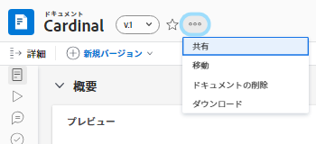
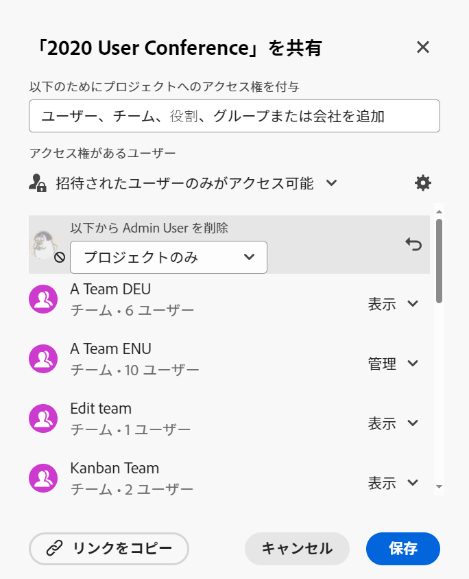
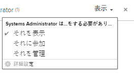
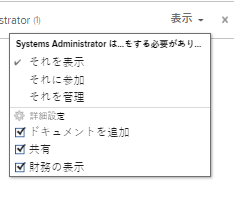
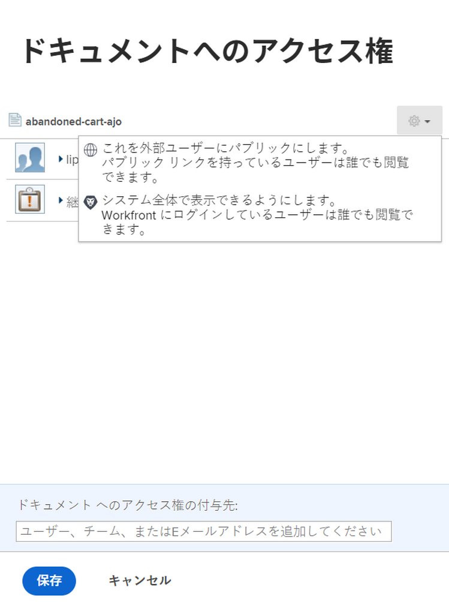
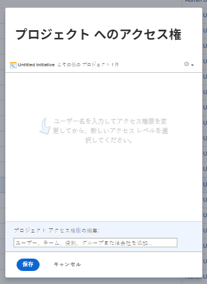

# オブジェクトの共有

Adobe Workfront管理者は、アクセスレベルを割り当てる際に、ユーザーにオブジェクトの表示や編集のアクセス権を付与します。 オブジェクトへのアクセス権の付与の詳細については、 [カスタムアクセスレベルの作成または変更](../../administration-and-setup/add-users/configure-and-grant-access/create-modify-access-levels.md).

ユーザーに付与されるアクセスレベルに加えて、自分が作成した特定のオブジェクトや、共有するアクセス権を持つオブジェクトを表示または編集する権限をユーザーに付与することもできます。 アクセスレベルと権限の詳細については、 [アクセスレベルと権限の連携](../../administration-and-setup/add-users/access-levels-and-object-permissions/how-access-levels-permissions-work-together.md).

権限は、Workfrontの 1 つの項目に固有で、その項目に対して実行できるアクションを定義します。

オブジェクトに対する権限の共有については、 [オブジェクトに対する共有権限の概要](../../workfront-basics/grant-and-request-access-to-objects/sharing-permissions-on-objects-overview.md).

>[!NOTE]
>
>Workfront管理者は、システム内のすべてのユーザーに対して、それらの項目の所有者にならずに、システム内の項目に対する権限を追加または削除できます。

この記事では、共有が同一の次のオブジェクトを共有する方法について説明します。 

* プロジェクト、タスク、問題
* Portfolio、プログラム
* ドキュメント

Workfrontで他のすべてのオブジェクトを共有する方法について詳しくは、次の記事も参照してください。

* テンプレートについては、 [プロジェクトテンプレートの共有](../../manage-work/projects/create-and-manage-templates/share-project-template.md).
* 配達確認については、 [Workfrontの配達確認での配達確認の共有](../../workfront-proof/wp-work-proofsfiles/share-proofs-and-files/share-proof.md).
* レポート、ダッシュボード、カレンダーについては、次の記事を参照してください。

   * [Adobe Workfrontでのレポートの共有](../../reports-and-dashboards/reports/creating-and-managing-reports/share-report.md)
   * [ダッシュボードの共有](../../reports-and-dashboards/dashboards/creating-and-managing-dashboards/share-dashboard.md)
   * [カレンダーレポートの共有](../../reports-and-dashboards/reports/calendars/share-a-calendar-report.md)

   また、 [レポート、ダッシュボード、カレンダーの共有](../../workfront-basics/grant-and-request-access-to-objects/permissions-reports-dashboards-calendars.md) レポート、ダッシュボード、カレンダーの共有に関する一般情報を参照してください。 

* フィルター、ビューおよびグループ化については、 [フィルター、表示またはグループ化の共有](../../reports-and-dashboards/reports/reporting-elements/share-filter-view-grouping.md).
* ドキュメントフォルダについては、 [ドキュメントフォルダーの共有](../../workfront-basics/grant-and-request-access-to-objects/share-a-document-folder.md).
* プランについては、 [シナリオプランナーでのプランの共有](../../scenario-planner/share-a-plan.md).

   追加のライセンスが必要です。

* 目標については、 [Workfront目標での目標の共有](../../workfront-goals/workfront-goals-settings/share-a-goal.md). 追加のライセンスが必要です。

## アクセス要件

<!--drafted for P&P:

<table style="table-layout:auto"> 
 <col> 
 <col> 
 <tbody> 
  <tr> 
   <td role="rowheader">Adobe Workfront plan*</td> 
   <td> 
Any 
 </td> 
  </tr> 
  <tr> 
   <td role="rowheader">Adobe Workfront license*</td> 
   <td> 
Current license: Standard
 
   Or
   
Legacy license: Work or higher

   </td> 
  </tr> 
  <tr> 
   <td role="rowheader">Access level configurations*</td> 
   <td> 
View access or higher to the objects you want to share
 
<b>NOTE</b>
   
   If you still don't have access, ask your Workfront administrator if they set additional restrictions in your access level. For information on how a Workfront administrator can modify your access level, see <a href="../../administration-and-setup/add-users/configure-and-grant-access/create-modify-access-levels.md" class="MCXref xref">Create or modify custom access levels</a>.
 </td> 
  </tr> 
  <tr> 
   <td role="rowheader">Object permissions</td> 
   <td> 
View permissions or higher to the objects you want to share
 
For information on requesting additional access, see <a href="../../workfront-basics/grant-and-request-access-to-objects/request-access.md" class="MCXref xref">Request access to objects </a>.
 </td> 
  </tr> 
 </tbody> 
</table>
-->

オブジェクトを共有するには、次の条件を満たす必要があります。

<table style="table-layout:auto"> 
 <col> 
 <col> 
 <tbody> 
  <tr> 
   <td role="rowheader">Adobe Workfront plan*</td> 
   <td> 
任意 
 </td> 
  </tr> 
  <tr> 
   <td role="rowheader">Adobe Workfront license*</td> 
   <td> 
仕事以上
 </td> 
  </tr> 
  <tr> 
   <td role="rowheader">アクセスレベル設定*</td> 
   <td> 
共有するオブジェクトへのアクセス権以上の表示
 
<b>メモ</b>

まだアクセス権がない場合は、Workfront管理者に、アクセスレベルに追加の制限を設定しているかどうかを問い合わせてください。 Workfront管理者がアクセスレベルを変更する方法について詳しくは、 <a href="../../administration-and-setup/add-users/configure-and-grant-access/create-modify-access-levels.md" class="MCXref xref">カスタムアクセスレベルの作成または変更</a>.
 </td>
</tr> 
  <tr> 
   <td role="rowheader">オブジェクト権限</td> 
   <td> 
共有するオブジェクトに対する権限以上の表示
 
追加のアクセス権のリクエストについて詳しくは、 <a href="../../workfront-basics/grant-and-request-access-to-objects/request-access.md" class="MCXref xref">オブジェクトへのアクセスのリクエスト </a>.
 </td> 
  </tr> 
 </tbody> 
</table>

&#42;保有しているプラン、ライセンスの種類、アクセス権を確認するには、Workfront管理者に問い合わせてください。

## 単一のオブジェクトの共有 {#share-a-single-object}

1. 共有するオブジェクトに移動します。

   共有可能なオブジェクトについては、 [オブジェクトに対する共有権限の概要](../../workfront-basics/grant-and-request-access-to-objects/sharing-permissions-on-objects-overview.md).
1. 次をクリック： **詳細** アイコン オブジェクト名の横にあるをクリックし、 **共有** または&#x200B;**共有。**

   

1. 内 **与える `<Object Name>` ～へのアクセス** フィールドに、オブジェクトを共有するユーザー、チーム、役割、グループまたは会社の名前を入力し、ドロップダウンリストに表示されたら名前をクリックします。

   例えば、プロジェクトを共有している場合、 **プロジェクトへのアクセス権を付与** フィールドに入力します。

   >[!TIP]
   >
   >オブジェクトを共有できるのは、アクティブなユーザー、チーム、役割、会社のみです。

   

   >[!TIP]
   >
   >同様の名前を持つ複数のエンティティが存在する場合は、それらすべてがタイプの下にリストされます。 エンティティの名前はアルファベット順に表示されます。 ただし、エンティティタイプの表示順はランダムです。
   >
   >
   >   >

1. （オプション）オブジェクトへのアクセスを許可するユーザー、チーム、ロールまたはグループごとに、手順 3 を繰り返します。

   <!--
   <MadCap:conditionalText data-mc-conditions="QuicksilverOrClassic.Draft mode">
   (NOTE: esnure this stays accurate; in the editor it looks like step 4 but one step is conditioned entirely for one version or another)
   </MadCap:conditionalText>
   -->

1. 手順 3 で追加した各ユーザー、チーム、役割、グループまたは会社に対する権限を指定するには、ドロップダウンメニューをクリックし、付与する権限レベルを選択します。

   次のオプションを使用できます。

   * **表示：** ユーザーは項目を確認し、共有できます。 
   * **投稿****:**ユーザーは、更新、ログ情報の作成、マイナーな編集、共有のほか、すべての表示権限を実行できます。

      >[!TIP]
      >
      >以下のオブジェクトに対してのみ、Contribute の権限を付与できます。 
      * プロジェクト
      * タスク
      * 問題

   * **管理：**ユーザーは、アクセスレベルで付与される管理権限を持たず、すべての表示および投稿権限を持たずに、オブジェクトに対するフルアクセス権を持ちます。

      >[!NOTE]
       Workfront管理者またはオブジェクト作成者は、これらのエンティティから権限を削除できます。

       

      

1. （オプション）「 **詳細オプション** ：オブジェクトに対する特定の権限を設定します。

   表示、管理、および投稿の詳細設定オプションは、選択したオブジェクトに応じて異なります。\
   権限レベルについて詳しくは、 [オブジェクトに対する共有権限の概要](../../workfront-basics/grant-and-request-access-to-objects/sharing-permissions-on-objects-overview.md).

   

1. （オプション）このオブジェクトをシステム内のすべてのユーザーが使用できるようにするには、 **ギア** アイコン  を選択し、ドロップダウンメニューで「 **この機能をシステム全体で表示**.

   すべてのユーザーは、設定した権限に基づいてオブジェクトを表示できます。

1. （オプションおよび条件付き）プロジェクトを共有する場合、 **ギア** アイコン を選択し、ドロップダウンメニューで「 **自分のプロジェクトアクセステンプレートとして設定** 権限をテンプレートとして設定する場合。\
   1 つのプロジェクトに対して権限を定義した後、次回プロジェクトをゼロから作成する際に、同じ権限が自動的に適用されます。

   >[!NOTE]
   プロジェクトアクセステンプレートは、アクセスレベルでWorkfront管理者が付与した共有のデフォルト設定よりも優先されます。\
   アクセスレベルでプロジェクトの共有の既定を指定する方法の詳細については、 [プロジェクトへのアクセス権の付与](../../administration-and-setup/add-users/configure-and-grant-access/grant-access-projects.md) .>
   <!--   >
   ><MadCap:conditionalText data-mc-conditions="QuicksilverOrClassic.Draft mode">   >
   >(NOTE: (this note also appears in Understanding Project Permissions.))   >
   ></MadCap:conditionalText>   >
   >-->   >

   テンプレートを共有する際に、テンプレートから作成されるプロジェクトに対する権限を指定できます。 詳しくは、 [プロジェクトテンプレートの共有](../../manage-work/projects/create-and-manage-templates/share-project-template.md).

1. （オプション）オブジェクトを公開するには、 **これを外部ユーザーに公開する**.

   >[!TIP]
   このオプションは、すべてのオブジェクトに対して使用できるわけではありません。

   

1. （条件付き）オブジェクトを外部ユーザーに公開した場合、 **リンクをコピー** 次に、外部ユーザーにリンクを配布します。\
   リンクを持つすべてのユーザーがオブジェクトを表示できます。

   >[!CAUTION]
   機密情報を含むオブジェクトを外部のユーザーと共有する場合は、慎重におこなうことをお勧めします。 これにより、Workfrontのユーザーや組織の一員でなくても、ユーザーは情報を表示できます。

1. 「**保存**」をクリックします。

## オブジェクトの一括共有

オブジェクトのリストから、複数のオブジェクトを一度に他のユーザー、チーム、グループ、ジョブの役割、会社と共有できます。

>[!IMPORTANT]
オブジェクトを一括で共有する場合、個々のオブジェクトに対する権限を持つエンティティの名前は表示されません。 オブジェクトを一括で共有する場合、共有リストに追加するエンティティは、選択したオブジェクトに追加されます。 個々のオブジェクトに関連付けられたエンティティは上書きされません。 

オブジェクトを一括で共有するには：

1. オブジェクトのリストに移動します。
1. リスト内の 2 つ以上のオブジェクトを選択します。
1. 次をクリック： **共有** アイコン .\
   オブジェクトへのアクセス権を持つユーザーは、一括共有時に使用可能として表示されません。

   >[!NOTE]
   選択したオブジェクトを共有する権限がない場合は、 **共有** ボタンが表示されません。

1. 内 **編集 `<Object Name>` ～を入手する** フィールドに、権限を付与するユーザー、チーム、グループ、ジョブの役割、または会社の名前を入力します。

   例えば、プロジェクトを共有している場合、 **次のプロジェクトへのアクセスを許可** フィールドに入力します。

   

1. セクションの手順 4～9 に従って、選択したオブジェクトの共有を続行します。 [単一のオブジェクトの共有](#share-a-single-object) 」を参照してください。

   <!--
   <MadCap:conditionalText data-mc-conditions="QuicksilverOrClassic.Draft mode">
   (NOTE: ensure these steps stay accurate; always look at them in the viewer; because of condiitoning, the steps numbers in the editor are different!!!!!!*****)
   </MadCap:conditionalText>
   -->

1. 「**保存**」をクリックします。
