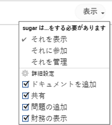
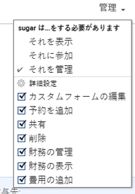

# オブジェクトに対する財務権限の共有

Adobe Workfront管理者は、アクセスレベルを割り当てる際に、財務データの表示や編集のためのアクセス権を付与できます。 詳しくは、 [財務データへのアクセス権の付与](../../administration-and-setup/add-users/configure-and-grant-access/grant-access-financial.md).

ユーザーに付与されるアクセスレベルに加えて、共有する特定のプロジェクト、タスク、または問題に対して、ユーザーに対して [ 財務の表示 ] または [ 管理 ] の権限を付与することもできます。

各アクセスレベルのユーザーが財務データに対して実行できる操作について詳しくは、 [財務データ](../../administration-and-setup/add-users/access-levels-and-object-permissions/functionality-available-for-each-object-type.md#financia) 記事内 [各オブジェクトタイプで使用できる機能](../../administration-and-setup/add-users/access-levels-and-object-permissions/functionality-available-for-each-object-type.md).

## アクセス要件

<!--drafted for P&P:

<table style="table-layout:auto"> 
 <col> 
 <col> 
 <tbody> 
  <tr> 
   <td role="rowheader">Adobe Workfront plan*</td> 
   <td> 
Any 
 </td> 
  </tr> 
  <tr> 
   <td role="rowheader">Adobe Workfront license*</td> 
   <td> 
Current license: Standard 
 
   Or
   
Legacy license: Plan 
</td> 
  </tr> 
  <tr> 
   <td role="rowheader">Access level configurations*</td> 
   <td> 
View or higher access to Projects, Tasks, Issues, and Financial&nbsp;Data
 
<b>NOTE</b>
   
   If you still don't have access, ask your Workfront administrator if they set additional restrictions in your access level. For information on how a Workfront administrator can modify your access level, see <a href="../../administration-and-setup/add-users/configure-and-grant-access/create-modify-access-levels.md" class="MCXref xref">Create or modify custom access levels</a>.
 </td> 
  </tr> 
  <tr> 
   <td role="rowheader">Object permissions</td> 
   <td> 
View permissions or higher to projects, tasks, and issues that include at least View Finance permissions
 
For information on requesting additional access, see <a href="../../workfront-basics/grant-and-request-access-to-objects/request-access.md" class="MCXref xref">Request access to objects </a>.
 </td> 
  </tr> 
 </tbody> 
</table>
-->
オブジェクトに関する財務データ情報を共有するには、次の条件を満たす必要があります。

<table style="table-layout:auto"> 
 <col> 
 <col> 
 <tbody> 
  <tr> 
   <td role="rowheader">Adobe Workfront plan*</td> 
   <td> 
任意 
 </td> 
  </tr> 
  <tr> 
   <td role="rowheader">Adobe Workfront license*</td> 
   <td> 
計画 
 </td> 
  </tr> 
  <tr> 
   <td role="rowheader">アクセスレベル設定*</td> 
   <td> 
プロジェクト、タスク、問題、および財務データへのアクセス権を表示または高くします
 
注意：まだアクセス権がない場合は、Workfront管理者に、アクセスレベルに追加の制限を設定しているかどうかを問い合わせてください。 Workfront管理者がアクセスレベルを変更する方法について詳しくは、 <a href="../../administration-and-setup/add-users/configure-and-grant-access/create-modify-access-levels.md" class="MCXref xref">カスタムアクセスレベルの作成または変更</a>.
 </td> 
  </tr> 
  <tr> 
   <td role="rowheader">オブジェクト権限</td> 
   <td> 
少なくとも View Finance 権限を含むプロジェクト、タスク、および問題に対する権限以上の表示
 
追加のアクセス権のリクエストについて詳しくは、 <a href="../../workfront-basics/grant-and-request-access-to-objects/request-access.md" class="MCXref xref">オブジェクトへのアクセスのリクエスト </a>.
 </td> 
  </tr> 
 </tbody> 
</table>

&#42;保有しているプラン、ライセンスの種類、アクセス権を確認するには、Workfront管理者に問い合わせてください。

## オブジェクトの共有と財務権限の付与

オブジェクトに財務権限を付与する場合は、次の点を考慮してください。

* プロジェクト、タスクおよびタスクに対する財務権限を付与できます。
* 権限は継承されます。プロジェクトに対する「財務の表示」権限を持っている場合、プロジェクトのタスクおよび問題に対する「財務の表示」権限が自動的に継承されます。

オブジェクトに財務権限を付与するには、次の手順に従います。

1. 他のユーザーと共有するタスク、プロジェクト、またはタスクに移動します。
1. オブジェクトの名前の近くにある「その他」メニューをクリックします を選択し、「 **共有**.

1. 内 **与える `<Object name>` ～へのアクセス** フィールドに、オブジェクトを共有するユーザー、チーム、ロール、グループまたは会社の名前を入力します。

   >[!TIP]
   >
   >オブジェクトを共有できるのは、アクティブなユーザー、チーム、役割、会社のみです。

1. 選択した名前の右側にドロップダウンメニューが表示された場合は、次の使用可能なオプションの 1 つをクリックします。

   * **それを表示**
   * **それに参加**
   * **それを管理**

             

1. 同じドロップダウンメニューで、 **詳細設定**&#x200B;次のいずれかの操作を行います。

   * 前の手順で 3 つのオプションのいずれかを選択した場合は、 **財務を表示** が選択されている。
   * 選択した場合 **財務の管理** 前の手順で、 **財務の管理** が選択されている。

1. 「**保存**」をクリックします。

## すべての共有レベルに対する財務権限

次の表に、オブジェクトに対する表示、投稿、または管理の権限をユーザーに付与した場合に得られる財務権限を示します。 

<table style="table-layout:auto"> 
 <col> 
 <col> 
 <col> 
 <col> 
 <thead> 
  <tr> 
   <th><strong>アクション</strong> </th> 
   <th><strong>管理</strong> </th> 
   <th><strong>参加</strong> </th> 
   <th><strong>ビュー</strong> </th> 
  </tr> 
 </thead> 
 <tbody> 
  <tr> 
   <td>請求レコードの管理</td> 
   <td>✓</td> 
   <td> 
 
 </td> 
   <td> </td> 
  </tr> 
  <tr> 
   <td>ロールの請求およびコストレートの管理/表示</td> 
   <td>✓</td> 
   <td> </td> 
   <td> </td> 
  </tr> 
  <tr> 
   <td>ユーザーの請求とコスト率の管理/表示</td> 
   <td>✓</td> 
   <td> </td> 
   <td> </td> 
  </tr> 
  <tr> 
   <td>財務情報の表示</td> 
   <td>✓</td> 
   <td>✓</td> 
   <td> ✓</td> 
  </tr> 
  <tr> 
   <td>生産資源計画ツールで原価別に情報を表示します。</td> 
   <td>✓</td> 
   <td>✓</td> 
   <td>✓</td> 
  </tr> 
  <tr> 
   <td>リソース計画ツールの予算リソース*</td> 
   <td>✓</td> 
   <td> </td> 
   <td> </td> 
  </tr> 
  <tr> 
   <td>リソース計画ツールでのリソースの表示*</td> 
   <td>✓</td> 
   <td>✓</td> 
   <td> 
✓
 </td> 
  </tr> 
 </tbody> 
</table>

&#42;追加のリソース管理アクセスが必要です。

リソース管理アクセスの詳細については、 [リソース管理へのアクセス権の付与](../../administration-and-setup/add-users/configure-and-grant-access/grant-access-resource-management.md).
