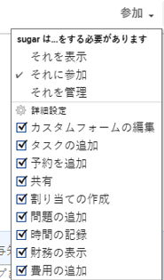

# オブジェクトに対する財務権限の共有

{{highlighted-preview}}

Adobe Workfront 管理者は、アクセスレベルを割り当てる際に、ユーザーに財務データの表示や編集のアクセス権を付与できます。詳しくは、[財務データへのアクセスを許可](../../administration-and-setup/add-users/configure-and-grant-access/grant-access-financial.md)を参照してください。

ユーザーに付与されるアクセスレベルに加えて、自分が共有のアクセス権を持つ特定のプロジェクトや、タスク、イシューの財務データを表示または管理する権限をユーザーに付与することもできます。

各アクセスレベルのユーザーが財務データに対して実行できる操作について詳しくは、[各オブジェクトタイプで使用できる機能](../../administration-and-setup/add-users/access-levels-and-object-permissions/functionality-available-for-each-object-type.md)の記事にある[財務データ](../../administration-and-setup/add-users/access-levels-and-object-permissions/functionality-available-for-each-object-type.md#financia)の節を参照してください。

## アクセス要件

<!--drafted for P&P:

<table style="table-layout:auto"> 
 <col> 
 <col> 
 <tbody> 
  <tr> 
   <td role="rowheader">Adobe Workfront plan*</td> 
   <td> 
Any 
 </td> 
  </tr> 
  <tr> 
   <td role="rowheader">Adobe Workfront license*</td> 
   <td> 
Current license: Standard 
 
   Or
   
Legacy license: Plan 
</td> 
  </tr> 
  <tr> 
   <td role="rowheader">Access level configurations*</td> 
   <td> 
View or higher access to Projects, Tasks, Issues, and Financial&nbsp;Data
 
<b>NOTE</b>
   
   If you still don't have access, ask your Workfront administrator if they set additional restrictions in your access level. For information on how a Workfront administrator can modify your access level, see <a href="../../administration-and-setup/add-users/configure-and-grant-access/create-modify-access-levels.md" class="MCXref xref">Create or modify custom access levels</a>.
 </td> 
  </tr> 
  <tr> 
   <td role="rowheader">Object permissions</td> 
   <td> 
View permissions or higher to projects, tasks, and issues that include at least View Finance permissions
 
For information on requesting additional access, see <a href="../../workfront-basics/grant-and-request-access-to-objects/request-access.md" class="MCXref xref">Request access to objects </a>.
 </td> 
  </tr> 
 </tbody> 
</table>
-->
オブジェクトに関する財務データ情報を共有するには、次の条件を満たしている必要があります。

<table style="table-layout:auto"> 
 <col> 
 <col> 
 <tbody> 
  <tr> 
   <td role="rowheader">Adobe Workfront プラン*</td> 
   <td> 
任意 
 </td> 
  </tr> 
  <tr> 
   <td role="rowheader">Adobe Workfront ライセンス*</td> 
   <td> 
プラン 
 </td> 
  </tr> 
  <tr> 
   <td role="rowheader">アクセスレベル設定*</td> 
   <td> 
プロジェクト、タスク、イシュー、および財務データに対する表示以上のアクセス権
 
メモ：まだアクセス権がない場合は、アクセスレベルに追加の制限が設定されていないかどうか Workfront 管理者にお問い合わせください。Workfront 管理者がユーザーのアクセスレベルを変更する方法については、<a href="../../administration-and-setup/add-users/configure-and-grant-access/create-modify-access-levels.md" class="MCXref xref">カスタムアクセスレベルの作成または変更</a>を参照してください。
 </td> 
  </tr> 
  <tr> 
   <td role="rowheader">オブジェクト権限</td> 
   <td> 
プロジェクト、タスク、およびイシューに対する表示以上の権限（財務の表示以上の権限を含む）
 
追加のアクセス権のリクエストについて詳しくは、<a href="../../workfront-basics/grant-and-request-access-to-objects/request-access.md" class="MCXref xref">オブジェクトへのアクセス権のリクエスト</a>を参照してください。
 </td> 
  </tr> 
 </tbody> 
</table>

&#42;保有するプラン、ライセンスタイプ、アクセス権を確認するには、Workfront 管理者にお問い合わせください。

## オブジェクトの共有と財務権限の付与

オブジェクトに財務権限を付与する場合は、次の点を考慮してください。

* プロジェクト、タスク、イシュー、およびレートカードに対して財務権限を付与できます。
* 権限は継承できます。プロジェクトに対する財務の表示権限を持っている場合、そのプロジェクトのタスクとイシューに対する財務の表示権限が自動的に継承されます。

オブジェクトに財務権限を付与するには、次の手順に従います。

1. 他のユーザーと共有するタスク、プロジェクト、またはイシューに移動します。
1. オブジェクト名の近くにあるその他メニュー  をクリックして、「**共有**」をクリックします。

1. 「**`<Object name>` のアクセス権の付与先**」フィールドに、そのオブジェクトを共有するユーザー、チーム、役割、グループ、または会社の名前を入力します。

   >[!TIP]
   >
   >オブジェクトを共有できるのは、アクティブなユーザー、チーム、役割、または会社のみです。

1. 選択した名前の右側にドロップダウンメニューが表示された場合は、次の使用可能なオプションのいずれかをクリックします。

   * **それを表示**
   * **それに参加**
   * **それを管理**

            

1. 同じドロップダウンメニューで、「**詳細設定**」をクリックして、次のいずれかを実行します。

   * 前の手順で 3 つのオプションのいずれかを選択した場合は、「**財務を表示**」が選択されていることを確認します。
   * 前の手順で「**財務の管理**」を選択した場合は、「**財務の管理**」が選択されていることを確認します。

1. 「**保存**」をクリックします。

## すべての共有レベルに対する財務の権限

次の表に、オブジェクトに対する表示、参加、管理の権限をユーザーに付与した場合に、ユーザーに与えられる財務の権限を示します。

<table style="table-layout:auto"> 
 <col> 
 <col> 
 <col> 
 <col> 
 <thead> 
  <tr> 
   <th><strong>アクション</strong> </th> 
   <th><strong>管理</strong> </th> 
   <th><strong>参加</strong> </th> 
   <th><strong>ビュー</strong> </th> 
  </tr> 
 </thead> 
 <tbody> 
  <tr> 
   <td>請求レコードの管理</td> 
   <td>✓</td> 
   <td> 
 
 </td> 
   <td> </td> 
  </tr> 
  <tr> 
   <td>役割の請求レートとコスト率の管理と表示</td> 
   <td>✓</td> 
   <td> </td> 
   <td> </td> 
  </tr> 
  <tr> 
   <td>ユーザー請求レートとコスト率の管理と表示</td> 
   <td>✓</td> 
   <td> </td> 
   <td> </td> 
  </tr> 
  <tr> 
   <td>財務情報を表示</td> 
   <td>✓</td> 
   <td>✓</td> 
   <td> ✓</td> 
  </tr> 
  <tr> 
   <td>評価カードを管理</td> 
   <td>✓</td> 
   <td> 
 
 </td> 
   <td> </td> 
  </tr> 
  <tr> 
   <td>評価カードを表示</td> 
   <td>✓</td> 
   <td>✓</td> 
   <td> ✓</td> 
  </tr>
  <tr> 
   <td>リソース計画ツールでコスト別に情報を表示する</td> 
   <td>✓</td> 
   <td>✓</td> 
   <td>✓</td> 
  </tr> 
  <tr> 
   <td>リソース計画ツールでリソース予算計上*</td> 
   <td>✓</td> 
   <td> </td> 
   <td> </td> 
  </tr> 
  <tr> 
   <td>リソース計画ツールでのリソースの表示*</td> 
   <td>✓</td> 
   <td>✓</td> 
   <td> 
✓
 </td> 
  </tr> 
 </tbody> 
</table>

&#42;追加のリソース管理アクセス権が必要です。

リソース管理アクセスについて詳しくは、[リソース管理へのアクセス権の付与](../../administration-and-setup/add-users/configure-and-grant-access/grant-access-resource-management.md)を参照してください。
