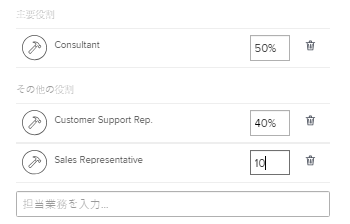

# 設定を行う

<!--

Edit the job role FTE percentage allocation blurbs when more functionality is released: now, it says that the % is that of the user's schedule, but it will be either the user's schedule or the system schedule.

-->

お使いの [!DNL Adobe Workfront] プロファイルには、自分に関する情報（自分の名前、電子メールアドレス、住所、電話番号、役職など）が含まれます。 また、 [!DNL Workfront] および社内の他のユーザー（通知設定や、に表示するタブなど） [!DNL Workfront]または自分の職務の役割、マネージャー、グループ、チームのメンバーシップ )。

この情報のほとんどは、 [!DNL Workfront] 管理者 [!DNL Workfront] アカウントが作成されました。

のアクセスレベルに応じて [!DNL Workfront]を編集する場合、 [!UICONTROL マイ設定] 領域。

## アクセスレベルが [!UICONTROL マイ設定] 領域

現在のアクセスレベルに応じて、 [!UICONTROL マイ設定] 領域。

編集可能なセクションに含まれる一部のフィールドは、アクセスレベルで設定されている、または設定されていない他の設定によっては、編集できません。 の一部のフィールドの編集に必要な追加のアクセス権の詳細 [!UICONTROL マイ設定]」を参照してください。詳しくは、 [の設定 [!UICONTROL マイ設定] 領域](#configuring-the-my-settings-area).

アクセスレベルを確認するには、 [!DNL Workfront] 管理者。

次のグリッドは、 [!UICONTROL マイ設定] 領域は、アクセスレベルに応じて表示または編集できます。

<table style="table-layout:auto"> 
 <col> 
 <col> 
 <col> 
 <col> 
 <col> 
 <col> 
 <col> 
 <thead> 
  <tr> 
   <th><strong>[!UICONTROL マイ設定 ] 領域</strong> </th> 
   <th><strong>表示または編集可能</strong> </th> 
   <th><strong>[!UICONTROL システム管理者 ]</strong> </th> 
   <th><strong>[!UICONTROL プランナー ]</strong> </th> 
   <th><strong>[!UICONTROL Worker]</strong> </th> 
   <th><strong>[!UICONTROL レビュー担当者 ]</strong> </th> 
   <th><strong>[!UICONTROL リクエスト元 ]</strong> </th> 
  </tr> 
 </thead> 
 <tbody> 
  <tr> 
   <td rowspan="2">[!UICONTROL 個人情報 ]</td> 
   <td> 
表示
 </td> 
   <td> 
✔
 </td> 
   <td> ✔</td> 
   <td>✔ </td> 
   <td>✔ </td> 
   <td> ✔</td> 
  </tr> 
  <tr> 
   <td> 
編集可能
 </td> 
   <td> 
✔
 </td> 
   <td> ✔</td> 
   <td> ✔</td> 
   <td>✔ </td> 
   <td>✔ </td> 
  </tr> 
  <tr> 
   <td rowspan="2">[!UICONTROL 環境設定 ]</td> 
   <td> 
表示
 </td> 
   <td> 
✔
 </td> 
   <td> ✔</td> 
   <td>✔ </td> 
   <td>✔ </td> 
   <td>✔ </td> 
  </tr> 
  <tr> 
   <td> 
編集可能
 </td> 
   <td> 
✔
 </td> 
   <td>✔ </td> 
   <td>✔ </td> 
   <td>✔ </td> 
   <td>✔ </td> 
  </tr> 
  <tr> 
   <td rowspan="2">[!UICONTROL 通知 ]</td> 
   <td> 
表示
 </td> 
   <td> 
✔
 </td> 
   <td>✔ </td> 
   <td>✔ </td> 
   <td> ✔</td> 
   <td>✔ </td> 
  </tr> 
  <tr> 
   <td> 
編集可能
 </td> 
   <td> 
✔
 </td> 
   <td>✔ </td> 
   <td>✔ </td> 
   <td> ✔</td> 
   <td> ✔</td> 
  </tr> 
  <tr> 
   <td rowspan="2">[!UICONTROL アクセス ]</td> 
   <td>表示</td> 
   <td> ✔</td> 
   <td>✔ </td> 
   <td> </td> 
   <td> </td> 
   <td> </td> 
  </tr> 
  <tr> 
   <td>編集可能</td> 
   <td> ✔</td> 
   <td> </td> 
   <td> </td> 
   <td> </td> 
   <td> </td> 
  </tr> 
  <tr> 
   <td rowspan="2">[!UICONTROL 組織 ]</td> 
   <td>表示</td> 
   <td>✔</td> 
   <td>✔ </td> 
   <td> </td> 
   <td> </td> 
   <td> </td> 
  </tr> 
  <tr> 
   <td>編集可能</td> 
   <td>✔</td> 
   <td>✔ </td> 
   <td> </td> 
   <td> </td> 
   <td> </td> 
  </tr> 
  <tr> 
   <td rowspan="2">[!UICONTROL リソース計画 ]</td> 
   <td>表示</td> 
   <td>✔</td> 
   <td>✔ </td> 
   <td> </td> 
   <td> </td> 
   <td> </td> 
  </tr> 
  <tr> 
   <td>編集可能</td> 
   <td>✔</td> 
   <td>✔ </td> 
   <td> </td> 
   <td> </td> 
   <td> </td> 
  </tr> 
  <tr> 
   <td rowspan="2">[!UICONTROL カスタムForms]</td> 
   <td>表示</td> 
   <td>✔</td> 
   <td>✔ </td> 
   <td>✔</td> 
   <td>✔ </td> 
   <td>✔ </td> 
  </tr> 
  <tr> 
   <td>編集可能</td> 
   <td>✔ </td> 
   <td>✔ </td> 
   <td> </td> 
   <td> </td> 
   <td> </td> 
  </tr> 
  <tr> 
   <td rowspan="2">[!UICONTROL コメント ]</td> 
   <td>表示</td> 
   <td>✔</td> 
   <td>✔ </td> 
   <td>✔ </td> 
   <td>✔ </td> 
   <td>✔ </td> 
  </tr> 
  <tr> 
   <td>編集可能</td> 
   <td>✔ </td> 
   <td>✔ </td> 
   <td>✔ </td> 
   <td>✔ </td> 
   <td>✔ </td> 
  </tr> 
 </tbody> 
</table>

## の設定 [!UICONTROL マイ設定] 領域

1. 次をクリック： **[!UICONTROL メインメニュー]** アイコン  Adobe Workfrontの右上隅で、プロフィール画像の横にあるユーザー名をクリックします。 または（使用可能な場合）、上部のナビゲーション領域のプロフィール画像をクリックし、 **[!UICONTROL Workfront Profile]**.
1. 次をクリック： **[!UICONTROL その他]** メニュー を選択し、次に **[!UICONTROL 編集]**.

1. アクセスレベルに応じて、次のセクションを更新できます。

   * [個人情報](#personal-info)
   * [環境設定](#preferences)
   * [通知](#notifications)
   * [アクセス](#access)
   * [組織](#organization)
   * [リソース計画](#resource-planning)
   * [カスタムフォーム](#custom-form)
   * [コメント](#comment)

1. 「**[!UICONTROL 保存]**」をクリックします。

### [!UICONTROL 個人情報]

このセクションには、次のサブセクションが含まれます。

* [基本情報](#basic-info)
* [ジョブ情報](#job-info)
* [連絡先情報](#contact-info)

#### [!UICONTROL 基本情報]

この情報は、 [!DNL Workfront] 管理者。 このサブセクションのすべてのフィールドは必須フィールドです。

このサブセクションでは、次のいずれかを変更できます。

<table style="table-layout:auto"> 
 <col> 
 <col> 
 <tbody> 
  <tr> 
   <td role="rowheader"><strong>[!UICONTROL 名 ]</strong></td> 
   <td>名を更新します。 必須フィールドです。</td> 
  </tr> 
  <tr> 
   <td role="rowheader"><strong>[!UICONTROL 姓 ]</strong></td> 
   <td>姓を更新します。 必須フィールドです。</td> 
  </tr> 
  <tr> 
   <td role="rowheader"><strong>[!UICONTROL 電子メールアドレス ]</strong></td> 
   <td> 電子メールアドレスを更新します。 これは必須フィールドです. 電子メールアドレスは、 [!DNL Workfront].</td> 
  </tr> 
  <tr> 
   <td role="rowheader"><strong>[!UICONTROL パスワードをリセット ]</strong></td> 
   <td>このセクションでパスワードをリセットします。 パスワードのリセットについて詳しくは、 <a href="../../../workfront-basics/manage-your-account-and-profile/managing-your-workfront-account/reset-your-password.md" class="MCXref xref">パスワードをリセット</a>.</td> 
  </tr> 
  <tr> 
   <td role="rowheader"><strong>（条件付き） &lt;sso configuration=""&gt; [!UICONTROL ユーザー名 ]</strong></td> 
   <td> 次の場合、 [!DNL Workfront] 管理者がとの SSO 統合を有効にしました [!DNL Workfront]に設定すると、SSO ユーザー名がこのフィールドに表示されます。 お使いのに対して有効にされた SSO 設定の種類 [!DNL Workfront] インスタンスは、このフィールドに表示されます。</td> 
  </tr> 
  <tr> 
   <td role="rowheader"><strong>（条件付き） [!UICONTROL のみ許可 &lt;sso configuration=""&gt; 認証 ]</strong></td> 
   <td> 
 次の場合、 [!DNL Workfront] 管理者がとの SSO 統合を有効にしました [!DNL Workfront] とは SSO 用にユーザーを更新しました。このフィールドはデフォルトで選択されています。 お使いのに対して有効にされた SSO 設定の種類 [!DNL Workfront] インスタンスは、このフィールドに表示されます。
 
このフィールドを選択した場合、 [!DNL Workfront] SSO 資格情報を使用します。 チェックを外すと、にログインできるようになります。 [!DNL Workfront] を [!DNL Workfront] 認証情報。
 
設定に関する詳細 [!DNL Workfront] SSO ソリューションの場合は、 <a href="../../../administration-and-setup/add-users/single-sign-on/single-sign-on.md" class="MCXref xref">シングルサインオン [!DNL Adobe Workfront]</a>. SSO のユーザーの更新の詳細は、 <a href="../../../administration-and-setup/add-users/single-sign-on/update-users-sso.md" class="MCXref xref">シングルサインオンのユーザーを更新する</a>.
 </td> 
  </tr> 
 </tbody> 
</table>

#### [!UICONTROL ジョブ情報]

このサブセクションでは、次のいずれかを変更できます。

<table style="table-layout:auto">
    <tr>
        <td><strong>[!UICONTROL タイトル ]</strong></td>
        <td>タイトルを指定します。 これはあなたの仕事の役割とは異なります。 役割はですが、役職はリソーススケジュール設定には含まれていません。 タイトルは、 [!DNL Workfront] インターフェイスを使用して、お客様の名前とアバターが表示されるすべての場所に配置できます。 この画面は、ユーザーにアクセスできるすべてのユーザーに表示されます。</td>
    </tr>
    <tr>
        <td><strong>[!UICONTROL お問い合わせ情報 ]</strong></td>
        <td>このフィールドに職業上の関心を指定します。</td>
    </tr>
</table>

#### [!UICONTROL 連絡先情報]

このサブセクションでは、次のいずれかを変更できます。

<table style="table-layout:auto">
    <tr>
        <td><strong>[!UICONTROL 電話番号 ]</strong></td>
        <td> </td>
    </tr>
    <tr>
        <td><strong>[!UICONTROL 拡張機能 ]</strong></td>
        <td> </td>
    </tr>
    <tr>
        <td><strong>[!UICONTROL モバイル番号 ]</strong></td>
        <td> </td>
    </tr>
    <tr>
        <td><strong>[!UICONTROL アドレス ]</strong></td>
        <td> </td>
    </tr>
    <tr>
        <td><strong>[!UICONTROL City]</strong></td>
        <td> </td>
    </tr>
    <tr>
        <td><strong>[!UICONTROL 状態 ]</strong></td>
        <td> </td>
    </tr>
    <tr>
        <td><strong>[!UICONTROL 郵便番号 ]</strong></td>
        <td> </td>
    </tr>
    <tr>
        <td><strong>[!UICONTROL 国 ]</strong></td>
        <td> </td>
    </tr>
    <tr>
        <td><strong>[!UICONTROL プロファイル画像 ]</strong></td>
        <td>プロフィール画像がアバターになり、 [!DNL Workfront] システムの任意の場所に表示されます。</td>
    </tr>
</table>

### [!UICONTROL 環境設定]

表示する内容を [!DNL Workfront] この節のインターフェイスを参照してください。

>[!NOTE]
>
>を持つユーザー [!UICONTROL 要求者] ライセンスには、他にパネルに追加できる項目はありません [!UICONTROL メインメニュー]( [!UICONTROL リクエスト] 領域。 As a [!DNL Workfront] 管理者は、要求者のライセンスを持つユーザを、 [!UICONTROL メインメニュー]. その後、表示する領域を選択できます [!UICONTROL メインメニュー] ユーザープロファイルを編集することで、

このサブセクションでは、次のいずれかを変更できます。

<table style="table-layout:auto"> 
 <col> 
 <col> 
 <tbody>
  <tr> 
   <td role="rowheader"><strong>[!UICONTROL タイムゾーン ]</strong> </td> 
   <td>
タイムゾーンを指定します。 これは、送信する電子メールメッセージに表示される時間を制御します。

       
タイムゾーンは、PTO カレンダーレポートに表示される内容にも影響します。
</td>
  </tr> 
  <tr> 
   <td role="rowheader"><strong>[!UICONTROL 電子メールロケール ]</strong> </td> 
   <td>ここで優先言語を指定します。 これは、送信電子メールメッセージで使用される言語、日付、および数値の形式を制御します。</td> 
  </tr> 
  <tr> 
   <td role="rowheader"><strong>[!UICONTROL 更新ステータスの完了率を表示 ]</strong> </td> 
   <td>タスクの [!UICONTROL ステータスの更新 ] フィールドにパーセント記号を表示するには、このチェックボックスを選択します。これにより、タスクの更新の入力時にタスクの完了率を更新できます。</td> 
  </tr> 
  <tr> 
   <td role="rowheader"><strong>[!UICONTROL 自分に割り当てられた作業を自分の「作業」タブに送信する ]</strong> </td> 
   <td>このフィールドを選択して、自分に割り当てている作業を「[!UICONTROL 作業リクエスト ]」タブではなく「[!UICONTROL 作業中 ]」タブで直接表示します。</td> 
  </tr> 
  <tr> 
   <td role="rowheader"><strong>（条件付き）ドキュメントのアップロード時に配達確認を自動的に生成する</strong></td> 
   <td>ドキュメントがに読み込まれた直後に配達確認の生成を開始するには、このフィールドを選択します。 [!DNL Workfront]. このフィールドはデフォルトで無効になっており、Workfront管理者のみが更新できます。 このフィールドは、WorkfrontのWorkfront配達確認コンポーネントを購入し、配達確認ユーザーとして有効になっている場合にのみ表示されます。 Workfront Proof について詳しくは、 <a href="../../../review-and-approve-work/proofing/managing-proofs-within-workfront/manage-proofs-in-wf.md" class="MCXref xref">Adobe Workfront内での配達確認の管理</a>.
   
<b>注意：</b> リクエストにアップロードされたドキュメントは、配達確認を自動生成しません。 
</td> 
  </tr> 
 </tbody> 
</table>

### [!UICONTROL 通知]

受信する通知を指定します [!DNL Workfront]. 通知の設定について詳しくは、 [独自の電子メール通知を変更する](../../../workfront-basics/using-notifications/activate-or-deactivate-your-own-event-notifications.md).

### [!UICONTROL アクセス]

アクセスおよびそれに関連付けられている他のコンポーネントは、 [!DNL Workfront] 管理者に問い合わせてください。

a のみ [!DNL Workfront] 管理者は、この節のすべてのフィールドを表示して編集できます。

このサブセクションでは、次のいずれかを変更できます。

<table style="table-layout:auto"> 
 <col> 
 <col> 
 <tbody> 
  <tr> 
   <td role="rowheader"><strong>[!UICONTROL がアクティブです ]</strong> </td> 
   <td>このフィールドは、同じく [!DNL Workfront] 管理者。デフォルトでオンにする必要があります。 これは、ユーザーがアクティブで、にログインできることを示します。 [!DNL Workfront]</td> 
  </tr> 
  <tr> 
   <td role="rowheader"><strong>[!UICONTROL アクセスレベル ]</strong> </td> 
   <td>このフィールドは、[!UICONTROL プラン ] または [!UICONTROL Workfront管理者 ] のアクセスレベルのユーザーに対して表示され、次の場合にのみ編集できます。 [!DNL Workfront] 管理者。 次の場合、 [!DNL Workfront] 管理者は、このフィールドを変更する際に、アクセスレベルを低い値に変更しないように注意してください。 </td> 
  </tr> 
  <tr> 
   <td role="rowheader"><strong>[!UICONTROL レイアウトテンプレート ]</strong> </td> 
   <td>このフィールドは、[!UICONTROL プラン ] または [!UICONTROL] を持つユーザーに表示されます [!DNL Workfront] administrator] アクセスレベルで、[!UICONTROL] でのみ編集可能 [!DNL Workfront] [!UICONTROL Plan] ライセンスを持つ管理者 ] またはユーザー（管理者ユーザーアクセス権も持つユーザー） ここでレイアウトテンプレートを選択し、Workfrontインターフェイスの外観とフィールドを更新します。 管理ユーザーアクセス権を持つユーザーの設定について詳しくは、 <a href="../../../administration-and-setup/add-users/configure-and-grant-access/grant-access-other-users.md#access-to-edit" class="MCXref xref">カスタムアクセスレベルを使用してユーザーのアクセスを設定し、ユーザーを編集します</a> in <a href="../../../administration-and-setup/add-users/configure-and-grant-access/grant-access-other-users.md" class="MCXref xref">ユーザーへのアクセス権の付与</a>. レイアウトテンプレートとインターフェイスに対する影響について詳しくは、 <a href="../../../administration-and-setup/customize-workfront/use-layout-templates/create-and-manage-layout-templates.md" class="MCXref xref">レイアウトテンプレートの作成と管理</a></td> 
  </tr> <!--
   <tr data-mc-conditions="QuicksilverOrClassic.Draft mode"> 
    <td role="rowheader"><strong>Log in as</strong> </td> 
    <td> 
<strong>Add access</strong> for a Workfront administrator or group administrator (associated with a group you are in) to log in as you. Select an <strong>Access expiration date</strong> for the login. 
 
You can repeat this to grant login access to multiple administrators.
 
The settings you choose in this section are visible only to you.
       <MadCap:conditionalText data-mc-conditions="QuicksilverOrClassic.Draft mode"> 
        Add a note about this being only for the Enterprise package if they decide to do it that way. Functionality that may come in a later sprint: If you want to be notified when the administrator logs in as you, select Receive an email when this user logs in. 
       </MadCap:conditionalText>
      
 </td> 
   </tr>
  --> 
  <tr> 
   <td role="rowheader"><strong>（条件付き）[!UICONTROL ユーザーは配達確認（... / ...配達確認ライセンスが残っている）を生成できます ]</strong></td> 
   <td>このフィールドは、レガシー [!DNL Workfront] プランおよび購入済み [!DNL Workfront Proof] コンポーネント。 このオプションを選択すると、校正ユーザーとして有効になります。 また、購入した配達確認ライセンスの合計数の中で、システムで使用されている配達確認ライセンスの数も表示されます。 このフィールドは、同じユーザーに対してのみ表示および編集可能です [!DNL Workfront] 管理者。 での校正のためのプランオプションの詳細 [!DNL Workfront]を参照してください。 <a href="/help/quicksilver/administration-and-setup/manage-workfront/configure-proofing/access-to-proofing-functionality.md">での校正機能へのアクセス [!DNL Workfront]</a>.</td>
  </tr> 
  <tr> 
   <td role="rowheader"><strong>（条件付き）[!UICONTROL 権限プロファイル ]</strong></td> 
   <td> 
このフィールドには、 [!DNL Workfront Proof]. 次の場合にのみ使用できます。
 
    <ul> 
     <li>レガシーを使用している [!DNL Workfront] プランおよび購入済み [!DNL Workfront Proof] コンポーネントを使用しているか、新しい [!DNL Workfront] プラン</li> 
     <li>配達確認ユーザーとして有効になっています。</li> 
    </ul> 
[!DNL Workfront] 管理者は、自分を除くすべてのユーザーのフィールドを編集できるので、すべてのユーザーは、自分のプロファイルでこのフィールドを表示のみとして表示できます。 権限プロファイルについて詳しくは、 <a href="../../../review-and-approve-work/proofing/proofing-overview/permission-profiles.md" class="MCXref xref">配達確認権限プロファイルの概要</a>.
 </td> 
  </tr> 
 </tbody> 
</table>

### [!UICONTROL 組織]

この情報は通常、 [!DNL Workfront] 管理者が [!DNL Workfront] アカウント。 また、この節では、組織や組織の構造に関する情報を更新することもできます。 次を持つユーザーのみ： [!UICONTROL プラン] または [!UICONTROL システム管理者] アクセスレベルでこのセクションを編集できます。 

このサブセクションでは、次のいずれかを変更できます。

<table style="table-layout:auto"> 
 <col> 
 <col> 
 <tbody> 
  <tr> 
   <td role="rowheader"><strong>[!UICONTROL 会社 ]</strong></td> 
   <td>ドロップダウンリストから、所属する会社の名前を選択します。</td> 
  </tr> 
  <tr> 
   <td role="rowheader"><strong>（条件付き） [!UICONTROL レポート先 ]</strong></td> 
   <td>次の項目を選択した後、 <strong>[!UICONTROL 会社 ]</strong> また、プロファイルの場合は、このフィールドでマネージャーの名前を指定できます。 ここで指定できる名前は 1 つだけです。即時管理者の名前を指定することをお勧めします。 名前を入力し、リストに表示されたらクリックして選択します。</td> 
  </tr> 
  <tr> 
   <td role="rowheader"><strong>（条件付き）[!UICONTROL 直属のレポート ]</strong></td> 
   <td>次の項目を選択した後、 <strong>[!UICONTROL 会社 ]</strong> また、このフィールドでは、ダイレクトレポートの名前を指定することもできます。 ここでは、必要な数の直属のレポートを指定できます。 名前を入力し、リストに表示されたら、クリックして選択します。</td> 
  </tr> 
  <tr> 
   <td role="rowheader"><strong>[!UICONTROL ホームチーム ]</strong> </td> 
   <td> 
を選択します。 <strong>[!UICONTROL ホームチーム ]</strong> を選択します。 このフィールドは、[!UICONTROL プラン ] または [!UICONTROL システム管理者 ] のアクセスレベルを持つユーザーに対して表示され、次の場合にのみ編集できます。 [!DNL Workfront] [!UICONTROL Plan] ライセンスを持つ管理者またはユーザーで、管理者ユーザーアクセス権も持っているもの。 管理ユーザーアクセス権を持つユーザーの設定について詳しくは、 <a href="../../../administration-and-setup/add-users/configure-and-grant-access/grant-access-other-users.md#access-to-edit" class="MCXref xref">カスタムアクセスレベルを使用してユーザーのアクセスを設定し、ユーザーを編集します</a> in <a href="../../../administration-and-setup/add-users/configure-and-grant-access/grant-access-other-users.md" class="MCXref xref">ユーザーへのアクセス権の付与</a>. 
 
お使いの <strong>ホームチーム</strong> は、の外観と操作性に影響を与えます [!DNL Workfront] インターフェイス：レイアウトテンプレートがチームに関連付けられている場合。 
 
  チームについて詳しくは、 <a href="../../../people-teams-and-groups/create-and-manage-teams/teams-overview.md" class="MCXref xref">チームの概要</a>.
 </td> 
  </tr> 
  <tr> 
   <td role="rowheader"><strong>[!UICONTROL その他のチーム ]</strong> </td> 
   <td> 
複数のチームに属することができます。 チーム名の入力を開始し、リストに表示されるときにクリックして選択することで、このフィールドに所属する追加のチームを指定します。 チームが多すぎると、チームに割り当てられた作業について混乱が生じる可能性があります。 チームについて詳しくは、 <a href="../../../people-teams-and-groups/create-and-manage-teams/teams-overview.md" class="MCXref xref">チームの概要</a>.
 
このフィールドは、[!UICONTROL プラン ] または [!UICONTROL System Administrator] のライセンスを持つユーザーに対して表示され、次の場合にのみ編集できます。 [!DNL Workfront] [!UICONTROL Plan] ライセンスを持つ管理者またはユーザーで、管理者ユーザーアクセス権も持っているもの。 管理ユーザーアクセス権を持つユーザーの設定について詳しくは、 <a href="../../../administration-and-setup/add-users/configure-and-grant-access/grant-access-other-users.md#access-to-edit" class="MCXref xref">カスタムアクセスレベルを使用してユーザーのアクセスを設定し、ユーザーを編集します</a> in <a href="../../../administration-and-setup/add-users/configure-and-grant-access/grant-access-other-users.md" class="MCXref xref">ユーザーへのアクセス権の付与</a>.
 </td> 
  </tr> 
  <tr> 
   <td role="rowheader"><strong>[!UICONTROL ホームグループ ]</strong> </td> 
   <td> 
を選択します。 <strong>[!UICONTROL ホームグループ ]</strong> を選択します。
 
注意：これは必須フィールドです。 ユーザーをグループに関連付けていないユーザーにすることはできません。 
 
このフィールドは、[!UICONTROL プラン ] または [!UICONTROL システム管理者 ] レベルのユーザーに表示されます。 を編集できるユーザーの詳細 <strong>[!UICONTROL ホームグループ ]</strong> フィールド、「 <a href="../../../administration-and-setup/add-users/create-and-manage-users/add-users.md#prerequisites" class="MCXref xref">ユーザーを追加</a> のセクション <a href="../../../administration-and-setup/add-users/create-and-manage-users/add-users.md" class="MCXref xref">ユーザーを追加</a>.Your <strong>[!UICONTROL ホームグループ ]</strong> は、すべてのプロジェクトのデフォルトグループで、デフォルトは <strong>[!UICONTROL ホームグループ ]</strong> 作成するすべての新規ユーザー用。 作成したカスタムフォームは、 <strong>[!UICONTROL ホームグループ ]</strong> デフォルトでは。
 
グループについて詳しくは、 <a href="../../../administration-and-setup/manage-groups/groups-overview/groups.md" class="MCXref xref">グループの概要</a>.
 </td> 
  </tr> 
  <tr> 
   <td role="rowheader"><strong>[!UICONTROL その他のグループ ]</strong> </td> 
   <td> 
複数のグループに属することができます。 グループ名の入力を開始して、このフィールドに属する追加のグループを指定します。 リストに表示される場合は、クリックして選択します。 このフィールドは、[!UICONTROL プラン ] または [!UICONTROL システム管理者 ] のアクセスレベルのユーザーに表示されます。 を編集できるユーザーの詳細 <strong>[!UICONTROL その他のグループ ]</strong> 」フィールドの「その他のグループ」の節を参照してください。 <a href="../../../administration-and-setup/add-users/create-and-manage-users/add-users.md" class="MCXref xref">ユーザーを追加</a>.
 
グループについて詳しくは、 <a href="../../../administration-and-setup/manage-groups/groups-overview/groups.md" class="MCXref xref">グループの概要</a>.
 </td> 
  </tr> 
 </tbody> 
</table>

### [!UICONTROL リソース計画]

リソース計画情報は、作業割り当てのタイムライン、ログの記録時間、コスト、および現在のプロジェクトの売上高に影響を与えます。 通常、この領域は [!DNL Workfront] 管理者、プロジェクトまたはリソース管理者、またはダイレクトマネージャによって設定されます。

この節では、次のいずれかを使用します。

<table style="table-layout:auto"> 
 <col> 
 <col> 
 <tbody> 
  <tr> 
   <td role="rowheader"><strong>[!UICONTROL スケジュールの非アクティブ化 ]</strong></td> 
   <td>一定期間後にアカウントを非アクティブ化するようにスケジュールする場合は、このチェックボックスをオンにします。 Adobe Analytics の 
<strong>[!UICONTROL 予定の非アクティブ化日 ]</strong> が表示されたら、アカウントが非アクティブ化される日付を指定します。 ユーザーの非アクティブ化について詳しくは、 <a href="../../../administration-and-setup/add-users/create-and-manage-users/deactivate-a-user.md#scheduling-users-for-deactivation" class="MCXref xref">ユーザーのアクティベーション解除をスケジュール</a> in <a href="../../../administration-and-setup/add-users/create-and-manage-users/deactivate-a-user.md" class="MCXref xref">ユーザーを非アクティブ化または再アクティブ化する</a>. 

プランライセンスを持っている場合や、 [!DNL Workfront] 管理者。 
</td> 
  </tr> 
  <tr> 
   <td role="rowheader"><strong>[!UICONTROLプライマリロール ]</strong></td> 
   <td> 
これは、Workfrontで実行できる主な職務の役割です。 割り当てられているすべてのタスクとタスクも、デフォルトでこのジョブの役割に割り当てられます。 リソース管理には、ジョブの役割が不可欠です。 ジョブの役割について詳しくは、 <a href="../../../administration-and-setup/set-up-workfront/organizational-setup/create-manage-job-roles.md" class="MCXref xref">ジョブの役割の作成と管理</a>.
 
このフィールドは、[!UICONTROL Plan] ライセンスを管理者ユーザーアクセス権を持っている場合、または [!DNL Workfront] 管理者。 管理ユーザーアクセス権を持つユーザーの設定について詳しくは、 <a href="../../../administration-and-setup/add-users/configure-and-grant-access/grant-access-other-users.md#access-to-edit" class="MCXref xref">カスタムアクセスレベルを使用してユーザーのアクセスを設定し、ユーザーを編集します</a> in <a href="../../../administration-and-setup/add-users/configure-and-grant-access/grant-access-other-users.md" class="MCXref xref">ユーザーへのアクセス権の付与</a>.
 </td> 
  </tr> 
  <tr> 
   <td role="rowheader"><strong>（条件付き）[!UICONTROLプライマリの役割 ] を選択した場合は、[!UICONTROL 可用性の割合 ] フィールドが表示されます。</strong></td> 
   <td>このジョブの役割に割り当てる予定時間の割合を指定します。 プライマリロールの [!UICONTROL FTE 可用性の割合 ] のデフォルト値は 100%です</td> 
  </tr> 
  <tr> 
   <td role="rowheader"><strong>[!UICONTROL その他の役割 ]</strong> </td> 
   <td> 
では複数のジョブロールを持つことができます。 [!DNL Workfront]. リソース管理には、ジョブの役割が不可欠です。 ジョブの役割について詳しくは、 <a href="../../../administration-and-setup/set-up-workfront/organizational-setup/create-manage-job-roles.md" class="MCXref xref">ジョブの役割の作成と管理</a>.
 
このフィールドは、[!UICONTROL Plan] ライセンスを管理者ユーザーアクセス権を持っている場合、または [!DNL Workfront] 管理者。 管理ユーザーアクセス権を持つユーザーの設定について詳しくは、 <a href="../../../administration-and-setup/add-users/configure-and-grant-access/grant-access-other-users.md#access-to-edit" class="MCXref xref">カスタムアクセスレベルを使用してユーザーのアクセスを設定し、ユーザーを編集します</a> in <a href="../../../administration-and-setup/add-users/configure-and-grant-access/grant-access-other-users.md" class="MCXref xref">ユーザーへのアクセス権の付与</a>.
 </td> 
  </tr> 
  <tr> 
   <td role="rowheader"><strong>（条件付き）1 つ以上の他のロールを選択した場合、各ロールに対して「[!UICONTROL 可用性の割合 ]」フィールドが表示されます。</strong></td> 
   <td> 
各ジョブの役割に割り当てる予定時間の割合を指定します。 [!UICONTROL その他の役割 ] の [!UICONTROL FTE の可用性の割合 ] のデフォルト値は 0%です。
 
  
 
メモ:  
     <ul> 
      <li>[!UICONTROL その他のロール ] の FTE 可用性が 0%の場合、ユーザーがこれらのロールのタスクに割り当てられていない限り、[!UICONTROL リソースプランナー ] には表示されません。</li> 
      <li> 
すべての <strong>[!UICONTROL FTE の可用性の割合 ]</strong> は、すべてのロールが 100%に等しい必要があります。 [!UICONTROL FTE の可用性の割合 ] ごとに、[!UICONTROL Resource Planner] のユーザーごとの役割ごとに [!UICONTROL Available Hours] が計算されます。 
 
各ユーザーの役割の [!UICONTROL 使用可能な時間 ] は、ユーザーの使用可能な時間によって異なります。 ユーザーの使用可能な時間は、 [!DNL Workfront] 次の条件を満たす： [!DNL Workfront] 管理者：[!UICONTROL リソース管理環境設定 ] で FTE を計算します。 ユーザーの可用性の計算の詳細については、 <a href="../../../resource-mgmt/resource-planning/calculate-hours-fte-for-users-roles-resource-planner.md" class="MCXref xref">リソース・プランナのユーザーとロールに対する時間と工数の計算の概要</a>. リソース管理環境設定の詳細については、「 <a href="../../../administration-and-setup/set-up-workfront/configure-system-defaults/configure-resource-mgmt-preferences.md" class="MCXref xref">リソース管理環境設定の指定</a>.
 </li> 
     </ul> 
 </td> 
  </tr> 
  <tr> 
   <td role="rowheader"><strong>スケジュール</strong></td> 
   <td> 
のみ [!DNL Workfront] [!UICONTROL Plan] ライセンスを持つ管理者またはユーザーで、タイムシートと時間に対する管理者アクセス権を持っている場合は、このフィールドを更新できます。 タイムシートと時間の管理アクセスの詳細については、「タイムシートと時間」の項を参照してください。 <a href="../../../administration-and-setup/add-users/configure-and-grant-access/grant-users-admin-access-certain-areas.md" class="MCXref xref">特定の領域に対する管理者アクセス権をユーザーに付与する</a>.
 
ドロップダウンメニューから正しいタイムシートを選択します。 これにより、タイムシートは、 [!DNL Workfront] 管理者。 
 </td> 
  </tr> 
  <tr> 
   <td role="rowheader"><strong>[!UICONTROL デフォルトの時間タイプ ]</strong> </td> 
   <td>デフォルトの時間タイプを選択します。 Workfrontで時刻をログインするときに、デフォルトで使用される時間タイプです。</td> 
  </tr> 
  <tr> 
   <td role="rowheader"><strong>[!UICONTROL 利用可能な時間タイプ ]</strong> </td> 
   <td>時刻をログに記録する際に、時間タイプを選択できるようにします。 このドロップダウンメニューの時間タイプは、 [!DNL Workfront] 管理者。</td> 
  </tr> 
  <tr> 
   <td role="rowheader"><strong>[!UICONTROL リソースプール ]</strong> </td> 
   <td>所属するリソースプールを選択します。 このフィールドは、レポートおよび情報提供のみを目的としており、リソースのスケジュール設定や計画には影響しません。</td> 
  </tr> 
  <tr> 
   <td role="rowheader"><strong>[!UICONTROL FTE]</strong> </td> 
   <td> 
ここで指定した数値は、[!UICONTROL リソース管理環境設定 ] のシステムレベルが「 <strong>[!UICONTROL デフォルトのスケジュール ]</strong>.
 
例えば、FTE 値が 0.5 で、[!UICONTROL デフォルトスケジュール ] が 40 時間の場合、週に 20 時間働くことができます。
 
[!UICONTROL Resource Management Preferences] （システムレベル）が <strong>[!UICONTROL ユーザーのスケジュール ]</strong>に設定すると、ここで指定した値は無視され、スケジュールに指定された値に従って作業できるようになります。 この場合、[!UICONTROL Resource Planner] の FTE は次の式で計算されます。 
 
<code style="font-style: normal;">[!UICONTROL User Available FTE] = [!UICONTROL Hours from the Schedule of the User/ Default Schedule Hours]</code> 
 
ユーザー FTE の計算について詳しくは、 <a href="../../../resource-mgmt/resource-planning/calculate-hours-fte-for-users-roles-resource-planner.md" class="MCXref xref">リソース・プランナのユーザーとロールに対する時間と工数の計算の概要</a>.
 
でのスケジュール作成の詳細 [!DNL Workfront]を参照してください。 <a href="../../../administration-and-setup/set-up-workfront/configure-timesheets-schedules/create-schedules.md" class="MCXref xref">スケジュールの作成</a>.
 
リソース管理プリファレンスの構成の詳細については、「 <a href="../../../administration-and-setup/set-up-workfront/configure-system-defaults/configure-resource-mgmt-preferences.md" class="MCXref xref">リソース管理環境設定の指定</a>.
 </td> 
  </tr> 
  <tr> 
   <td role="rowheader"><strong>[!UICONTROL 1 時間あたりのコスト ]</strong> </td> 
   <td>ユーザーの 1 時間あたりのコストの量を指定します。 でのコストの追跡の詳細 [!DNL Workfront]を参照してください。 <a href="../../../manage-work/projects/project-finances/track-costs.md" class="MCXref xref">コストの追跡</a>. この情報を更新するには、自分のアクセスレベルの財務データにアクセスできる場合、または [!DNL Workfront] 管理者。 金融アクセスの詳細については、 <a href="../../../administration-and-setup/add-users/configure-and-grant-access/grant-access-financial.md" class="MCXref xref">財務データへのアクセス権の付与</a>.</td> 
  </tr> 
  <tr> 
   <td role="rowheader"><strong>[!UICONTROL 1 時間あたりの請求数 ]</strong> </td> 
   <td>ユーザーの 1 時間あたりの請求額を指定します。 請求と売上高のトラッキングについて詳しくは、 <a href="../../../manage-work/projects/project-finances/billing-and-revenue-overview.md" class="MCXref xref">請求と売上高の概要</a>. この情報を更新するには、自分のアクセスレベルの財務データにアクセスできる場合、または [!DNL Workfront] 管理者。 金融アクセスの詳細については、 <a href="../../../administration-and-setup/add-users/configure-and-grant-access/grant-access-financial.md" class="MCXref xref">財務データへのアクセス権の付与</a>.</td> 
  </tr> 
 </tbody> 
</table>

### [!UICONTROL カスタムフォーム]

カスタムフォームをユーザープロファイルに関連付けることができます。 これにより、ユーザーに関する追加情報を保存できます。追加情報を保存しないと、 [!DNL Workfront] 上記のネイティブフィールド。\
カスタムフォームをユーザーに添付するには、次のアクセス権または権限が必要です。

* あなたは [!DNL Workfront] 管理者。
* あなたは [!UICONTROL プラン] ライセンスユーザーとユーザーカスタムフォームが、グループの 1 つと共有されている。

すべてのユーザーが、ユーザーに関連付けられたカスタムフォームを表示できます。

お使いの [!DNL Workfront] ユーザープロファイルにカスタムフォームを添付できるようにするには、管理者がユーザーオブジェクトのカスタムフォームを設定する必要があります。 カスタムフォームの作成について詳しくは、 [カスタムフォームの作成または編集](../../../administration-and-setup/customize-workfront/create-manage-custom-forms/create-or-edit-a-custom-form.md).

### [!UICONTROL コメント]

ユーザープロファイルに対するコメントを記録できます。このコメントは、 [!UICONTROL 更新] 」タブを使用します。

次の項目をクリックします。 [!UICONTROL 担当者] アイコンをクリックして、その他を更新に含めます。

次の項目をクリックします。 [!UICONTROL ロック] アイコンを使用して、自分と同じ会社に属するユーザーに対してこの更新を非公開にします。
