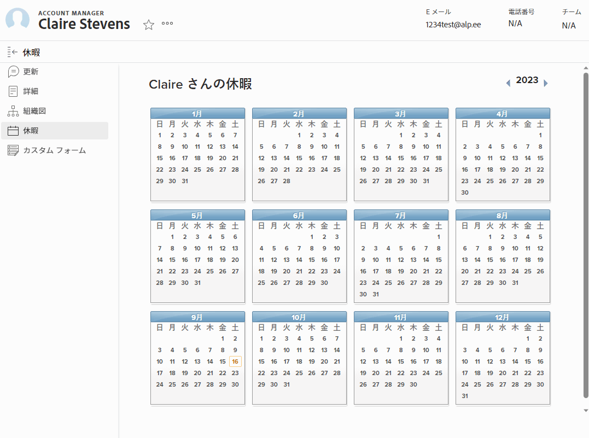

# 個人の休日を設定

<!-- Audited: 12/2023 -->

[!DNL Adobe Workfront] は、個人のタイムオフを管理、計上、および追跡するために、既存のシステムを複製または置き換えるように設計されていません。

ただし、承認されたオフのタイミングを指定することが重要です。これは、スケジュールと [!UICONTROL 計画完了日] 割り当てられているタスクの数を指定します。

例えば、2 週間かかる予定のタスクに割り当てられていて、その間に 3 日間の休暇を取る予定がある場合、 [!DNL Workfront] タスクタイムラインに 3 日を追加して、休止時間を考慮します。

また、リソース管理ツールは、個人の休日を使用して、作業のスケジュールを設定できるタイミングを示します。

>[!NOTE]
>
>休日のスケジュールを設定した日付との不一致が生じないようにするには、ユーザープロファイルのタイムゾーンがスケジュールのタイムゾーンと一致するようにすることをお勧めします。 詳しくは、次の記事を参照してください。
>
>* [スケジュールの作成](../../../administration-and-setup/set-up-workfront/configure-timesheets-schedules/create-schedules.md)
>* [ユーザーのプロファイルの編集](../../../administration-and-setup/add-users/create-and-manage-users/edit-a-users-profile.md)
>

## アクセス要件

この記事の手順を実行するには、次のアクセス権が必要です。

<table style="table-layout:auto"> 
 <col> 
 </col> 
 <col> 
 </col> 
 <tbody> 
  <tr> 
   <td role="rowheader">[!DNL Adobe Workfront] 計画</td> 
   <td>任意</td> 
  </tr> 
  <tr> 
   <td role="rowheader">[!DNL Adobe Workfront] ライセンス</td> 
   <td> 
新規：標準（個人のオフ時間を設定）

        
または

        
現在：勤務先以上（個人の休日を設定する場合）
 </td>
  </tr> 
  <tr> 
   <td role="rowheader">アクセスレベル設定</td> 
   <td>[!UICONTROL ユーザーを編集 ] アクセス権を持つ [!UICONTROL Manager] （他のユーザーのカレンダーの時間を変更する場合） 
   <strong>注意：</strong> 管理者が別のユーザーの個人のタイムオフカレンダーを編集した場合、すべてのエントリは、管理者のタイムゾーンではなく、ユーザーのタイムゾーンに表示されます。</td> 
  </tr> 
 </tbody> 
</table>

この表の情報の詳細については、 [Workfrontドキュメントのアクセス要件](/help/quicksilver/administration-and-setup/add-users/access-levels-and-object-permissions/access-level-requirements-in-documentation.md).

## での個人のオフタイムの設定 [!DNL Workfront]

{{step1-click-profile-pic}}

1. 左側のパネルで、 **[!UICONTROL オフの時間]**.
1. 個人の休日に希望する日付を選択します。

   

1. 選択 **[!UICONTROL 終日]**（1 日を休む場合）

   1 日未満の休日を取る場合は、このチェックボックスをオフのままにし、休日の開始時間と終了時間を指定します。

1. 「**[!UICONTROL 保存]**」をクリックします。

   これで、休暇が [!DNL Workfront] システムを使用して、リソース・プランナーやワークロード・バランサなどのリソース管理ツールを使用できます。 この間に作業を割り当てられると、ツールヒントが表示され、予定時間がずれたことがユーザーに通知されます。
