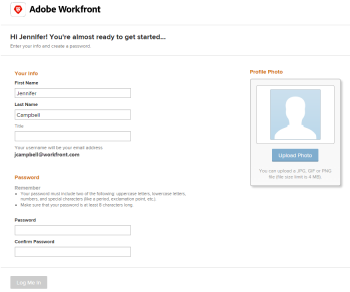

# 招待メールを受信して [!DNL Adobe Workfront] のパスワードを作成

[!DNL Workfront] 管理者が新しいユーザーを作成すると、新しいユーザーは、いくつかの要因に基づいて招待メールを受け取る場合があります。

* ユーザーの組織が [!DNL Adobe Admin Console] にオンボーディングされているかどうか
* ユーザーが [!DNL Workfront] と [!DNL Admin Console] のどちらに追加されているか
* ユーザーが他の [!DNL Adobe] 製品へのアクセス権を持っているか、新しい [!DNL Adobe] ユーザーか
* 管理者がユーザーに招待メールを送信することを選択したかどうか（まだ [!DNL Admin Console] に登録されていない組織のみに適用）

[!DNL Workfront] 管理者が新しいユーザーを作成する際に招待メールを送信する用法について詳しくは、[新規ユーザーへの招待メールを管理](../../../administration-and-setup/manage-workfront/emails/manage-email-invitations.md)を参照してください。

Workfront 管理者が新しいユーザーを [!DNL Adobe Workfront] に追加する方法について詳しくは、[ユーザーを追加](../../../administration-and-setup/add-users/create-and-manage-users/add-users.md)を参照してください。

## アクセス要件

+++ 展開すると、この記事の機能のアクセス要件が表示されます。

<table style="table-layout:auto"> 
 <col> 
 </col>
 <tbody> 
  <tr> 
   <td>Adobe Workfront パッケージ</td> 
   <td> 
任意
 </td> 
  </tr> 
  <tr> 
   <td>Adobe Workfront プラン</td> 
   <td> 
   
コントリビューター以上

   
リクエスト以上
 </td> 
  </tr> 
 </tbody> 
</table>

詳しくは、[Workfront ドキュメントのアクセス要件](/help/quicksilver/administration-and-setup/add-users/access-levels-and-object-permissions/access-level-requirements-in-documentation.md)を参照してください。

+++

## [!DNL Workfront] のパスワードを作成

新規ユーザーは、招待メールを受け取った後、招待メールのリンクに従って、パスワードを選択することにより、[!DNL Workfront] アカウントの作成を完了できます。

>[!NOTE]
>
>メール内のリンクは、[!DNL Workfront] 管理者が[!UICONTROL 招待]ページの[!UICONTROL 一般のオプション]エリアで指定している日数に限り有効です。

招待メールを使用して [!DNL Workfront] のパスワードを作成するには：

1. Workfront からの招待メールで「**[!UICONTROL 開始する]**」をクリックします。

   

1. 次の情報を指定します。\
   **[!UICONTROL 名]**：名（通常は事前入力されています）。\
   **[!UICONTROL 姓]**：姓（通常は事前入力されています）。\
   **[!UICONTROL 役職]**：組織内の役職。\
   **[!UICONTROL パスワード]**：Workfront にログインするためのパスワードを選択します。\
   **[!UICONTROL パスワードの確認]**：[!DNL Workfront] のパスワードを確認します。

1. 「**[!UICONTROL 利用条件に同意します]**」を選択します。
1. 「**[!UICONTROL ログイン]**」をクリックします。\
   これで、Workfront でのユーザーアカウントの作成が完了します。
