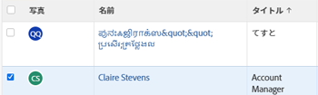
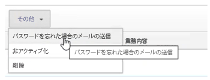

# 拡張認証を使用したユーザーのパスワードのリセット

[!DNL Workfront] 環境に対して拡張認証（eAuth）が有効になっている場合、[!DNL Workfront] 管理者は、別のユーザーのログイン資格情報をリセットできません。これは、[!DNL Workfront] eAuth のない環境、またはシングルサインオン（SSO）が有効になっている環境とは異なります。

## アクセス要件

この記事の手順を実行するには、次のアクセス権が必要です。

<table style="table-layout:auto"> 
 <col> 
 <col> 
 <tbody> 
  <tr> 
   <td role="rowheader"><strong>[!DNL Adobe Workfront] プラン*</strong></td> 
   <td> 
 任意
 </td> 
  </tr> 
  <tr> 
   <td role="rowheader"><strong>[!DNL Adobe Workfront] ライセンス*</strong></td> 
   <td> 
[!UICONTROL Plan]
 </td> 
  </tr> 
  <tr> 
   <td role="rowheader"><strong>アクセスレベル設定*</strong></td> 
   <td> 
システム管理者 
 </td> 
  </tr> 
 </tbody> 
</table>

ご利用のプラン、ライセンスタイプまたはアクセス権を確認するには、[!DNL Workfront] 管理者にお問い合わせください。

## eAuth 対応環境でのユーザーのパスワードのリセット

1. [!DNL Workfront] の右上隅にある「**[!UICONTROL メインメニュー]**」アイコンをクリックし、次に「**[!UICONTROL ユーザー]**」 をクリックします。

   

1. パスワードのリセットが必要な&#x200B;**[!UICONTROL ユーザー]**を選択します。
   

1. 目的の&#x200B;**[!UICONTROL ユーザー]**&#x200B;を選択した後に表示される「**[!UICONTROL その他]」ボタン**&#x200B;をクリックし、ドロップダウンメニューから「**[!UICONTROL パスワードを忘れた場合の E メールの送信]**」オプションを選択します。

   

「**[!UICONTROL パスワードを忘れた場合の E メールの送信]**」オプションを選択すると、選択したユーザーに、自身のパスワードを変更する手順が記載されたメールが送信されます。

