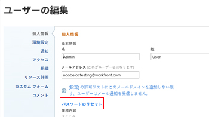

# パスワードをリセット

{{important-not-on-aec}}

リセットできる [!DNL Adobe Workfront] パスワード。 重要なセキュリティ対策として、これを定期的におこなうことをお勧めします。

>[!NOTE]
>
>A [!DNL Workfront] 管理者は、カスタムパスワード制限を設定できます。詳しくは、 [システムセキュリティの環境設定の構成](../../../administration-and-setup/manage-workfront/security/configure-security-preferences.md) および [認証用のパスワードポリシーの設定](../../../administration-and-setup/manage-workfront/security/configure-password-policies-authentication.md).
>
>A [!DNL Workfront] 管理者は、拡張認証が有効な環境でパスワードをリセットすることもできます。 詳しくは、 [拡張認証を使用したユーザーのパスワードのリセット](../../../workfront-basics/manage-your-account-and-profile/managing-your-workfront-account/reset-user-password-eauth.md).

## アクセス要件

この記事の手順を実行するには、次のアクセス権が必要です。

<table style="table-layout:auto"> 
 <col> 
 </col> 
 <col> 
 </col> 
 <tbody> 
  <tr> 
   <td role="rowheader"><strong>[!DNL Adobe Workfront] 計画*</strong></td> 
   <td> 
任意
 </td> 
  </tr> 
  <tr> 
   <td role="rowheader"><strong>[!DNL Adobe Workfront] ライセンス*</strong></td> 
   <td> 
[!UICONTROL リクエスト ] 以降
 </td> 
  </tr> 
 </tbody> 
</table>

保有するプランやライセンスの種類を確認するには、 [!DNL Workfront] 管理者。

## でパスワードをリセット [!DNL Adobe Workfront]

1. 次をクリック： **[!UICONTROL メインメニュー]** アイコン  右上隅に [!DNL Adobe Workfront]をクリックし、プロフィール画像の横にあるユーザー名をクリックします。

   

1. 次をクリック： **[!UICONTROL その他のメニュー]** を選択し、「 **[!UICONTROL 編集]**.

1. 内 **[!UICONTROL 担当者の編集]** 表示されるボックス ( **[!UICONTROL 個人情報]**&#x200B;をクリックし、 **[!UICONTROL パスワードをリセット]**.

   

   組織が [!DNL Workfront] SSO ソリューションでは、SSO システムを介してパスワードをリセットするために、クリック時にルーティングされる場合があります **[!UICONTROL パスワードをリセット]**. これにより、SSO パスワードがリセットされ、組織内の他のすべてのアプリケーションへのログインに影響します。

1. 古いパスワードを入力し、新しいパスワードを 2 回入力します。

   パスワードは 8 文字以上で、次の 2 種類の文字を含む必要があります。

   * レター
   * 数字
   * 特殊文字 (!@ # $ %など )

   パスワードの規則は、 [!DNL Workfront] 管理者。

1. 「**[!UICONTROL 変更を保存]**」をクリックします。
