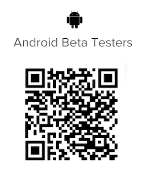

# Be an [!DNL Android] ベータテスタ

## ベータ版アプリをダウンロード

ベータ版テスターになるには、いくつかの方法があります [!DNL Adobe Workfront] アプリ：

### [!DNL Google Play] ストア

以下を使用して、 [!DNL Google Play Store] アプリを検索してダウンロードするには：

1. 次にアクセス： [!DNL Play Store] デバイス上のアプリを参照してください。
1. を検索 [!DNL Workfront]をタップし、リストに表示されたらタップします。
次をインストールする必要があります： [!DNL Workfront] アプリを使用してください。
1. をインストールして開きます。 [!DNL Workfront] アプリに表示されます。
1. ページの中央までスクロールし、をタップします。 **[!UICONTROL 参加する]** 内 **[!UICONTROL ベータテスターになる]** 」セクションに入力します。

1. タップ **[!UICONTROL 結合]** をクリックして、ベータ版テスターになることを確認します。\
   ベータ版ユーザーとして認識されるまでに数分かかります。 を再度開く必要がある場合があります。 [!DNL Play Store] をクリックして変更を確認します。

1. 進行状況が完了したら、ベータ版ユーザーになったことを示す確認メッセージが表示されます。\
   「[!UICONTROL ベータ版]」が [!DNL Play Store] アプリケーションのベータ版を使用していることを示しています。\
   

### QR コード

以下の QR コードをスキャンして、ベータ版に新規登録し、アプリをダウンロードすることもできます。

## 現在の状況をお知らせください

ベータ版アプリに関するフィードバックを提供したり、問題を報告したりするには、次の手順を実行します。

1. タップ **[!UICONTROL 詳細]** をクリックします。
1. 名前をタップし、 **[!UICONTROL フィードバックを送信]**.
1. 選択 **[!UICONTROL 調査を開始]** アプリに関する一般的なフィードバックを提供する。\
   または\
   選択 **[!UICONTROL 問題の報告]** 切符を差し出す [!DNL Workfront] カスタマーケアチーム。

## ベータテストのオプトアウト

ベータ版テストを停止するには [!DNL Workfront] アプリ：

1. 次にアクセス： [!DNL Play Store] デバイス上のアプリを参照してください。
1. を検索 [!DNL Workfront]をタップし、リストに表示されたらタップします。
1. 下にスクロールして **[!UICONTROL ベータ版テスト担当者]** 「 」セクションに移動し、「 」をタップします。 **[!UICONTROL 終了]**.\
   ベータ版テスターとして削除されるまでに数分かかります。 を再度開く必要がある場合があります。 [!DNL Play Store] をクリックして変更を確認します。
