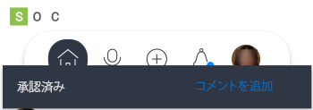

# 内の承認 [!DNL Adobe Workfront] モバイルアプリ

自分に割り当てられた承認または委任された承認は、 [!UICONTROL 承認] 領域 [!DNL Adobe Workfront] モバイルアプリを使用します。 次の [!UICONTROL 承認] 領域では、以下を承認できます。

<table style="table-layout:auto"> 
 <col> 
 <col> 
 <tbody> 
  <tr> 
   <td> 
    <ul> 
     <li>作業（タスクと問題）</li> 
     <li>ドキュメント</li> 
     <li>プルーフ </li> 
    </ul> </td> 
   <td> 
    <ul> 
     <li>タイムシート</li> 
     <li>アクセス要求</li> 
    </ul> </td> 
  </tr> 
 </tbody> 
</table>

配達確認は、別の承認プロセスに従います。 作業項目またはドキュメントの承認から配達確認を承認することはできません。 配達確認のレビューと承認について詳しくは、 [の配達確認を確認し、決定する [!DNL Adobe Workfront] モバイルアプリ](../../../workfront-basics/mobile-apps/using-the-workfront-mobile-app/work-with-proofs-in-mobile-app.md).

## 承認のレビュー

1. 選択 **[!UICONTROL すべての承認を表示]** 内 [!UICONTROL 承認] ～の面積 [!UICONTROL マイワーク].

   詳しくは、 [!UICONTROL マイワーク] モバイルアプリの場合は、 [[!UICONTROL マイワーク] モバイルアプリのセクション](../../../workfront-basics/mobile-apps/using-the-workfront-mobile-app/my-work-section-mobile.md).

1. リストから承認を選択します。

   

1. 更新、ドキュメント、詳細など、承認に関連する情報を確認します。

   この例では、タスクの承認を示しています。 その他の承認タイプには、異なる情報が含まれる場合があります。

   

## 承認を決定する

1. 承認を開きます。
1. 決定を選択します。 判定オプションのリストは、表示する承認のタイプによって異なります。

   | アイコン | 決定 |
   |---|---|
   |  | [!UICONTROL 承認] |
   |  | [!UICONTROL 変更を加えて承認] （ドキュメントに対してのみ使用可能） |
   |  | [!UICONTROL 拒否] |

   {style="table-layout:auto"}

1. （オプション）「 」を選択します。 **[!UICONTROL コメントを追加]** をクリックして、決定にコメントを追加します。 これらのコメントは、承認の更新内に表示されます。\
   \
   または\
   承認の左上にある矢印を選択して、 [!UICONTROL 承認] ページ。
