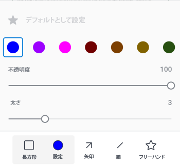
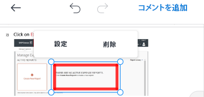

# [!DNL Android] でのプルーフに対するコメント

プルーフに対する既存のコメントをレビューおよび解決し、新しいコメントや注釈をプルーフドキュメントに追加できます。

プルーフに対するコメントのアクセス権は、[!DNL Adobe Workfront] と同じです。プルーフ機能について詳しくは、[ [!DNL Workfront Proof]](../../../workfront-proof/wp-acct-admin/account-settings/proof-perm-profiles-in-wp.md) のプルーフ権限プロファイルを参照してください。

>[!NOTE]
>
>プルーフの所有者がプルーフをロックした場合、そのプルーフにコメントすることはできません。詳しくは、[ [!DNL Adobe Workfront]  モバイルアプリでプルーフをレビューし、決定する](../../../workfront-basics/mobile-apps/using-the-workfront-mobile-app/work-with-proofs-in-mobile-app.md)の記事内の[プルーフのロックとロック解除](../../../workfront-basics/mobile-apps/using-the-workfront-mobile-app/work-with-proofs-in-mobile-app.md#lock)を参照してください。

## プルーフの既存コメントのレビュー

プルーフドキュメントに対して行われたコメントをレビューできます。コメントには、コメントが参照するドキュメントのエリアを呼び出すための図面が関連付けられている場合が多くあります。図面には、矢印、線、長方形、ハイライト表示、フリーハンドの図面を含めることができます。

1. ドキュメントのプルーフを開きます。詳しくは、[ [!DNL Adobe Workfront]  モバイルアプリでプルーフをレビューし、決定する](../../../workfront-basics/mobile-apps/using-the-workfront-mobile-app/work-with-proofs-in-mobile-app.md)を参照してください。
1. ドキュメントページでコメントアイコン  を選択し、コメントと、関連する図面および添付ファイルを開きます。

   コメントに複数の返信がある場合は、「**[!UICONTROL 返信を表示]**」を選択してすべての返信を表示するか、コメントシートを上下にスワイプして、さらに多くの内容を表示します。

1. コメントの添付ファイルを表示するには、コメントのサムネールを選択します。画面の指示に従って、添付ファイルをデバイスにダウンロードします。
1. コメントに返信するには、コメントの下のテキストボックスに回答を入力し、**[!UICONTROL 送信]**&#x200B;アイコン  を選択します。

### コメントリストの使用

1. すべてのコメントのリストをページ番号順に表示するには、右上のコメントアイコン  を選択します。

   未読のコメントの数がコメントアイコン上に表示されます。 リスト内の未読のコメントは、青い点でマークされます。添付ファイル付きのコメントには、クリップアイコン ![[!UICONTROL 添付ファイル]アイコン](assets/mobile-paper-clip-icon.png) が表示されます。

1. リストで個々のコメントを選択し、コメントとその関連図面をドキュメントページに表示します。
1. 「X」を選択してコメントリストを閉じ、プルーフに戻ります。

### 選択ビューでコメントに対するアクションを実行

>[!NOTE]
>
>選択ビューの「**[!UICONTROL その他]**」メニューに含まれるオプションは、[!DNL Workfront] 管理者または [!DNL Workfront Proof] 管理者の設定によって異なる場合があります。

1. その他のコメントオプションを表示するには、コメントリストの右上にある ![[!UICONTROL コメントのリスト]アイコン](assets/mobile-listofcommentsicon-30x27.png) を選択します。

   各コメントの横にチェックボックスが表示されます。

   >[!NOTE]
   >
   >選択ビューでは、ドキュメント内のコメントにアクセスできません。左上の矢印を選択して、コメントリストに戻ります。

1. 個々のコメントを選択するには、チェックボックスをタップします。

   すべてのコメントを選択するには、右上の&#x200B;**[!UICONTROL その他]**&#x200B;メニュー  、「**[!UICONTROL すべてを選択]**」の順にクリックします。

1. 選択したコメントを解決するには、右上の ![[!UICONTROL コメントを解決]アイコン](assets/mobile-resolvecomment-icon-30x30.png) を選択します。

   一度に解決できるコメントは 1 つだけです。コメントは、解決されたことを示す緑色のアイコンでマークされます。

   元のコメントはドキュメントに残ります。コメントの解決は、元のコメントに対する返信として次のように表示されます：「[!UICONTROL このスレッドは次の担当者に解決済みにされました [名前]]」。

   解決を取り消すには、解決されたコメントを選択し、右上の&#x200B;**[!UICONTROL 取り消し]**&#x200B;アイコンをクリックします。

1. 選択したコメントを既読としてマークするには、**[!UICONTROL 既読としてマーク]**&#x200B;アイコン  を選択します。

   このオプションは、未読のコメントが選択されている場合にのみ使用できます。

1. 選択したコメントを削除するには、右上の&#x200B;**[!UICONTROL その他]**&#x200B;メニュー  、「**[!UICONTROL 削除]**」の順に選択します。次に、確認メッセージで「**[!UICONTROL 削除]**」をクリックして、コメントを完全に削除します。
1. 左上の矢印を選択して選択ビューを終了し、コメントリストに戻ります。

## プルーフに対するコメント

プルーフコメントをドキュメントの特定のエリアに関連付けることができます。コメントを付けるエリアを選択するには、描画ツールを使用します。

1. ドキュメントのプルーフを開きます。詳しくは、[ [!DNL Adobe Workfront]  モバイルアプリでプルーフをレビューし、決定する](../../../workfront-basics/mobile-apps/using-the-workfront-mobile-app/work-with-proofs-in-mobile-app.md)を参照してください。
1. プルーフ画面の下部にあるツールバーから描画ツールを選択します。

   

   必要なツールが表示されない場合は、ツールバーを右にスクロールします。

1. ツール名の横にある「**[!UICONTROL 設定]**」を選択して、色、不透明度および太さを定義します。星形のアイコンを選択して、これらの選択をツールのデフォルト設定にします。

   

1. プルーフドキュメントにシェイプを描画します。**[!UICONTROL 取り消し]**&#x200B;アイコン  を選択して、描画を取り消します。
1. (条件付き）シェイプを選択し、「**[!UICONTROL 設定]**」でシェイプの設定を編集するか、「**[!UICONTROL 削除]**」でシェイプを削除します。

   

1. 「**[!UICONTROL コメントを追加]**」を選択します。
1. テキストボックスにコメントを入力します。
1. コメントに連絡先をタグ付けするには、@ 記号を入力するか「![[!UICONTROL 連絡先のタグ付け]](assets/mobile-tag-user-icon.png)」を選択して @ 記号を追加し、追加する連絡先の名前を入力していき、ドロップダウンリストに名前が表示されたらクリックします。

   プルーフにコメントが追加されると、連絡先にメール通知が届きます。

1. コメントに添付ファイルを追加するには、![[!UICONTROL 添付ファイル]アイコン ](assets/mobile-paper-clip-icon.png) を選択します。「**[!UICONTROL ドキュメントを選択]**」または「**[!UICONTROL 写真を撮る]**」を選択し、プロンプトに従って、コメントにファイルまたは写真を添付します。

   添付ファイルを削除するには、サムネール画像の「X」をクリックします。

1. **[!UICONTROL 送信]**&#x200B;アイコン  を選択して、コメントと図面をプルーフに追加します。
